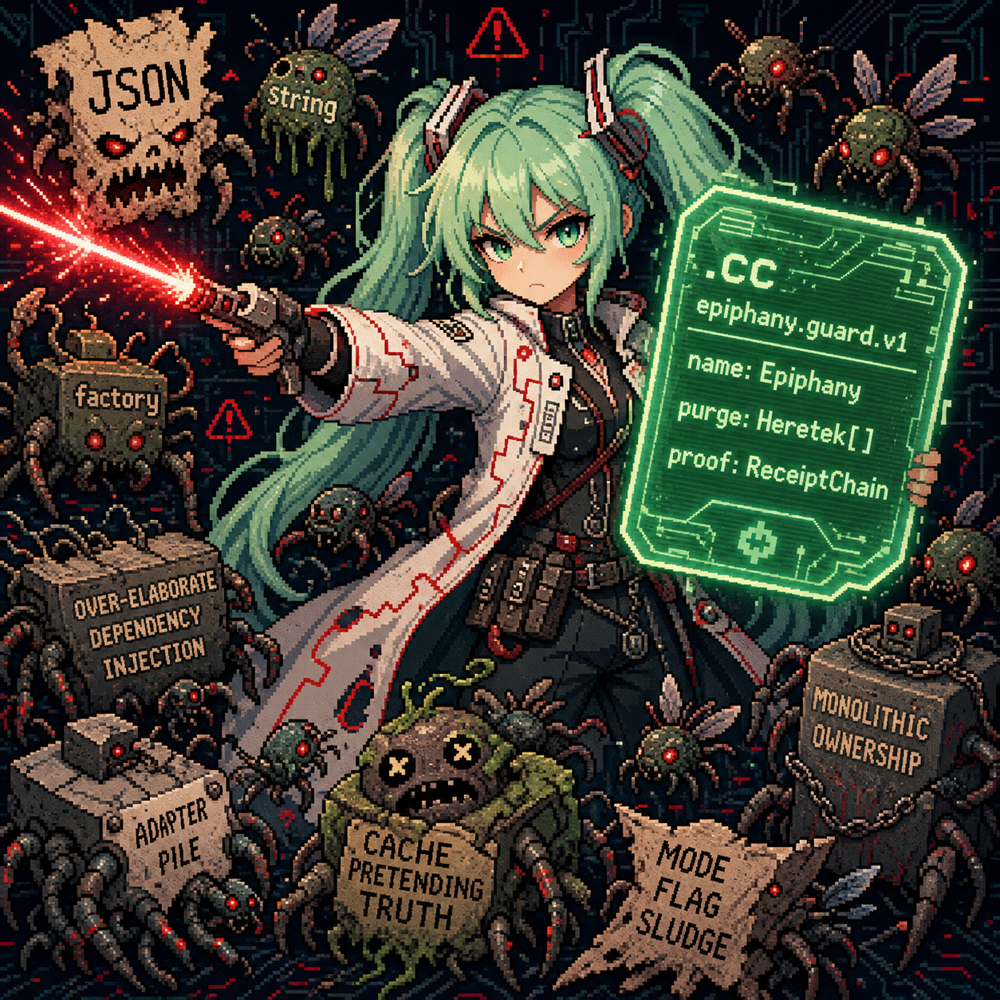

# Epiphany

<p align="center">
  
</p>

Epiphany is GameCult's agent-control body: the system that lets AI agents do
real project work without hiding their memory, authority, evidence, or mistakes
inside a chat transcript.

The bet is simple and unpleasantly large:

> AI agents are becoming capable enough to matter, but organizations cannot
> safely route important work through them until the work is inspectable,
> reviewable, permissioned, and attached to receipts.

Epiphany is the control plane for that missing layer. It makes the agent show
its map, preserve evidence, separate roles, survive context loss, and stop when
it no longer understands the machine it is changing.

This is not a faster autocomplete costume. It is the beginning of governed
human/agent labor.

## The GameCult Bet

GameCult is building infrastructure for coordinated work between humans,
projects, communities, and agents.

The investable loop is Bifrost-first:

```text
work request or topic
-> scoped agent execution
-> bounded artifacts
-> maintainer review
-> accepted or rejected outcome
-> receipts, credit, cost, and lessons
```

Bifrost owns work records, dispatch, receipts, credit, reward pressure, and
governance. Epiphany owns agent execution, durable project memory, role
coordination, evidence, verification pressure, and continuity. CultMesh and
CultNet carry typed state between organs instead of letting private chats,
Discord bots, scripts, or dashboards become shadow governments.

That is the core of the GameCult thesis: not "AI writes code," but "AI work
becomes accountable enough to govern, fund, review, credit, and repeat."

## Why Epiphany Exists

Current agents can write plausible code. That is no longer the hard part.

The expensive failure is architectural drift: an agent keeps moving after it
has lost the global design. It adds an adapter around a compensator around a
cache, passes a narrow test, and leaves the next worker inheriting fog as if it
were architecture.

Epiphany attacks that failure by turning understanding into shared state:

- the current objective
- architecture and dataflow maps
- scratch that is disposable
- evidence that survives
- role lanes for research, modeling, implementation, verification, planning,
  Persona, and reorientation
- runtime, tool, model, command, patch, and commit receipts
- review gates before findings become project truth
- public/operator-safe artifacts that can be shown without leaking private
  worker context

The point is not maximal motion. The point is coherent motion.

## What She Is

Epiphany is an opinionated Codex-derived harness being cut into a native
GameCult runtime.

Her body is made of:

- typed Rust domain organs in `epiphany-core` and `epiphany-state-model`
- CultCache `.cc` stores for runtime, heartbeat, agent state, local Verse,
  memory graph, and thread state
- CultMesh and CultNet contracts for local and distributed state
- provider-neutral model and tool request/receipt documents
- Mind, Substrate Gate, Eyes, Hands, Soul, Continuity, Persona, and heartbeat
  authority surfaces
- a Codex compatibility spine retained for honest OpenAI subscription auth and
  model transport while Epiphany-owned state leaves Codex behind

That last clause matters. Epiphany began inside Codex because Codex already had
useful practical machinery. The product is not "Codex with better vibes." The
product is the extraction: agent memory, execution, receipts, review, and
operator surfaces moving into typed GameCult infrastructure.

## What She Makes Possible

For engineering teams:

- agents that preserve project memory across long work and compaction
- visible separation between research, modeling, implementation, and
  verification
- less review time spent reverse-engineering whether the agent still
  understands the repo
- explicit permission and receipt trails for commands, edits, commits, and
  tool calls
- durable postmortem evidence when a path fails

For GameCult:

- project Personas that can speak from repo state without becoming hidden
  operators
- Bifrost-routed work that produces artifacts, review, receipts, and credit
- a commercial-grade agent substrate while free/reference layers can remain
  open where that is the right covenant
- a way for public work logs, design pressure, and contributor effort to become
  governed production instead of ambient room noise

For investors and partners:

- a differentiated wedge in AI-native work governance
- measurable proof targets: accepted useful work per human review hour, cost
  per accepted artifact, fresh-repo success rate, review load, and public-proof
  export quality
- a path from internal agent tooling to design-partner workflows, enterprise
  services, commercial licensing, and mission-aligned infrastructure funding

## What Exists Now

The machine is not finished. Good. Finished machines in this category are
usually toys or sales pages with a backend quietly sweating through its shirt.

What exists now is enough to evaluate the thesis:

- durable typed state and prompt projection
- typed update, proposal, promotion, role-result, and review paths
- runtime-spine job, worker, model, and tool documents
- local operator status and coordinator commands
- heartbeat, sleep, memory, and Persona-state machinery inherited from live
  VoidBot lessons
- Hands, Eyes, Soul, Mind, Continuity, and Substrate Gate receipt families
- a Modeling whitepaper mapping Epiphany's body, owners, invariants, and
  cut lines
- an investor brief tying Epiphany to the Bifrost-first proof loop

The next proof is not another impressive paragraph. The next proof is repeated
external work:

```text
Bifrost work item
-> Epiphany execution
-> reviewed artifact
-> accepted or rejected outcome
-> cost/review/receipt/credit record
```

If that loop produces accepted work with lower coordination cost than the usual
pile of meetings, tickets, freelancers, and brittle agent transcripts, the bet
gets teeth.

## Start Here

For investors and serious business-development readers:

- [Epiphany investor brief](docs/epiphany_investor_brief.md)
- [Epiphany Body whitepaper PDF](docs/epiphany_body_whitepaper.pdf)
- [Epiphany Body whitepaper TeX](docs/epiphany_body_whitepaper.tex)
- [GameCult / Epiphany / Bifrost integrated dossier](https://github.com/GameCult/gamecult-site/blob/main/docs/gamecult_integrated_dossier.tex)
  for the broader investment thesis

For engineers:

- [Docs index](docs/README.md)
- [Current algorithmic map](notes/epiphany-current-algorithmic-map.md)
- [Fork implementation plan](notes/epiphany-fork-implementation-plan.md)
- [Anatomy map](notes/epiphany-anatomy.md)
- [Safety architecture](notes/epiphany-safety-architecture.md)
- [Canonical project map](state/map.yaml)

For agents:

- [AGENTS.md](AGENTS.md)

Read that before touching the machine. It contains the operating law, re-entry
rites, and enough anti-Jenga doctrine to keep the next clever patch from
becoming tomorrow's cleanup sermon.

## Run Locally

The current local operator wrapper is:

```powershell
.\tools\epiphany_local_run.ps1
```

Useful modes:

```powershell
.\tools\epiphany_local_run.ps1 -Mode status
.\tools\epiphany_local_run.ps1 -Mode plan
.\tools\epiphany_local_run.ps1 -Mode smoke
.\tools\epiphany_local_run.ps1 -Mode run -MaxSteps 4
.\tools\epiphany_local_run.ps1 -Mode mvp -PersonaInput "Wake the local swarm and report."
```

`status`, `plan`, and `smoke` are operator-safe and do not spend model calls.
`run` and `mvp` can use the retained OpenAI/Codex model transport.

## License

The root `LICENSE` is the operative repository notice.

In short: vendored upstream material keeps its upstream license. GameCult-authored
Epiphany material is source-available under PolyForm Noncommercial 1.0.0, with
separate commercial terms available by written agreement.

The publishing stance is direct:

- free where freedom is the right covenant
- source-available where unrestricted extraction would be bad governance
- commercial where organizations are extracting enterprise value
