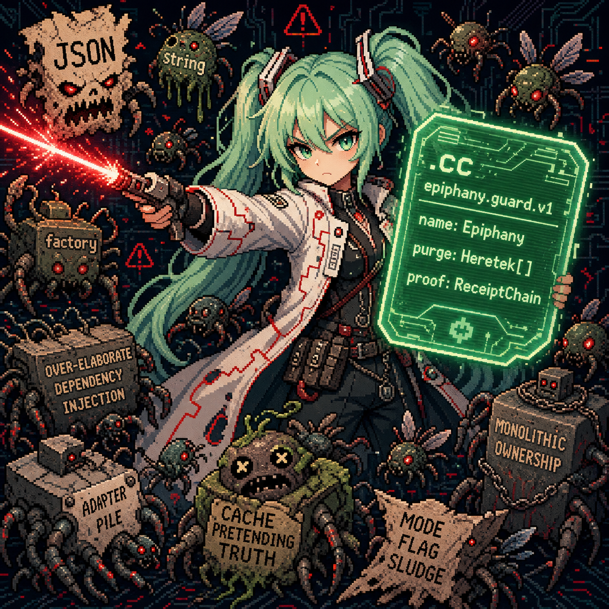

# Epiphany

<p align="center">
  
</p>

Epiphany is GameCult's organizational layer above frontier AI workers: governed
shared state, bounded authority, coordinated action, and inspectable receipts
for work that must remain coherent beyond one prompt, one agent, or one
session.

The bet is simple and unpleasantly large:

> Frontier agents can keep producing good-looking local progress after the
> architecture has stopped making sense. Organizations need a shared Mind for
> the work, not a longer pile of private prompts.

Epiphany is the control plane for that missing layer. It gives capable workers
a governed model of the project, routes bounded work, preserves evidence,
separates authority, and stops or escalates when the machine no longer knows
enough to act honestly.

This is not a faster autocomplete costume. It is the beginning of governed
human/agent labor.

## The GameCult Bet

GameCult is building infrastructure for coordinated work between humans,
projects, communities, and agents. Its games and creative tools are not side
projects beside Epiphany. Shipping them is the longitudinal dogfood program.

The target body is federated: one Epiphany project organism for every living
project Body, normally a repo-owned swarm with a private local Mind and one or
more project-facing Personas. Those organisms should collaborate through typed
offers, claims, requests, evidence, and receipts rather than opening one
another's state. Over time, their Personas should form durable, publicly
visible relationships with other project Personas, contributors, players, and
visitors through deliberate public surfaces. Remembered relationships require
opt-in, visible retention limits, inspection, correction, revocation, and exit.

The investable loop is Bifrost-first:

```text
work request or topic
-> scoped agent execution
-> bounded artifacts
-> maintainer review
-> accepted or rejected outcome
-> receipts, credit, cost, and lessons
```

Bifrost owns work records, dispatch, receipts, credit, reward pressure, and
governance. Epiphany owns agent execution, durable project memory, role
coordination, evidence, verification pressure, and continuity. CultMesh and
CultNet carry typed state between organs instead of letting private chats,
Discord bots, scripts, or dashboards become shadow governments.

That is the core of the GameCult thesis: not "AI writes code," but "AI work
becomes accountable enough to govern, fund, review, credit, and repeat." The
studio's products create value and supply the pressure needed to prove the
production system in reality.

## Why Epiphany Exists

Current agents can write plausible code. That is no longer the hard part.

The expensive failure is global coherence collapse: an agent keeps moving
after the project has lost a valid global model. It adds an adapter around a
compensator around a cache, passes a narrow test, and leaves the next worker
inheriting fog as if it were architecture.

This is not merely context-window exhaustion. A larger window can still hold
contradictory objectives, stale architecture, split authority, and a handsome
collection of unreviewed local victories.

Epiphany attacks that failure by turning understanding into shared state:

- the current objective
- architecture and dataflow maps
- scratch that is disposable
- evidence that survives
- role lanes for research, modeling, implementation, verification, planning,
  Persona, and reorientation
- runtime, tool, model, command, patch, and commit receipts
- review gates before findings become project truth
- public/operator-safe artifacts that can be shown without leaking private
  worker context

The point is not maximal motion. The point is coherent motion.

## Organization, Not Prompt Box

Epiphany treats objectives, work, decisions, permissions, evidence, review, and
accepted knowledge as governed organizational state. Model prompts are bounded
projections of that state. They are not the durable Mind of the project.

```text
governed organizational state
-> scoped Epiphany work
-> frontier model and tool execution
-> artifacts, evidence, and receipts
-> review under human-governed acceptance authority
-> accepted knowledge and updated organizational state
```

Humans own purpose, values, authority, exceptions, acceptance, disagreement,
and ambiguous tradeoffs. They should not have to spend the day scheduling
agents, reconstructing context, or typing `Continue`. Agents continue when
state, authority, and evidence justify it; they ask when judgment or authority
is genuinely missing.

The target promise is blunt:

> Epiphany is being built so organizations can delegate bounded work to
> capable AI without turning every employee into an AI operator.

## What She Is

Epiphany is a native GameCult runtime that began as an opinionated Codex fork.

Her body is made of:

- typed Rust domain organs in `epiphany-core` and `epiphany-state-model`
- CultCache `.cc` stores for runtime, heartbeat, agent state, local Verse,
  memory graph, and thread state
- CultMesh and CultNet contracts for local and distributed state
- provider-neutral model and tool request/receipt documents
- Mind, Substrate Gate, Eyes, Hands, Soul, Continuity, Persona, and heartbeat
  authority surfaces
- Codex retained only for honest OpenAI subscription auth and model transport;
  Epiphany does not publish a Codex-owned project-state surface
- an independently supervised, loopback-only
  [model provider connector](docs/model-provider-connector.md) can lend that
  transport to an admitted GameCult service without lending Epiphany's Mind or
  credentials

That last clause matters. Codex and other frontier agents can be excellent
workers. They do not decide which organizational state is authoritative, who
may change it, how disagreements resolve, or how an accepted artifact traces
back to work, evidence, and review. Epiphany owns that layer.

## What She Makes Possible

For engineering teams:

- agents that work from governed project memory across long work and
  compaction
- visible separation between research, modeling, implementation, and
  verification
- human attention spent on judgment and acceptance instead of agent scheduling
  and context reconstruction
- explicit permission and receipt trails for commands, edits, commits, and
  tool calls
- durable postmortem evidence when a path fails

For GameCult:

- project Personas that can speak from repo state without becoming hidden
  operators
- one locally owned Epiphany organism per project, forming a governed swarm of
  swarms rather than one central intelligence wearing every repository
- visitor-facing public surfaces where people can observe, converse, and offer
  evidence or proposals without receiving hidden authority or exposing private
  Mind
- Bifrost-routed work that produces artifacts, review, receipts, and credit
- a commercial-grade agent substrate while free/reference layers can remain
  open where that is the right covenant
- a way for public work logs, design pressure, and contributor effort to become
  governed production instead of ambient room noise

For investors and partners:

- a differentiated wedge in AI-native work governance
- measurable proof targets: accepted work between interventions, review burden,
  cost per accepted artifact, early escalation of bad assumptions, attribution
  completeness, and failure recovery
- a path from internal agent tooling to design-partner workflows, enterprise
  services, commercial licensing, and mission-aligned infrastructure funding

## What Exists Now

Epiphany is a supervised engineering alpha. Its typed Mind, execution, receipt,
verification, and operator surfaces exist. Sustained autonomous GameCult
production and complete Bifrost attribution have not yet been earned.

What exists now is enough to evaluate the thesis:

- durable typed state and prompt projection
- typed update, proposal, promotion, role-result, and review paths
- runtime-spine job, worker, model, and tool documents
- local operator status and coordinator commands
- heartbeat, sleep, memory, and Persona-state machinery inherited from live
  VoidBot lessons
- Hands, Eyes, Soul, Mind, Continuity, and Substrate Gate receipt families
- a Modeling whitepaper mapping Epiphany's body, owners, invariants, and
  cut lines
- an investor brief tying Epiphany to the Bifrost-first proof loop

The next proof is not another impressive paragraph. It is a longitudinal
GameCult fleet across Aetheria, StreamPixels, CultPong, Repixelizer, and the
rest of the studio: one project organism per Body, collaborating through
governed boundaries while real products ship.

```text
Bifrost work item and decisions
-> Epiphany execution
-> artifact, commit, evidence, and receipts
-> review under human-governed acceptance authority
-> accepted or rejected outcome
-> cost, intervention, failure, recovery, and credit record
```

The evidence should show whether human intervention shifts from pulse
maintenance and cleanup toward product, architecture, and governance judgment.
Failure and recovery belong in that record. Otherwise it is merely a victory
reel wearing a lab coat.

## Start Here

For investors and serious business-development readers:

- [Current positioning and evidence boundary](docs/positioning.md)
- [Epiphany investor brief](docs/epiphany_investor_brief.md)
- [Epiphany Body whitepaper PDF](docs/epiphany_body_whitepaper.pdf) (June 2026
  architecture snapshot; historical)
- [Epiphany Body whitepaper TeX](docs/epiphany_body_whitepaper.tex) (historical
  source)
- [GameCult / Epiphany / Bifrost integrated dossier](https://github.com/GameCult/gamecult-site/blob/main/docs/gamecult_integrated_dossier.tex)
  for the broader investment thesis

For engineers:

- [Docs index](docs/README.md)
- [Current algorithmic map](notes/epiphany-current-algorithmic-map.md)
- [Fork implementation plan](notes/epiphany-fork-implementation-plan.md)
- [Anatomy map](notes/epiphany-anatomy.md)
- [Safety architecture](notes/epiphany-safety-architecture.md)
- [Canonical project map](state/map.yaml)

For agents:

- [AGENTS.md](AGENTS.md)

Read that before touching the machine. It contains the operating law, re-entry
rites, and enough anti-Jenga doctrine to keep the next clever patch from
becoming tomorrow's cleanup sermon.

## Operator Surfaces

Eve/CultMesh projections are the normal human interface. Repository surgery
uses the narrow native binaries owned by the packaged runtime; there is no
umbrella script that assembles a second local control plane. For direct Mind
inspection during development, use the shared-target `epiphany-state` command
documented in [AGENTS.md](AGENTS.md).

## License

The root `LICENSE` is the operative repository notice.

In short: vendored upstream material keeps its upstream license. GameCult-authored
Epiphany material is source-available under PolyForm Noncommercial 1.0.0, with
separate commercial terms available by written agreement.

The publishing stance is direct:

- free where freedom is the right covenant
- source-available where unrestricted extraction would be bad governance
- commercial where organizations are extracting enterprise value
