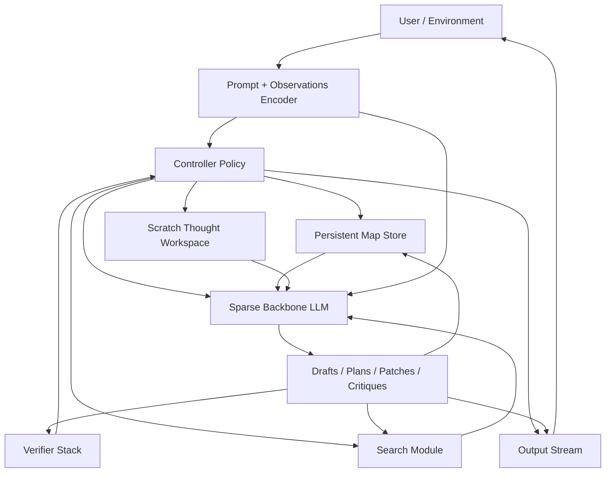

# Architecture Rationale

## Core Epiphany

The central failure mode is local plausibility without global coherence.

An agent can keep making reasonable-looking edits, pass narrow tests, improve proxy metrics, and still lose the actual shape of the system. Once the mental model collapses, adding more local fixes often makes the tower worse.

The response is to make global coherence a first-class object:

- keep a persistent map
- isolate scratch reasoning
- treat public output and code edits as commits, not thoughts
- verify against the map and the real goal
- kill dead churn instead of preserving maybe-useful machinery

## Proposed Model Shape

The speculative model architecture is a typed-state controller around a language backbone:



The important split:

- `map`: slow-changing canonical system model, invariants, decisions, data flow, rejected paths
- `scratch`: volatile local reasoning for one bounded subgoal
- `output`: user-visible replies, tool calls, and code edits
- `controller`: learned or prompted policy deciding when to model, think, verify, edit, backtrack, or speak
- `verifier`: tests plus map coherence, simplicity, and real-objective checks
- `search`: bounded branching and backtracking for hard decomposition choices

## Why A Pinned Map Is Not Enough

Pinning a map inside the context window is useful, but it is still one token soup:

- it competes with everything else for attention
- it has no typed write semantics
- it can drift silently
- it does not distinguish stable knowledge from temporary hypotheses

The cheap prototype uses external files to fake typed state before any model architecture exists.

## Cheap Prototype Strategy

Do not train a new backbone first. That is where money goes to die.

Instead:

1. Externalize state in files.
2. Use a controller protocol with a small action space.
3. Make the model choose one action at a time.
4. Record evidence after meaningful steps.
5. Compare against plain prompting.

Current state files:

- `state/map.yaml`
- `state/scratch.md`
- `state/branches.json`
- `state/evidence.jsonl`

Current controller actions:

- `update_map`
- `think_subgoal`
- `propose_patch`
- `run_verify`
- `compare_branches`
- `backtrack`
- `speak`

## Compact-Rehydrate-Continue Cycle

Compaction is not an implementation accident. In Epiphany it is an explicit architectural state transition:

```text
compact -> rehydrate -> continue
```

The purpose is to make context loss survivable without pretending nothing happened. The harness should checkpoint what matters before memory pressure becomes a blackout, then restart from durable state instead of transcript archaeology.

Before compacting, Epiphany should persist:

- the current objective and active subgoal
- the latest stable map/frontier/checkpoint
- accepted evidence and rejected paths since the last checkpoint
- open questions, blockers, and next action
- verification status for the current slice

After rehydrating, Epiphany should:

- reread canonical state instead of trusting residue in the prompt
- restore the active subgoal and map frontier
- restate the next action from persisted state
- continue with one bounded move
- avoid broad implementation until the current mechanism is understood again

This cycle is the harness admitting the model is not a magic continuous mind. A compacted agent wakes up from durable structure, not vibes in a trench coat.

## Evaluation Shape

Compare four conditions:

1. plain prompting
2. pinned map in normal context
3. external typed state without verifier discipline
4. external typed state with verifier discipline

Measure:

- task success
- regression rate after follow-up edits
- total diff size
- revert rate
- contradiction rate between map and patch
- branch kill rate
- human rating of architectural coherence

The best informal metric: after five iterations, does the system still make sense?

## DeepSeek Research Signals

These sources informed the architecture direction. The repo does not depend on them directly, but they are useful background.

- DeepSeek-R1 suggests RL can elicit reflection and self-verification, but also shows raw emergent reasoning can become repetitive or sloppy: https://github.com/deepseek-ai/DeepSeek-R1
- Generalist Reward Modeling suggests critique and principle generation can be scaled at inference time: https://arxiv.org/abs/2504.02495
- DeepSeek-Prover-V1.5 uses intrinsic-reward tree search, supporting the idea that search helps branching reasoning tasks: https://github.com/deepseek-ai/DeepSeek-Prover-V1.5
- DeepSeek-Prover-V2 leans on subgoal decomposition, supporting explicit decomposition rather than pure continuation: https://arxiv.org/abs/2504.21801
- DeepSeekMath-V2 emphasizes verification quality, not just final-answer correctness: https://github.com/deepseek-ai/DeepSeek-Math-V2
- DeepSeek-V2/V3 show the usefulness of sparse MoE and efficient attention for cheaper large-scale reasoning: https://arxiv.org/abs/2405.04434 and https://arxiv.org/abs/2412.19437
- Engram argues for explicit conditional memory and lookup as a separate axis of sparsity, which matches the need for map-like persistent state: https://arxiv.org/abs/2601.07372

## Codex-Specific Interpretation

Codex cannot expose a new internal model architecture from this repo. The practical path is harness-level behavior:

- add an Epiphany collaboration mode or preset
- inject developer instructions that enforce external typed state
- optionally add a tiny state helper tool
- evaluate whether that improves behavior before touching protocol enums

This is not a new brain. It is a better harness around the existing one.
