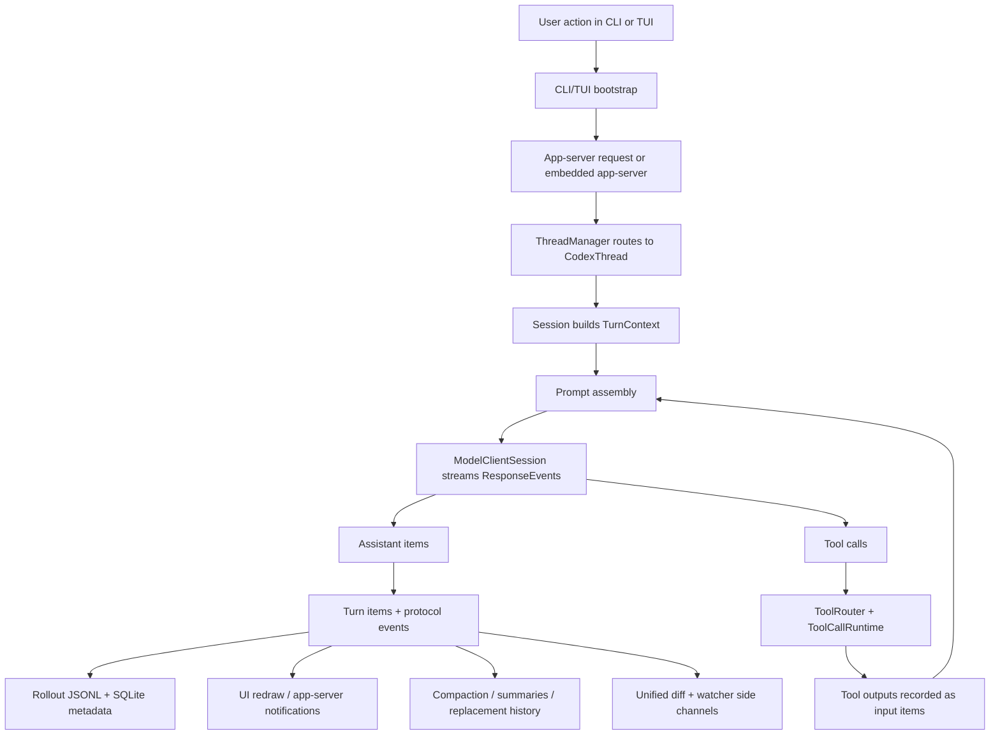

# Codex Repository Algorithmic Map

This is the working map for how vendored Codex moves data. It exists because the repo is large, the crate boundaries are real, and "just keep it in your head" is how you end up chewing drywall.

Scope: this is the main request/response loop for the open-source Codex repository in `E:\Projects\EpiphanyAgent\vendor\codex`. It focuses on the steady-state path from user input to model prompt, tool execution, UI events, and persistence. It is not a full inventory of every crate.

## Mental model in one sentence

Codex is a threaded agent engine in `core` wrapped by transport layers (`app-server`, `protocol`) and user interfaces (`tui`, CLI entrypoints), with durable execution history written to rollouts and indexed into SQLite metadata.

## Main actors

| Actor | Job | Important crates |
| --- | --- | --- |
| CLI/TUI front door | Parse user intent, bootstrap config, start or connect to the engine, render events | `cli`, `tui` |
| App server | Translate UI/CLI requests into core thread operations and stream results back over protocol transport | `app-server`, `protocol` |
| Thread manager | Own shared managers and the registry of active threads | `core` |
| Thread/session engine | Hold mutable thread state, build prompts, run turns, stream model events, persist history | `core` |
| Model client | Talk to the model provider, maintain turn-scoped streaming state, reuse websocket state inside a turn | `core`, `backend-client`, provider crates |
| Tool runtime | Expose model-visible tools, validate requests, execute shell/MCP/function calls, return tool outputs | `core`, `mcp-server`, `exec`, `exec-server` |
| Watchers and live side channels | Watch files, emit coarse change notifications, surface turn diffs and other realtime status | `core`, `app-server`, `app-server-protocol` |
| Memory and summarization | Extract rollout memories, maintain summaries, compact long history for future prompts | `core`, `rollout-trace`, `state` |
| Persistence layer | Write durable thread rollouts, mirror metadata into SQLite, support listing/resume/fork/archive | `rollout`, `thread-store`, `state` |

## Top-level flow

## Startup dataflow

### 1. CLI chooses a surface

- `cli/src/main.rs` is the top-level command parser.
- Interactive usage usually lands in the TUI path.
- Non-TUI commands branch into things like exec, review, sandbox, app server, or MCP server.

The important bit: the CLI mostly decides which surface to launch. It is not the agent brain.

### 2. TUI bootstraps the environment

`tui/src/lib.rs` does the heavy bootstrap work:

- load config
- resolve auth constraints
- set up logging and environment management
- decide whether to launch an embedded app server or connect to a remote one
- start the TUI client against that app-server target

The TUI is a client shell around the engine, not the engine itself.

### 3. App server becomes the transport seam

`app-server` owns the JSON-RPC-ish transport loop and client/session coordination.

Its job is to:

- accept UI/client requests
- resolve config overrides and trust checks
- create or resume threads through `ThreadManager`
- subscribe to thread events
- forward thread snapshots, deltas, approvals, and status changes back to the client

This is the cleanest seam for a custom GUI wrapper. A new GUI should talk to the app server, not reimplement the core turn loop.

## Core runtime model

### ThreadManager: the factory and registry

`core/src/thread_manager.rs` owns the long-lived shared machinery:

- models manager
- skills manager
- plugins manager
- MCP connection manager
- environment manager
- active thread registry

It creates new threads, resumes threads from rollouts, and forks existing threads by reconstructing history from persisted rollout items.

### CodexThread: the per-thread facade

`core/src/codex_thread.rs` is the stable handle the rest of the system uses for a live thread.

It delegates thread operations into the underlying session:

- submit input
- steer input
- fetch events
- call MCP tools
- flush rollout
- expose config snapshots

Think of it as the thread-shaped shell around a session.

### Session: the actual mutable brain case

`core/src/session/session.rs` is where the real per-thread state lives.

A session owns:

- current configuration and overrides
- conversation/thread history
- active turn state
- event channels to the UI/app server
- services bundle for auth, models, skills, plugins, MCP, analytics, and state DB
- rollout recorder and trace recorder

This is the core locus of mutation. If a thread changes, it changes here.

## Turn dataflow: one full loop

This is the central algorithmic loop.

### 1. Input enters the thread

Typical path:

1. user message or command enters the TUI
2. TUI sends an app-server request
3. `CodexMessageProcessor` turns that into a core op
4. `CodexThread.submit(...)` or `submit_with_trace(...)` forwards it into the session

For a custom GUI, this is the same path you want. The GUI should produce thread operations, not hand-build prompts.

### 2. Session creates a turn

The session turns the incoming op into a concrete turn with:

- sub-id / trace metadata
- collaboration mode
- approval and sandbox policy
- cwd and environment
- current date / timezone
- developer instructions
- user instructions
- personality
- feature flags
- dynamic tools
- model info and reasoning settings

This bundle becomes `TurnContext` in `core/src/session/turn_context.rs`.

That matters because the prompt is not built from raw user text alone. It is built from user text plus a large amount of execution policy and mode state.

### 3. Context and history are recorded before sampling

Before the model is asked anything, Codex records:

- context updates
- user input
- initial turn items
- skill/plugin injections
- relevant history mutations

This keeps the transcript, rollout, and UI state aligned even when a turn later branches into tools, retries, or cancellation.

### 4. Tools are resolved for this turn

`built_tools(...)` in `core/src/session/turn.rs` builds the model-visible tool surface for the turn.

It gathers:

- built-in tools
- MCP tools from the connection manager
- connector/tool-search surfaces when enabled
- dynamic tools
- permission-gated capabilities

This becomes a `ToolRouter`, which is both:

- the registry used at execution time
- the model-visible tool schema exposed in the prompt

### 5. Prompt assembly happens

Prompt construction is easiest to see in `core/src/prompt_debug.rs` and `core/src/session/turn.rs`.

The prompt is assembled from:

- formatted input/history window
- base instructions
- collaboration mode developer instructions
- optional personality
- tool definitions
- parallel-tool-call capability
- optional output schema

Useful frame: Codex does not have one static system prompt. It synthesizes a turn-scoped prompt from history plus runtime policy.

### 6. The model stream begins

`ModelClientSession` is the turn-scoped provider client.

It:

- opens or reuses provider transport for the turn
- may prewarm websocket state
- streams `ResponseEvent`s back into the session
- retains turn-scoped routing state such as sticky turn tokens

The stream is the heartbeat of the turn. Everything after this is driven by response items arriving incrementally.

### 7. Stream events split into two classes

As `ResponseEvent`s arrive, Codex handles them in `core/src/session/turn.rs` and `core/src/stream_events_utils.rs`.

#### Class A: non-tool output

These become visible assistant artifacts:

- assistant messages
- reasoning items
- web search markers
- image-generation items

They are parsed into turn items, emitted to the UI, and recorded into history/rollout.

#### Class B: tool calls

If a completed response item is actually a tool request, `ToolRouter::build_tool_call(...)` converts it into an executable invocation.

Then Codex:

1. records the tool-call item immediately
2. queues execution through `ToolCallRuntime`
3. waits for the tool result
4. turns the tool result into `ResponseInputItem`
5. records that output back into history
6. loops back into another sampling request if follow-up is needed

This is the critical feedback loop. The model does not directly mutate the world. It emits tool requests, gets structured outputs, and continues sampling with those outputs now in-context.

### 8. The turn repeats until follow-up stops

Sampling can loop multiple times inside one user-visible turn:

- model emits tool calls
- tools execute
- outputs are recorded
- model samples again

The turn ends when the model reaches a completed state with no more required tool follow-up.

### 9. Final outputs settle into three places

At the end of a turn, the result exists in three overlapping representations:

- live turn items for UI rendering
- conversation history for future prompts
- rollout/state persistence for resume, listing, fork, and analysis

That triplicate shape matters. Codex is always balancing live UX, future context, and durable replay.

## Tool execution dataflow

Tool execution is not one subsystem. It is a routing stack.

### ToolRouter decides what the model asked for

`core/src/tools/router.rs` converts completed model response items into tool invocations:

- shell commands
- function tools
- MCP tools
- custom tools
- tool-search calls

It also knows which tools are model-visible and whether they can run in parallel.

### ToolCallRuntime actually runs the call

`ToolCallRuntime` is the execution harness:

- dispatch built-in tools
- call MCP servers
- run shell commands with approval/sandbox policy
- handle cancellation
- return a structured result payload

Then the session records that payload as part of the same turn's transcript.

Short version: the model proposes, the router interprets, the runtime executes, and the session turns the result back into prompt material.

### Important caveat: tool outputs are still mostly transcript-shaped

This is one of the important current limitations.

Codex does have structured tool payload types. But much of the runtime still metabolizes tool execution back into response items and transcript/history material rather than promoting the result into a stronger shared state layer.

In practice that means:

- useful tool output often becomes more prompt material
- later turns may need to rediscover or resummarize facts from history
- there is only a weak membrane between "raw command exhaust" and "durable understanding"

That is part of why Epiphany needs an explicit observation/distillation layer instead of trusting transcript osmosis.

## Auxiliary side channels that matter

The main turn loop is the heart of the machine, but Codex also has a few auxiliary channels that shape behavior around it.

### File watching exists, but mostly as coarse notification substrate

Codex already has a generic file-watcher layer and app-server fs-watch support.

Today that mostly supports things like:

- skills change notifications
- client-visible file watch events
- coarse "something changed here" awareness

What it does **not** natively do is maintain a typed repo-understanding model or semantically invalidate graph claims, invariants, or code-intel shards when the code moves.

So the watcher substrate is real, but its understanding layer is thin.

### Turn diffs exist, but they are textual

Codex also tracks per-turn file changes and can emit an aggregated unified diff snapshot to clients.

That is useful for UI display and review, but it is still mostly text-level impact reporting.

It does not, by itself, answer:

- which mapped subsystem is now stale
- which mechanism answer was invalidated
- which graph node or invariant should be reopened

So the diff channel is a useful sensor, not yet a semantic diagnosis layer.

### Subagents exist, but coordination is mostly message/config based

Codex already supports spawning subagents, sending them messages, waiting on them, and closing them.

That is real multi-agent execution substrate.

But the dominant collaboration model is still:

- inherit parent config and tools
- exchange prompts/messages
- report completion/status back up the tree

There is not yet a strong shared typed state plane for map truth, evidence authority, retrieval freshness, or invalidation ownership. The agents can cooperate, but mostly by talking through the same old language pipe.

### Startup memory exists, but it is the wrong kind of memory for repo understanding

Codex has a memories pipeline that extracts and consolidates useful summaries from rollouts.

That helps with:

- user/task continuity
- startup summarization
- durable memory-like guidance

But it is not the same thing as a canonical repo-understanding store, and it is not a substitute for a graph/evidence/invalidation plane shared by specialists.

So the machine already has memory organs, just not the ones we actually need for Epiphany.

## Persistence model

Codex has two persistence stories layered together.

### 1. Rollout files are the durable thread log

The rollout layer writes thread history as append-oriented session/thread artifacts under `codex_home`.

These rollouts are the source used for:

- resume
- fork
- archive
- summary reconstruction
- durable event history

`ThreadManager` can rebuild a thread from rollout history, which is why rollout shape matters more than any one in-memory UI state.

### 1.5. Compaction is part of the real dataflow

Long-running threads do not just grow forever. Codex compacts history and preserves a replacement history that future prompts may carry forward.

That matters because compaction is not some decorative cleanup pass. It changes what later turns see as their effective past.

Today that compaction path is still mostly transcript- and summary-shaped. It preserves continuity, but not a first-class typed model of repo understanding.

That is why our current external map/evidence files feel useful: they are compensating for a real hole in the native harness.

### 2. SQLite mirrors metadata for indexing and control

The `state` crate mirrors rollout-derived metadata into SQLite.

That database supports things like:

- thread metadata
- backfill/extraction state
- memory-mode pollution flags
- job orchestration
- fast listing/filtering without replaying every rollout file

So the shape is:

- rollout = durable narrative log
- SQLite = queryable control/index layer

One uncomfortable but useful truth:

- rollout and SQLite are durable
- transcript and metadata replay are real
- but Codex still lacks a canonical typed repo-knowledge layer sitting above them

So persistence is strong for history, weaker for understanding.

### 3. Thread store abstracts local vs remote persistence

`thread-store` defines storage-neutral thread persistence interfaces.

That abstraction exists so callers can treat a `ThreadId` as the durable identity while storage backends decide whether the thread lives in local rollout files, remote storage, or something else.

## UI and engine boundary

This is the most important architectural boundary for EpiphanyAgent.

The TUI is not where prompt assembly or tool execution fundamentally lives.

Those live in `core`, with `app-server` acting as the transport/control seam.

So a dedicated GUI wrapper should probably:

- talk to app-server protocol
- consume thread snapshots and turn events
- send thread operations and settings updates
- leave prompt building, tool execution, persistence, and model streaming inside Codex core

That keeps the wrapper thin and avoids rebuilding the dangerous part twice.

## Where Epiphany naturally hooks in

Epiphany should hook in at the turn-construction and prompt-assembly layer, not by inventing a parallel execution engine.

Natural hook points:

1. collaboration preset resolution in the models/config path
2. mode/preset visibility in the UI layer
3. developer-instruction injection before prompt assembly
4. possibly app-server/client settings so the chosen preset survives non-TUI flows

The important thing is that Epiphany changes how turns are instructed and surfaced, not how the core agent loop fundamentally works.

It also needs to patch the blind spots around that loop:

- code-intelligence and hybrid retrieval
- semantic invalidation from repo changes
- structured distillation from tool output into durable facts
- shared knowledge across specialists without forcing every role to reread the whole transcript

## Anti-confusion summary

If the repo starts feeling slippery again, remember this:

- CLI chooses the surface.
- TUI is a client shell.
- App server is the transport seam.
- ThreadManager owns shared managers and live threads.
- Session owns mutable thread state.
- TurnContext captures per-turn policy and environment.
- Prompt assembly happens per turn.
- Model streaming produces response items.
- Response items either become UI/history artifacts or executable tool calls.
- Tool outputs are fed back into the same turn.
- File watchers, unified diffs, compaction, and memory summarization are real side channels around the main loop.
- Those side channels are useful substrate, but they are not yet a semantic repo-understanding layer.
- Rollouts persist the narrative; SQLite indexes the metadata.

That is the machine. Everything else is detail, decoration, or damage.
