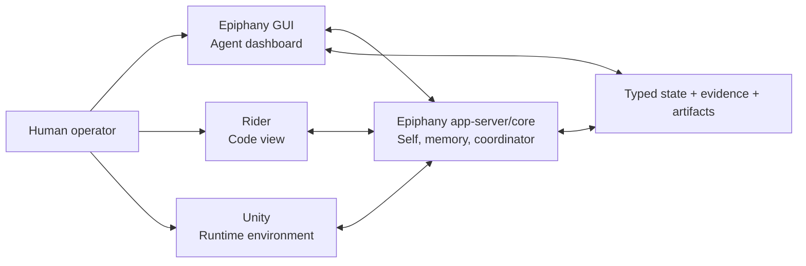

# Epiphany Rider + Unity Integration Plan

This is the opinionated integration plan for the stack this project actually
needs first: Rider as the IDE, Unity as the editor/runtime environment, and
Epiphany as the memory, coordinator, specialist harness, and audit surface.

It is deliberately single-user first. The goal is not a generic IDE ecosystem
strategy. The goal is to make Epiphany useful for Aetheria-shaped Unity work
without letting agents launch random editors, stare into raw transcripts, or
pretend source inspection is the same thing as runtime truth.

## Source Grounding

The plan assumes current public seams rather than folklore:

- Rider has bundled Unity support through the Unity Support plugin, and Unity
  projects should install the JetBrains Rider Editor package so Unity can
  generate C# project files, discover Rider installations, open scripts, and
  connect Rider to the Unity Editor.
  - JetBrains Rider Unity docs: <https://www.jetbrains.com/help/rider/Unity.html>
  - Unity Rider Editor package docs: <https://docs.unity.cn/2020.3/Documentation/Manual/com.unity.ide.rider.html>
- Rider plugins use the IntelliJ Platform frontend for tool windows, actions,
  editor context, and UI integration. Rider also has a ReSharper backend and an
  RD protocol when backend participation is needed.
  - IntelliJ tool windows: <https://plugins.jetbrains.com/docs/intellij/tool-windows.html>
  - IntelliJ action system: <https://plugins.jetbrains.com/docs/intellij/action-system.html>
  - Rider plugin/RD docs: <https://www.jetbrains.com/help/resharper/sdk/Rider.html>
- Unity can be driven through explicit editor command-line operations such as
  `-batchmode`, `-quit`, `-projectPath`, `-executeMethod`, and test runner
  flags like `-runTests` / `-testResults`.
  - Unity command-line arguments: <https://docs.unity.cn/Manual/EditorCommandLineArguments.html>
  - Unity command-line tests: <https://docs.unity.cn/Packages/com.unity.test-framework%401.0/manual/reference-command-line.html>
- Unity editor tooling can inspect and edit Unity-owned serialized state through
  editor APIs rather than text-parsing `.unity` and `.prefab` YAML.
  - `SerializedObject` / `SerializedProperty`: <https://docs.unity.cn/ScriptReference/SerializedObject.html>
  - `AssetDatabase`: <https://docs.unity.cn/ScriptReference/AssetDatabase.html>
  - `PrefabUtility`: <https://docs.unity.cn/ScriptReference/PrefabUtility.html>
  - `EditorSceneManager`: <https://docs.unity.cn/ScriptReference/SceneManagement.EditorSceneManager.html>

These seams are enough. We do not need to build a magical all-knowing IDE worm.
We need a few sober pipes that tell the truth.

Local graph-view grounding:

- The adjacent `E:\Projects\EpiphanyGraph\web\epiphany-graph-viewer` package
  already exports a React `EpiphanyGraphViewer` component for the typed
  Epiphany graph state shape:
  - `graphs.architecture`
  - `graphs.dataflow`
  - `graphs.links`
- That viewer provides `elkjs` layout, zoom/pan, zoom-gated detail, node/edge
  inspection, typed architecture/dataflow cross-link browsing, validation
  issues, and an `onCodeRefSelect` callback.

That is the right seed for Epiphany GUI graph and control-flow diagramming.
Do not reinvent the graph viewer in the dashboard unless the existing component
fails a concrete product need.

## Design Thesis

Rider and Unity should not become Epiphany's brain.

They are sensory and actuation organs:

- **Rider** exposes source-level reality: current solution, open file, selected
  symbols, diagnostics, changed ranges, navigation, inspections, and safe editor
  actions.
- **Unity** exposes editor/runtime reality: project-pinned editor version,
  package state, asset database refresh, compilation status, play mode probes,
  scene/prefab/scriptable-object facts, shader/material state, tests, and logs.
- **Epiphany** remains the Self: typed durable state, coordinator policy,
  specialist launch/readback, CRRC, evidence ledger, and GUI/operator review.

The rule is blunt:

```text
Rider tells Epiphany what the code body looks like.
Unity tells Epiphany what the living editor/runtime does.
Epiphany decides which lane may act next and records why.
```

No hidden source of truth. No autonomous IDE macro circus. No Unity process
summoned from PATH because somebody got enthusiastic. Tiny buttons, hard
receipts.

## Three-Pronged Development Architecture

The practical product shape is three tightly integrated panes over one
development workflow:



### Rider: Code View

Rider is the place where the human inspects the actual repository body.

It should expose:

- source tree and solution/project structure
- current file, selection, symbol, and caret context
- diffs, changed files, changed ranges, branch/changelist facts
- diagnostics and inspections
- navigation from Epiphany findings to `path:line` code refs
- human review of source changes before they are trusted

Rider's job is not to become the agent dashboard. It is the code view: the
human's high-fidelity window into what is really in the repo. When Epiphany
needs source context, Rider can send a selected slice. When the human needs to
audit a claim, Rider opens the file, diff, or symbol. The code body stays
visible instead of becoming a rumor in a chat transcript.

### Epiphany GUI: Agent Dashboard

The Epiphany GUI is the agent dashboard and operator control room.

It should let the user:

- set or revise the objective
- inspect coordinator/CRRC recommendations
- inspect modeling/checkpoint, implementation, verification/review, and
  reorientation lane state
- launch bounded specialist work through existing authority surfaces
- review findings and explicit acceptance gates
- view sealed logs and artifact manifests without opening raw worker thought
  streams
- inspect persisted typed state: objective, graph, frontier, checkpoint,
  scratch, evidence, jobs, and environment status
- visualize architecture/dataflow/control-flow state with the
  `EpiphanyGraphViewer` React component from the adjacent EpiphanyGraph repo

The GUI is not a second IDE and not a source of truth. It is the living
dashboard over Epiphany's durable Self. It should make agent state, role
ownership, evidence gaps, graph shape, and next safe actions visible enough
that the user can operate the system without becoming a terminal hostage.

### Unity: Runtime Environment

Unity is the living runtime environment.

It should expose:

- project-pinned editor identity and package state
- asset database refresh and compilation status
- edit-mode and play-mode tests
- scene, prefab, material, shader, and ScriptableObject facts
- Unity-serialized component fields through `SerializedObject` /
  `SerializedProperty`
- prefab instance overrides and prefab asset operations through `PrefabUtility`
- scene loading, saving, and setup inspection through `EditorSceneManager`
- targeted runtime probes
- logs, screenshots, probe JSON, and test results as artifacts
- scene configuration inspection and explicit bridge-owned scene/probe actions

Unity's job is to answer runtime questions. It is not the coordinator, not the
IDE, and not a place where agents get to freehand process launches. Runtime
truth comes from the pinned Unity bridge and its artifacts, or it does not
count.

The key distinction: Epiphany should not treat scene and prefab files as merely
text. A lot of the real game configuration lives in Unity's serialized object
model: component fields, prefab overrides, material references, shader links,
scene object hierarchies, asset GUIDs, ScriptableObject references, and import
state. Text parsing can sometimes help explain a file, but it cannot safely
answer or refactor most editor-level questions. For those, Epiphany needs a
resident Unity editor package that can walk Unity objects using Unity's own
editor APIs, write typed artifacts, and perform narrow, reviewable mutations
only when explicitly authorized.

### Full Workflow Contract

The three panes should behave like one agent-enabled development surface:

```text
Human sets objective in Epiphany GUI
-> Rider contributes source/diff/selection context
-> modeling grows typed architecture/dataflow/control-flow state
-> Epiphany GUI renders the graph, lanes, evidence, and next action
-> implementation edits source through the normal coding harness
-> Rider exposes the actual diff and diagnostics for inspection
-> Unity bridge runs pinned compilation, probes, tests, and scene fact capture
-> verifier reviews source + runtime evidence
-> coordinator routes continue, regather, reorient, or review
-> durable state records the accepted truth
```

Tight integration does not mean every tool can do everything. It means each
surface does its own job cleanly and hands typed receipts to Epiphany:

- Rider receipts are source/diff/diagnostic/context artifacts.
- Epiphany GUI receipts are objective, lane, graph, evidence, and acceptance
  records.
- Unity receipts are compile/test/probe/runtime artifacts.

The agent sees projected facts and asks for bounded operations. The human sees
the code, the agent state, and the runtime truth without having to stitch
together three half-lit rooms by hand. That is the product.

## Existing Baseline

Already landed:

- Epiphany app-server typed state and fixed-lane coordinator.
- Modeling/checkpoint, verification/review, and reorientation specialist lanes.
- Tauri + React operator GUI over app-server/status/artifact surfaces.
- GUI graph dashboard using the adjacent `@epiphanygraph/epiphany-graph-viewer`
  package over typed `graphs.architecture`, `graphs.dataflow`, and
  `graphs.links`.
- native `epiphany-rider-bridge`, which writes operator-safe Rider
  installation, solution, VCS, context, and open-ref artifacts.
- GUI **Inspect Rider** action and Rider artifact listing.
- `integrations/rider` frontend-only plugin scaffold for a tool window and
  Send Context to Epiphany action. This scaffold still needs build verification
  because Gradle is not installed on the current machine.
- native `epiphany-unity-bridge`, which:
  - reads `ProjectSettings/ProjectVersion.txt`
  - resolves only the exact project-pinned Unity Hub editor
  - refuses wrong or missing editor versions
  - owns `-batchmode`, `-quit`, and `-projectPath`
  - writes inspection/command/log artifacts
- GUI **Inspect Unity** action and runtime artifact listing.

Current Aetheria truth:

- Aetheria pins Unity `6000.1.10f1`.
- This machine currently has Unity Hub editor `6000.4.2f1`.
- Runtime execution is correctly blocked until the exact pinned editor exists.

## Architecture Overview

The integration has five processes/surfaces:

```text
Rider Plugin (Kotlin/IntelliJ frontend)
  -> local Epiphany IPC client
  -> source/diff/diagnostic/context artifacts
  -> Epiphany app-server / GUI action bridge

Unity Editor Package (C# Editor assembly)
  -> JSON artifact writer / local bridge endpoint
  -> pinned Epiphany Unity bridge CLI
  -> runtime/test/probe artifacts

Epiphany GUI (Tauri/React)
  -> app-server APIs + artifact index
  -> operator actions and review gates
  -> persisted state, specialist state, logs, and graph/control-flow diagrams

Epiphany Graph Viewer (React package from EpiphanyGraph)
  -> typed architecture/dataflow graph rendering
  -> node/edge/code-ref inspection and cross-link browsing

Epiphany core/app-server
  -> durable state, coordinator, CRRC, roles, graph/evidence, launch/readback
```

Rider and Unity do not talk to agents directly. They talk to the local Epiphany
control plane or write artifacts that the control plane can ingest. Agents see
projected facts, not raw event soup.

## Boundary Rules

### Rider Boundary

Rider may:

- show Epiphany status in a tool window
- send selected file/symbol/context to Epiphany
- open files and navigate to code refs from Epiphany findings
- expose diagnostics, inspections, solution/project metadata, changed ranges,
  and local VCS state as read-only facts
- expose the human-auditable source tree and diffs for the active repo
- run explicitly chosen IDE actions when the operator clicks them
- display reviewable patches, findings, and artifact links

Rider must not:

- auto-accept Epiphany findings
- silently apply code edits
- launch arbitrary specialists
- own durable Epiphany state
- become the primary agent dashboard
- replace the Tauri operator GUI until the plugin proves it has the missing
  ergonomics
- read sealed worker transcripts or raw result payloads

### Unity Boundary

Unity may:

- report project/editor/package/asset/scene/runtime facts
- run explicit probes through a pinned editor process
- run edit-mode/play-mode tests through bridge-owned command lines
- refresh assets and report compile/domain reload status when explicitly asked
- inspect scene hierarchy, prefab assets, prefab instances, prefab overrides,
  materials, shaders, ScriptableObjects, asset GUIDs, and serialized component
  properties from inside the Editor
- perform narrow editor-owned refactors only through explicit reviewed bridge
  commands with before/after artifacts
- write JSON artifacts, logs, screenshots, and probe outputs

Unity must not:

- be launched through PATH/default editor discovery
- substitute nearby Hub versions for the pinned editor
- continue into play mode/probes after compilation failure unless the requested
  probe explicitly allows failure capture
- apply scene/prefab/asset mutations without an explicit bridge command,
  dry-run/preview artifact when feasible, and final artifact receipt
- let implementation workers edit Unity serialized YAML directly for
  nontrivial scene/prefab refactors when Unity APIs can perform the operation
  with object identity intact
- become the coordinator

### Epiphany Boundary

Epiphany may:

- coordinate fixed lanes
- request Rider/Unity facts
- ingest artifacts as evidence
- route implementation back to modeling or verification when facts are stale
- stop implementation when the editor/runtime bridge is blocked
- render persisted state, specialist status, evidence, logs, and graph views in
  the GUI

Epiphany must not:

- treat missing runtime evidence as a pass
- let implementation workers bypass the bridge
- infer Unity truth from source alone when the task depends on editor/runtime
  behavior
- auto-promote semantic findings from IDE or Unity output
- hide the real repo diff or runtime artifact behind polished dashboard copy

## Rider Integration

### Phase R0: Local Bridge, No Plugin

Before writing a Rider plugin, use stable external surfaces:

- Epiphany GUI remains the main operator window.
- Rider is manually used for code navigation and diff review.
- Epiphany artifacts include Rider-friendly file paths and line numbers.
- Epiphany action prompts forbid direct Unity launch and point at the Unity
  bridge.

This is the current transition state. It is not enough, but it keeps the floor
solid.

### Phase R1: Rider Tool Window

Build a minimal Rider plugin under a future `integrations/rider` directory.

The first plugin is frontend-only Kotlin on the IntelliJ Platform:

- register an `Epiphany` tool window declaratively in `plugin.xml`
- show:
  - current thread id
  - workspace root
  - coordinator action/reason
  - role lanes
  - latest implementation audit
  - latest Unity runtime audit
  - pending review findings
- buttons:
  - Refresh
  - Open Epiphany GUI
  - Send Current File to Modeling Context
  - Run Coordinator Plan
  - Inspect Unity
  - Open Latest Artifact

The plugin talks to a local Epiphany bridge, not directly to agent internals.
Use JSON over localhost or stdio. Prefer a narrow JSON-RPC wrapper around the
same Python/Tauri/app-server surfaces the GUI already uses.

Initial Rider IPC methods:

```json
{
  "epiphany.status": { "threadId": "...", "cwd": "..." },
  "epiphany.coordinatorPlan": { "threadId": "...", "cwd": "..." },
  "epiphany.inspectUnity": { "cwd": "..." },
  "epiphany.openArtifact": { "path": "..." },
  "epiphany.ideContext": {
    "cwd": "...",
    "file": "...",
    "selection": { "startLine": 1, "endLine": 20 },
    "symbol": "optional"
  }
}
```

The returned values are sanitized operator projections only. No transcript
payloads. No `rawResult`.

### Phase R2: IDE Context Capture

Add a **Send Context to Epiphany** action:

- from editor popup
- from project/solution view
- from current selection

Captured payload:

```json
{
  "kind": "riderContext",
  "projectRoot": "E:/Projects/Aetheria-Economy",
  "solutionPath": "Aetheria.sln",
  "filePath": "Assets/Scripts/Foo.cs",
  "caret": { "line": 42, "column": 13 },
  "selection": { "startLine": 37, "endLine": 64 },
  "symbol": {
    "name": "GravityTileRenderer",
    "kind": "class",
    "namespace": "Aetheria.Rendering"
  },
  "vcs": {
    "branch": "codex/gravity-lod",
    "changedRangesKnown": true
  }
}
```

Epiphany ingests this as scratch/context, not durable truth. Modeling decides
whether it deserves graph/evidence status.

### Phase R3: Diagnostics and Changed Ranges

Expose read-only source health:

- solution load status
- project restore status if visible
- current file diagnostics
- solution diagnostics summary
- VCS changed files and changed line ranges
- current changelist/shelf facts

Use this for:

- implementation audit enrichment
- verifier evidence
- modeler frontier freshness

Do not let diagnostics become automatic verifier pass. Diagnostics are a signal,
not a judge wearing a tiny robe.

### Phase R4: Navigation from Epiphany

Make all Epiphany code refs clickable in Rider:

- open `path:line`
- reveal graph node files
- open implementation audit files
- open Unity bridge logs
- open verifier finding refs

This is a usability organ, not a reasoning organ. It keeps the human in the
loop without forcing terminal spelunking.

### Phase R5: Optional Backend/RD Work

Only add Rider backend/RD protocol if frontend-only plugin hits a real wall.

Candidate reasons:

- needing robust C# symbol resolution beyond PSI/frontend access
- needing ReSharper inspections or solution-model facts not exposed cleanly in
  frontend
- needing test/debug integration beyond command orchestration

Until then, stay frontend-only. Backend plugins are a bigger animal, and we do
not need to wrestle it in the kitchen for breakfast.

## Unity Integration

### Phase U0: Pinned Editor Inspection

Already landed:

```powershell
epiphany-unity-bridge inspect --project-path E:\Projects\Aetheria-Economy
```

Outputs:

- `unity-bridge-summary.json`
- `unity-bridge-inspection.md`

Required invariant:

- exact `ProjectSettings/ProjectVersion.txt` editor version or blocked.

### Phase U1: Resident Unity Editor Package

Add an Aetheria-side package, preferably UPM-shaped:

```text
Packages/com.gamecult.epiphany.unity/
  package.json
  Editor/
    EpiphanyBridge.cs
    EpiphanyProbeRunner.cs
    EpiphanyArtifactWriter.cs
    EpiphanyCompilationProbe.cs
    EpiphanySceneProbe.cs
    EpiphanyPrefabProbe.cs
    EpiphanySerializedObjectProbe.cs
    EpiphanyShaderProbe.cs
```

Alternative for faster dogfood:

```text
Assets/Editor/Epiphany/
```

Use `Packages/` once the bridge starts to stabilize. For the first Aetheria
pass, `Assets/Editor/Epiphany` is acceptable if speed matters more than package
cleanliness.

This package is the real Unity organ. It lives inside the Editor so Epiphany can
inspect Unity-owned object state instead of guessing from serialized text.

The first package exposes static `-executeMethod` targets:

```csharp
Epiphany.EditorBridge.InspectProject
Epiphany.EditorBridge.RefreshAssets
Epiphany.EditorBridge.CheckCompilation
Epiphany.EditorBridge.RunEditModeTests
Epiphany.EditorBridge.RunPlayModeTests
Epiphany.EditorBridge.RunProbe
Epiphany.EditorBridge.CaptureSceneFacts
Epiphany.EditorBridge.CapturePrefabFacts
Epiphany.EditorBridge.CaptureSerializedObjectFacts
Epiphany.EditorBridge.CaptureShaderFacts
```

All methods write JSON artifacts under a bridge-provided output directory.

Initial editor-resident probes:

- **Scene object graph**
  - open or inspect target scenes through `EditorSceneManager`
  - enumerate root GameObjects, children, components, enabled state, layers,
    tags, serialized fields, object references, and missing scripts
  - report scene dirtiness and save requirements without saving by default
- **Prefab graph**
  - load prefab assets through `AssetDatabase`
  - report prefab roots, nested prefab instances, variants, overrides, removed
    components, added components, and object references through `PrefabUtility`
- **Serialized object dump**
  - walk selected component/material/ScriptableObject serialized properties
    through `SerializedObject`
  - emit stable property paths, values, object reference GUIDs/paths, and
    unsupported/unreadable fields
- **Reference search**
  - find assets, scenes, prefabs, materials, and components that reference a
    GUID, material, shader, component type, or script
- **Dry-run mutation preview**
  - compute intended scene/prefab/material changes and write a proposed patch
    artifact without saving assets
  - require explicit operator/coordinator approval before applying

Mutation rule: editor package commands may eventually apply scene, prefab, or
asset changes, but only through named operations with scoped inputs, dry-run
preview when feasible, backup/dirty-state reporting, changed asset lists, and a
final artifact receipt. No broad YAML surgery. No "I think this GUID means a
thing" refactors. The Editor knows what the object is; use it.

### Phase U2: Bridge Command Contract

Extend native `epiphany-unity-bridge run` with named operations that call the
resident editor package instead of making freeform `-executeMethod` the normal
path.

Recommended CLI:

```powershell
epiphany-unity-bridge probe `
  --project-path E:\Projects\Aetheria-Economy `
  --operation check-compilation

epiphany-unity-bridge probe `
  --project-path E:\Projects\Aetheria-Economy `
  --operation scene-facts `
  --scene Assets/Scenes/Main.unity

epiphany-unity-bridge probe `
  --project-path E:\Projects\Aetheria-Economy `
  --operation prefab-facts `
  --asset Assets/Prefabs/Nebula.prefab

epiphany-unity-bridge probe `
  --project-path E:\Projects\Aetheria-Economy `
  --operation serialized-object `
  --asset Assets/Materials/Nebula.mat

epiphany-unity-bridge run-tests `
  --project-path E:\Projects\Aetheria-Economy `
  --platform editmode `
  --filter Aetheria.Rendering.Gravity*
```

Internally these map to exact command lines:

```text
<Pinned Unity.exe>
  -batchmode
  -quit
  -projectPath <project>
  -logFile <artifact>/unity.log
  -executeMethod Epiphany.EditorBridge.<Method>
  -epiphanyArtifactDir <artifact>
  -epiphanyOperation <operation>
```

Test operations use Unity Test Framework flags where possible:

```text
-runTests
-testPlatform editmode|playmode
-testResults <artifact>/test-results.xml
```

Never let worker prompts assemble these command lines. The bridge assembles
them. Workers request operations.

### Phase U3: Unity Artifact Schema

Every Unity bridge artifact bundle gets:

```text
unity-bridge-summary.json
unity-command.json
unity.log
unity-probe-result.json
unity-probe-result.md
optional:
  test-results.xml
  screenshot.png
  shader-report.json
  scene-facts.json
  prefab-facts.json
  serialized-object-facts.json
  reference-search.json
  mutation-preview.json
  mutation-apply.json
  compilation.json
```

Common JSON shape:

```json
{
  "kind": "unityProbeResult",
  "projectPath": "E:/Projects/Aetheria-Economy",
  "projectVersion": "6000.1.10f1",
  "editorPath": "C:/Program Files/Unity/Hub/Editor/6000.1.10f1/Editor/Unity.exe",
  "operation": "check-compilation",
  "status": "passed",
  "startedAt": "2026-04-30T12:00:00Z",
  "durationSeconds": 12.4,
  "returncode": 0,
  "compilation": {
    "status": "clean",
    "errors": [],
    "warnings": []
  },
  "assetsTouched": [],
  "logs": {
    "unity": "unity.log"
  },
  "evidenceSummary": "Unity project compiled cleanly under pinned editor."
}
```

Epiphany evidence ingestion should summarize this, not paste the log into
durable state. Logs stay artifacts. Evidence gets the meaning.

### Phase U4: Runtime Probes for Aetheria

Initial Aetheria-specific probes:

- **Compilation probe**
  - Does the project compile under pinned Unity?
  - Which assembly definitions fail?
- **Render pipeline fact probe**
  - Which render pipeline asset is active?
  - Which shader includes/resources are loaded?
  - Which compute shaders exist and compile?
- **Gravity texture contract probe**
  - Is `_NebulaSurfaceHeight` assigned?
  - What texture dimensions/formats are used?
  - Which materials/shaders sample it?
- **Scene/prefab reference probe**
  - Which scenes contain gravity/fog renderers?
  - Which prefabs reference the old camera path?
- **Scene configuration probe**
  - Which scene objects and components own gravity/fog configuration?
  - Which serialized component fields point at the old rendering path?
  - Which object references would need to change for the hierarchical texture
    set?
- **Prefab override probe**
  - Which prefab assets and prefab instances carry overrides relevant to
    gravity/fog rendering?
  - Which overrides are inherited versus local scene edits?
- **Play-mode smoke probe**
  - Can a minimal scene enter play mode long enough to validate the gravity
    texture producer contract?

These probes should be tiny, typed, and boring. A good probe tells one truth.
A heroic probe tells twelve truths and three lies.

### Phase U5: Unity Live Companion

Later, add an optional in-editor companion window:

```text
Window > Epiphany > Bridge
```

It shows:

- current Epiphany thread id
- pinned editor status
- latest probe result
- last artifact path
- buttons for Inspect, Check Compilation, Run Selected Probe

This is for human visibility, not agent control. The authoritative launch path
remains the pinned bridge.

## Epiphany State Additions

Do not jam IDE/runtime facts into scratch prose. Add typed state when the facts
start influencing coordinator policy.

Proposed future state shard:

```json
{
  "environment": {
    "ide": {
      "kind": "rider",
      "status": "connected",
      "solutionPath": "Aetheria.sln",
      "lastContextAt": "2026-04-30T12:00:00Z",
      "diagnosticSummary": {
        "errors": 0,
        "warnings": 14
      }
    },
    "runtime": {
      "kind": "unity",
      "projectVersion": "6000.1.10f1",
      "editorPath": null,
      "status": "missingEditor",
      "lastInspectionArtifact": ".epiphany-gui/runtime/...",
      "lastProbeArtifact": null
    }
  }
}
```

Coordinator policy can then route:

- missing pinned Unity editor -> implementation can continue source-only only
  when runtime evidence is not required; verifier cannot pass runtime claims
- Rider disconnected -> no block by default, but lower confidence in IDE
  diagnostics
- Unity compile failed -> implementation owns repair if failure is from current
  diff; modeling owns regather if failure reveals outdated graph

## Epiphany API Seams

Start in tools/GUI, then promote to app-server only when stable.

### Tool/GUI First

Existing:

- `epiphany-unity-bridge inspect`
- GUI `inspectUnity`

Add next:

- `epiphany-unity-bridge probe`
- `epiphany-unity-bridge run-tests`
- `epiphany-rider-bridge status`
- `epiphany-rider-bridge context`

### App-Server Later

Only after dogfood proves shape:

```text
thread/epiphany/environment
thread/epiphany/ide/context
thread/epiphany/runtime/inspect
thread/epiphany/runtime/probe
thread/epiphany/runtime/result
```

Read-only projections:

- `environment`
- `runtime/result`
- IDE context readback

Authority surfaces:

- `runtime/inspect`
- `runtime/probe`
- `runtime/test`

Acceptance surfaces:

- normal `thread/epiphany/update` or future `environmentAccept`
- no automatic promotion from IDE/runtime output

## Specialist Behavior

### Modeling / Checkpoint

Modeling should use Rider and Unity facts to grow graph state:

- Rider context identifies source symbols and changed ranges.
- Unity probes identify runtime ownership and asset/shader/material references.
- The modeler updates graph nodes for:
  - C# systems
  - shader files
  - compute shaders
  - materials/assets/scenes
  - dataflow between Unity objects and source contracts

Modeling verdicts should say:

- source map ready
- runtime map ready
- runtime blocked because pinned editor missing
- graph stale because Unity facts contradict source assumptions

### Implementation

Implementation may:

- edit source
- use Rider context sent by the operator/plugin
- request explicit Unity bridge probes
- leave reviewable source diff or a reviewable blocker artifact

Implementation may not:

- launch Unity directly
- use installed wrong Unity versions
- claim runtime success from source inspection
- edit Unity scene/prefab assets through broad text mutation unless modeling
  has identified that as the bounded target

### Verification / Review

Verification requires the right evidence class:

- source-only claim -> git diff + Rider diagnostics may be enough
- compile claim -> Unity compilation probe required
- shader/material claim -> Unity shader/material probe required
- play-mode behavior claim -> Unity play-mode/test probe required
- graph/continuity claim -> modeling state patch + accepted evidence

Verifier non-pass findings should continue to block implementation clearance.

### Reorientation / CRRC

CRRC should treat IDE/runtime state as continuity signals:

- Rider changed active file after checkpoint -> possibly regather
- Unity project version changed -> regather runtime environment
- Unity package lock changed -> regather package/runtime facts
- compile/probe artifact older than source diff -> verifier evidence stale

## Operator GUI Shape

Add a dedicated **Environment** band:

```text
Rider
  status: connected/disconnected/manual
  solution: Aetheria.sln
  current file: ...
  diagnostics: errors/warnings
  actions: Capture Context, Open Latest Finding

Unity
  project version: 6000.1.10f1
  editor: missing/ready/path
  compile: unknown/pass/fail/stale
  latest probe: ...
  actions: Inspect, Check Compilation, Run Probe, Open Log
```

Buttons stay explicit. Disabled states should explain the missing prerequisite.
The GUI must make "Unity exact editor missing" visually impossible to miss.
This is for the user, which is to say it is for us, because apparently we enjoy
discovering old editors by summoning them from the basement.

Add a dedicated **Graph** or **Map** view using the adjacent EpiphanyGraph
viewer component:

```tsx
import { EpiphanyGraphViewer } from "@epiphanygraph/epiphany-graph-viewer";
```

The GUI should pass the persisted typed graph state directly:

```ts
{
  architecture: epiphanyState.graphs.architecture,
  dataflow: epiphanyState.graphs.dataflow,
  links: epiphanyState.graphs.links
}
```

Required behavior:

- show architecture and dataflow/control-flow graph tabs or segmented controls
- surface validation issues from malformed graph state
- show selected node, edge, code refs, and linked architecture/dataflow nodes
- call Rider/open-file integration from `onCodeRefSelect`
- keep graph data machine-readable and queryable; the layout is a view, not the
  truth
- use focused subgraphs for dense regions rather than dumping a whole repo
  hairball into the user's lap and calling it insight

## Dataflow Examples

### Source-Only Change

```text
Rider context -> modeling updates source graph -> implementation edits C#
-> Rider diagnostics artifact -> verification reviews source claim
-> roleAccept/update -> continue
```

### Unity Runtime Claim

```text
modeling identifies Unity runtime contract
-> implementation edits source/shader
-> Unity bridge check-compilation
-> Unity bridge targeted probe
-> verifier reviews logs/probe artifacts
-> pass/fail blocks or clears implementation
```

### Missing Editor

```text
Unity bridge inspect
-> missingEditor artifact
-> coordinator marks runtime verification blocked
-> implementation may do source-only scaffold if coordinator allows
-> verifier cannot pass runtime behavior claims
```

### Source Drift

```text
Rider changed ranges or git diff touches frontier files
-> freshness/reorient sees checkpoint stale
-> CRRC launches reorient-worker or regather lane
-> modeling repairs graph before implementation resumes
```

## Implementation Slices

### Slice 1: Plan and State

- Add this plan.
- Add map/handoff/evidence note that Rider+Unity integration is the next
  environment organ.
- No code change beyond docs.

### Slice 2: Resident Unity Editor Package

- Add Aetheria-side `Assets/Editor/Epiphany` bridge first.
- Implement:
  - `InspectProject`
  - `CheckCompilation`
  - `CaptureSceneFacts`
  - `CapturePrefabFacts`
  - `CaptureSerializedObjectFacts`
  - `RunProbe`
  - artifact writer
- Use Unity APIs for Unity state:
  - `AssetDatabase` for asset lookup and GUID/path mapping
  - `EditorSceneManager` for scene loading/inspection
  - `SerializedObject` / `SerializedProperty` for component, material, and
    ScriptableObject fields
  - `PrefabUtility` for prefab assets, instances, and overrides
- Keep it source-controlled in Aetheria, not Epiphany, unless it becomes a
  reusable UPM package later.

### Slice 3: Unity Bridge Operations

- Extend native `epiphany-unity-bridge` from generic `run` to named operations:
  - `inspect`
  - `check-compilation`
  - `run-tests`
  - `run-probe`
- Add built-in operations for scene facts, prefab facts, serialized object
  facts, and reference search.
- Add output-dir argument contract for Unity `-executeMethod` targets.
- Add smoke with fake pinned editor and command JSON.

### Slice 4: Unity Mutation Preview

- Add dry-run editor commands for narrow scene/prefab/material changes.
- Write before/after artifacts and changed-asset manifests.
- Require explicit review before apply commands are available to agents.
- Keep broad direct YAML edits blocked for Unity-owned serialized state.

### Slice 5: GUI Environment Panel

- Add Environment band to `apps/epiphany-gui`.
- Surface latest Unity bridge status and artifact.
- Add buttons for named bridge operations.
- Add buttons for scene facts, prefab facts, serialized object facts, and
  reference search.
- Display mutation previews separately from applied changes.
- Keep artifacts visible and sealed logs separate from summaries.

### Slice 5b: GUI Graph Dashboard

- Pull in or vendor the adjacent `@epiphanygraph/epiphany-graph-viewer`
  component.
- Render persisted `graphs.architecture`, `graphs.dataflow`, and `graphs.links`
  in the Epiphany GUI.
- Wire `onCodeRefSelect` to the Rider bridge/open-file path.
- Add graph health and validation status near coordinator/modeling lane state.
- Keep raw graph payloads accessible as artifacts or JSON for exact reasoning.

### Slice 6: Rider Bridge CLI

- Add native `epiphany-rider-bridge` as a local protocol stub.
- It should accept context packets from the future plugin and write artifacts.
- It should not require Rider plugin code yet.

### Slice 7: Rider Plugin MVP

- Create `integrations/rider`.
- Frontend-only Kotlin plugin:
  - tool window
  - refresh status
  - capture current file/selection
  - open artifact/code refs
  - run Inspect Unity through Epiphany bridge
- No ReSharper backend yet.

### Slice 8: Coordinator Environment Awareness

- Add read-only environment projection after tools settle:
  - IDE status
  - Unity status
  - latest runtime artifacts
- Update coordinator policy:
  - runtime-required verifier claims need Unity evidence
  - missing editor blocks runtime verification
  - stale probe artifacts route back to implementation or modeling

## Verification Plan

Unity bridge:

- fake Hub root exact/missing/wrong-version smoke
- dry-run command fixture
- blocked missing-editor fixture
- artifact manifest completeness check

Unity package:

- edit-mode test that writes probe JSON
- compile-failure fixture if feasible
- command-line `-executeMethod` dry smoke under pinned editor once installed

Rider bridge:

- unit test context packet parsing
- plugin UI smoke if JetBrains test framework setup is tolerable
- manual dogfood checklist if plugin UI tests are too expensive at first

GUI:

- `npm run build`
- `npm run smoke:visual`
- Tauri `cargo check`
- native debug build when command wiring changes

Epiphany policy:

- coordinator mapper tests for:
  - missing Unity editor
  - stale runtime artifact
  - source-only pass
  - runtime-required block
  - verifier non-pass behavior

## Rejected Paths

- **Rider as the whole GUI**: tempting, wrong first move. The Tauri GUI already
  reflects Epiphany state. Rider should add IDE-native context and navigation,
  not replace the operator surface before the loop is stable.
- **Unity plugin as coordinator**: wrong authority. Unity can report living
  runtime facts; Epiphany decides what those facts mean.
- **Direct agent access to Unity/Rider APIs**: too easy to bypass audit,
  version pinning, and review gates.
- **Support every IDE/editor**: no. This is your machine. Rider plus Unity first.
- **Nearby Unity version fallback**: no. A nearby editor version is not the
  pinned editor. Runtime truth does not do vibes.

## MVP Definition

This integration is MVP-ready when:

1. GUI shows Rider/Unity environment status.
2. Unity exact-editor inspection is one click and auditable.
3. Unity compile/probe/test operations run only through the pinned bridge.
4. Rider can send current file/selection/symbol context to Epiphany.
5. Epiphany artifacts open naturally from Rider.
6. Verifier refuses runtime claims without Unity bridge evidence.
7. Missing pinned editor is a clear blocker, not a mysterious failure.
8. The Aetheria dogfood run can proceed without supervisor terminal puppeteering.

That is enough to test the actual product. Everything after that can earn its
keep in the dirt.
