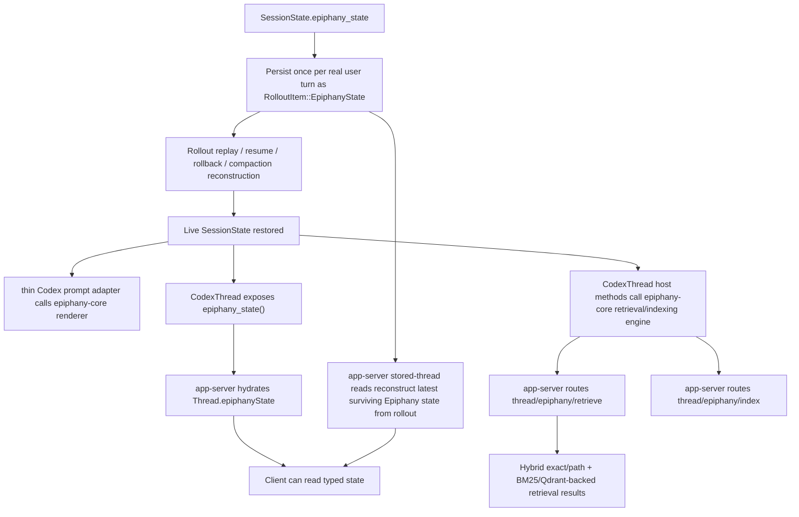

# Epiphany Current Algorithmic Delta Map

This note is not a full machine map for Codex. We already have that in [E:/Projects/EpiphanyAgent/notes/codex-repository-algorithmic-map.md](E:/Projects/EpiphanyAgent/notes/codex-repository-algorithmic-map.md).

This one is narrower and meaner: it documents where the current Epiphany prototype already diverges from upstream Codex in the code we actually have in the working tree.

Scope: current state after Phase 1, Phase 2, the minimal Phase 3 typed read surface, and the first bounded Phase 4 repo-local hybrid retrieval slice. It does **not** describe planned invalidation, GUI reflection, or multi-agent scheduling as if they already exist.

## Mental model in one sentence

Current Epiphany is a thin but real overlay on Codex's thread harness: Codex now carries structured thread state through persistence, replay, prompt assembly, hydrated client thread payloads, and typed repo-local retrieval/indexing surfaces, while the heavier Epiphany prompt, replay, and retrieval organs live in a sibling repo-owned crate instead of entirely inside vendored Codex.

## Divergence summary

Today Epiphany differs from plain Codex in five currently active places:

1. **Durable state exists**
   - Codex rollout/history now has a first-class `EpiphanyThreadState` snapshot.

2. **Prompt assembly reads that state**
   - turn construction injects a bounded developer-facing Epiphany summary when the thread has one.

3. **Hydrated client thread payloads can read that state**
   - app-server `Thread` payloads now expose optional typed `epiphanyState`.

4. **Replay semantics respect rollback and compaction**
   - the "latest Epiphany state" is not "last one in the file." It is reconstructed using turn/rollback boundaries.

5. **Repo-local retrieval/indexing now exists behind typed surfaces**
   - loaded threads can answer structured repo queries through exact/path lookup plus BM25/Qdrant-backed retrieval, and they can explicitly build the persistent semantic side through a separate indexing path.

That is already a meaningful divergence from stock Codex, even if the more glamorous organs are still missing.

## The delta flow



The important thing is that the same state is now flowing through three layers:

- durable storage
- prompt construction
- typed client reads

That is the current Epiphany spine, and retrieval now hangs off it instead of living as shell archaeology.

## Divergence 1: durable typed Epiphany state

### What changed

Codex now has a first-class structured Epiphany snapshot in protocol and rollout:

- [E:/Projects/EpiphanyAgent/vendor/codex/codex-rs/protocol/src/protocol.rs](E:/Projects/EpiphanyAgent/vendor/codex/codex-rs/protocol/src/protocol.rs)

Important pieces:

- `EPIPHANY_STATE_OPEN_TAG` / `EPIPHANY_STATE_CLOSE_TAG`
- `RolloutItem::EpiphanyState(EpiphanyStateItem)`
- `EpiphanyThreadState`
- supporting structs for:
  - subgoals
  - invariants
  - two linked graphs
  - frontier/checkpoint
  - scratch
  - observations
  - recent evidence
  - churn
  - mode

### How this differs from plain Codex

Stock Codex persists turn context and transcript-shaped history, but it does not persist a dedicated repo-understanding state plane with its own graph, evidence, and churn structures.

Current Epiphany adds exactly that.

### Why it matters

This is the first place where Epiphany stops being "remember this in prose" and becomes "there is a canonical object for current understanding."

## Divergence 2: per-turn persistence and replay

### What changed

Session persistence and replay now carry Epiphany state through the thread lifecycle:

- [E:/Projects/EpiphanyAgent/epiphany-core/src/rollout.rs](E:/Projects/EpiphanyAgent/epiphany-core/src/rollout.rs)
- [E:/Projects/EpiphanyAgent/vendor/codex/codex-rs/core/src/session/mod.rs](E:/Projects/EpiphanyAgent/vendor/codex/codex-rs/core/src/session/mod.rs)
- [E:/Projects/EpiphanyAgent/vendor/codex/codex-rs/core/src/epiphany_rollout.rs](E:/Projects/EpiphanyAgent/vendor/codex/codex-rs/core/src/epiphany_rollout.rs)
- [E:/Projects/EpiphanyAgent/vendor/codex/codex-rs/core/src/codex_thread.rs](E:/Projects/EpiphanyAgent/vendor/codex/codex-rs/core/src/codex_thread.rs)

Current behavior:

- `SessionState` can store `epiphany_state`
- after a real user turn, Codex persists one `RolloutItem::EpiphanyState(...)`
- resume restores the latest surviving Epiphany snapshot
- rollback skips rolled-back Epiphany snapshots
- compaction does not erase the latest surviving snapshot
- the vendored rollout wrapper now delegates the replay scan into `epiphany-core` and only supplies Codex's idea of what counts as a user-turn boundary

The key helper is:

- `latest_epiphany_state_from_rollout_items(...)`

That helper reverse-scans rollout items and respects:

- user-turn boundaries
- explicit rollback markers
- compaction boundaries

### How this differs from plain Codex

Plain Codex replay reconstructs thread history, but there is no extra layer saying "this is the thread's durable model of the system."

Epiphany now piggybacks on rollout as a second narrative:

- transcript/history narrative
- understanding-state narrative

### Good metaphor

Codex used to keep the conversation diary.

Epiphany adds the field notebook.

Not the whole future laboratory, just the notebook.

## Divergence 3: prompt assembly consults structured state

### What changed

Turn construction now reads Epiphany state and injects a bounded developer fragment:

- [E:/Projects/EpiphanyAgent/epiphany-core/src/prompt.rs](E:/Projects/EpiphanyAgent/epiphany-core/src/prompt.rs)
- [E:/Projects/EpiphanyAgent/vendor/codex/codex-rs/core/src/context/epiphany_state_instructions.rs](E:/Projects/EpiphanyAgent/vendor/codex/codex-rs/core/src/context/epiphany_state_instructions.rs)
- [E:/Projects/EpiphanyAgent/vendor/codex/codex-rs/core/src/session/mod.rs](E:/Projects/EpiphanyAgent/vendor/codex/codex-rs/core/src/session/mod.rs)

Current behavior:

- if `SessionState.epiphany_state` is present
- `Session::build_initial_context(...)` adds `EpiphanyStateInstructions`
- the vendored wrapper now calls `epiphany_core::render_epiphany_state(...)` instead of owning the heavy rendering logic itself
- the fragment is wrapped in `<epiphany_state> ... </epiphany_state>`
- the renderer is bounded and selective

The renderer currently summarizes:

- objective
- active subgoal
- invariants
- frontier/checkpoint
- focused graph nodes/edges/links
- scratch summary
- observations
- evidence
- churn
- mode

### How this differs from plain Codex

Plain Codex builds prompt context from history, instructions, tools, and runtime policy.

Current Epiphany adds one more structured feed:

- developer-visible thread understanding

### Important limit

This is still read-only prompt use.

The model is not yet updating canonical Epiphany state itself. It can read the map, but it is not yet the clerk writing the ledger.

## Divergence 4: typed client thread read surface

### What changed

Hydrated app-server thread payloads can now expose typed Epiphany state:

- [E:/Projects/EpiphanyAgent/vendor/codex/codex-rs/app-server-protocol/src/protocol/v2.rs](E:/Projects/EpiphanyAgent/vendor/codex/codex-rs/app-server-protocol/src/protocol/v2.rs)
- [E:/Projects/EpiphanyAgent/vendor/codex/codex-rs/app-server/src/codex_message_processor.rs](E:/Projects/EpiphanyAgent/vendor/codex/codex-rs/app-server/src/codex_message_processor.rs)

Current behavior:

- `Thread` has optional `epiphany_state`
- `thread/start` can hydrate it from a live loaded thread
- `thread/resume` can hydrate it from a live loaded thread
- `thread/fork` can hydrate it from a live loaded thread
- `thread/read` can hydrate it:
  - from live thread state when loaded
  - otherwise from rollout reconstruction
- `thread/unarchive` and detached review-thread startup can hydrate it too

### How this differs from plain Codex

Plain Codex clients can inspect thread metadata, turns, items, and diffs, but there is no typed thread field for "the thread's current structured repo understanding."

Epiphany adds the first piece of that client-visible state plane.

### Important limit

This is a **read surface**, not a full Epiphany control plane.

We do **not** yet have:

- `thread/epiphany/read`
- `thread/epiphany/update`
- `thread/epiphany/stateUpdated`
- `thread/epiphany/evidenceAppended`

So the client can now see the state, but cannot yet steer or subscribe to it as a first-class live surface.

## Divergence 5: repo-local retrieval/indexing

### What changed

Loaded threads now expose typed retrieval/indexing surfaces backed by a repo-owned implementation crate and a thin vendored host seam:

- [E:/Projects/EpiphanyAgent/vendor/codex/codex-rs/protocol/src/protocol.rs](E:/Projects/EpiphanyAgent/vendor/codex/codex-rs/protocol/src/protocol.rs)
- [E:/Projects/EpiphanyAgent/epiphany-core/src/retrieval.rs](E:/Projects/EpiphanyAgent/epiphany-core/src/retrieval.rs)
- [E:/Projects/EpiphanyAgent/vendor/codex/codex-rs/core/src/epiphany_retrieval.rs](E:/Projects/EpiphanyAgent/vendor/codex/codex-rs/core/src/epiphany_retrieval.rs)
- [E:/Projects/EpiphanyAgent/vendor/codex/codex-rs/core/src/codex_thread.rs](E:/Projects/EpiphanyAgent/vendor/codex/codex-rs/core/src/codex_thread.rs)
- [E:/Projects/EpiphanyAgent/vendor/codex/codex-rs/app-server-protocol/src/protocol/common.rs](E:/Projects/EpiphanyAgent/vendor/codex/codex-rs/app-server-protocol/src/protocol/common.rs)
- [E:/Projects/EpiphanyAgent/vendor/codex/codex-rs/app-server-protocol/src/protocol/v2.rs](E:/Projects/EpiphanyAgent/vendor/codex/codex-rs/app-server-protocol/src/protocol/v2.rs)
- [E:/Projects/EpiphanyAgent/vendor/codex/codex-rs/app-server/src/codex_message_processor.rs](E:/Projects/EpiphanyAgent/vendor/codex/codex-rs/app-server/src/codex_message_processor.rs)

Current behavior:

- `EpiphanyThreadState` now has retrieval metadata via `retrieval`
- `epiphany-core` now owns the heavy retrieval/indexing engine and manifest/Qdrant/Ollama/BM25 logic
- `vendor/codex/codex-rs/core/src/epiphany_retrieval.rs` is now a thin re-export layer instead of the whole engine
- `CodexThread` exposes:
  - `epiphany_retrieval_state()`
  - `epiphany_retrieve(...)`
  - `epiphany_index(...)`
- app-server protocol exposes experimental `thread/epiphany/retrieve`
- app-server protocol also exposes experimental `thread/epiphany/index`
- the retrieval machine is hybrid from day one:
  - exact/path-ish hits via existing `codex_file_search`
  - semantic hits via workspace-local BM25 chunk search over a gitignore-respecting corpus
  - persistent semantic retrieval from Qdrant when the explicit index is fresh
- live `thread.epiphanyState` hydration backfills a lightweight retrieval summary when the thread has Epiphany state but no persisted retrieval metadata yet

### How this differs from plain Codex

Plain Codex has pieces of repo search substrate scattered around:

- fuzzy/exact-ish file search
- BM25 usage in tool-search paths
- shell access if the operator wants to rummage manually

What it does not have is one Epiphany-owned retrieval organ that says:

- this query is for repo understanding
- this thread/workspace is the scope
- exact and semantic lookup are the same machine
- results come back in a typed shape instead of as transcript confetti

What changed now is that the heavier part of that organ no longer lives entirely inside vendored Codex. The host seam is still patched into Codex, but the actual engine mostly lives in `epiphany-core`, which makes the ownership boundary less muddy and makes modified Codex alone a less complete rebuild kit.

### Why it matters

This is the first time Epiphany can ask a structured repo question without falling back to file-by-file terminal spelunking.

That changes the shape of the harness. The map is no longer just a notebook the prompt can read. It now has a first retrieval organ hanging off the same typed spine.

### Important limits

This slice is intentionally small and honest:

- query-time only
- loaded-thread-first
- read-only
- local BM25 rather than embeddings
- no watcher-driven invalidation
- explicit indexing rather than hidden retrieval mutation
- env-driven backend config for now

## What has *not* diverged yet

This matters because the spec is ahead of the code in a few obvious places.

### Not yet shipped

- no code-intelligence layer
- no watcher-driven semantic invalidation
- no observation-promotion machinery beyond the data model
- no live Epiphany event stream
- no typed write/update methods for Epiphany state
- no mutation gates enforcing map freshness or declared intent
- no specialist-agent scheduling
- no GUI reflection layer

So current Epiphany is real, but still skeletal.

## Current algorithmic shape versus plain Codex

### Plain Codex steady-state path

```text
input -> turn context -> prompt -> model/tool loop -> transcript/history -> rollout -> client thread/items
```

### Current Epiphany path

```text
input
-> turn context
-> prompt + bounded epiphany_state fragment
-> model/tool loop
-> transcript/history
-> rollout + epiphany_state snapshot
-> replay-aware epiphany restoration
-> hydrated client thread payload with epiphanyState
-> thin Codex adapters into repo-owned epiphany-core organs
-> optional typed repo retrieval through thread/epiphany/retrieve
-> optional explicit semantic indexing through thread/epiphany/index
```

That is the real delta.

The transcript is no longer the only thing with continuity.

## Where the divergence is already meaningful

Even without invalidation or GUI, the divergence is already structurally important in five ways:

1. **Understanding has a durable object now**
   - not just prose and replayed vibes

2. **The turn loop can consult that understanding**
   - not just whatever history happens to fit in the window

3. **Clients can read that understanding directly**
   - not by scraping the prompt or reverse-engineering transcript fragments

4. **The harness has typed repo retrieval/indexing organs now**
   - not just shell archaeology plus vibes

5. **Most of the heavy Epiphany-owned implementation now lives outside vendored Codex**
   - not because plugins are fashionable, but because keeping the thicker organ repo-owned makes the boundary less muddy while preserving first-class typed integration

That is not the full Epiphany vision yet, but it is no longer cosmetic either.

## Recommended next companion note

The useful follow-on section for this file is probably not "more retrieval exists."

It is more likely one of these:

- structured observation promotion from retrieval/tool output into durable Epiphany state
- live health/config semantics for the explicit indexing path
- eventual watcher-driven invalidation only if the current explicit path proves too manual

Those would be the next places where the machine stops being a better notebook and starts being a more opinionated harness.
