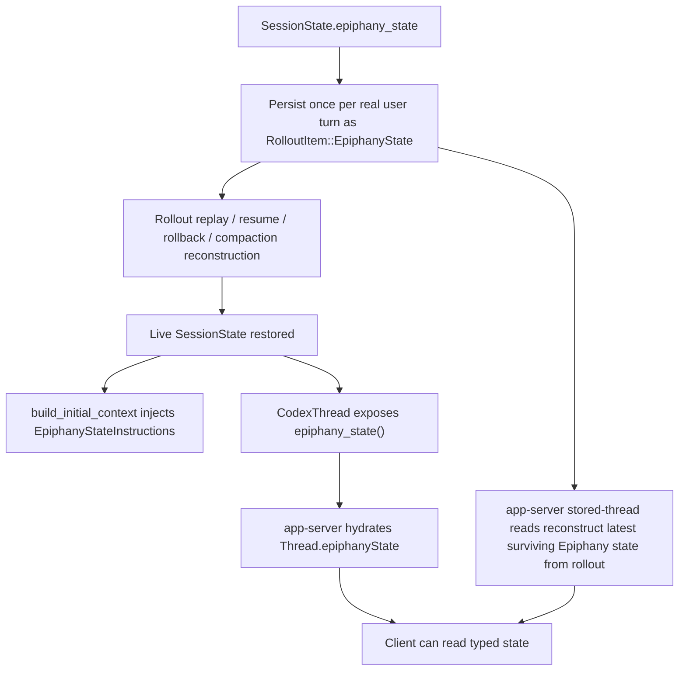

# Epiphany Current Algorithmic Delta Map

This note is not a full machine map for Codex. We already have that in [E:/Projects/EpiphanyAgent/notes/codex-repository-algorithmic-map.md](E:/Projects/EpiphanyAgent/notes/codex-repository-algorithmic-map.md).

This one is narrower and meaner: it documents where the current Epiphany prototype already diverges from upstream Codex in the code we have actually landed.

Scope: current state after Phase 1, Phase 2, and the minimal Phase 3 typed read surface. It does **not** describe planned retrieval, invalidation, GUI reflection, or multi-agent scheduling as if they already exist.

## Mental model in one sentence

Current Epiphany is a thin but real overlay on Codex's thread harness: Codex now carries a structured thread-state snapshot through persistence, replay, prompt assembly, and hydrated client thread payloads.

## Divergence summary

Today Epiphany differs from plain Codex in four shipped places:

1. **Durable state exists**
   - Codex rollout/history now has a first-class `EpiphanyThreadState` snapshot.

2. **Prompt assembly reads that state**
   - turn construction injects a bounded developer-facing Epiphany summary when the thread has one.

3. **Hydrated client thread payloads can read that state**
   - app-server `Thread` payloads now expose optional typed `epiphanyState`.

4. **Replay semantics respect rollback and compaction**
   - the "latest Epiphany state" is not "last one in the file." It is reconstructed using turn/rollback boundaries.

That is already a meaningful divergence from stock Codex, even if the more glamorous organs are still missing.

## The delta flow



The important thing is that the same state is now flowing through three layers:

- durable storage
- prompt construction
- typed client reads

That is the current Epiphany spine.

## Divergence 1: durable typed Epiphany state

### What changed

Codex now has a first-class structured Epiphany snapshot in protocol and rollout:

- [E:/Projects/EpiphanyAgent/vendor/codex/codex-rs/protocol/src/protocol.rs](E:/Projects/EpiphanyAgent/vendor/codex/codex-rs/protocol/src/protocol.rs)

Important pieces:

- `EPIPHANY_STATE_OPEN_TAG` / `EPIPHANY_STATE_CLOSE_TAG`
- `RolloutItem::EpiphanyState(EpiphanyStateItem)`
- `EpiphanyThreadState`
- supporting structs for:
  - subgoals
  - invariants
  - two linked graphs
  - frontier/checkpoint
  - scratch
  - observations
  - recent evidence
  - churn
  - mode

### How this differs from plain Codex

Stock Codex persists turn context and transcript-shaped history, but it does not persist a dedicated repo-understanding state plane with its own graph, evidence, and churn structures.

Current Epiphany adds exactly that.

### Why it matters

This is the first place where Epiphany stops being "remember this in prose" and becomes "there is a canonical object for current understanding."

## Divergence 2: per-turn persistence and replay

### What changed

Session persistence and replay now carry Epiphany state through the thread lifecycle:

- [E:/Projects/EpiphanyAgent/vendor/codex/codex-rs/core/src/session/mod.rs](E:/Projects/EpiphanyAgent/vendor/codex/codex-rs/core/src/session/mod.rs)
- [E:/Projects/EpiphanyAgent/vendor/codex/codex-rs/core/src/epiphany_rollout.rs](E:/Projects/EpiphanyAgent/vendor/codex/codex-rs/core/src/epiphany_rollout.rs)
- [E:/Projects/EpiphanyAgent/vendor/codex/codex-rs/core/src/codex_thread.rs](E:/Projects/EpiphanyAgent/vendor/codex/codex-rs/core/src/codex_thread.rs)

Current behavior:

- `SessionState` can store `epiphany_state`
- after a real user turn, Codex persists one `RolloutItem::EpiphanyState(...)`
- resume restores the latest surviving Epiphany snapshot
- rollback skips rolled-back Epiphany snapshots
- compaction does not erase the latest surviving snapshot

The key helper is:

- `latest_epiphany_state_from_rollout_items(...)`

That helper reverse-scans rollout items and respects:

- user-turn boundaries
- explicit rollback markers
- compaction boundaries

### How this differs from plain Codex

Plain Codex replay reconstructs thread history, but there is no extra layer saying "this is the thread's durable model of the system."

Epiphany now piggybacks on rollout as a second narrative:

- transcript/history narrative
- understanding-state narrative

### Good metaphor

Codex used to keep the conversation diary.

Epiphany adds the field notebook.

Not the whole future laboratory, just the notebook.

## Divergence 3: prompt assembly consults structured state

### What changed

Turn construction now reads Epiphany state and injects a bounded developer fragment:

- [E:/Projects/EpiphanyAgent/vendor/codex/codex-rs/core/src/context/epiphany_state_instructions.rs](E:/Projects/EpiphanyAgent/vendor/codex/codex-rs/core/src/context/epiphany_state_instructions.rs)
- [E:/Projects/EpiphanyAgent/vendor/codex/codex-rs/core/src/session/mod.rs](E:/Projects/EpiphanyAgent/vendor/codex/codex-rs/core/src/session/mod.rs)

Current behavior:

- if `SessionState.epiphany_state` is present
- `Session::build_initial_context(...)` adds `EpiphanyStateInstructions`
- the fragment is wrapped in `<epiphany_state> ... </epiphany_state>`
- the renderer is bounded and selective

The renderer currently summarizes:

- objective
- active subgoal
- invariants
- frontier/checkpoint
- focused graph nodes/edges/links
- scratch summary
- observations
- evidence
- churn
- mode

### How this differs from plain Codex

Plain Codex builds prompt context from history, instructions, tools, and runtime policy.

Current Epiphany adds one more structured feed:

- developer-visible thread understanding

### Important limit

This is still read-only prompt use.

The model is not yet updating canonical Epiphany state itself. It can read the map, but it is not yet the clerk writing the ledger.

## Divergence 4: typed client thread read surface

### What changed

Hydrated app-server thread payloads can now expose typed Epiphany state:

- [E:/Projects/EpiphanyAgent/vendor/codex/codex-rs/app-server-protocol/src/protocol/v2.rs](E:/Projects/EpiphanyAgent/vendor/codex/codex-rs/app-server-protocol/src/protocol/v2.rs)
- [E:/Projects/EpiphanyAgent/vendor/codex/codex-rs/app-server/src/codex_message_processor.rs](E:/Projects/EpiphanyAgent/vendor/codex/codex-rs/app-server/src/codex_message_processor.rs)

Current behavior:

- `Thread` has optional `epiphany_state`
- `thread/start` can hydrate it from a live loaded thread
- `thread/resume` can hydrate it from a live loaded thread
- `thread/fork` can hydrate it from a live loaded thread
- `thread/read` can hydrate it:
  - from live thread state when loaded
  - otherwise from rollout reconstruction
- `thread/unarchive` and detached review-thread startup can hydrate it too

### How this differs from plain Codex

Plain Codex clients can inspect thread metadata, turns, items, and diffs, but there is no typed thread field for "the thread's current structured repo understanding."

Epiphany adds the first piece of that client-visible state plane.

### Important limit

This is a **read surface**, not a full Epiphany control plane.

We do **not** yet have:

- `thread/epiphany/read`
- `thread/epiphany/update`
- `thread/epiphany/retrieve`
- `thread/epiphany/stateUpdated`
- `thread/epiphany/evidenceAppended`

So the client can now see the state, but cannot yet steer or subscribe to it as a first-class live surface.

## What has *not* diverged yet

This matters because the spec is ahead of the code in a few obvious places.

### Not yet shipped

- no retrieval subsystem
- no code-intelligence layer
- no watcher-driven semantic invalidation
- no observation-promotion machinery beyond the data model
- no live Epiphany event stream
- no typed write/update methods for Epiphany state
- no mutation gates enforcing map freshness or declared intent
- no specialist-agent scheduling
- no GUI reflection layer

So current Epiphany is real, but still skeletal.

## Current algorithmic shape versus plain Codex

### Plain Codex steady-state path

```text
input -> turn context -> prompt -> model/tool loop -> transcript/history -> rollout -> client thread/items
```

### Current Epiphany path

```text
input
-> turn context
-> prompt + bounded epiphany_state fragment
-> model/tool loop
-> transcript/history
-> rollout + epiphany_state snapshot
-> replay-aware epiphany restoration
-> hydrated client thread payload with epiphanyState
```

That is the real delta.

The transcript is no longer the only thing with continuity.

## Where the divergence is already meaningful

Even without retrieval or GUI, the divergence is already structurally important in three ways:

1. **Understanding has a durable object now**
   - not just prose and replayed vibes

2. **The turn loop can consult that understanding**
   - not just whatever history happens to fit in the window

3. **Clients can read that understanding directly**
   - not by scraping the prompt or reverse-engineering transcript fragments

That is not the full Epiphany vision yet, but it is no longer cosmetic either.

## Recommended next companion note

Once Phase 4 lands, this file should get a new section:

- `Divergence 5: repo-local hybrid retrieval`

That will probably be the moment the divergence starts feeling less like a careful extension and more like a different operating philosophy living inside the same harness.
