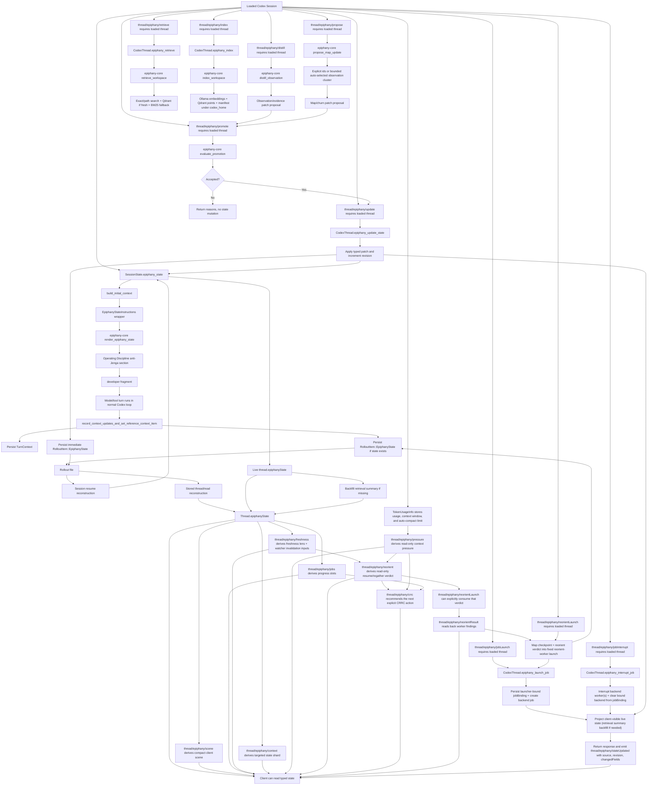

# Epiphany Current Algorithmic Map

This is the current control-flow map for Epiphany as it exists in the repo now.

It is not the future harness spec, and it is not the full Codex machine map. Codex still owns the ordinary turn loop, model/tool execution, persistence substrate, and app-server plumbing. Epiphany is the fork-layer that adds typed modeling state, prompt-facing state injection, client-visible state reads, and repo-local retrieval/indexing organs.

The important question for this file is not "what is Epiphany supposed to become?" It is: when the current code runs, where does Epiphany state go?

## Current Truth

Current Epiphany is a forked Codex harness with a typed modeling spine.

The spine exists in twenty-three live paths:

- protocol state shape: `EpiphanyThreadState`, `RolloutItem::EpiphanyState`, retrieval summaries, and prompt tags live in [protocol.rs](E:/Projects/EpiphanyAgent/vendor/codex/codex-rs/protocol/src/protocol.rs:103).
- in-memory session state: `SessionState` stores an optional `EpiphanyThreadState`, and `Session` exposes thin async accessors over it in [state/session.rs](E:/Projects/EpiphanyAgent/vendor/codex/codex-rs/core/src/state/session.rs:36) and [session/mod.rs](E:/Projects/EpiphanyAgent/vendor/codex/codex-rs/core/src/session/mod.rs:1240).
- prompt injection: `build_initial_context` reads the optional state and adds a bounded `<epiphany_state>` developer fragment; the renderer now includes a durable investigation-checkpoint section when authoritative state carries one, so a resumed agent can see whether planning/source gathering was banked or must be re-gathered in [session/mod.rs](E:/Projects/EpiphanyAgent/vendor/codex/codex-rs/core/src/session/mod.rs:2434) and [prompt.rs](E:/Projects/EpiphanyAgent/epiphany-core/src/prompt.rs:33).
- per-turn persistence: normal turn setup persists one `RolloutItem::EpiphanyState` after the `TurnContext` when state exists in [session/mod.rs](E:/Projects/EpiphanyAgent/vendor/codex/codex-rs/core/src/session/mod.rs:2677).
- client read hydration: app-server thread views attach live or reconstructed `thread.epiphanyState` in [codex_message_processor.rs](E:/Projects/EpiphanyAgent/vendor/codex/codex-rs/app-server/src/codex_message_processor.rs:4706) and [codex_message_processor.rs](E:/Projects/EpiphanyAgent/vendor/codex/codex-rs/app-server/src/codex_message_processor.rs:4822).
- explicit distillation proposals: app-server routes read-only `thread/epiphany/distill` through a loaded-thread handler into `epiphany-core` so one explicit observation can become a patch candidate without mutating state; tool/command/shell/model sources now get typed evidence kinds and bounded salient-output summaries instead of dumping raw output into durable state in [codex_message_processor.rs](E:/Projects/EpiphanyAgent/vendor/codex/codex-rs/app-server/src/codex_message_processor.rs:4358) and [distillation.rs](E:/Projects/EpiphanyAgent/epiphany-core/src/distillation.rs:28).
- explicit map/churn proposals: app-server routes read-only `thread/epiphany/propose` through a loaded-thread handler into `epiphany-core` so verified observations with code refs and accepting recent evidence can be selected explicitly or auto-selected as a bounded path cluster, prioritize the strongest selected observation, focus or extend architecture graph nodes, rescue unanchored graph nodes through strict semantic overlap, carry linked dataflow nodes and incident graph edges into the frontier, update churn candidates with match-kind-aware map-delta judgment and pressure, and still avoid mutation until promotion in [codex_message_processor.rs](E:/Projects/EpiphanyAgent/vendor/codex/codex-rs/app-server/src/codex_message_processor.rs:4429) and [proposal.rs](E:/Projects/EpiphanyAgent/epiphany-core/src/proposal.rs:115).
- explicit promotion gates: app-server routes `thread/epiphany/promote` through a loaded-thread handler into `epiphany-core` policy evaluation, rejects failed verifier evidence without mutation, applies accepted candidates through the same durable update path, and now treats medium/high/expanded/broadening/semantic churn deltas as needing explicit rationale plus stronger verifier evidence whose kind is token-matched rather than substring-matched; the same gate also validates durable investigation-checkpoint packets, including linked evidence ids, before they can be inked into state in [codex_message_processor.rs](E:/Projects/EpiphanyAgent/vendor/codex/codex-rs/app-server/src/codex_message_processor.rs:4501) and [promotion.rs](E:/Projects/EpiphanyAgent/epiphany-core/src/promotion.rs:33).
- explicit state updates: app-server routes `thread/epiphany/update` through a loaded `CodexThread` update method that rejects malformed appended observation/evidence graph records and structurally invalid replacement fields, including investigation checkpoints that cite missing evidence, mutates live `SessionState` only after validation, bumps the revision, and persists an immediate `RolloutItem::EpiphanyState` snapshot in [codex_message_processor.rs](E:/Projects/EpiphanyAgent/vendor/codex/codex-rs/app-server/src/codex_message_processor.rs:4620), [codex_thread.rs](E:/Projects/EpiphanyAgent/vendor/codex/codex-rs/core/src/codex_thread.rs:376), [codex_thread.rs](E:/Projects/EpiphanyAgent/vendor/codex/codex-rs/core/src/codex_thread.rs:552), and [promotion.rs](E:/Projects/EpiphanyAgent/epiphany-core/src/promotion.rs:44).
- live state notifications and write responses: app-server declares experimental `thread/epiphany/stateUpdated` and emits it with the updated typed state, typed `source`, event-level `revision`, and typed `changedFields` after successful direct updates and accepted promotions, but not after rejected promotions; direct `thread/epiphany/update` and accepted `thread/epiphany/promote` responses expose the same revision/change metadata, accepted promotions always report `Evidence` because verifier evidence is appended even when the patch evidence list is empty, and successful write response/notification states now use the same client-visible live projection as `thread/read`, including retrieval-summary backfill when durable state has no persisted retrieval metadata, in [common.rs](E:/Projects/EpiphanyAgent/vendor/codex/codex-rs/app-server-protocol/src/protocol/common.rs:1113), [v2.rs](E:/Projects/EpiphanyAgent/vendor/codex/codex-rs/app-server-protocol/src/protocol/v2.rs:4354), [v2.rs](E:/Projects/EpiphanyAgent/vendor/codex/codex-rs/app-server-protocol/src/protocol/v2.rs:4419), [v2.rs](E:/Projects/EpiphanyAgent/vendor/codex/codex-rs/app-server-protocol/src/protocol/v2.rs:4428), [codex_message_processor.rs](E:/Projects/EpiphanyAgent/vendor/codex/codex-rs/app-server/src/codex_message_processor.rs:4555), [codex_message_processor.rs](E:/Projects/EpiphanyAgent/vendor/codex/codex-rs/app-server/src/codex_message_processor.rs:4608), [codex_message_processor.rs](E:/Projects/EpiphanyAgent/vendor/codex/codex-rs/app-server/src/codex_message_processor.rs:4652), [codex_message_processor.rs](E:/Projects/EpiphanyAgent/vendor/codex/codex-rs/app-server/src/codex_message_processor.rs:4693), [codex_message_processor.rs](E:/Projects/EpiphanyAgent/vendor/codex/codex-rs/app-server/src/codex_message_processor.rs:11327), and [codex_message_processor.rs](E:/Projects/EpiphanyAgent/vendor/codex/codex-rs/app-server/src/codex_message_processor.rs:11370).
- scene projection: app-server declares experimental read-only `thread/epiphany/scene`, reads the same live/stored Epiphany state view used by `thread/read`, and derives a compact client scene with objective, active subgoal, invariant status counts, graph focus/counts, retrieval status, investigation-checkpoint summary counts, observation/evidence summaries, churn, live/stored source, and available control-plane actions without mutating or persisting state in [common.rs](E:/Projects/EpiphanyAgent/vendor/codex/codex-rs/app-server-protocol/src/protocol/common.rs:340), [v2.rs](E:/Projects/EpiphanyAgent/vendor/codex/codex-rs/app-server-protocol/src/protocol/v2.rs:3924), [codex_message_processor.rs](E:/Projects/EpiphanyAgent/vendor/codex/codex-rs/app-server/src/codex_message_processor.rs:4115), and [codex_message_processor.rs](E:/Projects/EpiphanyAgent/vendor/codex/codex-rs/app-server/src/codex_message_processor.rs:10757).
- job/progress reflection: app-server declares experimental read-only `thread/epiphany/jobs`, reads the same thread view as scene, optionally fills retrieval state for loaded threads with no Epiphany state, and derives four non-authoritative progress slots for retrieval indexing, graph remap, invariant verification, and specialist work. Durable `job_bindings` now act as a thin Epiphany-owned launcher seam with launcher id, authority scope, backend kind, and backend job id; the current adapter can overlay those launcher bindings onto live runtime `agent_jobs` snapshots so the surface can show real owner/progress/thread information without scheduling, notifying, mutating, or persisting runtime jobs in [common.rs](E:/Projects/EpiphanyAgent/vendor/codex/codex-rs/app-server-protocol/src/protocol/common.rs:347), [v2.rs](E:/Projects/EpiphanyAgent/vendor/codex/codex-rs/app-server-protocol/src/protocol/v2.rs:4142), [codex_message_processor.rs](E:/Projects/EpiphanyAgent/vendor/codex/codex-rs/app-server/src/codex_message_processor.rs:4176), and [codex_message_processor.rs](E:/Projects/EpiphanyAgent/vendor/codex/codex-rs/app-server/src/codex_message_processor.rs:11998).
- bound-job progress notifications: app-server now declares experimental `thread/epiphany/jobsUpdated`, listens for `agent_job_progress:{json}` background events from the runtime job runner, resolves matching launcher bindings against live `agent_jobs` snapshots through the current backend adapter, and emits only the changed bound-job payloads when the mapped job state actually differs from the last notification for that thread. It does not poll in a loop, mutate Epiphany state, schedule work, or make `thread/epiphany/jobs` a writer.
- explicit job control: app-server now declares experimental `thread/epiphany/jobLaunch` and `thread/epiphany/jobInterrupt`, routes them through core launch/interrupt handlers that can open the live or direct sqlite state runtime, create or cancel the current `agent_jobs` backend binding, persist durable `job_bindings` revisions through the authoritative Epiphany state path, interrupt live worker threads when needed, and emit `thread/epiphany/stateUpdated` with source `jobLaunch` or `jobInterrupt` instead of pretending jobs reflection is the scheduler in [common.rs](E:/Projects/EpiphanyAgent/vendor/codex/codex-rs/app-server-protocol/src/protocol/common.rs:389), [v2.rs](E:/Projects/EpiphanyAgent/vendor/codex/codex-rs/app-server-protocol/src/protocol/v2.rs:4850), [codex_thread.rs](E:/Projects/EpiphanyAgent/vendor/codex/codex-rs/core/src/codex_thread.rs:418), [codex_thread.rs](E:/Projects/EpiphanyAgent/vendor/codex/codex-rs/core/src/codex_thread.rs:493), [codex_thread.rs](E:/Projects/EpiphanyAgent/vendor/codex/codex-rs/core/src/codex_thread.rs:657), and [codex_message_processor.rs](E:/Projects/EpiphanyAgent/vendor/codex/codex-rs/app-server/src/codex_message_processor.rs:4992).
- freshness reflection: app-server declares experimental read-only `thread/epiphany/freshness`, reads the same live/stored thread view used by scene/jobs/context, fills live retrieval state for loaded threads, and derives one bounded retrieval/graph freshness lens plus, for loaded threads, watcher-backed invalidation inputs with watched root, changed paths, mapped graph-node hits, active-frontier hits, and revision/source identity without mutating, scheduling, notifying, or performing automatic semantic invalidation in [common.rs](E:/Projects/EpiphanyAgent/vendor/codex/codex-rs/app-server-protocol/src/protocol/common.rs:350), [v2.rs](E:/Projects/EpiphanyAgent/vendor/codex/codex-rs/app-server-protocol/src/protocol/v2.rs:4167), [v2.rs](E:/Projects/EpiphanyAgent/vendor/codex/codex-rs/app-server-protocol/src/protocol/v2.rs:4259), [epiphany_invalidation.rs](E:/Projects/EpiphanyAgent/vendor/codex/codex-rs/app-server/src/epiphany_invalidation.rs:19), [epiphany_invalidation.rs](E:/Projects/EpiphanyAgent/vendor/codex/codex-rs/app-server/src/epiphany_invalidation.rs:67), [codex_message_processor.rs](E:/Projects/EpiphanyAgent/vendor/codex/codex-rs/app-server/src/codex_message_processor.rs:4219), and [codex_message_processor.rs](E:/Projects/EpiphanyAgent/vendor/codex/codex-rs/app-server/src/codex_message_processor.rs:11073).
- targeted context reflection: app-server declares experimental read-only `thread/epiphany/context`, reads the same live/stored Epiphany state view used by scene/jobs, and derives a bounded state shard containing selected graph nodes/edges, links, active frontier, checkpoint, the full durable investigation-checkpoint packet, observations, direct evidence, linked evidence, and missing requested ids without retrieval, proposal, promotion, notification, mutation, or persistence in [common.rs](E:/Projects/EpiphanyAgent/vendor/codex/codex-rs/app-server-protocol/src/protocol/common.rs:355), [v2.rs](E:/Projects/EpiphanyAgent/vendor/codex/codex-rs/app-server-protocol/src/protocol/v2.rs:4253), [codex_message_processor.rs](E:/Projects/EpiphanyAgent/vendor/codex/codex-rs/app-server/src/codex_message_processor.rs:4261), and [codex_message_processor.rs](E:/Projects/EpiphanyAgent/vendor/codex/codex-rs/app-server/src/codex_message_processor.rs:11152).
- context-pressure reflection: core token telemetry carries `model_auto_compact_token_limit` beside total/last usage and `model_context_window`; app-server declares experimental read-only `thread/epiphany/pressure`, reads live token usage or the latest stored rollout `TokenCount`, and derives `unknown`/`low`/`elevated`/`high`/`critical` pressure plus a non-acting compaction-prep recommendation without mutating Epiphany state or scheduling compaction in [protocol.rs](E:/Projects/EpiphanyAgent/vendor/codex/codex-rs/protocol/src/protocol.rs:2237), [turn_context.rs](E:/Projects/EpiphanyAgent/vendor/codex/codex-rs/core/src/session/turn_context.rs:103), [session/mod.rs](E:/Projects/EpiphanyAgent/vendor/codex/codex-rs/core/src/session/mod.rs:2716), [common.rs](E:/Projects/EpiphanyAgent/vendor/codex/codex-rs/app-server-protocol/src/protocol/common.rs:360), [v2.rs](E:/Projects/EpiphanyAgent/vendor/codex/codex-rs/app-server-protocol/src/protocol/v2.rs:4361), [token_usage_replay.rs](E:/Projects/EpiphanyAgent/vendor/codex/codex-rs/app-server/src/codex_message_processor/token_usage_replay.rs:75), [codex_message_processor.rs](E:/Projects/EpiphanyAgent/vendor/codex/codex-rs/app-server/src/codex_message_processor.rs:4306), and [codex_message_processor.rs](E:/Projects/EpiphanyAgent/vendor/codex/codex-rs/app-server/src/codex_message_processor.rs:11028).
- reorientation policy: app-server declares experimental read-only `thread/epiphany/reorient`, reuses the same live/stored thread view plus mapped pressure/freshness/watcher signals, and derives a bounded `resume`/`regather` verdict with checkpoint-path/frontier reasons without mutating, compacting, scheduling, notifying, or continuing work in [common.rs](E:/Projects/EpiphanyAgent/vendor/codex/codex-rs/app-server-protocol/src/protocol/common.rs:365), [v2.rs](E:/Projects/EpiphanyAgent/vendor/codex/codex-rs/app-server-protocol/src/protocol/v2.rs:4514), [codex_message_processor.rs](E:/Projects/EpiphanyAgent/vendor/codex/codex-rs/app-server/src/codex_message_processor.rs:4394), and [codex_message_processor.rs](E:/Projects/EpiphanyAgent/vendor/codex/codex-rs/app-server/src/codex_message_processor.rs:11424).
- CRRC coordinator recommendation: app-server declares experimental read-only `thread/epiphany/crrc`, reuses the same pressure/freshness/watcher/reorientation mapping plus the fixed `reorient-worker` binding and result read-back helper, and returns one bounded recommendation such as continue, prepare checkpoint, launch worker, wait, review, accept, or regather manually without mutating, launching, accepting, compacting, notifying, scheduling, or silently continuing work in [common.rs](E:/Projects/EpiphanyAgent/vendor/codex/codex-rs/app-server-protocol/src/protocol/common.rs:370), [v2.rs](E:/Projects/EpiphanyAgent/vendor/codex/codex-rs/app-server-protocol/src/protocol/v2.rs:4661), and [codex_message_processor.rs](E:/Projects/EpiphanyAgent/vendor/codex/codex-rs/app-server/src/codex_message_processor.rs:4546).
- MVP operator view: `tools/epiphany_mvp_status.py` launches app-server over stdio, starts or reads one thread, gathers scene, pressure, reorient, jobs, reorient result, and CRRC responses, and renders them as text or JSON so the loop can be dogfooded without reading Rust.
- reorientation launch: app-server now declares experimental `thread/epiphany/reorientLaunch`, requires a loaded thread plus durable investigation checkpoint, consumes the live reorientation verdict, and launches one fixed `reorient-worker` binding through the existing job-control seam with explicit resume-versus-regather scope, checkpoint-derived payload, and structured-output expectations instead of pretending CRRC suddenly grew a scheduler in [common.rs](E:/Projects/EpiphanyAgent/vendor/codex/codex-rs/app-server-protocol/src/protocol/common.rs:370), [v2.rs](E:/Projects/EpiphanyAgent/vendor/codex/codex-rs/app-server-protocol/src/protocol/v2.rs:4575), and [codex_message_processor.rs](E:/Projects/EpiphanyAgent/vendor/codex/codex-rs/app-server/src/codex_message_processor.rs:4519).
- reorientation result read-back: app-server now declares experimental read-only `thread/epiphany/reorientResult`, defaults to the fixed `reorient-worker` binding, resolves that binding through the current `agent_jobs` backend when available, reads the single backend item result, and projects a reviewable finding with mode, summary, next safe move, checkpoint-validity flag, inspected files, frontier ids, evidence ids, raw result, and any job/item errors without mutating state, promoting evidence, or scheduling follow-up work in [common.rs](E:/Projects/EpiphanyAgent/vendor/codex/codex-rs/app-server-protocol/src/protocol/common.rs:374), [v2.rs](E:/Projects/EpiphanyAgent/vendor/codex/codex-rs/app-server-protocol/src/protocol/v2.rs:4610), and [codex_message_processor.rs](E:/Projects/EpiphanyAgent/vendor/codex/codex-rs/app-server/src/codex_message_processor.rs:4684).
- reorientation finding acceptance: app-server now declares experimental `thread/epiphany/reorientAccept`, requires a loaded thread and a completed `reorient-worker` backend result, appends accepted observation/evidence records, optionally banks the finding into scratch and the durable investigation checkpoint, persists through the normal typed update path, and emits `thread/epiphany/stateUpdated` with source `reorientAccept` without accepting pending work, auto-promoting arbitrary worker output, launching follow-up work, or silently continuing implementation in [common.rs](E:/Projects/EpiphanyAgent/vendor/codex/codex-rs/app-server-protocol/src/protocol/common.rs:378), [v2.rs](E:/Projects/EpiphanyAgent/vendor/codex/codex-rs/app-server-protocol/src/protocol/v2.rs:4635), and [codex_message_processor.rs](E:/Projects/EpiphanyAgent/vendor/codex/codex-rs/app-server/src/codex_message_processor.rs:4885).
- retrieval/indexing: app-server routes `thread/epiphany/retrieve` and `thread/epiphany/index` through loaded `CodexThread` host methods into `epiphany-core` in [codex_message_processor.rs](E:/Projects/EpiphanyAgent/vendor/codex/codex-rs/app-server/src/codex_message_processor.rs:4356), [codex_message_processor.rs](E:/Projects/EpiphanyAgent/vendor/codex/codex-rs/app-server/src/codex_message_processor.rs:4432), [codex_thread.rs](E:/Projects/EpiphanyAgent/vendor/codex/codex-rs/core/src/codex_thread.rs:467), and [codex_thread.rs](E:/Projects/EpiphanyAgent/vendor/codex/codex-rs/core/src/codex_thread.rs:449).

The thick Epiphany-owned implementation is mostly outside vendored Codex now:

- prompt rendering lives in [epiphany-core/src/prompt.rs](E:/Projects/EpiphanyAgent/epiphany-core/src/prompt.rs:33), including the always-rendered operating-discipline section in [prompt.rs](E:/Projects/EpiphanyAgent/epiphany-core/src/prompt.rs:26).
- generic rollout replay for stored-thread reads lives in [epiphany-core/src/rollout.rs](E:/Projects/EpiphanyAgent/epiphany-core/src/rollout.rs:38).
- retrieval and indexing live in [epiphany-core/src/retrieval.rs](E:/Projects/EpiphanyAgent/epiphany-core/src/retrieval.rs:144) and [retrieval.rs](E:/Projects/EpiphanyAgent/epiphany-core/src/retrieval.rs:160), with summary-only freshness reads in [retrieval.rs](E:/Projects/EpiphanyAgent/epiphany-core/src/retrieval.rs:100).
- deterministic observation distillation lives in [epiphany-core/src/distillation.rs](E:/Projects/EpiphanyAgent/epiphany-core/src/distillation.rs:28).
- deterministic map/churn proposal from verified, evidence-backed observations lives in [epiphany-core/src/proposal.rs](E:/Projects/EpiphanyAgent/epiphany-core/src/proposal.rs:115).
- verifier-backed promotion policy lives in [epiphany-core/src/promotion.rs](E:/Projects/EpiphanyAgent/epiphany-core/src/promotion.rs:33).

## Whole Control Flow



What this means in plain English:

- Epiphany state is a durable object, not prompt folklore.
- The prompt can read it every turn when it exists.
- The app-server can expose it as typed thread data.
- The app-server can also expose a compact read-only scene derived from that typed state for future clients.
- The app-server can expose read-only job/progress slots derived from typed state and retrieval summaries without creating a scheduler.
- The app-server can expose a read-only freshness lens derived from retrieval summaries plus graph frontier/churn state and, for loaded threads, watcher-backed invalidation telemetry without turning file staleness into a hidden worker.
- The app-server can expose a targeted read-only context shard for clients that need graph/evidence detail without pulling the full typed state.
- The app-server can expose context pressure derived from real token telemetry without starting compaction or pretending vibes are telemetry.
- A loaded thread can ask for a typed observation/evidence proposal without mutating state.
- A loaded thread can ask a verifier-backed promotion gate to reject or apply that proposal.
- A loaded thread can now accept explicit typed state patches and persist them immediately.
- Successful direct updates and accepted promotions now return and notify clients that typed state changed, which revision landed, and which top-level state fields changed.
- Those write response/notification states are now projected through the same live read helper as `thread/read`, so retrieval-summary backfill is consistent across client-visible state surfaces without becoming a durable write.
- Retrieval and indexing are typed side paths hanging off loaded threads.
- Retrieval remains read-only; state mutation has its own control-plane door.
- Map/churn proposal is also read-only; accepted graph/churn edits still go through promotion and update.

## Perfect Machine Audit Result

Source audit on 2026-04-26 re-read the changed Phase 6 reflection paths against the cited code instead of just checking that links resolve.

The current landed machine is still coherent. The core shape is not ornamental: one protocol state object flows through session state, prompt rendering, rollout persistence, thread hydration, explicit retrieval/indexing, read-only distillation/proposal, verifier-backed promotion, the single durable update writer, and now a live state notification that reflects completed writes. The useful simplification pressure is already present in the boundaries: retrieval reads, indexing writes only the semantic catalog, distillation/proposal draft patches, promotion gates, update persists, and notification broadcasts only after the write is done.

Nothing in the current typed spine obviously deserves deletion right now. The parts that would turn this into Jenga are still correctly listed as non-flows: automatic tool-output ingestion, automatic watcher-driven invalidation, specialist scheduling, broad event streaming, and an automatic Compact-Rehydrate-Reorient-Continue coordinator. Thin GUI/client reflection is no longer forbidden as a category, provided it reflects and steers typed state rather than inventing a second source of truth.

The next Perfect Machine move is not adding another writer, not re-hardening Phase 5, and no longer the first scene, job, freshness, targeted context, pressure, watcher, investigation-checkpoint, or reorientation surface. Those organs now let clients inspect the machine Epiphany already built at summary, progress, bounded-detail, freshness, context-pressure, file-movement, durable-planning-packet, and wakeup-verdict levels. The next outward work should either give that verdict a real runtime consumer or land real long-running job owners, not invent yet another decorative sense organ.

## Natural Language Spine

This is the same flow in the language Epiphany is supposed to make the model carry around while it works. The images below are compression of the code paths cited in the flow sections, not free-floating lore. Tiny but important distinction; otherwise we are just painting flames on a shopping cart.

| Stage | What It Means | Mental Image |
| --- | --- | --- |
| State shape | Epiphany first gives the system a real object for understanding, instead of asking the transcript to remember what matters. | A labeled field notebook with fixed sections, not loose napkins in a storm. |
| Resume | When a thread wakes up, Epiphany rebuilds the latest surviving model of the work before asking the agent to continue. | The foreman finds yesterday's marked-up blueprint before letting anyone pick up a saw. |
| Prompt injection | The current model is summarized into the developer context so the agent starts the turn facing the actual map. | The blueprint is pinned above the workbench, not buried in a drawer. |
| Operating discipline | The renderer always includes the anti-Jenga regression/benchmark rule so failed hypotheses get reverted before the next attempt. | A red tag on the workbench: one measured cut, then remove the bad jig before trying another. |
| Turn execution | Codex still runs the ordinary model/tool loop; Epiphany is context and discipline around that loop, not a replacement engine yet. | The same workshop machines run, but now there is a work order on the wall. |
| Persistence | After a real user turn, Epiphany snapshots the current model beside the normal turn context. | The field notebook gets dated and shelved after each real work session. |
| Thread read | Clients can ask for the current Epiphany model as typed data instead of scraping prompt text or transcript debris. | The dashboard reads the blueprint file directly, not a photo of the workbench. |
| Scene projection | Clients can ask for a compact reflection of the typed model: active goal, graph focus, retrieval status, compact investigation-checkpoint summary, evidence counts, churn, and available control actions. It is derived from state, not a second state store. | A foreman-facing wall board copied from the blueprint ledger; useful at a glance, legally not the blueprint. |
| Job projection | Clients can ask which Epiphany work slots are idle, needed, blocked, running, or unavailable for indexing, remap, verification, and future specialists. The slots are derived from state and retrieval summaries; they do not start work. | A shift board listing which crews would be needed if work begins, not a foreman secretly hiring people in the back room. |
| Freshness projection | Clients can ask whether retrieval or graph understanding is stale, missing, or ready, and loaded threads now also expose watcher-observed file movement with watched root, changed paths, mapped graph-node hits, and frontier hits. The answer is still a lens over existing retrieval/frontier/churn/watcher signals; it does not remap, schedule, or invalidate anything by itself. | A clipboard listing which blueprint tabs got coffee on them and which shelf of the catalog needs rechecking, now with a door sensor showing which cabinet was opened, without sending anyone to swing a hammer. |
| Context projection | Clients can ask for one bounded slice of the typed model: selected graph nodes/edges, active frontier, graph checkpoint, full investigation checkpoint packet, observations, direct evidence, linked evidence, and missing ids. It is derived from state and does not propose or promote anything. | A librarian opens the exact ledger pages you named, adds the active bookmark by default, and says which requested tabs were not in the book. |
| Pressure projection | Clients can ask how close the live or stored thread is to compaction pressure using token usage, context window, and the recorded auto-compact threshold. The answer may recommend preparation, but it does not act. | A pressure gauge on the boiler; it does not grab the wrench or pretend steam is a moral failing. |
| Retrieval | A loaded thread can ask a structured question of the repo through one typed retrieval surface. | A librarian brings back marked pages instead of making the agent rummage through every shelf. |
| Indexing | Persistent semantic memory is built only through an explicit indexing path. | The librarian updates the card catalog only when asked, not while pretending to answer a question. |
| Distillation | One explicit observation can be normalized into a typed observation/evidence patch, but not promoted automatically. | The clerk drafts a ledger entry in pencil before anyone is allowed to ink it. |
| Proposal | Verified observations with code refs and accepting recent evidence can produce a candidate graph frontier/churn patch without writing it. The caller can provide ids, or the proposal engine can choose a small ready path cluster, then reuse existing map nodes, focus linked context, and report pressure from the actual map delta. | The clerk overlays tracing paper on the old blueprint before drawing a new wall through the plumbing, choosing only the relevant marked pages before measuring how much load the sketch would put on the frame. |
| Promotion | A verifier-backed gate can reject a proposal without mutation or send it through the durable update path. | The foreman stamps the pencil draft before the clerk reaches for the red pen. |
| State updates | A loaded thread can accept explicit typed patches that append validated observations/evidence and replace bounded map/scratch/churn fields. Malformed appended evidence graph records and structurally broken replacement fields are rejected before mutation. | The clerk finally has the red pen, but the ledger refuses orphan receipts and impossible blueprint tabs before the ink touches paper. |
| State responses and notifications | Successful direct updates and accepted promotions return the landed revision and changed-field labels to the caller, then publish the updated typed state to app-server clients with source, revision, and changed-field labels saying which control-plane door caused it and which ledger sections changed. The state object is the same client-visible projection as `thread/read`, including retrieval-summary backfill when needed. | The clerk hands the filing receipt to the person at the counter, then rings the little bell for the room; both say which page number landed and which tabs were touched, with the card-catalog status clipped to the same page the dashboard would show. |

## Flow 1: State Shape

### Input

The protocol layer defines the object that all other Epiphany paths agree on.

### Plain-language role

This is where Epiphany stops being an instruction style and becomes a thing the program can carry. The state shape is the skeleton: objective, subgoals, graph, scratch, observations, evidence, churn, mode, and retrieval summary all get named places to live.

The point is not just serialization. The point is pressure. If understanding has a typed slot, later code can ask whether that slot is fresh, missing, stale, or contradictory. Without this shape, the agent has only memory soup and a little sailor hat.

### Mechanism

`vendor/codex/codex-rs/protocol/src/protocol.rs` adds:

- prompt tags: `EPIPHANY_STATE_OPEN_TAG` and `EPIPHANY_STATE_CLOSE_TAG`.
- rollout storage: `RolloutItem::EpiphanyState(EpiphanyStateItem)`.
- canonical thread state: `EpiphanyThreadState`.
- map/scratch/evidence/churn/mode structs.
- retrieval metadata: `EpiphanyRetrievalState`, `EpiphanyRetrievalStatus`, and `EpiphanyRetrievalShardSummary`.

Code refs:

- [protocol.rs](E:/Projects/EpiphanyAgent/vendor/codex/codex-rs/protocol/src/protocol.rs:103)
- [protocol.rs](E:/Projects/EpiphanyAgent/vendor/codex/codex-rs/protocol/src/protocol.rs:2955)
- [protocol.rs](E:/Projects/EpiphanyAgent/vendor/codex/codex-rs/protocol/src/protocol.rs:2972)
- [protocol.rs](E:/Projects/EpiphanyAgent/vendor/codex/codex-rs/protocol/src/protocol.rs:3168)

### Output

Every other current Epiphany path moves this shape around. There is no separate prompt-only representation pretending to be canonical.

## Flow 2: Resume Rebuilds Live State

### Input

A session is resumed from rollout items.

### Plain-language role

Resume is the amnesia antidote. Codex can already rebuild conversation history, but Epiphany adds a second reconstruction target: the current model of what the work means.

The important behavior is selective survival. If a later turn was rolled back, its Epiphany snapshot must die with it. If compaction happened, the latest valid model should survive. This is the difference between a real field notebook and a cursed diary that keeps pages from timelines you deleted.

### Mechanism

`Session::apply_rollout_reconstruction` calls the ordinary Codex rollout reconstruction path, replaces history/reference context, then writes the reconstructed `epiphany_state` back into live session state.

The current core resume path uses Codex-side reconstruction code in `session/rollout_reconstruction.rs`, because resume has to rebuild history, reference context, previous turn settings, and Epiphany state together. The app-server stored-thread read path uses the narrower `epiphany-core` replay helper through the codex-core re-export, because that path only needs the latest surviving Epiphany snapshot for `Thread.epiphanyState`.

That distinction matters. The `epiphany-core` helper is not a full history reconstructor. It reverse-scans rollout items, groups them by user-turn boundaries supplied by Codex, skips rolled-back user turns, and deliberately lets an older valid snapshot survive a compaction marker.

Code refs:

- [session/mod.rs](E:/Projects/EpiphanyAgent/vendor/codex/codex-rs/core/src/session/mod.rs:1197)
- [session/rollout_reconstruction.rs](E:/Projects/EpiphanyAgent/vendor/codex/codex-rs/core/src/session/rollout_reconstruction.rs:107)
- [epiphany-core/src/rollout.rs](E:/Projects/EpiphanyAgent/epiphany-core/src/rollout.rs:35)
- [epiphany-core/src/rollout.rs](E:/Projects/EpiphanyAgent/epiphany-core/src/rollout.rs:295)
- [core/src/epiphany_rollout.rs](E:/Projects/EpiphanyAgent/vendor/codex/codex-rs/core/src/epiphany_rollout.rs:5)
- [session/rollout_reconstruction_tests.rs](E:/Projects/EpiphanyAgent/vendor/codex/codex-rs/core/src/session/rollout_reconstruction_tests.rs:1200)

### Output

`SessionState.epiphany_state` is restored before later turn construction asks for prompt context.

### Invariant

The latest state is not merely the last serialized `EpiphanyState` item. Replay respects user-turn boundaries and rollback, and current tests explicitly preserve the latest valid Epiphany state across compaction. Rolled-back state should not resurrect itself like a little gremlin.

## Flow 3: Turn Startup Injects State Into The Prompt

### Input

A loaded session starts building initial turn context and already has `SessionState.epiphany_state`.

### Plain-language role

Prompt injection is where the stored model becomes model-facing guidance. It does not ask the agent to rediscover the project from the transcript. It hands the agent a compact orientation packet before the tool loop begins.

This is also where restraint matters. The renderer is deliberately bounded by hard section limits because a map that floods the prompt becomes another swamp. Epiphany should show the current frontier, the live risks, and the important evidence, not every artifact it has ever seen.

There is now one deliberately unbounded-in-spirit but tiny-in-text exception: the renderer always includes an operating-discipline section. That is where the Jenga lesson lives at runtime. If a regression or benchmark fix attempt does not move the real signal, the prompt tells the agent to revert it before trying the next hypothesis. This is not extra lore; it is a guardrail in the model-facing state packet.

### Mechanism

`Session::build_initial_context` locks session state and copies:

- reference context
- previous turn settings
- collaboration mode
- base instructions
- session source
- `epiphany_state`

It then builds the normal developer bundle. After collaboration-mode instructions, it checks `epiphany_state.as_ref()` and pushes `EpiphanyStateInstructions::from_state(...).render()`.

`EpiphanyStateInstructions` is only a Codex adapter. It calls `epiphany_core::render_epiphany_state(state)` and wraps the result in the protocol tags.

`render_epiphany_state` always emits:

- overview
- operating discipline
- bounded optional sections for subgoals, invariants, graphs, investigation checkpoint, scratch, observations, evidence, churn, and mode

Code refs:

- [session/mod.rs](E:/Projects/EpiphanyAgent/vendor/codex/codex-rs/core/src/session/mod.rs:2434)
- [session/mod.rs](E:/Projects/EpiphanyAgent/vendor/codex/codex-rs/core/src/session/mod.rs:2447)
- [session/mod.rs](E:/Projects/EpiphanyAgent/vendor/codex/codex-rs/core/src/session/mod.rs:2509)
- [context/epiphany_state_instructions.rs](E:/Projects/EpiphanyAgent/vendor/codex/codex-rs/core/src/context/epiphany_state_instructions.rs:7)
- [epiphany-core/src/prompt.rs](E:/Projects/EpiphanyAgent/epiphany-core/src/prompt.rs:26)
- [epiphany-core/src/prompt.rs](E:/Projects/EpiphanyAgent/epiphany-core/src/prompt.rs:33)
- [epiphany-core/src/prompt.rs](E:/Projects/EpiphanyAgent/epiphany-core/src/prompt.rs:43)

### Output

The model sees a bounded developer-context fragment:

```text
<epiphany_state>
...
</epiphany_state>
```

The renderer selects the useful current state instead of dumping raw JSON:

- objective
- active subgoal
- operating discipline
- invariants
- graph frontier/checkpoint
- investigation checkpoint
- focused graph nodes/edges/links
- scratch summary
- observations
- recent evidence
- churn
- mode

### Invariant

Prompt injection is read-only. It does not update canonical state. If the model learns something from the prompt, committing that understanding now requires an explicit proposal/update path, not a side effect of seeing the prompt.

## Flow 4: Normal Turns Persist Epiphany State

### Input

A real user turn enters the normal context-update path.

### Plain-language role

Persistence is the checkpoint ritual. After a real turn, Epiphany writes the current model next to the normal turn context so the next wakeup has something sturdier than vibes.

This is deliberately tied to real user turns. The system is not spraying snapshots after every tiny internal twitch. The notebook gets an entry when the work session actually advances.

### Mechanism

`record_context_updates_and_set_reference_context_item`:

1. decides whether to inject full initial context or just settings diffs.
2. records any model-visible context items.
3. persists one `RolloutItem::TurnContext`.
4. reads current `self.epiphany_state().await`.
5. if present, persists one `RolloutItem::EpiphanyState` with the current turn id.
6. advances the reference context item baseline.

Code refs:

- [session/turn.rs](E:/Projects/EpiphanyAgent/vendor/codex/codex-rs/core/src/session/turn.rs:168)
- [session/mod.rs](E:/Projects/EpiphanyAgent/vendor/codex/codex-rs/core/src/session/mod.rs:2677)
- [session/mod.rs](E:/Projects/EpiphanyAgent/vendor/codex/codex-rs/core/src/session/mod.rs:2702)

### Output

The rollout contains Epiphany snapshots aligned to real user turns.

### Invariant

No state means no `EpiphanyState` rollout item. Current code does not synthesize an empty Epiphany state just because the fork exists.

## Flow 5: Thread Reads Hydrate Typed Client State

### Input

The app-server needs to return a hydrated `Thread` payload through surfaces such as `thread/read`, `thread/resume`, `thread/fork`, or detached review-thread startup. The protocol comment also marks `thread/start` and payload-reusing notifications/responses as places where this field may be populated.

### Plain-language role

Thread hydration is the place where Epiphany becomes visible as application data. The GUI or any other client should not have to scrape the prompt to know what the agent thinks the system is.

The subtle bit is the retrieval summary backfill. If live state exists but has no retrieval metadata, the read view can attach a current freshness summary. That is a window display, not a ledger write.

### Mechanism

For `thread/read`, `read_thread_view` loads the persisted thread view and optional live thread. It then calls `apply_thread_read_epiphany_state`.

`apply_thread_read_epiphany_state` chooses:

- if the thread is loaded, use `live_thread_epiphany_state`.
- otherwise, read rollout items from disk and reconstruct the latest surviving Epiphany state with `latest_epiphany_state_from_rollout_items`.

`live_thread_epiphany_state` reads `CodexThread.epiphany_state()`. If state exists but has no retrieval summary, it calls `thread.epiphany_retrieval_state().await` and backfills the summary into the returned API object. That backfill is for the view; it is not a durable rollout write.

Code refs:

- [codex_message_processor.rs](E:/Projects/EpiphanyAgent/vendor/codex/codex-rs/app-server/src/codex_message_processor.rs:4483)
- [codex_message_processor.rs](E:/Projects/EpiphanyAgent/vendor/codex/codex-rs/app-server/src/codex_message_processor.rs:4599)
- [codex_message_processor.rs](E:/Projects/EpiphanyAgent/vendor/codex/codex-rs/app-server/src/codex_message_processor.rs:5430)
- [codex_message_processor.rs](E:/Projects/EpiphanyAgent/vendor/codex/codex-rs/app-server/src/codex_message_processor.rs:5702)
- [codex_message_processor.rs](E:/Projects/EpiphanyAgent/vendor/codex/codex-rs/app-server/src/codex_message_processor.rs:8047)
- [codex_message_processor.rs](E:/Projects/EpiphanyAgent/vendor/codex/codex-rs/app-server/src/codex_message_processor.rs:10389)
- [app-server-protocol/v2.rs](E:/Projects/EpiphanyAgent/vendor/codex/codex-rs/app-server-protocol/src/protocol/v2.rs:4662)

### Output

Clients can read `thread.epiphanyState` as typed data.

### Invariant

This is a read surface. The explicit `thread/epiphany/update` writer exists now, but thread hydration itself still does not mutate durable state, emit live `thread/epiphany/stateUpdated`, or append evidence.

## Flow 6: Retrieval Request Control Flow

### Input

A client sends experimental `thread/epiphany/retrieve`.

### Plain-language role

Retrieval is Epiphany's first repo-sensing organ. It lets the harness ask "where is the evidence for this idea?" without turning every mapping pass into shell archaeology.

The hybrid part matters. Exact/path search is the skeleton key for known names. Qdrant semantic search is the memory for concepts. BM25 is the sane fallback when the vector machinery is absent or stale. They are one retrieval machine, not rival cults in tiny robes.

Protocol shape:

- `threadId`
- `query`
- optional `limit`
- optional `pathPrefixes`

Code refs:

- [app-server-protocol/common.rs](E:/Projects/EpiphanyAgent/vendor/codex/codex-rs/app-server-protocol/src/protocol/common.rs:364)
- [app-server-protocol/v2.rs](E:/Projects/EpiphanyAgent/vendor/codex/codex-rs/app-server-protocol/src/protocol/v2.rs:4059)

### Mechanism

The app-server handler:

1. parses the thread id.
2. trims and rejects empty queries.
3. rejects zero limits.
4. requires the thread to be loaded.
5. clamps limit to Epiphany bounds.
6. calls `CodexThread.epiphany_retrieve`.
7. maps core results into app-server protocol DTOs.

`CodexThread.epiphany_retrieve` snapshots the thread config, extracts `cwd` as workspace root, gets `codex_home`, and runs `epiphany_retrieval::retrieve_workspace` in `spawn_blocking`.

`epiphany-core::retrieve_workspace`:

1. validates workspace root and query.
2. normalizes limit and path prefixes.
3. runs exact/path search through `codex_file_search`.
4. tries persistent semantic search.
5. uses Qdrant only when the manifest matches the current backend config, the workspace snapshot is clean, the collection exists, and Ollama can embed the query.
6. if no manifest exists, the manifest is stale, the collection is missing, or Qdrant/Ollama errors, falls back to query-time BM25 chunks.
7. merges exact and semantic results.
8. sorts with exact files first, semantic chunks second, exact directories third, then score/path/line ordering.
9. truncates to the requested limit.
10. returns query, index summary, and typed results.

Code refs:

- [codex_message_processor.rs](E:/Projects/EpiphanyAgent/vendor/codex/codex-rs/app-server/src/codex_message_processor.rs:4046)
- [codex_thread.rs](E:/Projects/EpiphanyAgent/vendor/codex/codex-rs/core/src/codex_thread.rs:456)
- [epiphany-core/src/retrieval.rs](E:/Projects/EpiphanyAgent/epiphany-core/src/retrieval.rs:160)
- [epiphany-core/src/retrieval.rs](E:/Projects/EpiphanyAgent/epiphany-core/src/retrieval.rs:404)
- [epiphany-core/src/retrieval.rs](E:/Projects/EpiphanyAgent/epiphany-core/src/retrieval.rs:487)
- [epiphany-core/src/retrieval.rs](E:/Projects/EpiphanyAgent/epiphany-core/src/retrieval.rs:1290)
- [epiphany-core/src/retrieval.rs](E:/Projects/EpiphanyAgent/epiphany-core/src/retrieval.rs:1450)
- [codex_message_processor.rs](E:/Projects/EpiphanyAgent/vendor/codex/codex-rs/app-server/src/codex_message_processor.rs:10412)

### Output

The response contains:

- query
- index summary
- result kind: exact file, exact directory, or semantic chunk
- path
- score
- optional line range
- optional excerpt

### Invariant

`thread/epiphany/retrieve` is read-only with respect to durable Epiphany state and persistent semantic indexing. It may build a query-time BM25 corpus in memory and report retrieval freshness, but it does not rebuild Qdrant, does not write the manifest, and does not persist Epiphany state.

## Flow 7: Explicit Indexing Control Flow

### Input

A client sends experimental `thread/epiphany/index`.

### Plain-language role

Indexing is catalog maintenance. It is intentionally not hidden inside retrieval because hidden writes make state harder to reason about and harder to trust.

The explicit path says: if we want persistent semantic memory, we ask for it. Then Epiphany chunks files, embeds them, writes Qdrant points, and records a manifest so later reads can tell whether the catalog still matches the shelves.

Protocol shape:

- `threadId`
- `forceFullRebuild`

Code refs:

- [app-server-protocol/common.rs](E:/Projects/EpiphanyAgent/vendor/codex/codex-rs/app-server-protocol/src/protocol/common.rs:340)
- [app-server-protocol/v2.rs](E:/Projects/EpiphanyAgent/vendor/codex/codex-rs/app-server-protocol/src/protocol/v2.rs:3921)

### Mechanism

The app-server handler:

1. parses the thread id.
2. requires the thread to be loaded.
3. calls `CodexThread.epiphany_index(force_full_rebuild)`.
4. maps the returned core retrieval state into an app-server index summary response.

`CodexThread.epiphany_index` snapshots `cwd`, reads `codex_home`, and runs `epiphany_retrieval::index_workspace` in `spawn_blocking`.

`epiphany-core::index_workspace`:

1. validates workspace root.
2. loads env-derived backend config.
3. snapshots indexable workspace files.
4. loads the manifest under `codex_home`.
5. checks Qdrant collection compatibility.
6. computes full rebuild versus incremental reindex.
7. chunks changed files.
8. embeds chunks through local Ollama.
9. creates or updates Qdrant collection/points.
10. deletes removed points when needed.
11. writes updated manifest metadata.
12. returns a ready `EpiphanyRetrievalState` if the write succeeds, or an error if workspace/Qdrant/Ollama/manifest work fails.

Code refs:

- [codex_message_processor.rs](E:/Projects/EpiphanyAgent/vendor/codex/codex-rs/app-server/src/codex_message_processor.rs:4122)
- [codex_thread.rs](E:/Projects/EpiphanyAgent/vendor/codex/codex-rs/core/src/codex_thread.rs:438)
- [epiphany-core/src/retrieval.rs](E:/Projects/EpiphanyAgent/epiphany-core/src/retrieval.rs:144)
- [epiphany-core/src/retrieval.rs](E:/Projects/EpiphanyAgent/epiphany-core/src/retrieval.rs:257)
- [epiphany-core/src/retrieval.rs](E:/Projects/EpiphanyAgent/epiphany-core/src/retrieval.rs:1113)
- [epiphany-core/src/retrieval.rs](E:/Projects/EpiphanyAgent/epiphany-core/src/retrieval.rs:1274)

### Output

The response returns an index summary. The persistent side effects are:

- Qdrant collection/points for semantic chunks.
- manifest JSON under `codex_home`.

### Invariant

Indexing is the only current persistent semantic write path. Retrieval does not secretly mutate the index. Good. Sneaky writes are how the goblin gets in.

## Flow 8: Retrieval State Summary Backfill

### Input

A live thread has Epiphany state, but `state.retrieval` is `None`.

### Plain-language role

Retrieval-summary backfill is a dashboard convenience. It answers "does this workspace currently have a usable semantic index?" when a client reads thread state.

It must stay light. It should measure the catalog, not rewrite the catalog. If this path starts mutating durable state, it becomes a hidden indexing/update surface wearing a fake mustache.

### Mechanism

`live_thread_epiphany_state` calls `thread.epiphany_retrieval_state().await`. That method runs `retrieval_state_for_workspace`, which:

1. checks the workspace exists.
2. loads backend config.
3. tries to load the manifest from `codex_home`.
4. returns a query-time baseline summary if no manifest exists.
5. marks stale if revision or collection differs.
6. compares manifest file metadata to current workspace metadata.
7. returns ready or stale summary with dirty paths.

Code refs:

- [codex_message_processor.rs](E:/Projects/EpiphanyAgent/vendor/codex/codex-rs/app-server/src/codex_message_processor.rs:10389)
- [codex_thread.rs](E:/Projects/EpiphanyAgent/vendor/codex/codex-rs/core/src/codex_thread.rs:420)
- [epiphany-core/src/retrieval.rs](E:/Projects/EpiphanyAgent/epiphany-core/src/retrieval.rs:100)
- [epiphany-core/src/retrieval.rs](E:/Projects/EpiphanyAgent/epiphany-core/src/retrieval.rs:1229)
- [epiphany-core/src/retrieval.rs](E:/Projects/EpiphanyAgent/epiphany-core/src/retrieval.rs:1365)
- [epiphany-core/src/retrieval.rs](E:/Projects/EpiphanyAgent/epiphany-core/src/retrieval.rs:1416)

### Output

The API view of `thread.epiphanyState.retrieval` can show current retrieval/index freshness without making the thread-read path write to rollout.

## Flow 9: Explicit State Update Control Flow

### Input

A client sends experimental `thread/epiphany/update` for a loaded thread.

### Plain-language role

State update is the red-pen path. It is the first shipped control-plane door for turning explicit observations and state decisions into the durable Epiphany model.

The important boundary is that this is not automatic transcript osmosis. The caller must submit a typed patch. Epiphany accepts only named state pieces: objective, active subgoal, subgoals, invariants, graphs, graph frontier/checkpoint, scratch, observations, evidence, churn, and mode. Retrieval still does not get to scribble in the notebook while pretending to fetch books.

Protocol shape:

- `threadId`
- optional `expectedRevision`
- `patch`
  - optional replacement fields for objective, subgoals, invariants, graph state, scratch, churn, and mode
  - append-only `observations`
  - append-only `evidence`

Wire-shape caveat: the app-server envelope is camelCase, but the nested reused Epiphany core DTOs keep their core snake_case field names. That is why an observation uses `source_kind` and churn uses `understanding_status` / `diff_pressure` inside the patch.

Code refs:

- [app-server-protocol/common.rs](E:/Projects/EpiphanyAgent/vendor/codex/codex-rs/app-server-protocol/src/protocol/common.rs:359)
- [app-server-protocol/v2.rs](E:/Projects/EpiphanyAgent/vendor/codex/codex-rs/app-server-protocol/src/protocol/v2.rs:4001)

### Mechanism

The app-server handler:

1. parses the thread id.
2. requires the thread to be loaded.
3. maps the app-server patch DTO into `EpiphanyStateUpdate`.
4. calls `CodexThread.epiphany_update_state`.
5. computes `changedFields` from the accepted patch surface.
6. projects the just-written state through `client_visible_live_thread_epiphany_state`, which reuses the `thread/read` live-state helper and backfills retrieval summary metadata when needed.
7. returns the client-visible `EpiphanyThreadState` plus response-level `revision` and `changedFields`.
8. emits `thread/epiphany/stateUpdated` with `source: "update"`, event-level `revision`, typed `changedFields`, and the same client-visible updated state.
9. reports empty patches and revision mismatches as invalid requests before notification.

`CodexThread.epiphany_update_state`:

1. rejects an empty patch.
2. reads the current reference turn id when one exists.
3. starts from the live `SessionState.epiphany_state` or a default empty state.
4. enforces `expectedRevision` when supplied.
5. validates appended evidence records have nonempty id/kind/status/summary, do not duplicate ids in the patch, and do not reuse existing durable evidence ids.
6. validates appended observations have nonempty id/summary/source kind/status, do not duplicate ids in the patch, do not reuse existing durable observation ids, and cite at least one evidence id that already exists or is appended in the same patch.
7. validates state replacement shapes through the shared `epiphany-core` structural validator used by promotion: active subgoal ids must resolve against the patch or current subgoals, graph/frontier/checkpoint references must resolve against the patch or current graphs, and churn replacement fields must carry required structural fields.
8. rejects invalid append or replacement patches before `SessionState`, rollout, response metadata, or notification side effects.
9. applies typed replacements, prepends new observations/evidence, increments `revision`, and records `last_updated_turn_id`.
10. writes the new state back into live `SessionState`.
11. immediately persists `RolloutItem::EpiphanyState`.
12. flushes the rollout durability barrier.

The replay helpers now also accept an out-of-band Epiphany snapshot before the first real user turn, so a seed/update written through this path is not lost just because no model turn has happened yet.

Code refs:

- [codex_message_processor.rs](E:/Projects/EpiphanyAgent/vendor/codex/codex-rs/app-server/src/codex_message_processor.rs:4439)
- [codex_message_processor.rs](E:/Projects/EpiphanyAgent/vendor/codex/codex-rs/app-server/src/codex_message_processor.rs:4502)
- [codex_message_processor.rs](E:/Projects/EpiphanyAgent/vendor/codex/codex-rs/app-server/src/codex_message_processor.rs:4512)
- [codex_message_processor.rs](E:/Projects/EpiphanyAgent/vendor/codex/codex-rs/app-server/src/codex_message_processor.rs:10430)
- [codex_message_processor.rs](E:/Projects/EpiphanyAgent/vendor/codex/codex-rs/app-server/src/codex_message_processor.rs:10440)
- [codex_thread.rs](E:/Projects/EpiphanyAgent/vendor/codex/codex-rs/core/src/codex_thread.rs:100)
- [codex_thread.rs](E:/Projects/EpiphanyAgent/vendor/codex/codex-rs/core/src/codex_thread.rs:374)
- [codex_thread.rs](E:/Projects/EpiphanyAgent/vendor/codex/codex-rs/core/src/codex_thread.rs:552)
- [codex_thread.rs](E:/Projects/EpiphanyAgent/vendor/codex/codex-rs/core/src/codex_thread.rs:645)
- [epiphany-core/src/promotion.rs](E:/Projects/EpiphanyAgent/epiphany-core/src/promotion.rs:34)
- [epiphany-core/src/promotion.rs](E:/Projects/EpiphanyAgent/epiphany-core/src/promotion.rs:44)
- [session/rollout_reconstruction.rs](E:/Projects/EpiphanyAgent/vendor/codex/codex-rs/core/src/session/rollout_reconstruction.rs:45)
- [epiphany-core/src/rollout.rs](E:/Projects/EpiphanyAgent/epiphany-core/src/rollout.rs:18)

### Output

The response contains the updated client-visible `epiphanyState`, response-level `revision`, and response-level `changedFields`. The durable side effect is a rollout `EpiphanyState` snapshot. The live side effect is a `thread/epiphany/stateUpdated` notification carrying `source: "update"`, event-level `revision`, typed `changedFields`, and the same client-visible updated state to app-server clients. That state uses the same retrieval-summary backfill as `thread/read`, but the backfill remains a view projection rather than a durable mutation. Invalid append or replacement patches return an invalid-request error, leave revision unchanged, and emit no state update notification.

### Invariant

This is an explicit write surface, not a hidden side effect. It does not run retrieval, indexing, watcher invalidation, automatic graph inference, or specialist-agent scheduling. The notification is a reflection of a completed write, not a second writer. It is just the clerk with the red pen, finally given a form.

## Flow 10: Observation Distillation Proposal Control Flow

### Input

A client sends experimental `thread/epiphany/distill` for a loaded thread with:

- `threadId`
- `sourceKind`
- `status`
- `text`
- optional `subject`
- optional `evidenceKind`
- optional `codeRefs`

### Plain-language role

Distillation is the pencil-draft path. It turns one explicit thing the client claims to have observed into the same observation/evidence records that `thread/epiphany/update` can persist, but it deliberately stops short of writing them.

That restraint is the point. This surface is not "the transcript became truth." It is "here is a shaped candidate; now choose whether to promote it." The current implementation is deterministic and boring on purpose: normalize whitespace, attach code refs, choose a stable id, and return a patch. No hidden model call, no watcher magic, no tiny bureaucracy pretending it is wisdom.

For source kinds that smell like real output from a tool, command, shell, model, or assistant, the distiller now keeps the same read-only patch boundary but makes the summary less like a bucket of stdout. It extracts a few salient lines such as exit code, test result, finished, passed, failed, error, or warning; result/failure/error/finished lines outrank generic warnings, while warning-only output still preserves the warning as the central signal. It also defaults the evidence kind to `tool-output` or `model-output` when the caller did not provide one. That gives later proposal/promotion logic typed signal without making the raw transcript canonical.

Protocol shape:

- `threadId`
- `sourceKind`
- `status`
- `text`
- optional `subject`
- optional `evidenceKind`
- optional `codeRefs`

Response shape:

- `expectedRevision`
- `patch`
  - `observations`
  - `evidence`

Wire-shape caveat is the same as update: the app-server envelope is camelCase, but nested reused Epiphany core DTOs keep their core snake_case fields.

Code refs:

- [app-server-protocol/common.rs](E:/Projects/EpiphanyAgent/vendor/codex/codex-rs/app-server-protocol/src/protocol/common.rs:345)
- [app-server-protocol/v2.rs](E:/Projects/EpiphanyAgent/vendor/codex/codex-rs/app-server-protocol/src/protocol/v2.rs:3937)
- [epiphany-core/src/distillation.rs](E:/Projects/EpiphanyAgent/epiphany-core/src/distillation.rs:28)

### Mechanism

The app-server handler:

1. parses the thread id.
2. requires the thread to be loaded.
3. reads the current Epiphany revision, defaulting to `0` if the thread has not yet created state.
4. calls `distill_observation`.
5. returns a `ThreadEpiphanyUpdatePatch` containing one observation and one evidence record.

`distill_observation`:

1. normalizes required `sourceKind`, `status`, and `text`.
2. rejects empty required fields.
3. normalizes optional `subject` and `evidenceKind`.
4. builds a bounded summary from `subject: text` or just `text`; for tool/command/shell/model/assistant sources it preserves raw line structure long enough to select salient output lines before truncation.
5. fingerprints normalized source/status/subject/text into stable observation/evidence ids.
6. defaults evidence kind to `verification` for test/smoke/verification sources, `tool-output` for tool/command/shell sources, `model-output` for model/assistant sources, and otherwise `observation`.
7. copies code refs into both records so the proposal carries its anchors.

Code refs:

- [codex_message_processor.rs](E:/Projects/EpiphanyAgent/vendor/codex/codex-rs/app-server/src/codex_message_processor.rs:4173)
- [codex_message_processor.rs](E:/Projects/EpiphanyAgent/vendor/codex/codex-rs/app-server/src/codex_message_processor.rs:4202)
- [codex_message_processor.rs](E:/Projects/EpiphanyAgent/vendor/codex/codex-rs/app-server/src/codex_message_processor.rs:4225)
- [epiphany-core/src/distillation.rs](E:/Projects/EpiphanyAgent/epiphany-core/src/distillation.rs:28)

### Output

The response is a promotion-ready patch. It is not durable until a caller submits it to `thread/epiphany/update`.

### Invariant

Distillation is read-only. It does not mutate `SessionState`, does not persist rollout items, does not run retrieval, and does not infer graph/churn changes. It sharpens one proposed observation into a typed shape; promotion remains a separate red-pen act.

## Flow 11: Map/Churn Proposal Control Flow

### Input

A client sends experimental `thread/epiphany/propose` for a loaded thread with:

- `threadId`
- optional `observationIds`

### Plain-language role

Proposal is the tracing-paper path. It starts from observations that are already in the thread's typed state, chooses a small proposal-ready set when `observationIds` is omitted, requires selected observations to have verified/accepted status, requires each selected observation to cite accepting `recent_evidence`, requires source-grounding through code refs, and returns a candidate patch that can replace graph/frontier/churn fields only if a later promotion accepts it.

This is the first shipped chewing motion. It is deliberately small: no model call, no watcher invalidation, no automatic graph truth. When ids are omitted, proposal now ranks proposal-ready observations by source/evidence strength, code refs, and current map focus, then keeps a bounded coherent path cluster instead of grabbing every shiny pebble in the yard. It then checks that selected observations are backed by current accepting evidence, scores the selected observations so the strongest verifier/test/smoke-backed signal becomes the proposal's primary summary, and tries to match observed code refs against existing architecture nodes. Concrete matching still wins: exact code refs, same-path refs, and deterministic path-node ids are tried before anything semantic. Only after those fail can strict semantic overlap reuse an existing architecture node, and only when that graph node has no code refs yet; anchored nodes stay governed by concrete refs because otherwise the map starts doing interpretive dance in a trench coat. Proposal then enriches matching nodes with newly observed refs, creates path-derived candidate nodes only for genuinely unmapped surfaces, expands frontier focus through graph links, marks named incident edges active, emits a proposal observation/evidence pair, and judges the map delta by match kind: exact-ref reuse is a narrow refinement, same-path reuse is broadening, deterministic-id reuse preserves a known candidate, semantic reuse anchors previously unanchored prose, and new nodes expand the map. Diff pressure now reflects that judgment, touched paths, observation count, and unresolved write risk instead of blindly inheriting the previous pressure. It is a candidate, not an oracle. We do not crown the goblin because it found a wrench.

Protocol shape:

- `threadId`
- optional `observationIds`; empty or omitted means deterministic auto-selection from existing proposal-ready observations

Response shape:

- `expectedRevision`
- `patch`
  - `observations`
  - `evidence`
  - `graphs`
  - `graphFrontier`
  - `churn`

Code refs:

- [app-server-protocol/common.rs](E:/Projects/EpiphanyAgent/vendor/codex/codex-rs/app-server-protocol/src/protocol/common.rs:350)
- [app-server-protocol/v2.rs](E:/Projects/EpiphanyAgent/vendor/codex/codex-rs/app-server-protocol/src/protocol/v2.rs:3963)
- [epiphany-core/src/proposal.rs](E:/Projects/EpiphanyAgent/epiphany-core/src/proposal.rs:115)

### Mechanism

The app-server handler:

1. parses the thread id.
2. requires the thread to be loaded.
3. requires existing Epiphany state.
4. reads the current state revision as `expectedRevision`.
5. calls `propose_map_update`.
6. returns a `ThreadEpiphanyUpdatePatch` containing proposal observation/evidence, replacement graphs/frontier, and churn.

`propose_map_update`:

1. normalizes and deduplicates requested observation ids.
2. when no ids are supplied, ranks proposal-ready observations and selects up to four observations from the strongest coherent path cluster.
3. the automatic ranker ignores observations without accepting status, code refs, or accepting `recent_evidence`; it scores source kind, evidence kind, code refs, summary presence, frontier dirty paths, active-node paths, and already mapped paths.
4. rejects unknown explicitly requested observations.
5. rejects selected observations whose status is not accepting: `ok`, `accepted`, `verified`, `pass`, or `passed`.
6. rejects selected observations that do not cite existing accepting `recent_evidence`.
7. rejects proposals without code refs.
8. scores selected observations and evidence by source kind, evidence kind, code refs, and summary presence so proposal wording is anchored to the strongest selected signal instead of raw id order.
9. builds semantic terms from selected observations, accepting evidence, code-ref paths, symbols, and notes.
10. clones the current graphs and searches architecture nodes for exact code-ref overlap, same-path overlap, then the deterministic path-node id.
11. if no concrete match exists, searches unanchored architecture nodes for a unique strong semantic match and refuses tied semantic matches.
12. enriches matching architecture nodes with newly observed refs, preserving their existing title/purpose/status.
13. creates path-derived candidate architecture nodes only when no existing node matches that code path or unanchored graph language.
14. expands focused node ids through graph links so architecture nodes pull their linked dataflow nodes into the frontier, and vice versa.
15. marks named graph edges incident to focused nodes as active.
16. merges focused node ids, active edge ids, and observed paths into the graph frontier.
17. emits a proposal observation/evidence pair tied to the candidate patch, including evidence-backed selection counts, priority label, primary observation id, and reused/created node counts.
18. emits churn with `proposal_refines_map`, `proposal_expands_map`, or `proposal_updates_map` depending on whether the candidate reused existing nodes, created new nodes, or did both.
19. emits graph freshness from the match-kind-aware delta: exact-ref/deterministic reuse is refinement, same-path reuse is broadening, semantic unanchored reuse is semantic anchoring, new nodes are expansion, and mixed reuse/create deltas are updates.
20. emits `diff_pressure` from the proposal shape and match kind: low for exact narrow refinements, medium for same-path broadening, semantic anchoring, single-surface expansion, or multi-observation/path pressure, and high for mixed/multi-create/multi-path changes or existing unexplained writes.

Code refs:

- [codex_message_processor.rs](E:/Projects/EpiphanyAgent/vendor/codex/codex-rs/app-server/src/codex_message_processor.rs:4244)
- [codex_message_processor.rs](E:/Projects/EpiphanyAgent/vendor/codex/codex-rs/app-server/src/codex_message_processor.rs:4287)
- [codex_message_processor.rs](E:/Projects/EpiphanyAgent/vendor/codex/codex-rs/app-server/src/codex_message_processor.rs:4301)
- [epiphany-core/src/proposal.rs](E:/Projects/EpiphanyAgent/epiphany-core/src/proposal.rs:115)
- [epiphany-core/src/proposal.rs](E:/Projects/EpiphanyAgent/epiphany-core/src/proposal.rs:244)
- [epiphany-core/src/proposal.rs](E:/Projects/EpiphanyAgent/epiphany-core/src/proposal.rs:271)
- [epiphany-core/src/proposal.rs](E:/Projects/EpiphanyAgent/epiphany-core/src/proposal.rs:351)
- [epiphany-core/src/proposal.rs](E:/Projects/EpiphanyAgent/epiphany-core/src/proposal.rs:417)
- [epiphany-core/src/proposal.rs](E:/Projects/EpiphanyAgent/epiphany-core/src/proposal.rs:1008)
- [epiphany-core/src/proposal.rs](E:/Projects/EpiphanyAgent/epiphany-core/src/proposal.rs:1037)

### Output

The response is a promotion-ready map/churn patch. Existing mapped surfaces now keep their node identity and accumulate observed refs instead of being duplicated as new path nodes, the frontier points at the linked context the prompt renderer already knows how to display, and churn pressure describes how risky the candidate map change is. The live smoke proved `thread/epiphany/propose` does not mutate state by itself; `thread/read` stayed at revision `1` with no persisted churn after proposal, then `thread/epiphany/promote` advanced revision to `2` and persisted the graph/churn patch only after verifier evidence accepted it.

### Invariant

Proposal is read-only. It does not mutate `SessionState`, does not persist rollout items, does not run retrieval, does not ask a model to infer a graph, and does not bypass promotion. It prepares a better bite; promotion still decides whether to swallow.

## Flow 12: Promotion Gate Control Flow

### Input

A client sends experimental `thread/epiphany/promote` for a loaded thread with:

- `threadId`
- optional `expectedRevision`
- `patch`
- `verifierEvidence`

### Plain-language role

Promotion is the stamp between pencil and ink. It is not another writer and it is not automatic wisdom. It looks at a proposed patch plus verifier evidence, decides whether the proposal has enough structure to deserve promotion, and either rejects with reasons or forwards the accepted patch into the existing durable update path.

The important thing is the failure behavior. A bad verifier status returns `accepted: false` and leaves `SessionState` untouched. That makes rejection a first-class outcome instead of a half-committed shrug. Tiny bureaucracy, actually useful for once.

Protocol shape:

- `threadId`
- optional `expectedRevision`
- `patch`
- `verifierEvidence`

Response shape:

- `accepted`
- `reasons`
- optional `epiphanyState`

Code refs:

- [app-server-protocol/common.rs](E:/Projects/EpiphanyAgent/vendor/codex/codex-rs/app-server-protocol/src/protocol/common.rs:354)
- [app-server-protocol/v2.rs](E:/Projects/EpiphanyAgent/vendor/codex/codex-rs/app-server-protocol/src/protocol/v2.rs:3980)
- [epiphany-core/src/promotion.rs](E:/Projects/EpiphanyAgent/epiphany-core/src/promotion.rs:33)

### Mechanism

The app-server handler:

1. parses the thread id.
2. requires the thread to be loaded.
3. sends the patch shape plus verifier evidence to `evaluate_promotion`.
4. returns `accepted: false`, reasons, and `epiphanyState: null` when policy rejects.
5. appends verifier evidence to the patch evidence when policy accepts.
6. maps the patch into `EpiphanyStateUpdate`.
7. calls `CodexThread.epiphany_update_state`.
8. projects the just-written state through `client_visible_live_thread_epiphany_state`, matching the `thread/read` live-state view and retrieval-summary backfill.
9. returns the client-visible `EpiphanyThreadState` plus response-level `revision` and `changedFields`.
10. emits `thread/epiphany/stateUpdated` with `source: "promote"`, event-level `revision`, and typed `changedFields` only for the accepted path; `Evidence` is included even if the accepted patch had no patch evidence because verifier evidence was appended to the durable state.

`evaluate_promotion` currently enforces a deliberately small but now delta-aware policy:

1. the patch must contain at least one mutation.
2. verifier evidence must have nonempty id/kind/status/summary.
3. verifier status must be accepting: `ok`, `accepted`, `verified`, `pass`, or `passed`.
4. patch evidence records must be nonempty and unique by id.
5. observations must be nonempty, unique by id, and cite existing evidence ids.
6. state replacement patches, including map/frontier/checkpoint/churn edits, must include at least one explicit observation and at least one patch evidence record.
7. subgoal, invariant, graph, frontier, checkpoint, and churn replacements get lightweight structural validation before they can reach the durable update path.
8. risky churn deltas require an explicit `patch.churn.warning`; risky means medium-or-higher `diff_pressure`, or graph freshness that signals expansion, broadening, semantic anchoring, or an update. Promotion therefore does not let a new map surface sneak through merely by labeling its pressure `low`.
9. risky churn deltas require stronger verifier evidence kind: verification, verifier, test, smoke, or review. Kind matching is token-aware, so `smoke-test` and `code-review` can qualify but substring accidents like `contest` do not. Generic observation evidence is not enough to stamp a high-pressure map change.

Code refs:

- [codex_message_processor.rs](E:/Projects/EpiphanyAgent/vendor/codex/codex-rs/app-server/src/codex_message_processor.rs:4316)
- [codex_message_processor.rs](E:/Projects/EpiphanyAgent/vendor/codex/codex-rs/app-server/src/codex_message_processor.rs:4349)
- [codex_message_processor.rs](E:/Projects/EpiphanyAgent/vendor/codex/codex-rs/app-server/src/codex_message_processor.rs:4363)
- [codex_message_processor.rs](E:/Projects/EpiphanyAgent/vendor/codex/codex-rs/app-server/src/codex_message_processor.rs:4399)
- [codex_message_processor.rs](E:/Projects/EpiphanyAgent/vendor/codex/codex-rs/app-server/src/codex_message_processor.rs:4415)
- [codex_message_processor.rs](E:/Projects/EpiphanyAgent/vendor/codex/codex-rs/app-server/src/codex_message_processor.rs:4427)
- [codex_message_processor.rs](E:/Projects/EpiphanyAgent/vendor/codex/codex-rs/app-server/src/codex_message_processor.rs:10430)
- [codex_message_processor.rs](E:/Projects/EpiphanyAgent/vendor/codex/codex-rs/app-server/src/codex_message_processor.rs:10440)
- [epiphany-core/src/promotion.rs](E:/Projects/EpiphanyAgent/epiphany-core/src/promotion.rs:33)
- [epiphany-core/src/promotion.rs](E:/Projects/EpiphanyAgent/epiphany-core/src/promotion.rs:126)
- [epiphany-core/src/promotion.rs](E:/Projects/EpiphanyAgent/epiphany-core/src/promotion.rs:157)
- [epiphany-core/src/promotion.rs](E:/Projects/EpiphanyAgent/epiphany-core/src/promotion.rs:467)

### Output

Rejected promotions return reasons and no state. Accepted promotions return the updated client-visible `epiphanyState`, response-level `revision`, and response-level `changedFields` from the durable update path, then emit `thread/epiphany/stateUpdated` with `source: "promote"`, event-level `revision`, typed `changedFields`, plus that same projected state. Because accepted promotion always appends verifier evidence, promotion responses and notifications report `Evidence` even when the submitted patch evidence array was empty. Because accepted promotion now uses the `thread/read` live-state projection, clients also see retrieval-summary backfill consistently without promotion becoming a retrieval writer.

### Invariant

Promotion is a gate, not independent persistence. It does not write rollout items directly, it does not mutate state on rejection, and rejected promotions emit no state update notification. Accepted promotions still go through `CodexThread.epiphany_update_state`, so the red pen remains one tool, not three tools in a coat.

## Flow 13: Scene Projection Control Flow

### Input

A client sends experimental `thread/epiphany/scene` with:

- `threadId`

### Plain-language role

Scene projection is the first Phase 6 reflection boundary. It is not another state object and not a GUI brain. It is the little wall board a client can read when the full ledger is too raw: state present or missing, live or stored source, revision, objective, active subgoal, invariant status counts, graph focus/counts, retrieval status, latest observations/evidence, churn, and which Epiphany control doors are available.

The important boundary is that it derives from the same Epiphany state view as `thread/read`. It never writes `SessionState`, never appends rollout items, never runs proposal or promotion, and never makes client-side layout the canonical model. The client gets a scene; the ledger remains the ledger.

Protocol shape:

- `threadId`

Response shape:

- `threadId`
- `scene`
  - `stateStatus`
  - `source`
  - optional `revision`
  - optional `objective`
  - optional `activeSubgoal`
  - `subgoals`
  - `invariantStatusCounts`
  - `graph`
  - optional `retrieval`
  - `observations`
  - `evidence`
  - optional `churn`
  - `availableActions`

Code refs:

- [app-server-protocol/common.rs](E:/Projects/EpiphanyAgent/vendor/codex/codex-rs/app-server-protocol/src/protocol/common.rs:339)
- [app-server-protocol/v2.rs](E:/Projects/EpiphanyAgent/vendor/codex/codex-rs/app-server-protocol/src/protocol/v2.rs:3921)
- [codex_message_processor.rs](E:/Projects/EpiphanyAgent/vendor/codex/codex-rs/app-server/src/codex_message_processor.rs:4067)
- [codex_message_processor.rs](E:/Projects/EpiphanyAgent/vendor/codex/codex-rs/app-server/src/codex_message_processor.rs:10500)

### Mechanism

The app-server handler:

1. parses the thread id.
2. checks whether the thread is currently loaded so the scene can report live/stored source and available actions.
3. calls the existing `read_thread_view(..., include_turns: false)` path, which already applies live Epiphany state or stored rollout reconstruction.
4. passes the optional `thread.epiphany_state` into `map_epiphany_scene`.
5. returns a compact derived scene.

`map_epiphany_scene`:

1. returns a missing-state scene when no Epiphany state exists.
2. marks source as `live` when the thread is loaded, otherwise `stored`.
3. copies revision/objective/active subgoal without changing them.
4. summarizes invariant status counts with deterministic status ordering.
5. summarizes architecture/dataflow graph counts, active frontier ids, dirty paths, open question/gap counts, and checkpoint identity.
6. summarizes retrieval status, semantic availability, index revision, shard count, dirty-path count, and indexed file/chunk counts.
7. includes a compact investigation-checkpoint summary when one exists, including disposition plus open-question/code-ref/evidence counts.
8. includes bounded latest observation/evidence summaries in newest-first order, matching the durable state's recent-record ordering.
9. reflects churn pressure/warning fields.
10. reports available actions only when the thread is loaded, including the read-only `context` and `jobs` doors and adding `propose`/`promote` only when state exists.

### Output

The response is a client-shaped reflection of the current Epiphany machine. It lets a GUI or other client render the state without scraping prompt text, diffing the full `EpiphanyThreadState`, or making up its own model of which doors exist.

### Invariant

Scene projection is read-only. It is allowed to compress and label the authoritative state for humans and clients, but it must not become the place where understanding is manufactured. A dashboard is allowed to exist. It is not allowed to grab the steering wheel and call itself destiny.

## Flow 14: Job/Progress Reflection Control Flow

### Input

A client sends experimental `thread/epiphany/jobs` with:

- `threadId`

### Plain-language role

Job projection is the second Phase 6 reflection boundary. It gives clients a typed answer to "what Epiphany work is visible from here?" without creating a background scheduler, GUI-owned progress model, or a second durable runtime job table.

The surface currently reports four base slots:

- retrieval indexing
- graph remap
- invariant/evidence verification
- specialist work

The important boundary is that these are reflections over existing state. Retrieval status comes from the same retrieval summary machinery used by scene/thread reads. Remap pressure comes from graph frontier dirty paths, open questions/gaps, and churn freshness. Verification pressure comes from invariant status counts. Durable `jobBindings` in authoritative Epiphany state now act as a thin launcher seam: they can attach launcher id, authority scope, backend kind/job id, plus owner/scope/linkage metadata and, when the current backend adapter can resolve a real runtime `agent_jobs` record, overlay live status, progress counts, runtime job id, and active worker thread ids. If the runtime seam is missing or the referenced job is gone, the slot blocks honestly instead of improvising a secret scheduler.

Protocol shape:

- `threadId`

Response shape:

- `threadId`
- `source`
- optional `stateRevision`
- `jobs`
  - `id`
  - `kind`
- `scope`
- `ownerRole`
- optional `launcherJobId`
- optional `authorityScope`
- optional `backendKind`
- optional `backendJobId`
- `status`
- optional `itemsProcessed`
  - optional `itemsTotal`
  - optional `progressNote`
  - optional `lastCheckpointAtUnixSeconds`
  - optional `blockingReason`
  - optional `runtimeAgentJobId`
  - `activeThreadIds`
  - `linkedSubgoalIds`
  - `linkedGraphNodeIds`

Code refs:

- [app-server-protocol/common.rs](E:/Projects/EpiphanyAgent/vendor/codex/codex-rs/app-server-protocol/src/protocol/common.rs:347)
- [app-server-protocol/v2.rs](E:/Projects/EpiphanyAgent/vendor/codex/codex-rs/app-server-protocol/src/protocol/v2.rs:4142)
- [codex_message_processor.rs](E:/Projects/EpiphanyAgent/vendor/codex/codex-rs/app-server/src/codex_message_processor.rs:4176)
- [codex_message_processor.rs](E:/Projects/EpiphanyAgent/vendor/codex/codex-rs/app-server/src/codex_message_processor.rs:11998)

### Mechanism

The app-server handler:

1. parses the thread id.
2. checks whether the thread is loaded so the response can report live/stored source.
3. calls `read_thread_view(..., include_turns: false)` to reuse the live/stored Epiphany projection path.
4. if the thread is loaded and no Epiphany retrieval summary is present, asks the loaded thread for retrieval state so the index slot can still be honest before typed Epiphany state exists.
5. returns `stateRevision` only when authoritative Epiphany state exists.
6. opens a live runtime state-db seam from the loaded thread when possible and falls back to direct state-runtime lookup for read-only agent-job resolution.
7. passes the optional state, optional retrieval override, and optional runtime job snapshots into `map_epiphany_jobs`.

`map_epiphany_jobs`:

1. returns base `retrieval-index`, `graph-remap`, `verification`, and `specialist-work` slots from retrieval state, frontier/churn state, invariant counts, and the no-scheduler boundary.
2. copies active subgoal and graph-node ids into relevant slots so clients can link progress pressure back to the visible model.
3. if authoritative typed state carries `jobBindings`, matches those bindings onto the base slots by id/kind and reflects launcher identity, authority scope, backend kind, and backend job id.
4. when a binding targets the current `agent_jobs` backend and the state runtime can resolve it, overlays live runtime `agent_jobs` status, progress counts, progress note, runtime job id, and active worker thread ids onto the slot.
5. when the state runtime is unavailable or the referenced backend job is missing, blocks the bound slot with an explicit reason instead of pretending the work is running.

### Output

The response is a typed progress board derived from the current Epiphany machine. The Phase 6 jobs smoke proved that missing-state jobs can still reflect retrieval while graph/remap and verification stay blocked, ready-state jobs expose revision identity and launcher metadata, a bound specialist runtime job surfaces `running` plus launcher id, authority scope, backend kind/job id, runtime job id, and active worker thread id, no `thread/epiphany/stateUpdated` or `thread/epiphany/jobsUpdated` notification is emitted by the read, and final thread state revision does not change.

### Invariant

Job projection is read-only. It does not start indexing, create runtime jobs, remap graphs, verify invariants, schedule specialists, mutate `SessionState`, append rollout items, or emit progress notifications. It is a board on the wall, not a payroll department with a fake mustache.

## Flow 15: Targeted Context Shard Control Flow

### Input

A client sends experimental `thread/epiphany/context` with:

- `threadId`
- optional `graphNodeIds`
- optional `graphEdgeIds`
- optional `observationIds`
- optional `evidenceIds`
- optional `includeActiveFrontier`
- optional `includeLinkedEvidence`

### Plain-language role

Context projection is the third Phase 6 reflection boundary. It gives clients a bounded way to ask "show me the exact Epiphany state slice around this graph/evidence target" without hauling the full `EpiphanyThreadState`, running retrieval, drafting proposals, or letting the GUI manufacture canonical understanding.

The useful distinction from scene and jobs is resolution. Scene is the wall board. Jobs is the shift board. Context is the opened binder page: selected graph nodes and edges, links, active frontier, checkpoint, observations, evidence, and any requested ids that were not found.

Protocol shape:

- `threadId`
- `graphNodeIds`
- `graphEdgeIds`
- `observationIds`
- `evidenceIds`
- optional `includeActiveFrontier`, defaulting true in the mapper
- optional `includeLinkedEvidence`, defaulting true in the mapper

Response shape:

- `threadId`
- `source`
- `stateStatus`
- optional `stateRevision`
- `context`
  - `graph`
    - `architectureNodes`
    - `architectureEdges`
    - `dataflowNodes`
    - `dataflowEdges`
    - `links`
  - optional `frontier`
  - optional `checkpoint`
  - optional `investigationCheckpoint`
  - `observations`
  - `evidence`
- `missing`
  - `graphNodeIds`
  - `graphEdgeIds`
  - `observationIds`
  - `evidenceIds`

Code refs:

- [app-server-protocol/common.rs](E:/Projects/EpiphanyAgent/vendor/codex/codex-rs/app-server-protocol/src/protocol/common.rs:350)
- [app-server-protocol/v2.rs](E:/Projects/EpiphanyAgent/vendor/codex/codex-rs/app-server-protocol/src/protocol/v2.rs:4182)
- [codex_message_processor.rs](E:/Projects/EpiphanyAgent/vendor/codex/codex-rs/app-server/src/codex_message_processor.rs:4186)
- [codex_message_processor.rs](E:/Projects/EpiphanyAgent/vendor/codex/codex-rs/app-server/src/codex_message_processor.rs:10791)

### Mechanism

The app-server handler:

1. parses the thread id.
2. checks whether the thread is loaded so the response can report live/stored source.
3. calls `read_thread_view(..., include_turns: false)` to reuse the live/stored Epiphany projection path.
4. passes the optional `thread.epiphany_state` and selectors into `map_epiphany_context`.
5. returns the derived context shard and missing-id lists.

`map_epiphany_context`:

1. returns missing state with an empty context and echoes requested ids when no Epiphany state exists.
2. defaults `includeActiveFrontier` to true, so a client can ask for the current working slice with only a thread id.
3. defaults `includeLinkedEvidence` to true, so selected observations bring their evidence anchors.
4. de-duplicates requested ids while preserving request/frontier order.
5. selects architecture and dataflow nodes by id.
6. selects graph edges by explicit edge id and incident edges touching selected nodes.
7. includes graph links touching selected architecture or dataflow nodes.
8. includes active frontier, graph checkpoint, and the full durable investigation checkpoint when available.
9. selects observations by id.
10. selects directly requested evidence plus evidence ids linked from selected observations.
11. reports any requested or active-frontier graph ids, observation ids, or evidence ids not found in the authoritative typed state.

### Output

The response is a bounded state shard for a client or model-facing coordinator that already knows which part of the Epiphany model it wants to inspect. The Phase 6 context smoke proved missing-state context reports live source without inventing a revision or graph records, ready context preserves revision identity, returns the active graph node/edge and linked/direct evidence, emits no `thread/epiphany/stateUpdated` notification, and leaves final thread state revision unchanged.

### Invariant

Context projection is read-only. It does not run retrieval, draft proposals, promote observations, mutate `SessionState`, append rollout items, or emit notifications. It opens the binder to the requested page; it does not pick up the pen.

## Flow 16: Context Pressure Reflection Control Flow

### Input

A client sends experimental `thread/epiphany/pressure` with:

- `threadId`

### Plain-language role

Pressure projection is the fourth Phase 6 reflection boundary. It answers "how close is this thread to context pressure?" from runtime telemetry that already drives compaction, not from transcript vibes or user panic.

The useful distinction from automatic CRRC is that this surface only reflects. It reports pressure level, measurement basis, used tokens, remaining budget, ratio, and whether preparation is advisable. It does not compact, schedule, persist state, notify `stateUpdated`, or checkpoint in-flight planning.

Protocol shape:

- `threadId`

Response shape:

- `threadId`
- `source`
- `pressure`
  - `status`
  - `level`
  - `basis`
  - optional `usedTokens`
  - optional `modelContextWindow`
  - optional `modelAutoCompactTokenLimit`
  - optional `remainingTokens`
  - optional `ratioPerMille`
  - `shouldPrepareCompaction`
  - `note`

Code refs:

- [protocol.rs](E:/Projects/EpiphanyAgent/vendor/codex/codex-rs/protocol/src/protocol.rs:2237)
- [turn_context.rs](E:/Projects/EpiphanyAgent/vendor/codex/codex-rs/core/src/session/turn_context.rs:103)
- [session/mod.rs](E:/Projects/EpiphanyAgent/vendor/codex/codex-rs/core/src/session/mod.rs:2716)
- [app-server-protocol/common.rs](E:/Projects/EpiphanyAgent/vendor/codex/codex-rs/app-server-protocol/src/protocol/common.rs:355)
- [app-server-protocol/v2.rs](E:/Projects/EpiphanyAgent/vendor/codex/codex-rs/app-server-protocol/src/protocol/v2.rs:4284)
- [token_usage_replay.rs](E:/Projects/EpiphanyAgent/vendor/codex/codex-rs/app-server/src/codex_message_processor/token_usage_replay.rs:75)
- [codex_message_processor.rs](E:/Projects/EpiphanyAgent/vendor/codex/codex-rs/app-server/src/codex_message_processor.rs:4244)
- [codex_message_processor.rs](E:/Projects/EpiphanyAgent/vendor/codex/codex-rs/app-server/src/codex_message_processor.rs:10811)

### Mechanism

Core telemetry:

1. `TokenUsageInfo` stores total usage, last usage, `model_context_window`, and optional `model_auto_compact_token_limit`.
2. `TurnContext` exposes the same auto-compact limit that the compaction path uses.
3. token usage updates, recomputation, and full-window marking carry the threshold into session history and `TokenCount` events.

The app-server handler:

1. parses the thread id.
2. checks whether the thread is loaded.
3. reads live `CodexThread::token_usage_info()` for loaded threads.
4. falls back to the latest stored rollout `TokenCount` for unloaded threads.
5. maps missing telemetry to honest `unknown`.
6. maps known telemetry against `model_auto_compact_token_limit` when present, otherwise falls back to `model_context_window`.
7. derives `low`, `elevated`, `high`, or `critical` from used tokens over the selected limit.
8. sets `shouldPrepareCompaction` only as advice when the selected ratio reaches high pressure.

### Output

The response is a read-only gauge. The Phase 6 pressure smoke proved that a fresh live thread reports `unknown`, recommends no compaction prep, emits no `thread/epiphany/stateUpdated`, and does not create Epiphany state. Focused mapper tests cover auto-compact threshold preference and context-window fallback.

### Invariant

Pressure projection is read-only. It does not start compaction, perform CRRC, checkpoint source gathering, mutate `SessionState`, append rollout items, or emit state notifications. It is a pressure gauge, not an emergency crew with a clipboard addiction.

## Flow 17: Reorientation Policy Control Flow

### Input

A client sends experimental `thread/epiphany/reorient` with:

- `threadId`

### Plain-language role

Reorientation policy is the fifth Phase 6 reflection boundary. It answers one narrow question after wakeup or during a continuity check: does the current durable checkpoint still deserve `resume`, or has enough relevant drift accumulated that the honest answer is `regather`?

The useful distinction from automatic CRRC is that this surface only returns a verdict. It consumes the landed checkpoint, freshness, watcher, and pressure signals, but it does not compact, schedule, mutate, notify, or continue work by itself.

### Mechanism

The app-server handler:

1. parses the thread id.
2. reads the same live/stored thread view used by the other reflection surfaces.
3. reuses live retrieval summary and watcher snapshots for loaded threads when available.
4. reuses live token telemetry or the latest stored rollout `TokenCount`.
5. maps freshness and pressure through the existing reflection helpers.
6. evaluates one bounded verdict:
   - `regather` when state is missing, the checkpoint is missing, the checkpoint explicitly requests re-gather, checkpoint code-ref paths are dirty or newly changed, active frontier watcher hits show live drift, or an unanchored checkpoint sits on top of stale signals.
   - `resume` when a `resume_ready` checkpoint remains aligned with the current signals.
7. returns typed reasons, relevant changed/dirty checkpoint paths, active frontier hits, next action text, and a human-readable note.

### Output

The response is a read-only wakeup verdict. The Phase 6 reorient smoke proved that a fresh live thread regathers when there is no ember, a clean checkpoint resumes, watcher-touched checkpoint paths flip the verdict back to regather, no `thread/epiphany/stateUpdated` notification is emitted, and final thread state revision does not change.

### Invariant

Reorientation policy is read-only. It does not compact, mutate `SessionState`, append rollout items, emit `thread/epiphany/stateUpdated`, schedule CRRC, or silently continue work. It is the verdict slip, not the bailiff.

## Current Non-Flows

These are deliberately not shipped yet:

- no broad live Epiphany event stream beyond `thread/epiphany/stateUpdated` for successful update/promote writes.
- no automatic evidence promotion from tool output; the current distill/propose/promote path still requires explicit verifier-backed calls.
- no automatic Compact-Rehydrate-Reorient-Continue coordinator; current code preserves and rehydrates valid Epiphany snapshots across resume/rollback/compaction, exposes context pressure, carries a durable investigation checkpoint packet, returns a read-only reorientation verdict, can explicitly launch one bounded reorientation worker, read that worker's result back through a reviewable surface, and explicitly accept completed findings into typed state, but runtime launch/acceptance policy and next-step execution are still explicit rather than ambient scheduler behavior.
- no automatic watcher-driven graph or semantic invalidation.
- no code-intelligence graph.
- no specialist-agent scheduler.
- no Epiphany-owned long-running job executor beyond the current runtime `agent_jobs` seam.
- no GUI implementation beyond the read-only scene, jobs, freshness, context, and pressure projection surfaces.
- no durable retrieval-summary write from `thread/epiphany/retrieve`.

The current system is therefore not "the model maintains a map automatically." More precisely:

```text
stored Epiphany state
-> rendered into model context
-> persisted across turns and resume
-> visible to clients
-> reflected as a compact read-only scene for clients
-> reflected as read-only job/progress slots for clients
-> reflected as a read-only freshness lens for clients
-> reflected as targeted read-only graph/evidence context shards for clients
-> reflected as read-only context pressure from token telemetry
-> reflected as a read-only resume/regather verdict from checkpoint + freshness + watcher + pressure
-> reflected as a read-only CRRC recommendation over verdict + worker/result state
-> can be consumed explicitly by one bounded reorient-worker launch surface
-> retrieval/indexing can inform future work
-> explicit distillation can draft observation/evidence patches
-> explicit proposal can draft map/churn patches from verified observations
-> explicit promotion can reject or accept verified candidates
-> explicit update patches can revise durable map/evidence/churn state
-> successful writes emit thread/epiphany/stateUpdated
```

The current remaining missing organ is not the red pen, not the first chewing motion, not the first state-change bell, not the first client-shaped scene, not the first job/progress reflection, not the first live bound-job notification, not the first freshness lens, not the first watcher-backed invalidation read, not the first targeted graph/evidence context read, not the first context-pressure gauge, not the first durable investigation checkpoint packet, not the first bounded reorientation verdict, not the first thin launcher seam, not the first explicit launch/interrupt authority surface over that seam, not the first runtime consumer that can act on the reorientation verdict without becoming a hidden tyrant, not the first read-back surface for that worker's findings, not the first explicit acceptance write for completed findings, not the first read-only CRRC coordinator recommendation, and no longer the first dogfood-facing operator view over the landed loop. Those exist. Proposal now has the first bits of map memory, focus, and selection hygiene: it can auto-select a bounded evidence-backed observation cluster when ids are omitted, requires accepting recent evidence behind selected observations, prioritizes stronger selected observations for proposal wording, reuses existing architecture nodes by concrete code-ref/path/id checks before creating new path nodes, can rescue unanchored graph nodes through strict unique semantic overlap, follows graph links and incident edges into the frontier, and reports match-kind-aware churn pressure from the actual proposal shape. Distillation now also has the first source-output-aware teeth for tool/model summaries. Promotion now notices risky deltas instead of just checking the shape of the envelope, treats graph expansion as risky even if the patch tries to mumble "low pressure" while dragging a new wall into the blueprint, token-matches strong verifier kinds so `contest` cannot sneak past as `test`, and validates investigation checkpoints against known evidence before the packet can be inked. Successful update/promote writes now emit `thread/epiphany/stateUpdated` with `source: "update"` or `source: "promote"`, event-level revision, and typed changed fields so clients no longer need to poll blindly, infer the cause from timing, or diff the whole state to know which top-level sections moved. Runtime `agent_job_progress` background events now also emit `thread/epiphany/jobsUpdated` with changed bound-job payloads so clients no longer need to poll `thread/epiphany/jobs` just to watch one real owner move, the bound jobs now reflect launcher id, authority scope, and backend kind/job id instead of treating raw runtime pointers as the architecture, `jobLaunch` / `jobInterrupt` can create or tear down those bindings without pretending reflection is authority, `reorientLaunch` can launch one fixed `reorient-worker` job from the checkpoint verdict without turning the verdict itself into a writer, `reorientResult` can read the worker's structured output back as a reviewable finding without promoting it, `reorientAccept` can explicitly bank a completed finding into typed observation/evidence plus optional scratch/checkpoint state, and `crrc` can recommend the next explicit action over that loop without doing the action itself. The scene, jobs, freshness, context, pressure, reorient, crrc, reorient-result, and MVP status surfaces give clients compact or bounded read-only views without making the GUI/client authoritative, scene/context surface the checkpoint packet back out without becoming writers, freshness surfaces watcher telemetry without becoming a hidden worker, reorient turns those signals into an explicit wakeup verdict that one explicit launch surface can consume on purpose, crrc tells the operator whether to continue, checkpoint, launch, wait, review, accept, or regather manually, and the status tool prints the answer without requiring a Rust spelunk. The remaining missing organs are a second backend if `agent_jobs` stops being enough and eventually role-scoped specialist ownership without silently auto-promoting anything.

```text
model/tool observations
-> structured observation distillation
-> bounded map/churn patch proposal
-> promotion policy / verifier acceptance
-> typed Epiphany state update
-> durable evidence/map/churn mutation
-> live stateUpdated notification
```

The typed write path exists, the first deterministic observation/evidence distillation path exists, source-output-aware distillation now summarizes noisy tool/model output into typed evidence with final result/error/finished lines ahead of generic warnings, the first deterministic map/churn proposal path exists, proposal-quality hardening now auto-selects bounded observation clusters when ids are omitted, requires accepting recent evidence, reuses existing graph nodes by observed code refs, prioritizes stronger selected observations, rescues unanchored graph nodes by strict semantic overlap, focuses linked frontier context, reports match-kind-aware map-delta pressure, and the first verifier-backed promotion gate exists. The first map/churn safety layer also exists: promotion can reject state replacement patches that are not tied to explicit observations/evidence, that contain structurally broken subgoal, invariant, graph, frontier, checkpoint, investigation-checkpoint, or churn fields, that try to promote risky churn without a warning and stronger verifier evidence, that claim a graph expansion is low-pressure to dodge the warning gate, or that rely on substring verifier-kind accidents. The first live state notification layer also exists: accepted writes publish updated typed state plus event-level revision and typed changed fields; rejected promotions stay quiet.

In natural language: current Epiphany can preserve a map, show a map, project a compact scene from the map, project derived job/progress slots from the map and retrieval summary, reflect a thin launcher seam over bound work, explicitly launch or interrupt that bound work through a bounded authority surface, emit live bound-job progress notifications from runtime `agent_job_progress` events, project a read-only freshness lens over retrieval and graph staleness, layer watcher-backed invalidation telemetry onto that lens for loaded threads, project a targeted graph/evidence context shard from the map, project context pressure from token telemetry, bank an in-flight investigation packet in durable typed state, reflect that packet back into prompt/scene/context, turn those signals into a read-only resume-versus-regather verdict, recommend the next explicit CRRC action over the verdict and worker/result state, print that recommendation in a dogfood operator view, explicitly launch one bounded `reorient-worker` job from that verdict, read its result back for review, explicitly accept a completed finding into typed state, retrieve evidence for the map, draft one explicit observation/evidence patch, derive a bounded graph/frontier/churn candidate from verified evidence-backed observations with code refs, choose a small coherent observation set when the caller does not provide one, favor the strongest selected observation when drafting that candidate, reject or accept a verified candidate, apply explicit map/evidence/churn edits, notify clients after successful writes, and sanity-check those edits before they hit the ledger. It still does not invalidate stale graph regions automatically, execute Epiphany-owned long-running jobs beyond the borrowed runtime `agent_jobs` backend, or coordinate broad specialist ownership. Teeth are installed; chewing is supervised; the first bell rings; the first wall board exists; the first shift board exists; the first freshness clipboard exists; the first door sensor now exists too; the first binder lens exists; the first pressure gauge exists; the first ember packet exists; the first verdict slip now exists too; the first bounded launch lever and stop switch now exist too; the first explicit wakeup-hand now exists too; the first coordinator clipboard now exists too; the first operator readout exists too. The next slices are about giving real roles real ownership, not jawbones.

## Verification Hooks

Current tests cover the landed flows at useful seams:

- prompt rendering and omission/inclusion/resume behavior in `codex-core`.
- rollback and compaction replay behavior in `codex-core` and `epiphany-core`.
- explicit out-of-band Epiphany snapshot replay before the first user turn.
- deterministic observation/evidence distillation in `epiphany-core`.
- deterministic map/churn proposal in `epiphany-core`.
- verifier-backed promotion policy in `epiphany-core`.
- map/churn promotion validation for evidence-backed state replacements in `epiphany-core`.
- typed state-update patch application in `codex-core`.
- retrieval ranking, fallback, stale manifest detection, and mocked Qdrant/Ollama indexing in `epiphany-core`.
- app-server protocol serde for `thread/epiphany/retrieve`, `thread/epiphany/index`, `thread/epiphany/distill`, `thread/epiphany/propose`, `thread/epiphany/promote`, `thread/epiphany/update`, `thread/epiphany/stateUpdated`, and `thread/epiphany/jobsUpdated`.
- focused app-server notification coverage for `thread/epiphany/jobsUpdated`, including duplicate-suppression when repeated runtime progress would otherwise emit the same bound-job payload twice.
- app-server mapping of core retrieval/index summaries into protocol responses.
- reusable app-server smoke for the richer Phase 5 chain in `tools/epiphany_phase5_smoke.py`, including update/promote response metadata, `thread/epiphany/stateUpdated` notifications with source, revision, changed-field checks, retrieval-summary presence in successful write response/notification states, the verifier-only promotion edge where `Evidence` changes because verifier evidence is appended, invalid direct observation/evidence and replacement update rejection without mutation or notification, and explicit zero-notification assertions for rejected promotions.
- live app-server smoke for the first Phase 6 scene boundary in `tools/epiphany_phase6_scene_smoke.py`.
- live app-server smoke for the first Phase 6 jobs boundary in `tools/epiphany_phase6_jobs_smoke.py`.
- live app-server smoke for the first Phase 6 freshness boundary in `tools/epiphany_phase6_freshness_smoke.py`.
- live app-server smoke for watcher-backed invalidation inputs inside the Phase 6 freshness boundary in `tools/epiphany_phase6_invalidation_smoke.py`.
- live app-server smoke for the first Phase 6 context boundary in `tools/epiphany_phase6_context_smoke.py`.
- live app-server smoke for the first Phase 6 pressure boundary in `tools/epiphany_phase6_pressure_smoke.py`.
- live app-server smoke for the first Phase 6 reorientation policy boundary in `tools/epiphany_phase6_reorient_smoke.py`.
- live app-server smoke for the first bounded reorient-launch runtime consumer plus CRRC coordinator recommendations in `tools/epiphany_phase6_reorient_launch_smoke.py`.
- live app-server smoke for the first MVP operator status view in `tools/epiphany_mvp_status_smoke.py`.
- live app-server smoke for the first Phase 6 job-control boundary in `tools/epiphany_phase6_job_control_smoke.py`.

Useful commands:

```powershell
cargo test --manifest-path .\epiphany-core\Cargo.toml
$env:CARGO_TARGET_DIR='C:\Users\Meta\.cargo-target-codex'; cargo test -p codex-core --lib epiphany
$env:CARGO_TARGET_DIR='C:\Users\Meta\.cargo-target-codex'; cargo test -p codex-app-server-protocol --lib thread_epiphany_
$env:CARGO_TARGET_DIR='C:\Users\Meta\.cargo-target-codex'; cargo test -p codex-app-server --lib map_epiphany_
& 'C:\Users\Meta\.cache\codex-runtimes\codex-primary-runtime\dependencies\python\python.exe' '.\tools\epiphany_phase5_smoke.py'
& 'C:\Users\Meta\.cache\codex-runtimes\codex-primary-runtime\dependencies\python\python.exe' '.\tools\epiphany_phase6_scene_smoke.py'
& 'C:\Users\Meta\.cache\codex-runtimes\codex-primary-runtime\dependencies\python\python.exe' '.\tools\epiphany_phase6_jobs_smoke.py'
& 'C:\Users\Meta\.cache\codex-runtimes\codex-primary-runtime\dependencies\python\python.exe' '.\tools\epiphany_phase6_freshness_smoke.py'
& 'C:\Users\Meta\.cache\codex-runtimes\codex-primary-runtime\dependencies\python\python.exe' '.\tools\epiphany_phase6_invalidation_smoke.py'
& 'C:\Users\Meta\.cache\codex-runtimes\codex-primary-runtime\dependencies\python\python.exe' '.\tools\epiphany_phase6_context_smoke.py'
& 'C:\Users\Meta\.cache\codex-runtimes\codex-primary-runtime\dependencies\python\python.exe' '.\tools\epiphany_phase6_pressure_smoke.py'
& 'C:\Users\Meta\.cache\codex-runtimes\codex-primary-runtime\dependencies\python\python.exe' '.\tools\epiphany_phase6_reorient_smoke.py'
& 'C:\Users\Meta\.cache\codex-runtimes\codex-primary-runtime\dependencies\python\python.exe' '.\tools\epiphany_phase6_reorient_launch_smoke.py'
& 'C:\Users\Meta\.cache\codex-runtimes\codex-primary-runtime\dependencies\python\python.exe' '.\tools\epiphany_mvp_status_smoke.py'
& 'C:\Users\Meta\.cache\codex-runtimes\codex-primary-runtime\dependencies\python\python.exe' '.\tools\epiphany_phase6_job_control_smoke.py'
```
