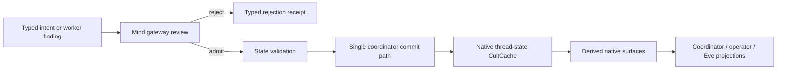

# Epiphany Current Algorithmic Map

## Observation and bootstrap authority correction (2026-07-12)

- Owner: diagnostics only project persisted CultMesh state; they never initialize it.
- Bootstrap owns static policy, topology, schema, advertisement, surface, and capability declarations. It does not own daemon liveness.
- Daemons own heartbeat/status documents. Missing status is represented as `unknown`, never promoted to `ready` by a reader or seeder.
- Provider directories contain only persisted provider advertisements, Eve surfaces, and tool capabilities. Missing provider state produces no synthetic row.
- Forbidden writers removed in this pass: read-command calls to `seed_epiphany_local_verse_context`, loader fallback constructors, and bootstrap's default-ready daemon-status loop.
- Next authority cut: requester commands may author intents, but Bifrost, GitHub, tool providers, Eve providers, and daemon lifecycle owners must author their own response receipts.

## Bifrost body-change request path (2026-07-12)

- Owner: the calling Hands/requester owns the body-change intent.
- Inputs: repository, branch, change summary, justification, changed paths, verification/review receipt references, authors, and credit subjects.
- Output: one persisted `gamecult.bifrost.body_change_publication_intent`; command status is `pending-bifrost`.
- Derived sight: the Bifrost ledger shows the open request and attributes the intent row to `source_agent_id`.
- Forbidden writers: the requester CLI no longer constructs or writes Bifrost acceptance, ledger attribution, GitHub publication, PR, commit, publication URL, or credit receipts.
- Response owners: Bifrost may answer with its publication receipt; the GitHub publication adapter may answer only after real substrate evidence exists.
- Negative proof: after request submission, latest intent is present while latest Bifrost publication and GitHub publication receipts are absent.

## Daemon tool request path (2026-07-12)

- Owner: the requesting agent owns the invocation intent; the advertised host daemon owns the response receipt.
- Input: a persisted capability plus requester identity, requester cluster, payload reference, and bounded reason/summary.
- Output: one `epiphany.cultmesh.daemon_tool_invocation_intent`, status `pending-provider`, and the host daemon id as `responseOwner`.
- Unknown host status does not block request queuing and is never promoted by the requester.
- Forbidden writers: `invoke-tool` cannot accept or synthesize receipt id/status, result reference, or result summary; it no longer executes local readback functions and labels them daemon results.
- Negative proof: request intent persists, latest provider receipt remains absent, and response-shaped CLI fields are refused.

## Eve connection request path (2026-07-12)

- Owner: the consumer owns `eve_connection_intent`; the advertised provider cluster owns `eve_connection_receipt`.
- Input: persisted Odin advertisement, requesting cluster, reason, and requested action.
- Output: one pending intent naming target advertisement, cluster, Eve surface, and feedback route.
- Forbidden writers: `connect-eve` cannot accept or synthesize provider receipt id/status and cannot return provider-owned queue projection as a connection result.
- Dependent invariant: collaboration feedback may cite only a persisted provider receipt; a consumer request is not acceptance.
- Negative proof: provider receipt remains absent after request, response-shaped fields fail, and feedback without provider acceptance fails.

## Daemon lifecycle request and heartbeat paths (2026-07-12)

- Request owner: Self/operator owns a daemon-poke intent; Idunn or the target daemon owns its receipt and resulting status.
- Poke output: pending intent with observed status and null receipt/result fields, shared by single, batch, and triage paths.
- Forbidden writers: poke callers cannot provide receipt id/status, resulting status, or artifact; the generic Verse CLI daemon-status writer no longer exists.
- Heartbeat owner: `epiphany-cluster-daemon` writes status. On its first run it derives identity/routing fields from persisted topology and authors the first heartbeat itself.
- Negative proof: a real provider heartbeat can precede a pending poke; no poke receipt appears, counterfeit `ready` result is rejected, and `set-daemon-status` is unavailable.

## Persona feedback and Imagination consensus boundary (2026-07-12)

- Eve provider: `epiphany-eve-provider accept` loads the pending connection intent, verifies `provider_cluster_id == target_cluster_id`, and writes the provider receipt.
- Persona owner: `collaboration-feedback` writes public, bounded feedback only after that provider receipt exists.
- Imagination owner: consensus participant selection, packet reference, receipt status/id, and adoption gate.
- Persona output: `pending-imagination` with null consensus fields and `responseOwner=Imagination`.
- Forbidden writers: Persona cannot pass or synthesize Imagination response fields.
- Negative proof: the full consumer-request/provider-accept/Persona-feedback chain persists no consensus receipt until Imagination answers.

## Public-proof submission boundary (2026-07-12)

- Request source: an existing redacted `repo_work_public_proof` document is the complete pending publication cargo.
- Consumer command: `bifrost-public-proof` selects that proof and reports `pending-bifrost`; it writes no new receipt.
- Bifrost owner: ledger attribution, review and credit receipt binding, public destination, publication URL, publication status, and final receipt.
- Forbidden writers: the caller-facing command rejects all Bifrost result fields and leaves publication coordinates null.
- Negative check: absence of a pending proof fails without writing a publication receipt; response-shaped fields are rejected before mutation.

## Bifrost accounting request boundaries (2026-07-12)

- Artifact acceptance source: Mind-admitted `repo.artifact_acceptance_request`; caller output is pending `Maintainer/Bifrost` with null acceptance coordinates.
- Metrics source: Mind-admitted `repo.metrics_request`; caller output is pending `Bifrost/Maintainer` with null accounting coordinates.
- Forbidden artifact writers: caller cannot provide artifact/proof/review/ledger/receipt/status/accepted-by results.
- Forbidden metrics writers: caller cannot provide accepted artifact, model spend, review load, credit, proof, summary, receipt, or status results.
- Negative proof: missing requests fail without receipt mutation and response-shaped arguments fail before lookup or write.

## Operator snapshot authority boundary (2026-07-12)

- Owner: operator snapshot adapter owns only a bounded summary of an edge status artifact.
- Runtime spine owns daemon-tool execution intent and receipt truth.
- Forbidden projection: `/tools/invocations` JSON cannot be promoted into canonical daemon-tool schemas by snapshot import.
- Output explicitly returns null tool intent/receipt fields and `toolInvocationAuthority=runtime-spine-only`.
- Negative proof: forged accepted tool JSON produced a snapshot but no canonical intent or receipt.

## Fixture store quarantine (2026-07-12)

- `epiphany-verse-query smoke` owns synthetic contract fixtures only.
- Its only writable body is `.epiphany-smoke/verse-query-default/local-verse.ccmp` with runtime `verse-query-default-smoke`.
- Store/runtime overrides fail before fixture seeding or receipt construction.
- Negative proof: targeting `state/local-verse.ccmp` was rejected and its SHA-256 did not change.
- Positive proof: the built-in quarantined smoke completes successfully and reports its quarantine coordinates.

## Operator-run completion receipt boundary (2026-07-12)

- Intent owner: operator orchestration writes run id, mode, roots, limits, and artifact coordinates before execution.
- Completion evidence: matching latest intent plus a valid JSON result inside the canonical artifact root, modified at or after intent creation.
- Receipt status is derived as `completed`; callers cannot submit status.
- Forbidden evidence: missing, non-JSON, pre-intent, out-of-root, or mismatched-run artifacts.

## Daemon-supervisor install authority boundary (2026-07-12)

- Plan commands force non-execution and may only write planned artifacts/receipts.
- Execute commands force execution intent and must pass the existing elevation gate before service-manager mutation.
- Wrapper command identity matches the Rust command exactly; no hidden `--execute-install` switch selects reality.
- Ambiguous install aliases are not accepted.
- Negative proof: hostile plan flag cannot mutate; execute without elevation produces an explicit refusal receipt.

## Standalone receipt fixture boundaries (2026-07-12)

- Deployment-family fixture receipts live only in a disposable repo under `<root>/.epiphany-smoke`.
- Weksa fixture receipts live only at `.epiphany-smoke/weksa-interlingua/local-verse.ccmp`.
- Neither smoke accepts a caller-selected receipt store.
- Redirect arguments fail before synthetic receipt construction.

This is the source-grounded map of the live machine. Historical route and
bridge anatomy belongs in git history and evidence ledgers, not here.

## Objective

Epiphany is a native typed organism. Persistent Mind, coordinator policy,
worker lifecycle, organ receipts, prompt context, operator surfaces, and Verse
publication are owned by Epiphany Rust/CultCache/CultMesh/CultNet organs.
Vendored Codex retains Codex-native behavior and the OpenAI-compatible
authentication/model-transport reliquary. It owns no Epiphany state, prompt,
scheduler, route, notification, or interface contract.

## Authority Map

| Owner | Inputs | Outputs | Invariant |
|---|---|---|---|
| `epiphany-state-model` | typed state fields | `EpiphanyThreadState` and prompt projection | State is typed; rendering is not authority. |
| `coordinator_state_transaction.rs` | expected state, next state, typed companion envelopes | one atomic canonical-state transaction | Sole production writer of `THREAD_STATE_KEY`; companions cannot impersonate state. |
| `coordinator_state.rs` | current state plus validated ordinary update | proposed next state and transaction request | Owns update meaning, not persistence. |
| `coordinator_launch.rs` | validated launch plan, state, runtime envelopes | state-plus-launch transaction request | Launch constructs runtime companions; the transaction owner commits them. |
| `coordinator_acceptance.rs` | reviewed finding, Mind review, commit receipt | state-plus-Mind-witness transaction request | Acceptance owns admission meaning; the transaction owner commits its witnesses. |
| `thread_state_store.rs` | typed state entry | low-level CultCache codec/read access | Substrate, not policy; it exposes no production writer. |
| `coordinator_service.rs` | state/runtime store paths and typed commands | state update, launch, accept, interrupt results | Facade routes typed work; it contains no policy or protocol mapping. |
| `surfaces/*` | native state, runtime snapshots, pressure/freshness inputs | scene, jobs, roles, planning, context, graph, CRRC, coordinator recommendations | Read surfaces derive; they do not mutate. |
| `runtime_spine.rs` | typed launch/result/receipt documents | CultCache runtime records | Runtime lifecycle and evidence are durable typed documents. |
| `mind_gateway.rs` and coordinator acceptance | worker findings and proposed patches | review, rejection, or state-commit receipts | Worker thought cannot write Mind directly. |
| `substrate_gate.rs` | bounded access intent | scoped access grant/refusal | Repository access and state admission are separate authorities. |
| `eyes_gateway.rs` | inspected source under a grant | evidence review/packet/refusal | Looked-at truth carries provenance. |
| `hands_gateway.rs` | approved action intent | patch/command/commit/PR receipts | Consequence is bounded, attributable, and reviewable. |
| `soul_gateway.rs` | claimed consequence plus evidence | verdict/refusal receipt | Work is not true merely because it ran. |
| `continuity_gateway.rs` | rupture/checkpoint/recovery facts | continuity receipts | Survival state is explicit, not transcript residue. |
| `heartbeat_state.rs` and daemon binaries | durable schedule/liveness policy | pulses, launch pressure, sleep/rumination state | Scheduling is physiology, not project truth. |
| `cultmesh_integration.rs` and `epiphany-verse-query` | typed local documents | private/local/public Verse projections | Visibility never creates authority or declassifies private state. |
| Persona loop | state projection, stimulus, semantic recall | natural speech plus interpreted candidate actions | Imagination projects; Persona speaks; Mind interprets. |
| vendored Codex | Codex sessions and OpenAI-compatible auth/model transport | Codex behavior and model transport | No Epiphany protocol or durable Epiphany state crosses this boundary. |

## Primary State Flow

`coordinator_state_transaction::{open_coordinator_state_transaction,
commit_coordinator_state_transaction}` is the single persistence owner.
Ordinary updates, launch transactions, and accepted findings construct their
domain-specific next state or companion documents, then submit them to that
owner. It rejects stale expected state, refuses companion envelopes that target
the canonical key, and commits state plus companions in one prepared batch.
`thread_state_store.rs` retains typed codec/read access only; its production raw
writers and their public exports are deleted. A source guard rejects any second
production `THREAD_STATE_KEY` writer. `EpiphanyCoordinatorService` is the narrow
caller-facing facade.

Forbidden writers:

- worker result payloads;
- operator display JSON;
- Codex rollouts or Codex thread objects;
- derived scene/coordinator/context projections;
- heartbeat telemetry;
- CultMesh mirrors and public Verse documents.

## Worker And Receipt Flow

`runtime_spine.rs` registers and persists worker launch requests, worker
results, Mind reviews, Mind commit receipts, Eyes packets, Substrate Gate
grants, Hands consequence receipts, Soul verdicts, Continuity receipts, and
coordinator run receipts. `EpiphanyCoordinatorService` now accepts one `store`
path for canonical state and its atomic runtime/witness companions. The native
status mouth exposes the same boundary as one `--store` argument. Document
families remain typed and separately owned inside the cache; filesystem path
plurality no longer pretends to be an authority boundary.

## Hands → Soul → Modeling Loop

1. Self emits a bounded Hands gate with requested paths and required receipts.
2. Substrate Gate records the access grant.
3. Hands records intent/review plus patch, command, and commit receipts.
4. `coordinator_launch_context.rs` builds sealed work-loop telemetry from that
   receipt chain for Soul.
5. Soul emits a verdict receipt against the actual consequence.
6. Modeling receives the verified consequence and proposes a map/state patch.
7. `coordinator_acceptance.rs` commits an admitted proposal with its Mind
   review/commit witnesses before Self routes another Hands turn.

The repo-work scheduler obeys the same order. After a branch-local execute
receipt it stops at `await-modeling`; it cannot invoke closure or manufacture
Modeling/Mind evidence. `epiphany-work close` requires explicit model
authorship, model reference, verdict, and finding before it can admit a map.
Deterministic checks remain Soul evidence, not a substitute for Modeling. The
verified consequence now crosses an explicit
`epiphany.modeling.repo_work_request.v0` boundary authored by Self. The request
is immutable, references the passing Soul receipt, commit, and changed paths,
and grants Modeling interpretation authority without granting Self authority to
write the result. A Modeling finding is refused unless it answers that exact
request and matches its verified consequence. The current close command writes
both phase documents from explicit CLI cargo; scheduler launch and asynchronous
result collection remain the next cut.

Soul verification is now an explicit phase of the shared closure pipeline.
`epiphany-work verify` and the first post-execution scheduler pulse run only
that phase: deterministic verification, immutable Soul verdict, and immutable
Self-to-Modeling request. Modeling absence or a non-passing Modeling verdict can
no longer make Soul report failure. The partial closure artifact is
`status=awaiting-modeling`; overview and later scheduler pulses preserve that
gate rather than mistaking file existence for Mind admission. The scheduler
source contains neither the Modeling finding writer nor map admission.

Repo work now has a native third worker launch kind beside generic role and
reorientation work: `repo-work-modeling`. It runs through the existing
`epiphany-openai-runtime`, carries the immutable request plus the bounded
Soul-verified commit diff, and requires
`epiphany.worker.repo_work_modeling_result.v0`. The runtime—not Self—converts
model output directly into the canonical `RepoWorkModelingFinding`. Scheduler
pulses launch one detached runtime job, wait without duplication, consume only
the typed finding, and then resume the existing immutable Mind/map admission.
A non-passing finding is immutable and stops for reviewed revision rather than
being overwritten or silently retried.

The former direct CLI writer is cut. `epiphany-work close --model-authored ...`
may no longer create a Modeling finding; closure can only reread the canonical
runtime document. The obsolete direct-CLI closure smoke was deleted. A live
negative probe returned exit 1 for forged passing CLI cargo while leaving the
typed request awaiting its real Modeling worker.

Detached worker physiology is now Idunn-owned. `epiphany-work` opens the typed
runtime job and invokes `epiphany-daemon-supervisor service-launch`; it contains
no child-process `spawn`. The supervisor launches the existing model runtime,
owns Windows hidden-process behavior, redirects stdout/stderr to explicit
artifacts, and publishes an
`epiphany.cultmesh.daemon_service_lifecycle_receipt.v0` containing service and
process identity. Self receives that receipt ID as routing evidence only. Live
item `idunn-owned-modeling` crossed this boundary and reached the Bifrost gate.

The current Modeling request is owned by
`epiphany.modeling.repo_work_route.v0`, not the filesystem closure projection.
Generation zero lands atomically with its Soul-backed request. A later
generation can advance only through `advance_repo_work_modeling_route`: the
current finding must exist and be non-passing, the new request must preserve
item/Soul/commit/paths, and a Mind acceptance must grant only
`repoWork.modelingRoute`. Request, Mind review, and stable route pointer commit
in one CultCache batch; old request/finding documents remain immutable.
`epiphany-work revise-modeling --review-ref ... --rationale ...` is the explicit
review mouth. Scheduler job IDs include the route generation and derive the
stable route key from the item, so neither close JSON nor an old completed job
can select current work.

Before any Modeling runtime job is opened, the exact consumer executable runs
`preflight` against the actual runtime store. Its own schema registry must read
the store and advertise the required route, request, finding, and worker-launch
types. Preflight hashes both executable bytes and the ordered supported schema
catalog. Idunn refuses a typed launch without the passing schema flag,
executable SHA-256, schema-catalog SHA-256, witness ID, and required document
list; all are persisted in the daemon service lifecycle receipt. The preflight
ID is correctly a witness, not a fake independent receipt. Preflight precedes
`open_runtime_spine_heartbeat_job`, so stale consumers leave no queued corpse.

The
accepted interpretation is persisted as
`epiphany.modeling.repo_work_finding.v0`; it references the passing Soul verdict,
commit, and changed paths. Mind rereads that typed receipt and the admitted repo
map plus CultMesh projection carry its receipt ID.

The canonical repo-work map entry is `epiphany.repo_work.map_entry.v0` in the
same runtime CultCache. `commit_repo_work_map_admission` validates it against
the persisted Modeling finding, then publishes the map entry, Mind review, and
Mind commit in one prepared batch. The former bespoke
`.epiphany/state/repo-work-map.msgpack` owner is deleted. CultMesh remains a
projection after admission and cannot repair or override the canonical entry.

Closure phase documents are immutable by stable receipt ID. An identical retry
reuses the existing Soul verdict and Modeling finding, rereads an already
admitted Mind/map batch, and regenerates only operator/CultMesh projections.
Conflicting same-ID Soul, Modeling, or map cargo is refused; no reconciliation
loop may overwrite the earlier truth.

Manual edits and programmatic actions converge at the same receipt and Mind
admission boundaries. A later action cannot retroactively make an unrecorded
consequence valid.

## Read And Recommendation Flow

`epiphany-mvp-status` reads the unified native coordinator store.
It derives:

- scene via `surfaces/scene.rs`;
- pressure via `surfaces/pressure.rs`;
- freshness via `surfaces/freshness.rs`;
- jobs via `surfaces/jobs.rs`;
- role board via `surfaces/role_board.rs`;
- planning via `surfaces/planning.rs`;
- reorientation via `surfaces/reorient.rs`;
- CRRC via `surfaces/crrc.rs`;
- coordinator status via `surfaces/coordinator.rs`.

`epiphany-mvp-coordinator` consumes that native status shape. Requested Hands
paths come from the scene checkpoint/frontier. Revision comes from
`/scene/scene/revision`. There is no Codex `read.thread.epiphanyState` fallback.

## Persona Flow

Semantic memory recall is a bounded context input, not a state writer. Outside
world actions pass through Bifrost identity/governance and Heimdall capability
proofs. Persona speech audits are typed CultMesh witnesses; public speech does
not expose private worker or operator state.

## Heartbeat And Daemon Physiology

`heartbeat_state.rs`, `epiphany-heartbeat-store`,
`epiphany-daemon-supervisor`, and `epiphany-cluster-daemon` own scheduling and
liveness. A lane is not relaunched while its prior turn is active. Cooldown
begins after completion. Idle physiology may ruminate, distill memory, or dream
without claiming project-state authority.

Idunn owns daemon survival. Self and Downstream consumers may inspect and recommend; they do
not become alternate daemon keepers.

## Verse And Interface Projection

CultMesh is the preferred local typed interface over CultCache/CultNet.

- `epiphany-internal`: private thoughts, reviews, receipts, and local organ
  coordination;
- `gamecult-local`: trusted operator-safe GameCult sharing;
- `epiphany-global`: public dreams and Persona/public discussion documents.

Eve/CultUI surfaces lower typed CultMesh composition/state. Renderers and
wrappers do not own the projected truth.

## Codex Boundary

The following are structurally absent:

- `thread/epiphany/*` requests and notifications;
- `ThreadEpiphany*` protocol DTOs and generated bindings;
- `Thread.epiphanyState` in Codex app-server payloads;
- Epiphany rollout migration or replay;
- app-server phase-6 Epiphany smokes;
- Codex-backed MVP status/interruption;
- `epiphany-codex-bridge`.

Native coordinator/status projections emit `state`, not the deleted Codex
`Thread.epiphanyState` spelling. Source guards reject that compatibility field
and reject the old two-store status flags.

Codex app-server protocol has no dependency on `epiphany-state-model`.
App-server has no Epiphany state-model/core/bridge dependency. Negative source
checks in native launch/coordinator code reject renewed Codex route authority.

## Verification Layers

| Claim | Evidence layer |
|---|---|
| State mutation law | `state_update.rs` and coordinator-state unit tests |
| Worker/Mind admission | runtime-spine and coordinator-acceptance tests |
| Read-only derived surfaces | focused `surfaces/*` tests |
| Native status/interrupt | `epiphany-mvp-status` tests and executable smoke paths |
| Hands/Soul loop | Hands receipt tests plus coordinator launch-context tests |
| Protocol starvation | source scans, app-server compile, generated-schema equivalence |
| Verse privacy/authority | CultMesh/Verse focused smokes and typed receipt readbacks |
| Public crossings | Persona/Bifrost bridge smokes with private-state seals |

Repo-work map admission is a canonical generation-bound transaction. A map
entry names its `RepoWorkModelingRoute` and generation; the runtime spine loads
that route and admits only a passing immutable finding selected by the route's
current request. CLI closure is a caller of this invariant, not its owner.
Non-passing findings and stale generations therefore cannot become durable Mind
state even through a forged-looking admission call.

The model runtime has a deterministic generation-retry proof at
`epiphany-openai-runtime/src/lib.rs`: both findings pass through the production
assistant-result parser and runtime-owned finding writer. Generation zero is
non-passing, Mind alone advances the route, generation one is passing and
admitted, and a stale generation-zero admission is refused. This proves typed
handoff and ownership without provider/network variance. The remaining smoke
boundary is process composition through `epiphany-work revise-modeling`, the
scheduler's consumer preflight, and Idunn's child lifecycle receipt.

Scheduler dry-run is now an authority projection rather than a vague promise.
When a current typed Modeling request has no finding or job, its
`advancedResult` names the current route, generation, request, generation-bound
job id, required preflight, and Idunn lifecycle ownership without opening a job
or spawning a process. A disposable authority test drives the production
revision mouth and scheduler and proves generation one is selected. The final
process proof must compare this projection with a real preflighted Idunn launch
receipt; it must not add a fake production runtime mode.

The physical comparison passes. A real generation-one scheduler pulse matched
the deterministic route/request/job projection, consumer preflight
fingerprinted the executable and compiled schema catalog, Idunn persisted the
launch lifecycle receipt, and the detached model runtime completed a passing
typed finding with empty stderr. A later scheduler dry-run saw that finding as
`admit-modeling`; it did not relaunch generation zero. This closes the
generation-retry authority path. Re-enter through a source-grounded Perfect
Machine audit rather than adding more closure machinery.

## Current Cut Line

Keep:

- native typed state and runtime stores;
- explicit organ gates and receipts;
- native coordinator/status surfaces;
- CultMesh/CultNet/Eve projection;
- Codex-compatible auth/model transport where still required.

Cut or correct next:

- current plans and handoff prose that still describe deleted Codex routes or
  bridge files as live mechanisms;
- wrapper arguments named for Codex when they no longer cross a Codex boundary;
- compatibility-shaped JSON field names inside native-only operator artifacts
  when no external contract requires them;
- misleading state/runtime store path names;
- any remaining full-context serializer or summary that duplicates typed owner
  state instead of projecting it narrowly.

## Native Heartbeat Service Boundary

The refreshed Perfect Machine audit selects runtime physiology as the next
organ boundary. `epiphany-heartbeat-store serve` now owns a native interval
loop around the existing `run_void_routine_store` primitive. It writes one
iteration directory per pulse, emits only a compact pulse receipt containing
artifact identity and success, supports bounded clean shutdown through
`--max-iterations`, and contains no child-process spawn or second state writer.
Heartbeat owns pulse timing; the next cut is to launch this binary through
Idunn and prove restart/resume, swarm-brake observability, and lifecycle
readback before demoting the PowerShell rumination vigil.
That cut is now proven. An engaged brake produced two compact refused pulses
without terminating `serve`; releasing it let the same persisted store complete
a routine. Idunn then launched two pulses and a separate one-pulse restart from
that store with empty stderr and lifecycle receipts. The attached PowerShell
vigil is deleted. The remaining service boundary is durable Idunn policy and
operator readback: advertise/configure the heartbeat service through typed
daemon state so restart intent survives beyond one explicit `service-launch`.
Source inspection corrected the proposed owner: standing daemon restart policy
requires a topology daemon and liveness status, while heartbeat is an
Idunn-managed child service. The durable owner must therefore be a typed
managed-service desired-state document keyed by service id. It delegates all
starts to the existing service lifecycle primitive and must not invent an
`epiphany-daemon-heartbeat` topology identity.
The typed desired-state surface is now implemented as
`epiphany.cultmesh.managed_service_policy.v0`, persisted at a service-id key.
`epiphany-daemon-supervisor managed-service-policy` writes command, args, cwd,
enabled/restart/backoff intent, sealed log refs, and the latest lifecycle
witness; `managed-service-read` projects desired state plus
`latestLifecycle`. It deliberately reports process observation as unknown
until a real reconcile probe exists, so an old launch receipt cannot claim the
service is alive.
That probe now exists. `managed-service-reconcile` reads only the service policy
and lifecycle history, observes the latest PID through the native platform
process API, applies enabled/restart-mode/cooldown decisions, and delegates a
restart to `service_launch`. Launch receipt ids now carry attempt time, so
restarts preserve history. Live root
`C:\Users\Meta\AppData\Local\Temp\epiphany-managed-reconcile-8e3d7cc5fe0b4c5fa38b18b3d00cea0c`
proved restart receipt
`daemon-service-lifecycle-receipt-idunn-managed-heartbeat-launch-1783858125893`
and PID `19736` were observed alive after the prior process was killed. Next
fold this reconcile into Idunn's own serve loop and cut the full-context Verse
load from service launch.
Both cuts are landed. Service plan/launch now load only the typed swarm brake
and rely on their own typed writers to open/register the store; they do not
reseed or serialize the local Verse. `managed-service-serve` is a distinct Idunn
loop from standing-daemon `serve`, so child service desired state is not blocked
by absent topology restart policies. Live root
`C:\Users\Meta\AppData\Local\Temp\epiphany-idunn-unattended-3394ecfaa03f41d8935f9fb70411ca75`
proved PID `44276` was observed alive without duplication, then after forced
death the next pulse launched PID `40532` under unique receipt
`daemon-service-lifecycle-receipt-idunn-managed-heartbeat-launch-1783859054234`.
The next boundary is provider-owned Eve sight over managed service desired/observed
state.
That first sight boundary is now implemented. `observe_native_process` moved
from the supervisor binary into a shared narrow core organ. Query aliases
`managed-services` and `idunn-services` join typed
service policy with latest lifecycle history and native observation, then read
only the compact heartbeat serve pulse line from the sealed stdout artifact.
Live row PID `25236` transitioned from `READY/alive` to `ATTN/dead` while
retaining pulse `completed`, iteration `1`, and lifecycle receipt
`daemon-service-lifecycle-receipt-idunn-managed-heartbeat-launch-1783859373793`.
No command args or routine payloads are projected. Next merge these rows into
the main provider-owned Eve composition rather than keeping a specialist query only.

This map must change when ownership changes. Historical scars belong in git,
evidence, or an explicitly archived note—not in the machine's proprioception.
