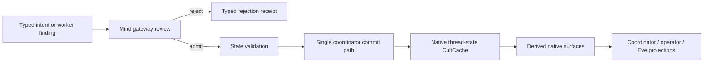

# Epiphany Current Algorithmic Map

This is the source-grounded map of the live machine. Historical route and
bridge anatomy belongs in git history and evidence ledgers, not here.

## Objective

Epiphany is a native typed organism. Persistent Mind, coordinator policy,
worker lifecycle, organ receipts, prompt context, operator surfaces, and Verse
publication are owned by Epiphany Rust/CultCache/CultMesh/CultNet organs.
Vendored Codex retains Codex-native behavior and the OpenAI-compatible
authentication/model-transport reliquary. It owns no Epiphany state, prompt,
scheduler, route, notification, or interface contract.

## Authority Map

| Owner | Inputs | Outputs | Invariant |
|---|---|---|---|
| `epiphany-state-model` | typed state fields | `EpiphanyThreadState` and prompt projection | State is typed; rendering is not authority. |
| `coordinator_state_transaction.rs` | expected state, next state, typed companion envelopes | one atomic canonical-state transaction | Sole production writer of `THREAD_STATE_KEY`; companions cannot impersonate state. |
| `coordinator_state.rs` | current state plus validated ordinary update | proposed next state and transaction request | Owns update meaning, not persistence. |
| `coordinator_launch.rs` | validated launch plan, state, runtime envelopes | state-plus-launch transaction request | Launch constructs runtime companions; the transaction owner commits them. |
| `coordinator_acceptance.rs` | reviewed finding, Mind review, commit receipt | state-plus-Mind-witness transaction request | Acceptance owns admission meaning; the transaction owner commits its witnesses. |
| `thread_state_store.rs` | typed state entry | low-level CultCache codec/read access | Substrate, not policy; it exposes no production writer. |
| `coordinator_service.rs` | state/runtime store paths and typed commands | state update, launch, accept, interrupt results | Facade routes typed work; it contains no policy or protocol mapping. |
| `surfaces/*` | native state, runtime snapshots, pressure/freshness inputs | scene, jobs, roles, planning, context, graph, CRRC, coordinator recommendations | Read surfaces derive; they do not mutate. |
| `runtime_spine.rs` | typed launch/result/receipt documents | CultCache runtime records | Runtime lifecycle and evidence are durable typed documents. |
| `mind_gateway.rs` and coordinator acceptance | worker findings and proposed patches | review, rejection, or state-commit receipts | Worker thought cannot write Mind directly. |
| `substrate_gate.rs` | bounded access intent | scoped access grant/refusal | Repository access and state admission are separate authorities. |
| `eyes_gateway.rs` | inspected source under a grant | evidence review/packet/refusal | Looked-at truth carries provenance. |
| `hands_gateway.rs` | approved action intent | patch/command/commit/PR receipts | Consequence is bounded, attributable, and reviewable. |
| `soul_gateway.rs` | claimed consequence plus evidence | verdict/refusal receipt | Work is not true merely because it ran. |
| `continuity_gateway.rs` | rupture/checkpoint/recovery facts | continuity receipts | Survival state is explicit, not transcript residue. |
| `heartbeat_state.rs` and daemon binaries | durable schedule/liveness policy | pulses, launch pressure, sleep/rumination state | Scheduling is physiology, not project truth. |
| `cultmesh_integration.rs` and `epiphany-verse-query` | typed local documents | private/local/public Verse projections | Visibility never creates authority or declassifies private state. |
| Persona loop | state projection, stimulus, semantic recall | natural speech plus interpreted candidate actions | Imagination projects; Persona speaks; Mind interprets. |
| vendored Codex | Codex sessions and OpenAI-compatible auth/model transport | Codex behavior and model transport | No Epiphany protocol or durable Epiphany state crosses this boundary. |

## Primary State Flow

`coordinator_state_transaction::{open_coordinator_state_transaction,
commit_coordinator_state_transaction}` is the single persistence owner.
Ordinary updates, launch transactions, and accepted findings construct their
domain-specific next state or companion documents, then submit them to that
owner. It rejects stale expected state, refuses companion envelopes that target
the canonical key, and commits state plus companions in one prepared batch.
`thread_state_store.rs` retains typed codec/read access only; its production raw
writers and their public exports are deleted. A source guard rejects any second
production `THREAD_STATE_KEY` writer. `EpiphanyCoordinatorService` is the narrow
caller-facing facade.

Forbidden writers:

- worker result payloads;
- operator display JSON;
- Codex rollouts or Codex thread objects;
- derived scene/coordinator/context projections;
- heartbeat telemetry;
- CultMesh mirrors and public Verse documents.

## Worker And Receipt Flow

`runtime_spine.rs` registers and persists worker launch requests, worker
results, Mind reviews, Mind commit receipts, Eyes packets, Substrate Gate
grants, Hands consequence receipts, Soul verdicts, Continuity receipts, and
coordinator run receipts. Conceptually, the runtime store is lifecycle/evidence
truth and the thread-state store is admitted Mind truth. Current launch and
acceptance code, however, receive `runtime_spine_store` and write
`THREAD_STATE_KEY` into that cache. Production often aliases the paths, but the
API names conceal that requirement. The boundary must be repaired before the
two-store invariant can be claimed.

## Hands → Soul → Modeling Loop

1. Self emits a bounded Hands gate with requested paths and required receipts.
2. Substrate Gate records the access grant.
3. Hands records intent/review plus patch, command, and commit receipts.
4. `coordinator_launch_context.rs` builds sealed work-loop telemetry from that
   receipt chain for Soul.
5. Soul emits a verdict receipt against the actual consequence.
6. Modeling receives the verified consequence and proposes a map/state patch.
7. `coordinator_acceptance.rs` commits an admitted proposal with its Mind
   review/commit witnesses before Self routes another Hands turn.

Manual edits and programmatic actions converge at the same receipt and Mind
admission boundaries. A later action cannot retroactively make an unrecorded
consequence valid.

## Read And Recommendation Flow

`epiphany-mvp-status` reads the native thread-state and runtime-spine stores.
It derives:

- scene via `surfaces/scene.rs`;
- pressure via `surfaces/pressure.rs`;
- freshness via `surfaces/freshness.rs`;
- jobs via `surfaces/jobs.rs`;
- role board via `surfaces/role_board.rs`;
- planning via `surfaces/planning.rs`;
- reorientation via `surfaces/reorient.rs`;
- CRRC via `surfaces/crrc.rs`;
- coordinator status via `surfaces/coordinator.rs`.

`epiphany-mvp-coordinator` consumes that native status shape. Requested Hands
paths come from the scene checkpoint/frontier. Revision comes from
`/scene/scene/revision`. There is no Codex `read.thread.epiphanyState` fallback.

## Persona Flow

Semantic memory recall is a bounded context input, not a state writer. Outside
world actions pass through Bifrost identity/governance and Heimdall capability
proofs. Persona speech audits are typed CultMesh witnesses; public speech does
not expose private worker or operator state.

## Heartbeat And Daemon Physiology

`heartbeat_state.rs`, `epiphany-heartbeat-store`,
`epiphany-daemon-supervisor`, and `epiphany-cluster-daemon` own scheduling and
liveness. A lane is not relaunched while its prior turn is active. Cooldown
begins after completion. Idle physiology may ruminate, distill memory, or dream
without claiming project-state authority.

Idunn owns daemon survival. Self and Gjallar may inspect and recommend; they do
not become alternate daemon keepers.

## Verse And Interface Projection

CultMesh is the preferred local typed interface over CultCache/CultNet.

- `epiphany-internal`: private thoughts, reviews, receipts, and local organ
  coordination;
- `gamecult-local`: trusted operator-safe GameCult sharing;
- `epiphany-global`: public dreams and Persona/public discussion documents.

Eve/CultUI surfaces lower typed CultMesh composition/state. Renderers and
wrappers do not own the projected truth.

## Codex Boundary

The following are structurally absent:

- `thread/epiphany/*` requests and notifications;
- `ThreadEpiphany*` protocol DTOs and generated bindings;
- `Thread.epiphanyState` in Codex app-server payloads;
- Epiphany rollout migration or replay;
- app-server phase-6 Epiphany smokes;
- Codex-backed MVP status/interruption;
- `epiphany-codex-bridge`.

Native operator projections may still emit a compatibility-shaped
`epiphanyState` field. That field belongs to Epiphany's native projection and is
an active cleanup target; it is not the deleted Codex `Thread.epiphanyState`
contract returning through a side door.

Codex app-server protocol has no dependency on `epiphany-state-model`.
App-server has no Epiphany state-model/core/bridge dependency. Negative source
checks in native launch/coordinator code reject renewed Codex route authority.

## Verification Layers

| Claim | Evidence layer |
|---|---|
| State mutation law | `state_update.rs` and coordinator-state unit tests |
| Worker/Mind admission | runtime-spine and coordinator-acceptance tests |
| Read-only derived surfaces | focused `surfaces/*` tests |
| Native status/interrupt | `epiphany-mvp-status` tests and executable smoke paths |
| Hands/Soul loop | Hands receipt tests plus coordinator launch-context tests |
| Protocol starvation | source scans, app-server compile, generated-schema equivalence |
| Verse privacy/authority | CultMesh/Verse focused smokes and typed receipt readbacks |
| Public crossings | Persona/Bifrost bridge smokes with private-state seals |

## Current Cut Line

Keep:

- native typed state and runtime stores;
- explicit organ gates and receipts;
- native coordinator/status surfaces;
- CultMesh/CultNet/Eve projection;
- Codex-compatible auth/model transport where still required.

Cut or correct next:

- current plans and handoff prose that still describe deleted Codex routes or
  bridge files as live mechanisms;
- wrapper arguments named for Codex when they no longer cross a Codex boundary;
- compatibility-shaped JSON field names inside native-only operator artifacts
  when no external contract requires them;
- misleading state/runtime store path names;
- any remaining full-context serializer or summary that duplicates typed owner
  state instead of projecting it narrowly.

This map must change when ownership changes. Historical scars belong in git,
evidence, or an explicitly archived note—not in the machine's proprioception.
