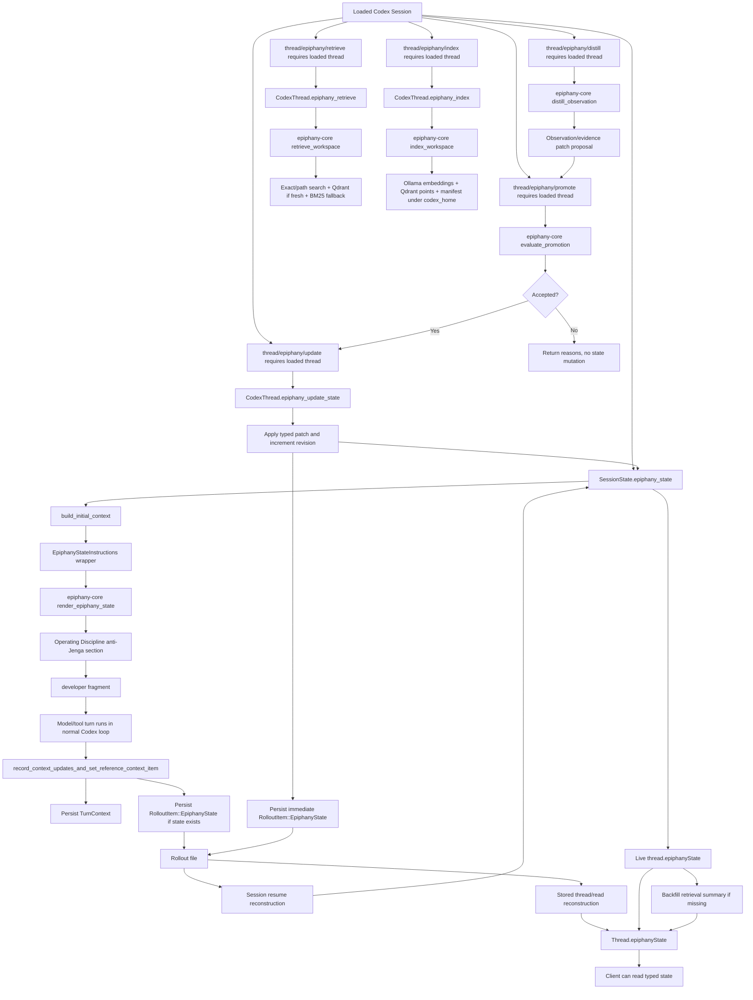

# Epiphany Current Algorithmic Map

This is the current control-flow map for Epiphany as it exists in the repo now.

It is not the future harness spec, and it is not the full Codex machine map. Codex still owns the ordinary turn loop, model/tool execution, persistence substrate, and app-server plumbing. Epiphany is the fork-layer that adds typed modeling state, prompt-facing state injection, client-visible state reads, and repo-local retrieval/indexing organs.

The important question for this file is not "what is Epiphany supposed to become?" It is: when the current code runs, where does Epiphany state go?

## Current Truth

Current Epiphany is a forked Codex harness with a typed modeling spine.

The spine exists in nine live paths:

- protocol state shape: `EpiphanyThreadState`, `RolloutItem::EpiphanyState`, retrieval summaries, and prompt tags live in [protocol.rs](E:/Projects/EpiphanyAgent/vendor/codex/codex-rs/protocol/src/protocol.rs:103).
- in-memory session state: `SessionState` stores an optional `EpiphanyThreadState`, and `Session` exposes thin async accessors over it in [state/session.rs](E:/Projects/EpiphanyAgent/vendor/codex/codex-rs/core/src/state/session.rs:36) and [session/mod.rs](E:/Projects/EpiphanyAgent/vendor/codex/codex-rs/core/src/session/mod.rs:1240).
- prompt injection: `build_initial_context` reads the optional state and adds a bounded `<epiphany_state>` developer fragment in [session/mod.rs](E:/Projects/EpiphanyAgent/vendor/codex/codex-rs/core/src/session/mod.rs:2434).
- per-turn persistence: normal turn setup persists one `RolloutItem::EpiphanyState` after the `TurnContext` when state exists in [session/mod.rs](E:/Projects/EpiphanyAgent/vendor/codex/codex-rs/core/src/session/mod.rs:2677).
- client read hydration: app-server thread views attach live or reconstructed `thread.epiphanyState` in [codex_message_processor.rs](E:/Projects/EpiphanyAgent/vendor/codex/codex-rs/app-server/src/codex_message_processor.rs:4520).
- explicit distillation proposals: app-server routes read-only `thread/epiphany/distill` through a loaded-thread handler into `epiphany-core` so one explicit observation can become a patch candidate without mutating state in [codex_message_processor.rs](E:/Projects/EpiphanyAgent/vendor/codex/codex-rs/app-server/src/codex_message_processor.rs:4166) and [distillation.rs](E:/Projects/EpiphanyAgent/epiphany-core/src/distillation.rs:28).
- explicit promotion gates: app-server routes `thread/epiphany/promote` through a loaded-thread handler into `epiphany-core` policy evaluation, rejects failed verifier evidence without mutation, and applies accepted candidates through the same durable update path in [codex_message_processor.rs](E:/Projects/EpiphanyAgent/vendor/codex/codex-rs/app-server/src/codex_message_processor.rs:4237) and [promotion.rs](E:/Projects/EpiphanyAgent/epiphany-core/src/promotion.rs:33).
- explicit state updates: app-server routes `thread/epiphany/update` through a loaded `CodexThread` update method that mutates live `SessionState`, bumps the revision, and persists an immediate `RolloutItem::EpiphanyState` snapshot in [codex_message_processor.rs](E:/Projects/EpiphanyAgent/vendor/codex/codex-rs/app-server/src/codex_message_processor.rs:4337) and [codex_thread.rs](E:/Projects/EpiphanyAgent/vendor/codex/codex-rs/core/src/codex_thread.rs:373).
- retrieval/indexing: app-server routes `thread/epiphany/retrieve` and `thread/epiphany/index` through loaded `CodexThread` host methods into `epiphany-core` in [codex_message_processor.rs](E:/Projects/EpiphanyAgent/vendor/codex/codex-rs/app-server/src/codex_message_processor.rs:4039), [codex_thread.rs](E:/Projects/EpiphanyAgent/vendor/codex/codex-rs/core/src/codex_thread.rs:438), and [codex_thread.rs](E:/Projects/EpiphanyAgent/vendor/codex/codex-rs/core/src/codex_thread.rs:456).

The thick Epiphany-owned implementation is mostly outside vendored Codex now:

- prompt rendering lives in [epiphany-core/src/prompt.rs](E:/Projects/EpiphanyAgent/epiphany-core/src/prompt.rs:33), including the always-rendered operating-discipline section in [prompt.rs](E:/Projects/EpiphanyAgent/epiphany-core/src/prompt.rs:26).
- generic rollout replay for stored-thread reads lives in [epiphany-core/src/rollout.rs](E:/Projects/EpiphanyAgent/epiphany-core/src/rollout.rs:38).
- retrieval and indexing live in [epiphany-core/src/retrieval.rs](E:/Projects/EpiphanyAgent/epiphany-core/src/retrieval.rs:144) and [retrieval.rs](E:/Projects/EpiphanyAgent/epiphany-core/src/retrieval.rs:160), with summary-only freshness reads in [retrieval.rs](E:/Projects/EpiphanyAgent/epiphany-core/src/retrieval.rs:100).
- deterministic observation distillation lives in [epiphany-core/src/distillation.rs](E:/Projects/EpiphanyAgent/epiphany-core/src/distillation.rs:28).
- verifier-backed promotion policy lives in [epiphany-core/src/promotion.rs](E:/Projects/EpiphanyAgent/epiphany-core/src/promotion.rs:33).

## Whole Control Flow



What this means in plain English:

- Epiphany state is a durable object, not prompt folklore.
- The prompt can read it every turn when it exists.
- The app-server can expose it as typed thread data.
- A loaded thread can ask for a typed observation/evidence proposal without mutating state.
- A loaded thread can ask a verifier-backed promotion gate to reject or apply that proposal.
- A loaded thread can now accept explicit typed state patches and persist them immediately.
- Retrieval and indexing are typed side paths hanging off loaded threads.
- Retrieval remains read-only; state mutation has its own control-plane door.

## Natural Language Spine

This is the same flow in the language Epiphany is supposed to make the model carry around while it works. The images below are compression of the code paths cited in the flow sections, not free-floating lore. Tiny but important distinction; otherwise we are just painting flames on a shopping cart.

| Stage | What It Means | Mental Image |
| --- | --- | --- |
| State shape | Epiphany first gives the system a real object for understanding, instead of asking the transcript to remember what matters. | A labeled field notebook with fixed sections, not loose napkins in a storm. |
| Resume | When a thread wakes up, Epiphany rebuilds the latest surviving model of the work before asking the agent to continue. | The foreman finds yesterday's marked-up blueprint before letting anyone pick up a saw. |
| Prompt injection | The current model is summarized into the developer context so the agent starts the turn facing the actual map. | The blueprint is pinned above the workbench, not buried in a drawer. |
| Operating discipline | The renderer always includes the anti-Jenga regression/benchmark rule so failed hypotheses get reverted before the next attempt. | A red tag on the workbench: one measured cut, then remove the bad jig before trying another. |
| Turn execution | Codex still runs the ordinary model/tool loop; Epiphany is context and discipline around that loop, not a replacement engine yet. | The same workshop machines run, but now there is a work order on the wall. |
| Persistence | After a real user turn, Epiphany snapshots the current model beside the normal turn context. | The field notebook gets dated and shelved after each real work session. |
| Thread read | Clients can ask for the current Epiphany model as typed data instead of scraping prompt text or transcript debris. | The dashboard reads the blueprint file directly, not a photo of the workbench. |
| Retrieval | A loaded thread can ask a structured question of the repo through one typed retrieval surface. | A librarian brings back marked pages instead of making the agent rummage through every shelf. |
| Indexing | Persistent semantic memory is built only through an explicit indexing path. | The librarian updates the card catalog only when asked, not while pretending to answer a question. |
| Distillation | One explicit observation can be normalized into a typed observation/evidence patch, but not promoted automatically. | The clerk drafts a ledger entry in pencil before anyone is allowed to ink it. |
| Promotion | A verifier-backed gate can reject a proposal without mutation or send it through the durable update path. | The foreman stamps the pencil draft before the clerk reaches for the red pen. |
| State updates | A loaded thread can accept explicit typed patches that append observations/evidence and replace bounded map/scratch/churn fields. | The clerk finally has the red pen, but still writes only on the ledger page the form allows. |

## Flow 1: State Shape

### Input

The protocol layer defines the object that all other Epiphany paths agree on.

### Plain-language role

This is where Epiphany stops being an instruction style and becomes a thing the program can carry. The state shape is the skeleton: objective, subgoals, graph, scratch, observations, evidence, churn, mode, and retrieval summary all get named places to live.

The point is not just serialization. The point is pressure. If understanding has a typed slot, later code can ask whether that slot is fresh, missing, stale, or contradictory. Without this shape, the agent has only memory soup and a little sailor hat.

### Mechanism

`vendor/codex/codex-rs/protocol/src/protocol.rs` adds:

- prompt tags: `EPIPHANY_STATE_OPEN_TAG` and `EPIPHANY_STATE_CLOSE_TAG`.
- rollout storage: `RolloutItem::EpiphanyState(EpiphanyStateItem)`.
- canonical thread state: `EpiphanyThreadState`.
- map/scratch/evidence/churn/mode structs.
- retrieval metadata: `EpiphanyRetrievalState`, `EpiphanyRetrievalStatus`, and `EpiphanyRetrievalShardSummary`.

Code refs:

- [protocol.rs](E:/Projects/EpiphanyAgent/vendor/codex/codex-rs/protocol/src/protocol.rs:103)
- [protocol.rs](E:/Projects/EpiphanyAgent/vendor/codex/codex-rs/protocol/src/protocol.rs:2955)
- [protocol.rs](E:/Projects/EpiphanyAgent/vendor/codex/codex-rs/protocol/src/protocol.rs:2972)
- [protocol.rs](E:/Projects/EpiphanyAgent/vendor/codex/codex-rs/protocol/src/protocol.rs:3168)

### Output

Every other current Epiphany path moves this shape around. There is no separate prompt-only representation pretending to be canonical.

## Flow 2: Resume Rebuilds Live State

### Input

A session is resumed from rollout items.

### Plain-language role

Resume is the amnesia antidote. Codex can already rebuild conversation history, but Epiphany adds a second reconstruction target: the current model of what the work means.

The important behavior is selective survival. If a later turn was rolled back, its Epiphany snapshot must die with it. If compaction happened, the latest valid model should survive. This is the difference between a real field notebook and a cursed diary that keeps pages from timelines you deleted.

### Mechanism

`Session::apply_rollout_reconstruction` calls the ordinary Codex rollout reconstruction path, replaces history/reference context, then writes the reconstructed `epiphany_state` back into live session state.

The current core resume path uses Codex-side reconstruction code in `session/rollout_reconstruction.rs`, because resume has to rebuild history, reference context, previous turn settings, and Epiphany state together. The app-server stored-thread read path uses the narrower `epiphany-core` replay helper through the codex-core re-export, because that path only needs the latest surviving Epiphany snapshot for `Thread.epiphanyState`.

That distinction matters. The `epiphany-core` helper is not a full history reconstructor. It reverse-scans rollout items, groups them by user-turn boundaries supplied by Codex, skips rolled-back user turns, and deliberately lets an older valid snapshot survive a compaction marker.

Code refs:

- [session/mod.rs](E:/Projects/EpiphanyAgent/vendor/codex/codex-rs/core/src/session/mod.rs:1197)
- [session/rollout_reconstruction.rs](E:/Projects/EpiphanyAgent/vendor/codex/codex-rs/core/src/session/rollout_reconstruction.rs:107)
- [epiphany-core/src/rollout.rs](E:/Projects/EpiphanyAgent/epiphany-core/src/rollout.rs:35)
- [epiphany-core/src/rollout.rs](E:/Projects/EpiphanyAgent/epiphany-core/src/rollout.rs:295)
- [core/src/epiphany_rollout.rs](E:/Projects/EpiphanyAgent/vendor/codex/codex-rs/core/src/epiphany_rollout.rs:5)
- [session/rollout_reconstruction_tests.rs](E:/Projects/EpiphanyAgent/vendor/codex/codex-rs/core/src/session/rollout_reconstruction_tests.rs:1200)

### Output

`SessionState.epiphany_state` is restored before later turn construction asks for prompt context.

### Invariant

The latest state is not merely the last serialized `EpiphanyState` item. Replay respects user-turn boundaries and rollback, and current tests explicitly preserve the latest valid Epiphany state across compaction. Rolled-back state should not resurrect itself like a little gremlin.

## Flow 3: Turn Startup Injects State Into The Prompt

### Input

A loaded session starts building initial turn context and already has `SessionState.epiphany_state`.

### Plain-language role

Prompt injection is where the stored model becomes model-facing guidance. It does not ask the agent to rediscover the project from the transcript. It hands the agent a compact orientation packet before the tool loop begins.

This is also where restraint matters. The renderer is deliberately bounded by hard section limits because a map that floods the prompt becomes another swamp. Epiphany should show the current frontier, the live risks, and the important evidence, not every artifact it has ever seen.

There is now one deliberately unbounded-in-spirit but tiny-in-text exception: the renderer always includes an operating-discipline section. That is where the Jenga lesson lives at runtime. If a regression or benchmark fix attempt does not move the real signal, the prompt tells the agent to revert it before trying the next hypothesis. This is not extra lore; it is a guardrail in the model-facing state packet.

### Mechanism

`Session::build_initial_context` locks session state and copies:

- reference context
- previous turn settings
- collaboration mode
- base instructions
- session source
- `epiphany_state`

It then builds the normal developer bundle. After collaboration-mode instructions, it checks `epiphany_state.as_ref()` and pushes `EpiphanyStateInstructions::from_state(...).render()`.

`EpiphanyStateInstructions` is only a Codex adapter. It calls `epiphany_core::render_epiphany_state(state)` and wraps the result in the protocol tags.

`render_epiphany_state` always emits:

- overview
- operating discipline
- bounded optional sections for subgoals, invariants, graphs, scratch, observations, evidence, churn, and mode

Code refs:

- [session/mod.rs](E:/Projects/EpiphanyAgent/vendor/codex/codex-rs/core/src/session/mod.rs:2434)
- [session/mod.rs](E:/Projects/EpiphanyAgent/vendor/codex/codex-rs/core/src/session/mod.rs:2447)
- [session/mod.rs](E:/Projects/EpiphanyAgent/vendor/codex/codex-rs/core/src/session/mod.rs:2509)
- [context/epiphany_state_instructions.rs](E:/Projects/EpiphanyAgent/vendor/codex/codex-rs/core/src/context/epiphany_state_instructions.rs:7)
- [epiphany-core/src/prompt.rs](E:/Projects/EpiphanyAgent/epiphany-core/src/prompt.rs:26)
- [epiphany-core/src/prompt.rs](E:/Projects/EpiphanyAgent/epiphany-core/src/prompt.rs:33)
- [epiphany-core/src/prompt.rs](E:/Projects/EpiphanyAgent/epiphany-core/src/prompt.rs:43)

### Output

The model sees a bounded developer-context fragment:

```text
<epiphany_state>
...
</epiphany_state>
```

The renderer selects the useful current state instead of dumping raw JSON:

- objective
- active subgoal
- operating discipline
- invariants
- graph frontier/checkpoint
- focused graph nodes/edges/links
- scratch summary
- observations
- recent evidence
- churn
- mode

### Invariant

Prompt injection is read-only. It does not update canonical state. If the model learns something from the prompt, committing that understanding now requires an explicit proposal/update path, not a side effect of seeing the prompt.

## Flow 4: Normal Turns Persist Epiphany State

### Input

A real user turn enters the normal context-update path.

### Plain-language role

Persistence is the checkpoint ritual. After a real turn, Epiphany writes the current model next to the normal turn context so the next wakeup has something sturdier than vibes.

This is deliberately tied to real user turns. The system is not spraying snapshots after every tiny internal twitch. The notebook gets an entry when the work session actually advances.

### Mechanism

`record_context_updates_and_set_reference_context_item`:

1. decides whether to inject full initial context or just settings diffs.
2. records any model-visible context items.
3. persists one `RolloutItem::TurnContext`.
4. reads current `self.epiphany_state().await`.
5. if present, persists one `RolloutItem::EpiphanyState` with the current turn id.
6. advances the reference context item baseline.

Code refs:

- [session/turn.rs](E:/Projects/EpiphanyAgent/vendor/codex/codex-rs/core/src/session/turn.rs:168)
- [session/mod.rs](E:/Projects/EpiphanyAgent/vendor/codex/codex-rs/core/src/session/mod.rs:2677)
- [session/mod.rs](E:/Projects/EpiphanyAgent/vendor/codex/codex-rs/core/src/session/mod.rs:2702)

### Output

The rollout contains Epiphany snapshots aligned to real user turns.

### Invariant

No state means no `EpiphanyState` rollout item. Current code does not synthesize an empty Epiphany state just because the fork exists.

## Flow 5: Thread Reads Hydrate Typed Client State

### Input

The app-server needs to return a hydrated `Thread` payload through surfaces such as `thread/read`, `thread/resume`, `thread/fork`, or detached review-thread startup. The protocol comment also marks `thread/start` and payload-reusing notifications/responses as places where this field may be populated.

### Plain-language role

Thread hydration is the place where Epiphany becomes visible as application data. The GUI or any other client should not have to scrape the prompt to know what the agent thinks the system is.

The subtle bit is the retrieval summary backfill. If live state exists but has no retrieval metadata, the read view can attach a current freshness summary. That is a window display, not a ledger write.

### Mechanism

For `thread/read`, `read_thread_view` loads the persisted thread view and optional live thread. It then calls `apply_thread_read_epiphany_state`.

`apply_thread_read_epiphany_state` chooses:

- if the thread is loaded, use `live_thread_epiphany_state`.
- otherwise, read rollout items from disk and reconstruct the latest surviving Epiphany state with `latest_epiphany_state_from_rollout_items`.

`live_thread_epiphany_state` reads `CodexThread.epiphany_state()`. If state exists but has no retrieval summary, it calls `thread.epiphany_retrieval_state().await` and backfills the summary into the returned API object. That backfill is for the view; it is not a durable rollout write.

Code refs:

- [codex_message_processor.rs](E:/Projects/EpiphanyAgent/vendor/codex/codex-rs/app-server/src/codex_message_processor.rs:4404)
- [codex_message_processor.rs](E:/Projects/EpiphanyAgent/vendor/codex/codex-rs/app-server/src/codex_message_processor.rs:4520)
- [codex_message_processor.rs](E:/Projects/EpiphanyAgent/vendor/codex/codex-rs/app-server/src/codex_message_processor.rs:5351)
- [codex_message_processor.rs](E:/Projects/EpiphanyAgent/vendor/codex/codex-rs/app-server/src/codex_message_processor.rs:5623)
- [codex_message_processor.rs](E:/Projects/EpiphanyAgent/vendor/codex/codex-rs/app-server/src/codex_message_processor.rs:7969)
- [codex_message_processor.rs](E:/Projects/EpiphanyAgent/vendor/codex/codex-rs/app-server/src/codex_message_processor.rs:10310)
- [app-server-protocol/v2.rs](E:/Projects/EpiphanyAgent/vendor/codex/codex-rs/app-server-protocol/src/protocol/v2.rs:4611)

### Output

Clients can read `thread.epiphanyState` as typed data.

### Invariant

This is a read surface. The explicit `thread/epiphany/update` writer exists now, but thread hydration itself still does not mutate durable state, emit live `thread/epiphany/stateUpdated`, or append evidence.

## Flow 6: Retrieval Request Control Flow

### Input

A client sends experimental `thread/epiphany/retrieve`.

### Plain-language role

Retrieval is Epiphany's first repo-sensing organ. It lets the harness ask "where is the evidence for this idea?" without turning every mapping pass into shell archaeology.

The hybrid part matters. Exact/path search is the skeleton key for known names. Qdrant semantic search is the memory for concepts. BM25 is the sane fallback when the vector machinery is absent or stale. They are one retrieval machine, not rival cults in tiny robes.

Protocol shape:

- `threadId`
- `query`
- optional `limit`
- optional `pathPrefixes`

Code refs:

- [app-server-protocol/common.rs](E:/Projects/EpiphanyAgent/vendor/codex/codex-rs/app-server-protocol/src/protocol/common.rs:360)
- [app-server-protocol/v2.rs](E:/Projects/EpiphanyAgent/vendor/codex/codex-rs/app-server-protocol/src/protocol/v2.rs:4042)

### Mechanism

The app-server handler:

1. parses the thread id.
2. trims and rejects empty queries.
3. rejects zero limits.
4. requires the thread to be loaded.
5. clamps limit to Epiphany bounds.
6. calls `CodexThread.epiphany_retrieve`.
7. maps core results into app-server protocol DTOs.

`CodexThread.epiphany_retrieve` snapshots the thread config, extracts `cwd` as workspace root, gets `codex_home`, and runs `epiphany_retrieval::retrieve_workspace` in `spawn_blocking`.

`epiphany-core::retrieve_workspace`:

1. validates workspace root and query.
2. normalizes limit and path prefixes.
3. runs exact/path search through `codex_file_search`.
4. tries persistent semantic search.
5. uses Qdrant only when the manifest matches the current backend config, the workspace snapshot is clean, the collection exists, and Ollama can embed the query.
6. if no manifest exists, the manifest is stale, the collection is missing, or Qdrant/Ollama errors, falls back to query-time BM25 chunks.
7. merges exact and semantic results.
8. sorts with exact files first, semantic chunks second, exact directories third, then score/path/line ordering.
9. truncates to the requested limit.
10. returns query, index summary, and typed results.

Code refs:

- [codex_message_processor.rs](E:/Projects/EpiphanyAgent/vendor/codex/codex-rs/app-server/src/codex_message_processor.rs:4039)
- [codex_thread.rs](E:/Projects/EpiphanyAgent/vendor/codex/codex-rs/core/src/codex_thread.rs:456)
- [epiphany-core/src/retrieval.rs](E:/Projects/EpiphanyAgent/epiphany-core/src/retrieval.rs:160)
- [epiphany-core/src/retrieval.rs](E:/Projects/EpiphanyAgent/epiphany-core/src/retrieval.rs:404)
- [epiphany-core/src/retrieval.rs](E:/Projects/EpiphanyAgent/epiphany-core/src/retrieval.rs:487)
- [epiphany-core/src/retrieval.rs](E:/Projects/EpiphanyAgent/epiphany-core/src/retrieval.rs:1290)
- [epiphany-core/src/retrieval.rs](E:/Projects/EpiphanyAgent/epiphany-core/src/retrieval.rs:1450)
- [codex_message_processor.rs](E:/Projects/EpiphanyAgent/vendor/codex/codex-rs/app-server/src/codex_message_processor.rs:10333)

### Output

The response contains:

- query
- index summary
- result kind: exact file, exact directory, or semantic chunk
- path
- score
- optional line range
- optional excerpt

### Invariant

`thread/epiphany/retrieve` is read-only with respect to durable Epiphany state and persistent semantic indexing. It may build a query-time BM25 corpus in memory and report retrieval freshness, but it does not rebuild Qdrant, does not write the manifest, and does not persist Epiphany state.

## Flow 7: Explicit Indexing Control Flow

### Input

A client sends experimental `thread/epiphany/index`.

### Plain-language role

Indexing is catalog maintenance. It is intentionally not hidden inside retrieval because hidden writes make state harder to reason about and harder to trust.

The explicit path says: if we want persistent semantic memory, we ask for it. Then Epiphany chunks files, embeds them, writes Qdrant points, and records a manifest so later reads can tell whether the catalog still matches the shelves.

Protocol shape:

- `threadId`
- `forceFullRebuild`

Code refs:

- [app-server-protocol/common.rs](E:/Projects/EpiphanyAgent/vendor/codex/codex-rs/app-server-protocol/src/protocol/common.rs:340)
- [app-server-protocol/v2.rs](E:/Projects/EpiphanyAgent/vendor/codex/codex-rs/app-server-protocol/src/protocol/v2.rs:3921)

### Mechanism

The app-server handler:

1. parses the thread id.
2. requires the thread to be loaded.
3. calls `CodexThread.epiphany_index(force_full_rebuild)`.
4. maps the returned core retrieval state into an app-server index summary response.

`CodexThread.epiphany_index` snapshots `cwd`, reads `codex_home`, and runs `epiphany_retrieval::index_workspace` in `spawn_blocking`.

`epiphany-core::index_workspace`:

1. validates workspace root.
2. loads env-derived backend config.
3. snapshots indexable workspace files.
4. loads the manifest under `codex_home`.
5. checks Qdrant collection compatibility.
6. computes full rebuild versus incremental reindex.
7. chunks changed files.
8. embeds chunks through local Ollama.
9. creates or updates Qdrant collection/points.
10. deletes removed points when needed.
11. writes updated manifest metadata.
12. returns a ready `EpiphanyRetrievalState` if the write succeeds, or an error if workspace/Qdrant/Ollama/manifest work fails.

Code refs:

- [codex_message_processor.rs](E:/Projects/EpiphanyAgent/vendor/codex/codex-rs/app-server/src/codex_message_processor.rs:4115)
- [codex_thread.rs](E:/Projects/EpiphanyAgent/vendor/codex/codex-rs/core/src/codex_thread.rs:438)
- [epiphany-core/src/retrieval.rs](E:/Projects/EpiphanyAgent/epiphany-core/src/retrieval.rs:144)
- [epiphany-core/src/retrieval.rs](E:/Projects/EpiphanyAgent/epiphany-core/src/retrieval.rs:257)
- [epiphany-core/src/retrieval.rs](E:/Projects/EpiphanyAgent/epiphany-core/src/retrieval.rs:1113)
- [epiphany-core/src/retrieval.rs](E:/Projects/EpiphanyAgent/epiphany-core/src/retrieval.rs:1274)

### Output

The response returns an index summary. The persistent side effects are:

- Qdrant collection/points for semantic chunks.
- manifest JSON under `codex_home`.

### Invariant

Indexing is the only current persistent semantic write path. Retrieval does not secretly mutate the index. Good. Sneaky writes are how the goblin gets in.

## Flow 8: Retrieval State Summary Backfill

### Input

A live thread has Epiphany state, but `state.retrieval` is `None`.

### Plain-language role

Retrieval-summary backfill is a dashboard convenience. It answers "does this workspace currently have a usable semantic index?" when a client reads thread state.

It must stay light. It should measure the catalog, not rewrite the catalog. If this path starts mutating durable state, it becomes a hidden indexing/update surface wearing a fake mustache.

### Mechanism

`live_thread_epiphany_state` calls `thread.epiphany_retrieval_state().await`. That method runs `retrieval_state_for_workspace`, which:

1. checks the workspace exists.
2. loads backend config.
3. tries to load the manifest from `codex_home`.
4. returns a query-time baseline summary if no manifest exists.
5. marks stale if revision or collection differs.
6. compares manifest file metadata to current workspace metadata.
7. returns ready or stale summary with dirty paths.

Code refs:

- [codex_message_processor.rs](E:/Projects/EpiphanyAgent/vendor/codex/codex-rs/app-server/src/codex_message_processor.rs:10310)
- [codex_thread.rs](E:/Projects/EpiphanyAgent/vendor/codex/codex-rs/core/src/codex_thread.rs:420)
- [epiphany-core/src/retrieval.rs](E:/Projects/EpiphanyAgent/epiphany-core/src/retrieval.rs:100)
- [epiphany-core/src/retrieval.rs](E:/Projects/EpiphanyAgent/epiphany-core/src/retrieval.rs:1229)
- [epiphany-core/src/retrieval.rs](E:/Projects/EpiphanyAgent/epiphany-core/src/retrieval.rs:1365)
- [epiphany-core/src/retrieval.rs](E:/Projects/EpiphanyAgent/epiphany-core/src/retrieval.rs:1416)

### Output

The API view of `thread.epiphanyState.retrieval` can show current retrieval/index freshness without making the thread-read path write to rollout.

## Flow 9: Explicit State Update Control Flow

### Input

A client sends experimental `thread/epiphany/update` for a loaded thread.

### Plain-language role

State update is the red-pen path. It is the first shipped control-plane door for turning explicit observations and state decisions into the durable Epiphany model.

The important boundary is that this is not automatic transcript osmosis. The caller must submit a typed patch. Epiphany accepts only named state pieces: objective, active subgoal, subgoals, invariants, graphs, graph frontier/checkpoint, scratch, observations, evidence, churn, and mode. Retrieval still does not get to scribble in the notebook while pretending to fetch books.

Protocol shape:

- `threadId`
- optional `expectedRevision`
- `patch`
  - optional replacement fields for objective, subgoals, invariants, graph state, scratch, churn, and mode
  - append-only `observations`
  - append-only `evidence`

Wire-shape caveat: the app-server envelope is camelCase, but the nested reused Epiphany core DTOs keep their core snake_case field names. That is why an observation uses `source_kind` and churn uses `understanding_status` / `diff_pressure` inside the patch.

Code refs:

- [app-server-protocol/common.rs](E:/Projects/EpiphanyAgent/vendor/codex/codex-rs/app-server-protocol/src/protocol/common.rs:355)
- [app-server-protocol/v2.rs](E:/Projects/EpiphanyAgent/vendor/codex/codex-rs/app-server-protocol/src/protocol/v2.rs:3984)

### Mechanism

The app-server handler:

1. parses the thread id.
2. requires the thread to be loaded.
3. maps the app-server patch DTO into `EpiphanyStateUpdate`.
4. calls `CodexThread.epiphany_update_state`.
5. returns the updated `EpiphanyThreadState`.
6. reports empty patches and revision mismatches as invalid requests.

`CodexThread.epiphany_update_state`:

1. rejects an empty patch.
2. reads the current reference turn id when one exists.
3. starts from the live `SessionState.epiphany_state` or a default empty state.
4. enforces `expectedRevision` when supplied.
5. applies typed replacements, prepends new observations/evidence, increments `revision`, and records `last_updated_turn_id`.
6. writes the new state back into live `SessionState`.
7. immediately persists `RolloutItem::EpiphanyState`.
8. flushes the rollout durability barrier.

The replay helpers now also accept an out-of-band Epiphany snapshot before the first real user turn, so a seed/update written through this path is not lost just because no model turn has happened yet.

Code refs:

- [codex_message_processor.rs](E:/Projects/EpiphanyAgent/vendor/codex/codex-rs/app-server/src/codex_message_processor.rs:4337)
- [codex_thread.rs](E:/Projects/EpiphanyAgent/vendor/codex/codex-rs/core/src/codex_thread.rs:100)
- [codex_thread.rs](E:/Projects/EpiphanyAgent/vendor/codex/codex-rs/core/src/codex_thread.rs:373)
- [codex_thread.rs](E:/Projects/EpiphanyAgent/vendor/codex/codex-rs/core/src/codex_thread.rs:543)
- [session/rollout_reconstruction.rs](E:/Projects/EpiphanyAgent/vendor/codex/codex-rs/core/src/session/rollout_reconstruction.rs:45)
- [epiphany-core/src/rollout.rs](E:/Projects/EpiphanyAgent/epiphany-core/src/rollout.rs:18)

### Output

The response contains the updated `epiphanyState`. The durable side effect is a rollout `EpiphanyState` snapshot.

### Invariant

This is an explicit write surface, not a hidden side effect. It does not run retrieval, indexing, watcher invalidation, automatic graph inference, or specialist-agent scheduling. It is just the clerk with the red pen, finally given a form.

## Flow 10: Observation Distillation Proposal Control Flow

### Input

A client sends experimental `thread/epiphany/distill` for a loaded thread with:

- `threadId`
- `sourceKind`
- `status`
- `text`
- optional `subject`
- optional `evidenceKind`
- optional `codeRefs`

### Plain-language role

Distillation is the pencil-draft path. It turns one explicit thing the client claims to have observed into the same observation/evidence records that `thread/epiphany/update` can persist, but it deliberately stops short of writing them.

That restraint is the point. This surface is not "the transcript became truth." It is "here is a shaped candidate; now choose whether to promote it." The current implementation is deterministic and boring on purpose: normalize whitespace, attach code refs, choose a stable id, and return a patch. No hidden model call, no watcher magic, no tiny bureaucracy pretending it is wisdom.

Protocol shape:

- `threadId`
- `sourceKind`
- `status`
- `text`
- optional `subject`
- optional `evidenceKind`
- optional `codeRefs`

Response shape:

- `expectedRevision`
- `patch`
  - `observations`
  - `evidence`

Wire-shape caveat is the same as update: the app-server envelope is camelCase, but nested reused Epiphany core DTOs keep their core snake_case fields.

Code refs:

- [app-server-protocol/common.rs](E:/Projects/EpiphanyAgent/vendor/codex/codex-rs/app-server-protocol/src/protocol/common.rs:345)
- [app-server-protocol/v2.rs](E:/Projects/EpiphanyAgent/vendor/codex/codex-rs/app-server-protocol/src/protocol/v2.rs:3937)
- [epiphany-core/src/distillation.rs](E:/Projects/EpiphanyAgent/epiphany-core/src/distillation.rs:28)

### Mechanism

The app-server handler:

1. parses the thread id.
2. requires the thread to be loaded.
3. reads the current Epiphany revision, defaulting to `0` if the thread has not yet created state.
4. calls `distill_observation`.
5. returns a `ThreadEpiphanyUpdatePatch` containing one observation and one evidence record.

`distill_observation`:

1. normalizes required `sourceKind`, `status`, and `text`.
2. rejects empty required fields.
3. normalizes optional `subject` and `evidenceKind`.
4. builds a bounded summary from `subject: text` or just `text`.
5. fingerprints source/status/subject/text into stable observation/evidence ids.
6. defaults evidence kind to `verification` for test/smoke/verification sources, otherwise `observation`.
7. copies code refs into both records so the proposal carries its anchors.

Code refs:

- [codex_message_processor.rs](E:/Projects/EpiphanyAgent/vendor/codex/codex-rs/app-server/src/codex_message_processor.rs:4166)
- [codex_message_processor.rs](E:/Projects/EpiphanyAgent/vendor/codex/codex-rs/app-server/src/codex_message_processor.rs:4202)
- [codex_message_processor.rs](E:/Projects/EpiphanyAgent/vendor/codex/codex-rs/app-server/src/codex_message_processor.rs:4225)
- [epiphany-core/src/distillation.rs](E:/Projects/EpiphanyAgent/epiphany-core/src/distillation.rs:28)

### Output

The response is a promotion-ready patch. It is not durable until a caller submits it to `thread/epiphany/update`.

### Invariant

Distillation is read-only. It does not mutate `SessionState`, does not persist rollout items, does not run retrieval, and does not infer graph/churn changes. It sharpens one proposed observation into a typed shape; promotion remains a separate red-pen act.

## Flow 11: Promotion Gate Control Flow

### Input

A client sends experimental `thread/epiphany/promote` for a loaded thread with:

- `threadId`
- optional `expectedRevision`
- `patch`
- `verifierEvidence`

### Plain-language role

Promotion is the stamp between pencil and ink. It is not another writer and it is not automatic wisdom. It looks at a proposed patch plus verifier evidence, decides whether the proposal has enough structure to deserve promotion, and either rejects with reasons or forwards the accepted patch into the existing durable update path.

The important thing is the failure behavior. A bad verifier status returns `accepted: false` and leaves `SessionState` untouched. That makes rejection a first-class outcome instead of a half-committed shrug. Tiny bureaucracy, actually useful for once.

Protocol shape:

- `threadId`
- optional `expectedRevision`
- `patch`
- `verifierEvidence`

Response shape:

- `accepted`
- `reasons`
- optional `epiphanyState`

Code refs:

- [app-server-protocol/common.rs](E:/Projects/EpiphanyAgent/vendor/codex/codex-rs/app-server-protocol/src/protocol/common.rs:349)
- [app-server-protocol/v2.rs](E:/Projects/EpiphanyAgent/vendor/codex/codex-rs/app-server-protocol/src/protocol/v2.rs:3963)
- [epiphany-core/src/promotion.rs](E:/Projects/EpiphanyAgent/epiphany-core/src/promotion.rs:33)

### Mechanism

The app-server handler:

1. parses the thread id.
2. requires the thread to be loaded.
3. sends the patch shape plus verifier evidence to `evaluate_promotion`.
4. returns `accepted: false`, reasons, and `epiphanyState: null` when policy rejects.
5. appends verifier evidence to the patch evidence when policy accepts.
6. maps the patch into `EpiphanyStateUpdate`.
7. calls `CodexThread.epiphany_update_state`.
8. returns the updated `EpiphanyThreadState`.

`evaluate_promotion` currently enforces a deliberately small but now map-aware policy:

1. the patch must contain at least one mutation.
2. verifier evidence must have nonempty id/kind/status/summary.
3. verifier status must be accepting: `ok`, `accepted`, `verified`, `pass`, or `passed`.
4. patch evidence records must be nonempty and unique by id.
5. observations must be nonempty, unique by id, and cite existing evidence ids.
6. state replacement patches, including map/frontier/checkpoint/churn edits, must include at least one explicit observation and at least one patch evidence record.
7. subgoal, invariant, graph, frontier, checkpoint, and churn replacements get lightweight structural validation before they can reach the durable update path.

Code refs:

- [codex_message_processor.rs](E:/Projects/EpiphanyAgent/vendor/codex/codex-rs/app-server/src/codex_message_processor.rs:4237)
- [codex_message_processor.rs](E:/Projects/EpiphanyAgent/vendor/codex/codex-rs/app-server/src/codex_message_processor.rs:4271)
- [codex_message_processor.rs](E:/Projects/EpiphanyAgent/vendor/codex/codex-rs/app-server/src/codex_message_processor.rs:4287)
- [codex_message_processor.rs](E:/Projects/EpiphanyAgent/vendor/codex/codex-rs/app-server/src/codex_message_processor.rs:4314)
- [epiphany-core/src/promotion.rs](E:/Projects/EpiphanyAgent/epiphany-core/src/promotion.rs:33)
- [epiphany-core/src/promotion.rs](E:/Projects/EpiphanyAgent/epiphany-core/src/promotion.rs:125)

### Output

Rejected promotions return reasons and no state. Accepted promotions return the updated `epiphanyState` from the durable update path.

### Invariant

Promotion is a gate, not independent persistence. It does not write rollout items directly and it does not mutate state on rejection. Accepted promotions still go through `CodexThread.epiphany_update_state`, so the red pen remains one tool, not three tools in a coat.

## Current Non-Flows

These are deliberately not shipped yet:

- no live Epiphany event stream.
- no automatic evidence promotion from tool output; the current distill/promote path still requires explicit verifier-backed calls.
- no watcher-driven graph or semantic invalidation.
- no code-intelligence graph.
- no specialist-agent scheduler.
- no GUI reflection layer.
- no durable retrieval-summary write from `thread/epiphany/retrieve`.

The current system is therefore not "the model maintains a map automatically." More precisely:

```text
stored Epiphany state
-> rendered into model context
-> persisted across turns and resume
-> visible to clients
-> retrieval/indexing can inform future work
-> explicit distillation can draft observation/evidence patches
-> explicit promotion can reject or accept verified candidates
-> explicit update patches can revise durable map/evidence/churn state
```

The current remaining missing organ is not the red pen. The red pen exists. The missing organ is the part that can propose a good map/churn edit from verified observations without silently auto-promoting it:

```text
model/tool observations
-> structured observation distillation
-> bounded map/churn patch proposal
-> promotion policy / verifier acceptance
-> typed Epiphany state update
-> durable evidence/map/churn mutation
```

The typed write path exists, the first deterministic observation/evidence distillation path exists, and the first verifier-backed promotion gate exists. The first map/churn safety layer also exists: promotion can reject state replacement patches that are not tied to explicit observations/evidence or that contain structurally broken subgoal, invariant, graph, frontier, checkpoint, or churn fields.

In natural language: current Epiphany can preserve a map, show a map, retrieve evidence for the map, draft one explicit observation/evidence patch, reject or accept a verified candidate, apply explicit map/evidence/churn edits, and sanity-check those edits before they hit the ledger. It still does not derive graph edits by itself. Teeth are installed; chewing is still supervised, and the next slice is teaching it to prepare a better bite without swallowing automatically.

## Verification Hooks

Current tests cover the landed flows at useful seams:

- prompt rendering and omission/inclusion/resume behavior in `codex-core`.
- rollback and compaction replay behavior in `codex-core` and `epiphany-core`.
- explicit out-of-band Epiphany snapshot replay before the first user turn.
- deterministic observation/evidence distillation in `epiphany-core`.
- verifier-backed promotion policy in `epiphany-core`.
- map/churn promotion validation for evidence-backed state replacements in `epiphany-core`.
- typed state-update patch application in `codex-core`.
- retrieval ranking, fallback, stale manifest detection, and mocked Qdrant/Ollama indexing in `epiphany-core`.
- app-server protocol serde for `thread/epiphany/retrieve`, `thread/epiphany/index`, `thread/epiphany/distill`, `thread/epiphany/promote`, and `thread/epiphany/update`.
- app-server mapping of core retrieval/index summaries into protocol responses.

Useful commands:

```powershell
cargo test --manifest-path .\epiphany-core\Cargo.toml
$env:CARGO_TARGET_DIR='C:\Users\Meta\.cargo-target-codex'; cargo test -p codex-core --lib epiphany
$env:CARGO_TARGET_DIR='C:\Users\Meta\.cargo-target-codex'; cargo test -p codex-app-server-protocol --lib thread_epiphany_
$env:CARGO_TARGET_DIR='C:\Users\Meta\.cargo-target-codex'; cargo test -p codex-app-server --lib map_epiphany_
```
