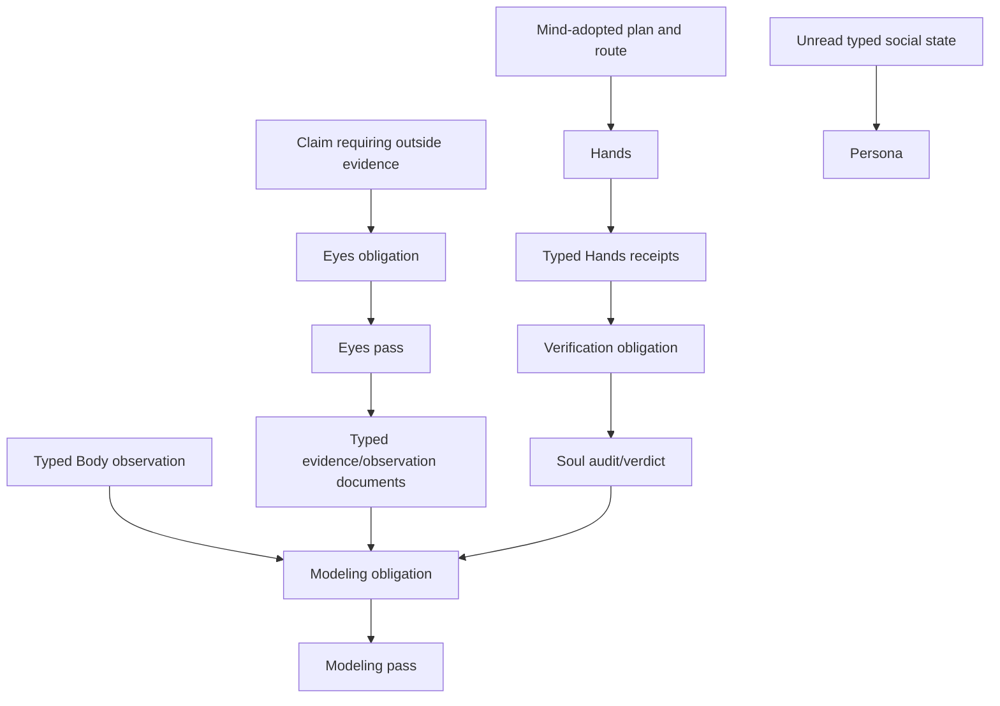

# Epiphany current algorithmic map

Updated: 2026-08-18
Latest implementation cut: `d3300bba` on `codex/epiphany-shakedown-live`

This document describes the live machine. Historical cuts, rejected paths, and
proof chronology belong in git, `state/ledgers.msgpack`, and bounded smoke
artifacts.

## Objective

Epiphany is a native typed organism whose durable decisions can answer one
question without consulting a transcript:

> What exact typed state and governed observations was this pass reasoning from
> when it produced this decision?

CultCache is the decision-bearing substrate. CultNet/CultMesh carry typed
projections and crossings. Codex-derived code remains only for earned OpenAI
authentication/model transport; it owns no Epiphany Mind, scheduler, route, or
interface authority.

## Canonical authority map

| Owner | Inputs | Outputs | Invariant |
|---|---|---|---|
| keyed Mind documents | typed semantic documents keyed by logical identity | deterministic `EpiphanyMindView` | There is no persisted aggregate Mind head or global revision. |
| `reasoning_context.rs` Mind commit owner | invariant-owned strong reads and complete typed writes | atomic batch CAS plus `EpiphanyMindCommitReceipt` | Disjoint identities merge; same-identity or changed-strong-read conflicts refuse without partial mutation. |
| concrete family admission owners | sealed decision context, exact family request/result chain, affected semantic documents | one family-specific `MindMutation` | The model cannot choose which stale state is safe to ignore. |
| `current_work.rs` | keyed Mind view and exact runtime request/job/result/decision families | pure family scheduling and continuation projections | Events, timestamps, role lanes, and thread provenance cannot create or suppress work. |
| coordinator policy/status | current-work projections, Resident pressure, and exact runtime receipts | one prioritized recommendation and read-only operator views | Coordinator presence is derived; no mutable coordinator head exists. |
| runtime worker attempt owner | immutable launch, exact process claim, typed result, job result, archival evidence | one terminal attempt authority | Scheduling, process liveness, and semantic admission remain distinct authorities. |
| Substrate Gate | exact worker/job authority and requested operation | scoped grant or refusal | Access permission does not admit Mind state. |
| Eyes | explicit external-evidence obligation plus governed source receipts | typed evidence packet and Mind observations | Eyes gathers outside evidence; it does not gate Modeling over the Body. |
| Modeling | Body basis, keyed RepoModel view, verified consequences, and explicit proposals | typed graph/frontier mutations | Modeling processes the Body directly and owns no external-source permission. |
| Hands | adopted route/plan plus exact capability receipts | typed consequences | A claimed intention is not a consequence. |
| Soul | exact consequence and invariant/evidence obligations | verification audit or refusal | Work is not true merely because it ran. |
| Persona | unread typed social/relationship state plus exact Persona projection | typed effects, speech intent, and consequence receipts | Persona work cannot block unrelated Hands or Modeling documents. |
| CultMesh/Eve | typed provider-owned documents and deterministic views | private/local/public projections | Visibility and rendering never create authority. |

## Canonical Mind

The runtime Mind `.cc` is the sole decision-bearing store. Other `.cc` files
may own physiology or external transport, but facts from them must enter Mind as
typed observations or receipts before an agent pass consumes them.

Singleton semantic identities:

- objective;
- focus;
- mode;
- RepoModel identity/body binding.

Keyed semantic identities include subgoals, invariants, evidence, observations,
checkpoints, planning items, Persona memories and social reads, Hands receipts,
Verification audits, and RepoModel domains/nodes/edges/summaries/frontier/
lifecycle receipts/per-claim obligation guards.

`EpiphanyMindView` and `EpiphanyRepoModelView` are deterministic assemblies of
exact envelopes. Their projection digests identify a view for audit/display;
they are not mutable authority revisions.

Deleted authority:

- `EpiphanyThreadStateEntry` and `EpiphanyThreadState`;
- `coordinator_state_transaction` and generic state-update services;
- generic coordinator launch/accept/interrupt requests;
- global `expectedRevision` and worker-launch `stateRevision`;
- aggregate prompt, freshness, and graph-context surfaces;
- aggregate RepoModel persistence and global model revision/hash causality.

There is no dual reader, bootstrap aggregate, migrator, or compatibility write
path.

## Reasoning audit path

```mermaid
flowchart LR
    S["Exact typed Mind envelopes"] --> B["Sealed EpiphanyReasoningBasis"]
    B --> N["Final native model request"]
    N --> P["Internally derived provider request"]
    P --> T["Governed tool intents and receipts"]
    T --> C["Sealed EpiphanyDecisionContext"]
    C --> D["Typed terminal decision or pass failure"]
    D --> M["Invariant-owned MindMutation"]
    M --> R["EpiphanyMindCommitReceipt"]
```

The sealed basis contains pass/organ identity, projection-policy version, exact
source document versions, immutable Body basis where applicable, and a closed
typed reasoning-projection variant.

The terminal context contains the exact basis ID, exact final native request,
the exact internally derived provider request, and ordered governed tool
intent/receipt versions actually supplied to the pass.

Structured decisions are authoritative; token streams and assistant deltas are
optional retention. A model-backed failure is also a typed terminal decision
record. Generic diagnostic model runs cannot produce Mind-admissible decisions.

Current migration boundary: the typed basis/context foundation, concrete Body,
frontier, Research, Verification, Planning, Reorientation, and Persona paths,
plus worker/session/Persona archive reachability are landed. Exact `f8412b69`
adds one read-only context-ID audit projection and deletes the digest-only
worker archive: the typed role and generic terminal result family now survives
retention, and runtime schema v2 refuses the earlier writable shape. Exact `f7948795`
deletes `MindGatewayReview`, `MindStateCommitReceipt` v0, the generic Mind
interpreter prompt, and their false CultNet mutation mouths. Exact `e0e75a30`
deletes the residual aggregate-shaped role patch, its parser, and its
family-policy tribunals. Research now authors one closed typed decision whose
admission owner derives keyed Mind writes; the unowned generic Imagination
planning patch is gone. Exact `1c9aafd8` seals one decision context before model-backed
frontier-Planning failure terminalization and binds both the typed faculty
failure and generic job result to it. Shared runtime validators own the
store-backed model/tool refusal matrix used by both execution and sealing.

## Concurrent Mind mutation

Each concrete invariant owner builds a `MindMutation` containing exact decision
context, exact strong-read envelopes, exact inserts/replacements, its invariant
owner identity, and an atomically written commit receipt.

Merge law:

1. Different document identities merge regardless of commit order.
2. Distinct inserts merge.
3. Same-identity byte-identical replay returns the original receipt.
4. Same-identity divergent writes conflict.
5. Changed strong reads conflict before mutation.
6. Observational-only source changes do not block an unrelated mutation.
7. Multi-document invariants commit entirely or not at all.
8. Model output is never silently rebased; conflict creates fresh work.

Collection members therefore remain separate CultCache identities. Shared
vectors and mutable global heads are forbidden because they manufacture false
conflict between Persona, Hands, Modeling, and Verification.

## State-driven work

Coordinator priority is a pure projection:

1. missing keyed Mind preparation;
2. exact Reorientation work;
3. Resident pressure;
4. explicit operator regather;
5. exact Planning/PlanMind work;
6. Proposal, Body, or verdict Modeling work;
7. Verification work;
8. explicit external-evidence Research work;
9. exact consideration families;
10. Hands work;
11. otherwise await a frontier proposal.

No default Modeling job, latest lane, accepted-at comparison, runtime event, or
generic interrupt can manufacture work.

```mermaid
flowchart TD
    Body["Typed Body observation"] --> MO["Modeling obligation"]
    MO --> Model["Modeling pass"]
    Claim["Claim requiring outside evidence"] --> EO["Eyes obligation"]
    EO --> Eyes["Eyes pass"]
    Eyes --> Evidence["Typed evidence/observation documents"]
    Evidence --> MO
    Plan["Mind-adopted plan and route"] --> Hands
    Hands --> Consequence["Typed Hands receipts"]
    Consequence --> Verify["Verification obligation"]
    Verify --> Audit["Soul audit/verdict"]
    Audit --> MO
    Social["Unread typed social state"] --> Persona
```

Eyes may create evidence that creates Modeling work. Eyes acceptance never
suppresses or authorizes ordinary Body Modeling.

## Runtime and attempt lifecycle

These are distinct authorities and must not be collapsed into one state enum:

- Heartbeat owns scheduling pressure and terminal acknowledgement consumption.
- Resident Self owns grant, coordinator lease, settlement, cooldown, and
  requeue.
- Coordinator process owns its incarnation receipt or exact-death closure.
- Runtime worker attempt owns immutable launch, process claim, activation,
  typed result, job result, and terminal attempt classification.
- Mind owns adoption of a successful semantic result.
- Retention owns deletion only after all live authorities are terminal.

The attempt aggregate centralizes exact request association and typed terminal
classification. Archived fulfilled attempts must retain recoverable decision
authority, not merely an ID/digest tombstone.

## RepoModel and semantic projection

RepoModel persistence is keyed by semantic identity: identity/body binding,
domain, node, edge, summary, frontier, lifecycle receipt, and per-node claim-
obligation guard.

`EpiphanyRepoModelView` sorts and assembles those documents. Frontier dependency
and cycle checks include the exact reachable closure in strong reads. Per-node
guards make node retirement versus concurrent frontier targeting physically
conflict without serializing unrelated graph writes.

Semantic vector projection is derived cache work. Readiness is based on exact
projection obligations and receipts; semantic cache state never admits Mind or
routes an agent pass.

## External and social facts

- Repository Body bytes enter through typed observations and exact digests.
- Immutable public Git content may remain external, but its canonical identity,
  digest, governed receipt, and exact observed excerpt enter Mind.
- Social reads enter as typed Persona observations before cognition.
- Crossings own transport and signed receipts; they never impersonate local
  cognition or Mind admission.
- Content-addressed artifacts may remain external, but the exact identity and
  decision-bearing excerpt/version are stored in the basis/context.

## Retention

Preserve reasoning bases, decision contexts, structured terminal decisions and
typed failures, Mind commit receipts, Persona effects, speech/consequence
receipts, and their direct context links.

Runtime retention may remove SSE frames, deltas, intermediate requests,
provider events, and tool scaffolding only after the terminal context is sealed
and the retained decision can still reach its basis/context without them.
The v1 worker-attempt archive embeds the exact typed role result and its
context-bound generic result family. The read-only decision audit consumes the
same durable records before and after archival.

## Verification and open gates

Accepted through `f8412b69`:

- every Epiphany core target compiles;
- core library `493/493`;
- OpenAI runtime library `24/24`;
- model-runtime binary `10/10`;
- OpenAI-runtime binary `10/10`.
- Persona service `1/1`.
- all core targets compile; generic role-patch source guards pass.
- authenticated Persona re-entry refuses naked typed input, performs no
  external observation or model call, and preserves the exact three-stage
  decision chain;
- reopened current-work projection is identical and byte-for-byte read-only at
  Launch, Wait, completed, and post-Research boundaries.
- `epiphany-model-runtime audit-decision` reconstructs an exact terminal pass
  from typed durable records only; the query is byte-for-byte read-only and
  remains complete after live worker result retirement.
- runtime schema v2 refuses the prior digest-only worker archive epoch without
  mutation.

Open before Model Atlas Gate 1 resumes:

1. run the fresh exact-package capstone over a new store, including concurrent
   Persona/repository work, complete decision inspection without transcripts,
   and process restart/re-entry. The equivalent source-level ownership,
   concurrency, refusal, and re-entry matrix is accepted;
2. only then restart Model Atlas Gate 1 from a new
   external root.

Historical c011 and partial Gate roots remain read-only. Yggdrasil remains a
public crossing body, not a build host. Operational topology registration and
autonomous scheduling remain forbidden until the capstone passes.

## Primary source anchors

- `epiphany-core/src/mind_documents.rs`
- `epiphany-core/src/reasoning_context.rs`
- `epiphany-core/src/current_work.rs`
- `epiphany-core/src/repo_model_documents.rs`
- `epiphany-core/src/runtime_worker_attempt.rs`
- `epiphany-core/src/runtime_spine.rs`
- `epiphany-core/src/resident_self.rs`
- `epiphany-core/src/reorientation_work.rs`
- `epiphany-core/src/surfaces/coordinator.rs`
- `epiphany-core/src/surfaces/worker_launch.rs`
- `epiphany-openai-runtime/src/lib.rs`
- `epiphany-openai-runtime/src/persona_executor.rs`
