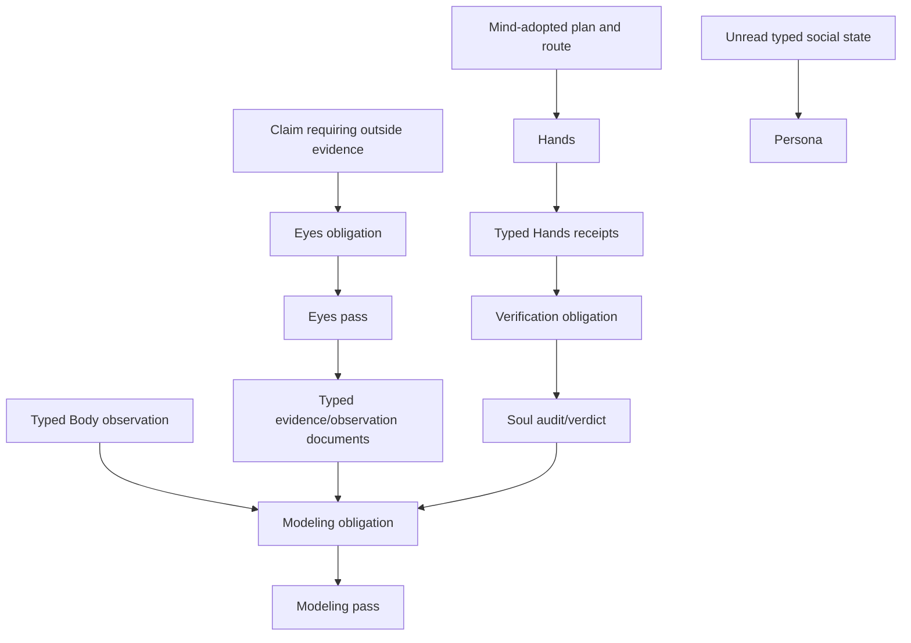

# Epiphany current algorithmic map

Updated: 2026-08-24
Latest committed implementation cut: `24023265` on `codex/epiphany-shakedown-live`
Current pass: duplicate live Hands receipt rereads deleted;
Ox17 remains paused

This document describes the live machine. Historical cuts, rejected paths, and
proof chronology belong in git, `state/ledgers.msgpack`, and bounded smoke
artifacts.

## Objective

Epiphany is a native typed organism whose durable decisions can answer one
question without consulting a transcript:

> What exact typed state and governed observations was this pass reasoning from
> when it produced this decision?

CultCache is the decision-bearing substrate. CultNet/CultMesh carry typed
projections and crossings. Each organ's typed CultNet contract factory is the
sole author of its contract directory; local Verse summaries derive directly
from those contracts and no parallel CultMesh contract documents are persisted.
The fixed three-Verse trust policy and public-room directory are also direct
local Verse projections; they are not written into CultCache as counterfeit
mutable state.

The shared state-model vocabulary is inhabited, not aspirational. Exact
`a602fbdc` deletes fifteen DTO types with no external consumer: aggregate
acceptance/runtime links, a second graph/frontier/checkpoint model, global
retrieval and scratch state, generic job bindings, and churn telemetry. Keyed
Mind/runtime receipts own decisions and lifecycle identity; keyed RepoModel
documents own repository structure; scratch and retrieval inputs belong to
sealed reasoning passes. Two callerless OpenAI-runtime mouths and eight
definition-only type constants are also gone. The cut is 291 pure deletions;
the state-model crate is 366 lines. It does not touch the still-unrun Atlas
inter-swarm path.

Provider observability is typed consequence, not a no-op callback shelf. Exact
`9abadfe7` removes the frame-observation DTO, sequence/preview bookkeeping, and
observer methods from both provider transports because every live caller threw
the observation away. Codex SSE and OpenRouter responses still lower into the
same typed model events and receipts. A provider-specific transcript reader
used only by a test assertion is also absent; decision audit continues to use
sealed native/provider requests, structured terminal records, governed tool
receipts, and Mind commit receipts rather than stream text.

Durable provenance is singular. Exact `2a435eb5` advances Persona memory to v2
and removes a linked-event vector that repeated `effect_document_id` plus a
relationship slot every producer left empty. The memory keeps the exact
Interpreter effect document and decision context. Tool receipts advance to v1
and remove an always-empty raw-result reference; exact result JSON or error is
the receipt consequence. Mind/runtime writable epochs were v10/v26 at that
cut, and old stores refuse rather than inheriting the retired shapes.

Routing identity lives at the owner, not in every payload. Exact `ffd91c20`
first deleted the fixed Research role from the then-live Eyes evidence packets
because their request and decision-context identities already owned provenance.
It deletes the fixed Epiphany Persona agent label from each social mention because
the Persona-only queue and immutable turn request own routing. Resident Self
retention keeps cumulative lifecycle/envelope counts and its exact chained
deletion digest; it no longer accepts a clock merely to persist an unread
timestamp outside that chain. Persona social mention v2 and Resident Self state
v3/retention head v1 remain; exact `83611f9b` later deletes the Eyes packet
family entirely. Model Atlas is unchanged and remains unaccepted until a
live inter-swarm exchange exercises publication, transport, verification,
admission, wake, and withdrawal end to end.

Provider transport is not a second state machine. Exact `fe118e13` keeps the
exact provider request as durable decision input, but makes provider events and
receipts transient values. The runtime immediately lowers each into the native
model event/receipt family that already owns tool continuation, assistant-text
reconstruction, terminal validation, and bounded retention. The provider
event/receipt CultCache registrations, archive requirements, schema IDs, and
public CultNet schemas are deleted. Runtime advances to v28; the public catalog
has 18 schemas. `epiphany-model-runtime` now points directly at its executable
body instead of compiling through an include-only shell. Atlas is untouched.

Schema publication is not a shadow registry. Exact `dbed11b3` deletes the
nonexistent runtime-event contract and the obsolete public schema for the
private archived-session tombstone. Exact `8bb0719b` then removes every
runtime-local identity, session, job, binding, coordinator, native model/tool,
and state-ledger JSON mirror. Those documents remain typed CultCache state and
are discovered from the native registration or projected by their owning
CultMesh provider; no live CultNet crossing consumed the hand-maintained JSON,
and several schemas contradicted their Rust owners. The catalog now contains
only three earned portable boundaries: the exact OpenAI-compatible provider
request, `gamecult.persona_state.v0`, and `epiphany.work_organ_state.v0`. The
two cuts remove 850 net maintained lines. Atlas remains untouched and untested
end to end.

Dependency ownership follows source ownership. Exact `695af6c6` deletes
thirteen manifest edges with no consumer in their owning package, plus the
tracked marker that kept the extinct `epiphany-openai-auth-spine` directory
alive. The release bundle no longer directly owns nine libraries used only by
leaf crates or not used at all; four leaf/dev manifests drop their own dead
edges. The lock graph contracts from 757 to 732 packages, including removal of
the orphan PostgreSQL and duplicate newer crypto chains. All nine production
entrypoints and the affected library/test targets compile individually. The
cut removes 284 net manifest, lock, and source lines. Package-scoped cleanup of
the five compiled packages removed 124.2 GiB of disposable historical build
artifacts without removing the prebuilt state tool. Atlas is untouched.

Hands consequence receipts carry consequence, not doctrine commentary. Exact
`65bf044f` removes fixed schema-version strings and unread contract prose from
the patch, command, and commit documents. CultCache owns their type/schema
identity; admission still proves exact intent, review, Substrate Gate grant,
runtime job, affected paths or command, immutable receipt identity, and the
resulting consequence. Fourteen unused shadow type constants and one callerless
reorient display enum are also gone. Runtime advances to v29; old writable
state refuses. The existing lifecycle proof carries Hands concurrently with a
Persona admission and creates exact Verification work, while package cleanup
removes the 678.6 MiB it generated. The cut removes 67 net maintained lines.
Atlas remains the untouched, unaccepted collaboration slice.

Autonomous proposal origin has one owner. Exact `d9a196a0` folds the direction
result, option ordinal, and worker job identities into the Proposal-Modeling
request that already owns selection. The separate binding document, schema,
registration, third atomic write, collision branch, and copied launch/result
hashes are deleted. Promotion still strongly reads the immutable direction
request/result and worker launch/result while inserting one proposal/request
pair; launch, fulfillment, and archival validate the same request-owned chain.
Runtime advances to v30. The full keyed lifecycle and old-store refusal pass;
package cleanup removes 677.6 MiB. The cut removes 53 net maintained lines and
does not touch the unrun Atlas crossing.

Repository-domain identity is one small typed receipt, not a second Body.
Exact `6f5d6600` retains the canonical organizational repository name and exact
authenticated Body hash, then deletes the copied runtime, swarm, workspace,
fixed envelope identity/schema prose, and binding timestamp. CultCache and the
authenticated Body route already own those facts. Bootstrap still validates
the live Body and atomically strong-reads runtime identity plus the Body route;
proposal promotion and fulfillment still refuse repository or Body-hash
substitution. Runtime advances to v31. The full keyed lifecycle and old-store
refusal pass; package cleanup removes 677.2 MiB. The cut removes 50 net
maintained lines. Atlas remains protected until a real inter-swarm exchange
exercises publication, trust, transport, projection, verification, admission,
wake, brake, and re-entry together.

Operator objective intake carries the human assertion, not a second objective
model. Exact `952dcd9f` keeps thread provenance, objective text, source actor
and reference, and submission time, while deleting fixed schema prose, stored
key identity, a digest of the already-hashed payload, and contract text. The
singleton Mind objective remains the active state and the commit receipt still
binds its exact operator provenance atomically. The outcome exposes only the
projection digest, commit receipt, and changed bit. A binary test that merely
repeated the library seed/idempotency/refusal proof is deleted; the library
proof now requires byte-identical replay and the resident-grant provenance
proof remains. Runtime advances to v32. The three focused proofs pass and the
cut removes 54 net maintained lines. Package cleanup removes 18.5 GiB; the
1.7 MiB state tool is preserved while another 961.1 MiB of regenerated build
artifacts is removed. Atlas is untouched.

Repository-frontier documents carry decisions, not their own envelope labels.
Exact `718ce9c1` removes fixed schema-version fields and contract slogans from
thirteen durable documents across Proposal, Proposal-Modeling, Planning,
Research, plan candidate, PlanMind, plan decision, route, Hands authority,
Verification, Soul verdict, and post-verdict Modeling. CultCache envelope
identity plus runtime epoch v33 owns the internal shape. Semantic identity,
exact source versions, strong dependencies, decision context, evidence,
disposition, and consequence remain. Sealed worker contexts keep their schema
and contract because they are part of the exact request the model saw. The
full keyed lifecycle, epoch refusal, provider candidate mapping, core library,
and release-owned coordinator target pass. The cut removes 177 net maintained
lines and leaves the unrun Atlas crossing untouched.

Runtime epoch identity is rooted, not repeated. Exact `a4356d1f` retains the
runtime identity and swarm binding epoch fields, then removes fixed
schema-version echoes from thirteen child documents covering sessions, jobs,
execution bindings, launches, process claims, results, coordinator receipts,
death recovery, and retained archives. Their semantic and causal payloads are
unchanged. Runtime v34 remains the hard old-store refusal boundary. The core
library, full keyed lifecycle, reorientation, failure audit, transcript-free
binding audit, provider mapping, coordinator, swarm, and model-runtime targets
pass. The cut removes 122 net maintained lines and leaves Atlas plus external
crossings untouched.

The packaged model runtime has one execution authority. Exact `e60b924f`
deletes the callerless `preflight` JSON self-certificate and registered-type
catalog accessor; real store epoch admission and Idunn package witnesses own
compatibility and provenance. Exact `3b991e40` deletes the uncalled standalone
`model-turn`, `tool-followup`, and `tool-followup-turn` commands plus their
parser/DTO/test surfaces. `run-worker` remains the sole provider execution path
and retains internal tool continuation; `list-decisions` and `audit-decision`
retain transcript-free operator inspection. The two cuts remove 532 net
maintained lines. The remaining binary suite passes 8/8. Atlas is untouched.

CultMesh contains no JSON-derived operator snapshot, coordinator receipt,
Hands gate, role-review event, unauthenticated Odin/Eve provider row, or daemon
tool directory. Native runtime and keyed Mind receipts remain the owners; old
stores containing the deleted envelope types refuse at the schema boundary.
Persona speech decisions and Weksa lowering receipts likewise remain in their
own typed owners; CultMesh does not persist unused parallel shadows.
Operator intent/completion and Hands consequence flow are also read from their
native runtime and Mind owners. The local Verse has no operator-run or generic
work-loop telemetry shadow and prompt assembly has no branch that depends on it.
Repository work likewise has no CultMesh overview, readiness, map-entry, or
public-proof aggregate. Keyed Mind/runtime documents own the underlying work;
an unused aggregate cannot become an interface merely by round-tripping. The
unused service-execution audit and Bifrost artifact, metrics, and public-proof
receipt families are deleted with the tests that alone called them.

Worker launches carry one typed launch document, its exact output contract, and
the sealed reasoning projection that owns model input. They do not carry a
generic organ dependency matrix or prose receipt catalogue. Family admission
owners derive exact dependencies from typed state; no universal "every organ
depends on every other organ" prompt cargo can make Eyes gate Modeling or make
a decorative list impersonate transaction authority. Persona projects exact
social, memory, and Body inputs without that fiction.

The operator surface has no unconsumed view-lens registry, legacy acceptance
bundle builder, test-only raw-JSON result interpreter, or second CRRC
recommendation algorithm. Typed outcome interpretation remains shared by
current work and reorientation. The keyed status composer is the sole CRRC
recommendation projection; its DTO does not confer routing authority.

Status projects only Mind identity, exact current work, one coordinator
action/reason pair, and operator-readable role lanes. It has no nested duplicate
`view`, inert auxiliary mode, ignored arguments, fixed synthetic jobs, second
scene/planning Mind, or result/tool/pressure tableaux. Exact `2ce91461` and
`78836f3b` remove 2,241 net lines and sixteen tests that guarded duplicate
projections, unreachable pressure routing, manifest strings, or prompt keywords
rather than a live consequence. Core 356/356, status 1/1, coordinator 8/8, and
release construction 19/19 pass. The operator thought-sealing boundary remains
tested.

The schema registry contains no `epiphany.surface.*` families. Exact
`f10f7fb3` deletes the final twelve schemas and ten catalog entries after a
producer/consumer audit found no live owner on either side; several still
claimed global revisions or artifact-directory state. The publication index
contains zero surface documents. Persona's portable state
remains `gamecult.persona_state.v0`; Eve/CultMesh providers retain their own
typed contracts.

Exact `ab3cacfb` reduces the local catalog to twenty-three live or portable
contracts. Thirty-one producerless RepoWork, operator-run, generic intent,
swarm, Persona-artifact, Rider, and Unity schemas are gone. Runtime sessions are
read-only lifecycle state; no generic session intent or swarm receipt is
advertised. Brokkr owns Unity capabilities through CultMesh/Eve, and a future
Rider daemon owns Rider. Epiphany has no editor-specific command organ.

The same cut removes the callerless `prompt_context` module and the
specialist-prompt TOML loader. Their public APIs had no production consumer and
their four tests were their only population. Live agent passes assemble sealed
typed reasoning projections and exact native/provider requests directly; no
parallel freeform context renderer survives.

Exact `16d85b1b` removes the six direct JSON-builder tests from
`agent_launch` and two OpenAI-runtime self-source searches. Strict provider
lowering, typed ingress refusal, runtime-owned identity derivation, and Mind
admission remain the behavioral owners; implementation spelling and duplicate
schema field inspection do not.

Exact `06f93f70` removes the test-only inverse OpenAI-to-native request mapper.
Provider requests are derived internally from canonical native requests in
tests as well as production; no fixture may manufacture native ancestry from a
caller-authored provider document.

Live providers own their CultMesh/CultNet schema catalogs. Exact `03140a47`
deletes the standalone runtime-spine CLI, its callerless Hello/catalog writers,
and its hand-maintained mutation-contract mirror. Runtime status and model
preflight derive accepted document types from the same CultCache registration
that opens the Mind store. The typed runtime documents remain; a command-line
facsimile no longer impersonates their service owner.

Coordinator status is a core projection, not a second program. Exact
`500125d5` deletes the unconsumed packaged status CLI and moves the functions
the coordinator actually calls into one `epiphany-core` module. Operator-safe
lowering remains tested; command parsing, file output, and duplicate compilation
do not.

Persona's consequence membrane is typed, not lexical. Exact `63939fa2` removes
the keyword tribunal that rejected projector prose for looking like JSON or
containing action-shaped words. Projector and Persona outputs remain sealed
private stage results. The Interpreter's closed effect enum, allowed-channel
set, cardinality and size bounds, exact decision context, and Mind admission
own consequence safety. Prompt-substring tests do not.

Tests must falsify an owner or consequence. Exact `bf2f39eb` deletes an
identical-call causal-ID tautology and a duplicate unknown-field check for an
extinct generic patch. Exact family lifecycles and runtime-owned identity
substitution remain the behavioral proofs.

Exact `f3360248` deletes three more duplicate implementation-spelling proofs:
a cache-directory prefix assertion whose stability/separation cases remain, a
Git argument-vector mirror whose actual source-cache recovery case remains, and
a raw repeated-round predicate test whose guard-transition and terminal
failed-worker cases remain. The retained tests cross the owning behavior; the
deleted tests merely recited helpers.

Exact `104bf390` deletes two public-source tests that supplied no additional
protection: one duplicated the canonical immutable-GitHub parser tests already
owned by `epiphany-core`; the other was permanently ignored, network-dependent,
pinned to historical source, and asserted only that README prose contained the
project name. The bounded public-source transport remains production code; its
identity law remains tested once at its owner.

The tool runtime exposes execution, not self-description. Exact `777dd1a5`
deletes its callerless static `smoke` command, fixed summary DTO, parser branch,
and self-affirming branding test. Signed daemon health owns liveness; typed tool
intents and receipts own execution. Removing the second command also removes the
now-pointless one-variant CLI enum.

Repository Body verification lives at the owner, not in a shipped manual
self-test. Exact `013c3bf1` deletes the callerless Body `smoke` command and its
temporary-store ritual. The runtime command retains bootstrap, bind, observe,
and status; the 23 focused owner tests prove authenticated Body behavior and
refusal paths directly.

Model-runtime physiology must come from an actual provider or a test fixture,
never a shipped command that writes synthetic evidence into a runtime store.
Exact `ce90f911` deletes the callerless `smoke` route, fake request/tool-call/
completion sequence, `smoke_no_network` receipt, parser, options, and usage
claim. The retained commands execute or audit real typed model work.

Tool execution stdout is a completion projection, not a schema catalogue or
authority mirror. Exact `0bb6a883` removes the fixed adapter/schema fields and
the caller-supplied store echo. The typed CultCache receipt remains canonical;
stdout carries only intent ID, receipt ID, and terminal status.

Cryptographic identity separation does not require one executable per key.
Exact `ad2292ee` deletes the two callerless Persona identity setup binaries,
their release roles, and their private enrollment/anchor-export wrappers. The
delivery-request and permit identities remain purpose-specific. Runtime owners
may only open already-admitted private identities and validate pinned public
anchors; deployment admission owns future enrollment if those dormant
crossings are activated. No model pass, Persona turn, or Bifrost request path
can mint or rotate either trust root.

Persona feedback has one ingress owner. Exact `3dda58a5` deletes the standalone
feedback CLI and the old immutable-snapshot replacement API it alone exposed.
Resident Self reads the provider-owned Bifrost delivery store, authenticates
each delivery against the pinned anchor, admits it into the separate local
feedback store, and then projects allowed pressure into typed social state.
Static status JSON and a second import command cannot race or impersonate that
physiology. The retained tests exercise authentication, substitution refusal,
disclosure policy, recovery, and exact provider-store import.

Model Atlas is not three daemons merely because its library has three
authorities. Exact `56267201` deletes the publisher, projector, and impact
ingress executable wrappers plus their release roles. The typed library owners
and their separate state remain intact; no current deployment lifecycle pays
for speculative loops, CLI parsing, sleep cadence, or process termination
handlers. A future Gate 1 must prove the minimum Idunn-managed process topology
from actual lifecycle and failure-isolation needs.

Atlas also has one local author per fact. Exact `ce306e23` deletes the parallel
Atlas-specific offer/claim write intents and direct runtime commit APIs.
Ordinary Modeling through the keyed RepoModel is the sole owner of offer and
claim lifecycle; the publisher reads those exact Mind documents. Soul retains
the exact signed-publication verification planner, Self retains impact
admission, and the projector remains purely derived. The retained runtime test
now enters through RepoModel before proving verification admission and stale
Body refusal. Inter-swarm publication, projection, transport, wake, brakes, and
Eve lowering remain intact for Gate 1.

Those are component proofs, not evidence of collaboration. No live inter-swarm
exchange has yet run. Atlas therefore remains an unspent vertical slice: future
subtraction may remove duplicate ceremony around it, but must not narrow the
publication, trust, transport, verification, admission, wake, brake, or Eve path
before Gate 1 exercises the whole crossing.

Proposal work has one source: an exact admitted Imagination direction result.
Self atomically promotes that result into an inert proposal, its autonomous
origin binding, and its Modeling request. Exact `900c5232` first deleted the
callerless frontier-proposal executable. Exact `6e600e8d` then deleted the
remaining generic writer, user input DTO, selector, and User/Persona/Bifrost
source variants after rebuilding the broad lifecycle proof through the live
Imagination chain. Exact `5d507bfd` then reduces the origin binding from 22
mirrored fields to six causal join fields. A proposal still cannot exist without
its exact direction request/result, worker launch/result, selected option,
Body/domain binding, and canonical Modeling request; validation reads those
facts from their owning immutable documents instead of copying them into the
join record.

Proposal-Modeling has no second launch record. Exact `b0a4978d` deletes the
persisted binding after its minimized form proved to own nothing. The immutable
worker launch carries the typed request reference, job, role, binding, and sealed
document; current-work, retry counting, fulfillment, coordinator actuation, and
archival all read that owner directly. Family-specific semantic requests remain
mandatory.

Planning and PlanMind likewise have no second launch record. Exact `b55e96ea`
deletes both persisted binding families and derives contiguous attempts and the
current job from the family references on immutable worker launches. A retry is
authorized only by the exact typed failed result and its failure review; the
launch transaction now strongly reads those documents and every prior launch.
The semantic Planning and PlanMind requests, sealed projections, result
validation, and two-stage adoption boundary remain family-owned.

Body Modeling, Imagination consideration, and Reorientation also have no
second launch record. Exact `8dbfcf63` deletes all three persisted binding
families. Canonical worker job identities now encode contiguous attempt order;
the immutable worker launch carries the exact family reference, role, binding,
and typed launch projection. Body retry CAS reads the prior launches, latest
job, exact structured result, and matching admission refusal. Reorientation
retry CAS reads the prior launches, latest job, typed pass failure, and exact
terminal runtime result. Imagination retry CAS reads every prior launch. Family
requests, sealed reasoning projections, result validation, substrate grants,
typed failures, and Mind admission remain with their existing owners. Runtime
writable state is v19. This cut does not touch Model Atlas or narrow the still-
unrun inter-swarm path.

Verdict-driven Modeling has one writer. Exact `3ed1d564` deletes the public
`commit_repo_frontier_modeling_request` API that production never called.
Accepted Verification already commits its audit, Soul verdict, and canonical
frontier-Modeling request atomically through the Mind owner; the deleted API
reopened the store and offered a second mutation path solely for one OpenAI
test fixture. That test now launches ordinary Body Modeling through current
work and still proves exact sealed input, structured completion, typed result
and job terminality, provider failure, and output-contract failure. Its
fabricated frontier, route, Verification, and Soul tableau is gone.

Coordinator terminal state is not an artifact catalogue. Exact `63d2991e`
advances the receipt to v1 and removes its unread step count, model-provider
echo, runtime-store path, artifact and sealed-artifact lists, arbitrary
metadata, and final-job echo. The receipt retains its terminal status/action/
reason, time, session/thread identity, plan-or-execute mode, and the exact
resident grant, launch, policy, argv, objective, release, manifest, and
executable provenance continuity authenticates. Operator artifacts remain in
the operator summary only. The published JSON schema now matches the Rust
contract instead of rejecting the live resident fields it omitted. Runtime
writable state is v20.

Runtime session and job documents are lifecycle state, not duplicate result
records. Sessions retain only grouping identity plus active/completed state;
jobs retain only identity plus Queued/Completed/Failed state. Exact structured
role/reorientation outcomes own semantic decision cargo, native model receipts
or typed pass failures own model terminality, and worker process claims own
process death. There is no generic terminal-result document or summary-bearing
lifecycle record.

Runtime physiology is created only by its real owners. Exact `cd2177e8` first
deleted `ensure_runtime_session`, whose only consumers were fixtures and whose
active-ID path returned a pre-existing session without comparing its payload.
Exact `fdefb889` later deletes the remaining generic session/job writers after
proving every caller was also a fixture. Family launch CAS, model-execution
opening, and coordinator opening now own creation. Runtime schema is unchanged.

Current typed work has one assembler. Exact `0a97eef8` deletes the separate
Body-only and unresolved-Body projectors, which reopened Body, RepoModel, and
runtime state to reconstruct subsets already owned by `project_current_work`.
It also deletes three unused per-job continuation wrappers that each rebuilt
the entire projection. Live coordinator review selectors consume the one shared
slice directly. The retained lifecycle proof confirms projection remains
thread-free and performs no live Body scan.

Exact `5a047944` removes the callerless generic helper shelf rather than
preserving API because it looks reusable: JSON ledger status, role binding and
owner lookups, unique-string accumulation, and a successful-coordinator
receipt wrapper. Typed owners and the exact coordinator binding validator stay
where live callers use them. No replacement utility layer exists.

Exact `6ccaf937` removes three more unowned mouths. Repository Body consumers
read the assembled typed Mind view rather than a one-field forwarding helper.
Persona quarantine remains keyed typed state rather than gaining a second
sorted-list projection. Substrate Gate no longer exposes a generic repo-work
planning grant that no admission or actuator consumed; exact coordinator and
worker grant constructors remain with their live authority paths. Nothing is
inserted between those owners and their consumers.

Exact `f6a2ad7f` deletes two exported readers with no workspace consumer.
Packaged-release authentication remains exact-ID based; its current-head
document remains publication state, not a general query API. Idunn
provider-health admission continues to consume and validate typed trust
anchors supplied at its boundary; it no longer owns an unused file-loading
convenience path. The signed admission, continuity, and substitution laws are
unchanged.

Imagination consideration no longer writes a review-shaped cul-de-sac. Exact
`be611f24` deletes the producerless review request, its durable type, schema
constant, export, and runtime registry entry. The retained candidate remains a
typed proposal-only outcome; a real adopted Modeling proposal follows the
separate proposal lifecycle rather than this unread document. Runtime epoch
v22 refuses v21 stores instead of silently carrying the retired type forward.

Resident Self no longer admits a receipt family that no process could produce
or consume. Exact `3140d305` removes `ResidentSelfRuntimeReceipt`, its schema
constant, and its registration/decoding branches. Resident Self state v2
refuses v1 stores without mutation. The unrelated definition-only coordinator
result-status enum is also gone; current role-board status remains the one live
display projection. Session and worker retention continue through their actual
runtime-spine owners.

Model inference no longer writes mutable adapter-status shadows. Exact
`0091e0e1` removes both generic and OpenAI-specific status documents, their
constructors/writers, runtime registrations, published schemas, and the test
that only restated the synthetic OpenRouter status fields. Provider/model
identity remains in the exact native and provider requests; credential and
transport attachment is proved where the transport is constructed and used.
Runtime epoch v23 refuses v22 stores. The local published catalog now contains
twenty live or portable contracts.

Mind no longer contains a second, uninhabited planning ontology. Exact
`2e3489c4` removes planning-capture, backlog-item, roadmap-stream, and
objective-draft document families plus their 256-line generic state-model
vocabulary. No live path could construct or admit one, so every reasoning
projection received the same empty structure. Frontier planning requests,
candidates, Mind review, adopted decisions, checkpoints, and consequence
receipts remain the sole planning lifecycle. Mind/runtime epochs v9/v24 refuse
the retired writable shape.

Blocked Persona turns have one durable consequence record. Exact `a6f73fc4`
deletes the duplicate quarantine-pressure document that was written beside the
terminal receipt but never read. The terminal receipt retains exact blocked
crossing evidence and mention digest; keyed mentions retain `quarantined`
status plus terminal-receipt identity. No second queue or pressure projection
reconstructs the same decision.

Reorientation likewise has one decision record. Exact `fed4b857` deletes the
entire continuity-gateway module and its unread recovery receipt, which copied
the persisted runtime result into a companion beside the typed Mind decision.
The sealed basis/context, exact result, strong reads, Mind decision or failure,
and commit receipt own replay and audit. Reorientation now uses the ordinary
Mind commit primitive. Runtime epoch v25 refuses v24 stores.

Bifrost owns its private feedback-signing identity. Exact `94098223` deletes
Epiphany's host-identity executable and the private signer, persisted identity,
enrollment, platform protection, and anchor-export implementation behind it.
Epiphany retains only the typed public anchor and purpose/payload/identity-bound
Ed25519 verifier required at feedback admission. Tests use a deterministic
test-only signer; production code cannot create, open, rotate, or export the
provider's trust root.

Exact `a276d0f4` removes the residual generic identity abstraction as well.
CultNet's shared public anchor/signature shapes are decoded directly by the
Bifrost Persona-feedback admission owner, which privately preserves the exact
legacy-compatible identity and signature domains. The generic module, public
aliases/verifier, enrollment/export fixtures, and callerless public signing
helpers are gone. Anchor assurance/provenance fields remain serialized because
they are part of Bifrost's existing wire format; they do not own admission.

Persisted cluster topology is also gone. Its writer became dead when the
callerless seed bundle was removed, while the supervisor merely accepted any
nonempty subset of seven fixed keys as “bootstrap” without authenticating Body
domain, completeness, or runtime binding. That was a sentinel, not topology
authority. Supervisor admission continues through exact store/runtime identity,
packaged release, brake, service policy, process identity, and signed health.

Exact `203bcc41` separately deletes the producerless Bifrost body-change/GitHub
publication contracts and projections. Bifrost owns its real Persona
feedback/delivery stores and signed crossing receipts; Epiphany consumes those
provider-owned documents instead of publishing a substitute protocol. The two
specialized projector policy writers remain the only writers for their actual
local service policies; no test-only generic writer recreates that path.

Hands does not advertise a pull-request receipt it cannot produce. Exact
`11d99de1` deletes `HandsPrReceipt`, its registration, dead test-only writer,
read path, relinquishment check, exports, and contract claims. Local Hands
authority ends at exact patch, command, and commit consequences. A real remote
publication result enters as provider/Bifrost-owned evidence rather than an
Epiphany-authored facsimile.

Exact `25d4d1fa` deletes a second fictional Hands branch: the callerless route-
relinquishment writer, its refusal receipt, its Mind receipt, and both schema
registrations. No scheduler, coordinator, actuator, admission owner, or test
consumed it. The live path is narrower: exact intent/review/grant authority,
then patch/command/commit receipts, with the commit atomically creating the
Verification request. Epiphany has no durable Hands-relinquishment lifecycle
until a real consequence owner requires and verifies one.

Hands also does not record operator-authored descriptions as if they were
observed consequences. Exact `b78ffb25` deletes the callerless
`epiphany-hands-action` recorder, its packaged role, command-description
handshake, and main-only tests. The coordinator may seal a scoped action gate,
but reports `awaitingHandsExecutor`; it cannot terminalize that gate. Exact
receipt-chain admission and Verification projection remain ready for a future
actuator that performs the operation and emits receipts from its own observed
effects.

The handoff from Hands to Soul has no transient aggregate. Exact `6ccc7dd2`
deletes the 20-field receipt-chain summary and derives the Verification request
directly from the persisted patch, command, and commit receipts plus the
frontier authority. The commit still publishes itself and its deterministic
Verification request atomically.

Tool discovery also has no free-floating capability registry. Exact `beb9fd32`
deletes `EpiphanyToolCapability`, its constructor/registration/contract row,
standalone schema, catalog entry, and smoke-banner claim after finding no live
producer or consumer. Exact tool definitions sealed into model requests plus
runtime execution bindings and governed invocation receipts own the actual
path. The catalog retains tool intent/receipt and drops to 42 schemas.

Continuity owns no second reorientation archive. Exact `ca2d2cf2` removes
packet, compaction-checkpoint, stale-turn-repair, and refusal contract rows that
had no typed documents or runtime path. Exact `fed4b857` later removes the
unread recovery-receipt copy. The typed reorientation Mind decision/failure,
sealed context, exact result, and commit receipt own the live path; compaction
and handoff remain native state physiology.

Soul likewise publishes only its real result. Exact `f8974d52` removes generic
verification-request, invariant-check, regression, review, and refusal contract
rows that had no typed documents or runtime path. The keyed repo-frontier
verification request owns the live obligation, and `SoulVerdictReceipt` owns the
persisted audit result consumed by Modeling/Mind.

Eyes owns one concrete admission path. Exact `201fa192` removes generic
evidence-request, review, and refusal rows that had no typed documents or
runtime path. Exact `83611f9b` then removes the never-persisted source-lookup
DTO and the duplicate evidence packet. The real grant/tool receipt chain is
authenticated in place; the structured Research decision becomes keyed Mind
evidence/observation writes under one atomic `Eyes.frontier_research` commit.

Idunn deployment truth is not mirrored into invented Epiphany-local envelopes.
Odin/Idunn owns `gamecult.idunn.deployment_manifest.v3` and signed daemon-health
admission. Cross-repository inspection found no producer for Epiphany's former
v0 deployment and aftercare DTOs; Epiphany had no writer, test, or consumer for
them. Those schemas, registry entries, context fields, loaders, and key helpers
are deleted rather than advertising a crossing that never existed.

Exact `856648de` completes the daemon and derived-cache subtraction. Epiphany
owns no local daemon supervisor, semantic-memory projector, workspace-coverage
projector, managed-service policy, projector lifecycle/heartbeat/recovery
mirror, or Qdrant/Ollama/Postgres cache configuration. Idunn owns deployment and
daemon survival; signed Idunn health is the operational receipt. Eve/CultMesh
may project that provider-owned state, but Epiphany does not mirror it into a
second writable authority.

Exact `30c66080`, `008bd493`, `7e16e758`, and `3312880e` close the remaining
generic command entrances, legacy lifecycle lineage, finite/fallback launch,
and caller-authored supervisor identity. Exact `afb223da` deletes two more
implementation-mirror tests and the wrapper created to animate one of them,
then advances managed-service policy to v1 without fixed owner prose,
`restart_mode`, unused backoff, decorative update time, or notes. Historical
policy rows refuse at the load boundary. Exact `ffe707ff` deletes the global
lifecycle latest mirror, history scan, timestamp election, local-Verse slot,
and their two self-referential tests. Each service now has one exact current
receipt head; same-service concurrent replacement conflicts atomically.

The five remaining supervisor tests guard lifecycle brake scope, Windows Task
Scheduler argv integrity, all-or-none Idunn signed-health identity, stale child
process identity/PID reuse, and heartbeat freshness plus lifecycle correlation.
Tests that merely format bytes, call a match arm, round-trip a brake, or preserve
a display/history mirror are gone with the production scaffolding they excused.

The earlier supervisor reductions established that Idunn on Yggdrasil is the
deployment and daemon-survival owner. `856648de` deletes the remaining local
spawn, process-identity, heartbeat, and recovery implementation instead of
keeping a parallel physiology alive for two cache processes that no agent used.
The model-provider boundary explicitly selects a
typed provider dialect and internally derives the exact provider request from
the canonical native request. OpenRouter/Ox is the current Yggdrasil provider;
Codex-derived code remains only where an OpenAI provider needs its earned
authentication or transport. Neither owns Epiphany Mind, scheduler, route, or
interface authority.

Exact `a6cf9383` first made that boundary physical in the package graph. The pure
`epiphany-openai-runtime` library opens the exact model execution, derives the
provider request, normalizes typed provider events, emits governed tool
intents, and records terminal physiology/audit without depending on a Codex
crate. One shared source module at the release-bundle edge owns concrete
Codex/OpenRouter authentication, credential reading, and network calls for the
model and Persona entrypoints. Persona keeps its three-stage family executor;
the service owns its concrete runner. Workers have one governed tool-capable
route, not a tool route plus a parallel no-tools opinion.

The target boundary is the independent daemon mapped in
`notes/standalone-codex-transport-migration.md`. Independent
`GameCult/CodexConnector` exact
`54d8bc2525b7e7fa1b9dd26b95871247ff4c7566` now owns one typed multi-caller
transport package and one public daemon binary without linking a Codex crate.
Its default library is only the encrypted contract/client ABI; daemon-only
auth, raw Responses transport, CultCache replay, and Ureq/Rustls dependencies
sit behind the `daemon` feature.
Each consumer internally derives its exact typed provider request. The daemon
verifies those exact bytes, returns a digest-bound transport receipt plus typed
events, and uses a private digest-pinned official `codex app-server` child only
to own credential refresh. The child never receives cognitive input or output.

Replay is one keyed CultCache document per caller/request identity in an owned
Redb store. `Active` is durable before provider I/O; the exact encrypted
`Completed` response is durable before socket reply. After restart, completed
work replays byte-identically and ambiguous active work refuses without
consuming unrelated live capacity. RAM retains only the current process's live
execution set.

Exact Epiphany `ed7357a2` completes its source-side consumer cut. The model and
Persona entrypoints cross the shared client ABI; the complete embedded Codex
spine, compiled Codex graph, direct auth/HTTP/SSE path, and Codex-home/readiness
plumbing are gone. OpenRouter remains a separate direct provider edge. Durable
model receipts retain Connector caller identity, exact native/provider digests,
and cached-token usage without requiring a transcript. Redacted CultMesh/Odin
readiness, the independent Idunn target, Yggdrasil installation, one real
Epiphany round trip, and Ghostlight's copied wire/deployment deletion remain
open.

## Canonical authority map

| Owner | Inputs | Outputs | Invariant |
|---|---|---|---|
| keyed Mind documents | typed semantic documents keyed by logical identity | deterministic `EpiphanyMindView` | There is no persisted aggregate Mind head or global revision. |
| `reasoning_context.rs` Mind commit owner | invariant-owned strong reads and complete typed writes | atomic batch CAS plus `EpiphanyMindCommitReceipt` | Disjoint identities merge; same-identity or changed-strong-read conflicts refuse without partial mutation. |
| runtime bootstrap | immutable runtime identity envelope | exact identity strong read plus keyed session/job/launch writes | Worker launch replays the original identity and existing session envelopes byte-for-byte; it cannot refresh a singleton timestamp or capability mirror and thereby serialize unrelated work. Native runtime kind and supported document types are derived for CultNet publication. |
| concrete family admission owners | sealed decision context, exact family request/result chain, affected semantic documents | one family-specific `MindMutation` | The model cannot choose which stale state is safe to ignore. |
| `current_work.rs` | keyed Mind view and exact runtime request/job/result/decision families | pure family scheduling and continuation projections | Events, timestamps, role lanes, and thread provenance cannot create or suppress work. |
| coordinator policy/status | keyed Mind presence, exact current work, and the accepted continuity decision | one action/reason pair plus operator-readable role lanes | Coordinator presence is derived; no mutable coordinator head, pressure tableau, or duplicate policy wrapper exists. |
| runtime worker attempt owner | sealed typed launch, exact process claim, semantic result or typed failure, job result, archival evidence | one terminal attempt authority | The launch document solely owns live family identity. The result cannot repeat routing identity; after live deletion the archive owns exact request kind/ID beside the preserved structured decision. Scheduling, process liveness, and semantic admission remain distinct authorities. |
| model-provider boundary | sealed native model request plus explicit provider configuration | exact internally derived provider request and transport result | OpenRouter remains a release-owned direct boundary. Codex crosses the lean CodexConnector client ABI; the daemon owns only caller admission, credential refresh, exact transport, and durable replay. Provider selection cannot author a second request truth or admit Mind state. |
| OpenAI Responses schema projector | full native typed output schema | one provider-legal strict generation schema | Provider formatting preserves useful supported constraints but never replaces native decoding or Mind admission. |
| model-pass terminal owner | sealed reasoning basis/context and typed failure class | exact transport closure plus `EpiphanyModelPassFailure` and terminal session/job result in one batch CAS | The caller cannot nominate a job/session; the context-derived binding closes role, reorient, and Persona failures without granting generic transport results decision authority. |
| Substrate Gate | exact worker/job authority and requested operation | scoped grant or refusal | Access permission does not admit Mind state. |
| Eyes | explicit external-evidence obligation plus governed grant/tool receipts | keyed Mind evidence/observations plus exact commit receipt | Eyes gathers outside evidence; it does not gate Modeling over the Body. |
| Modeling | Body basis, keyed RepoModel view, verified consequences, and explicit proposals | typed graph/frontier mutations | Modeling processes the Body directly and owns no external-source permission. |
| Hands | adopted route/plan plus exact capability receipts | typed consequences | A claimed intention is not a consequence. |
| Soul | exact consequence and invariant/evidence obligations | verification audit or refusal | Work is not true merely because it ran. |
| Persona | unread typed social/relationship state plus exact Persona projection and one explicit service turn budget | typed effects, speech intent, consequence receipts, or exact typed failure | Persona owns its outer pass deadline; provider transport owns no competing timeout policy, and Persona work cannot block unrelated Hands or Modeling documents. |
| Brokkr / editor providers | provider-owned editor capability documents and exact receipts | typed CultMesh/Eve observations and governed actuation results | Epiphany does not own Unity or Rider bridges. Brokkr owns Unity; a future Rider daemon owns Rider. |
| CultMesh/Eve | typed provider-owned documents and deterministic views | private/local/public projections | Visibility and rendering never create authority. |

Exact `40d00bc5` removes Self's parallel planning-eligibility tableau. Its
detailed candidate blocker fields had no reader; the only consumer reduced the
projection to whether one current Imagination frontier was actionable. Hands
and Imagination now use the same pure frontier predicate with an explicit
unchallenged-target requirement. No diagnostic DTO is allowed to become a
second routing algorithm merely because it can explain the first one.

Exact `ac6455c5` also removes five dormant transaction-injection callbacks and
demotes individual archive actuators behind their retention owners. The exact
envelope snapshots and batch-CAS fences remain the transaction law; callers no
longer receive a ceremonial hook for an opinion they never supplied.

Exact `6e600e8d` makes proposal provenance singular all the way into inference.
The sealed proposal projection no longer carries a source-kind switch, actor,
source reference, privacy flag, or proposal-level public-source list already
owned by the autonomous binding. The provider output schema has one shape and
permits only Eyes or Imagination as the next organ; an Imagination proposal
cannot leap directly into Hands or arrive with an adopted plan. The runtime
still validates the exact autonomous chain at launch, fulfillment, admission,
archive retention, and replay. Mind/runtime writable epochs are v5/v8.

Exact `82f4733d` removes three more values that had no independent meaning:
`desired_outcome` always repeated the proposal body, `scope_hints` was always
empty, and `proposed_at` copied the timestamp already retained by the exact
bound Imagination result. They no longer participate in the durable proposal,
its content identity, or the sealed Modeling projection. Proposal/context
schemas are v2/v4 and Mind/runtime writable epochs are v6/v9.

Exact `6fbd8184` removes repository, workspace, thread, and runtime coordinates
from inert proposal content. The atomic proposal Modeling request owns those
coordinates. Autonomous validation derives that exact request from binding
runtime plus proposal identity, then binds it to the current Body/domain and
the exact Imagination request/result/worker chain. Proposal schema is v3;
Mind/runtime writable epochs are v7/v10.

Exact `2dfd8c72` removes the producerless Eyes claim-challenge side channel.
Eyes owned no terminal outcome that could create this document; its only
producer was a test that fabricated both the evidence and the challenge. Eyes
therefore cannot maintain a parallel status that suppresses Planning or Hands.
Authenticated external evidence creates a Modeling obligation; Modeling then
commits a fresh keyed node/frontier state through the normal exact-envelope
transaction. Existing Planning and Hands passes still refuse when their exact
claim/frontier envelopes change. Claim-obligation documents now contain only
their real unresolved frontier identities (v3); Mind/runtime writable epochs
are v8/v11.

Exact `3eca3394` removes the aggregate runtime status projection. Readiness
consumers now ask for the one immutable runtime identity they actually use;
schema preflight asks the CultCache registration owner for its live type list.
No code scans sessions, jobs, results, tool intents, and tool receipts merely
to manufacture counters, and the coordinator no longer emits a parallel
`runtime-spine-status.json` summary artifact. Typed documents and Eve/CultMesh
projections remain the state and interface authorities.

Exact `27c8389c` removes the prepared-heartbeat result wrapper. Heartbeat job
preparation has one output: the exact CultCache envelope batch that the family
admission owner commits atomically. The full job is still one envelope in that
batch; it is no longer duplicated as an unread return field or public DTO.

Exact `bda8d8c6` removes twelve aggregate-Mind fields from the role-launch
document. Every live constructor filled them with empty defaults, and the
sealed `EpiphanyReasoningBasis` already carries the exact current typed Mind
projection assembled from source document versions. Role launch now owns only
pass identity and family-specific authority; it cannot carry a second scratch,
graph, planning, evidence, observation, invariant, checkpoint, or churn view.
This removes 255 net source lines without changing the decision-context chain.

Exact `5ed5ca88` makes typed-request fulfillment an internal runtime/Self
primitive. Its request reference, worker-process status classifier,
fulfillment/attempt functions, and evidence DTO have no external contract or
consumer and are no longer public crate API. The evidence DTO returns only the
job and result identities its admission callers consume; it no longer echoes
the request identity they supplied. A unit test that only restated enum/helper
classification spelling is gone. Exact live/archive result validation,
admission-refusal filtering, retry classification, and resident-Self recovery
remain covered by the keyed lifecycle consequence proof.

Exact `7cf6d45c` reduces completed model-session retention to its behavioral
minimum. `EpiphanyArchivedRuntimeSession` is a private tombstone, not a public
runtime contract. It records only the retired session, job, model-request, and
tool-intent identities that prevent resurrection, plus the digest of the exact
deleted envelope chain. The duplicate archive/session identity, archive-time
clock, result-ID copy, terminal-status counts, retired-type counts, retired
envelope count, and reasoning-basis/decision-context mirrors were never read
and are gone. Reasoning bases, decision contexts, and structured decisions
remain durable outside session retention. Runtime writable epoch v12 and
archived-session schema v1 make the cut explicit; no old writable store is
migrated or dual-read.

Exact `09001d89` applies the same subtraction discipline to decision-bearing
worker archives without deleting their reason to exist. An archived worker
attempt keeps its exact job/request family, terminal process class, deletion
chain digest, decision context, structured role result, and terminal job
records. The duplicate archive/job identity, archive timestamp, retired-type
counts, retired-envelope count, and unused vectors returned by retention are
gone. Decision audit still reconstructs the exact terminal context and typed
outcome after live worker authority is removed. Runtime writable epoch v13 and
archived-worker-attempt schema/type v2 make the hard cut explicit.

Editor actuation is outside this machine. Epiphany may request provider-owned
editor capabilities through CultMesh/Eve, but owns no Rider or Unity protocol,
process, state, or verifier. Brokkr owns Unity. A future Rider daemon must own
Rider.

External lifecycle boundary: Idunn remains available when Epiphany is missing,
failed, or braked. Epiphany's swarm brake is an input only to an Idunn
transaction that changes Epiphany's deployed body; it cannot gate Idunn startup,
self-bootstrap, observation, same-release recovery, or another target's
lifecycle. The persisted Epiphany brake survives that recovery and continues to
block cognition/consequence ingress. Treating the target brake as a deployer
prerequisite reverses the owner and creates an unrecoverable cycle.

Idunn's CI/CD loop also owns the source-change path on upgraded Yggdrasil:
observe pushed commit, compile, test, construct the exact release, admit/deploy
it, and publish service-health receipts. Starfire is an operator/source body;
it does not run a parallel release build when Idunn owns the same change.

## Canonical Mind

The runtime Mind `.cc` is the sole decision-bearing store. Other `.cc` files
may own physiology or external transport, but facts from them must enter Mind as
typed observations or receipts before an agent pass consumes them.

Singleton semantic identities:

- objective;
- focus;
- mode;
- RepoModel identity/body binding.

Keyed semantic identities include subgoals, invariants, evidence, observations,
checkpoints, planning items, Persona memories and social reads, Hands receipts,
Verification audits, RepoModel domains/nodes/edges/frontier items, and per-claim
obligation guards.

`EpiphanyMindView` and `EpiphanyRepoModelView` are deterministic assemblies of
exact envelopes. Their projection digests identify a view for audit/display;
they are not mutable authority revisions.

Deleted authority:

- `EpiphanyThreadStateEntry` and `EpiphanyThreadState`;
- `coordinator_state_transaction` and generic state-update services;
- generic coordinator launch/accept/interrupt requests;
- global `expectedRevision` and worker-launch `stateRevision`;
- aggregate prompt, freshness, and graph-context surfaces;
- aggregate RepoModel persistence and global model revision/hash causality.

There is no dual reader, bootstrap aggregate, migrator, or compatibility write
path.

## Reasoning audit path

```mermaid
flowchart LR
    S["Exact typed Mind envelopes"] --> B["Sealed EpiphanyReasoningBasis"]
    B --> N["Final native model request"]
    N --> P["Internally derived provider request"]
    P --> T["Governed tool intents and receipts"]
    T --> C["Sealed EpiphanyDecisionContext"]
    C --> D["Typed terminal decision or pass failure"]
    D --> M["Invariant-owned MindMutation"]
    M --> R["EpiphanyMindCommitReceipt"]
```

The sealed basis contains pass/organ identity, projection-policy version, exact
source document versions, immutable Body basis where applicable, and a closed
typed reasoning-projection variant.

The terminal context contains the exact basis ID, exact final native request,
the exact internally derived provider request, and ordered governed tool
intent/receipt versions actually supplied to the pass.

Provider credentials remain deployment-substrate inputs. Yggdrasil injects the
OpenRouter key through systemd `LoadCredential`; readiness is checked inside
Resident Self's mount namespace. The key is neither prompt cargo nor Mind state.

Persona and worker passes use the same provider boundary but keep family-owned
execution budgets. Workers already wrap the complete typed pass in their outer
budget and therefore lower provider transport with no independent request
timeout. Exact `3b958a83` gives Persona the same ownership shape through its
explicit `--turn-timeout-seconds` service input, defaulting to 600 seconds. The
inner provider transport receives no second timer. Provider-specific error text
is also removed from the shared transport failure surface.

Structured decisions are authoritative; token streams and assistant deltas are
optional retention. A model-backed failure is also a typed terminal decision
record. Generic diagnostic model runs cannot produce Mind-admissible decisions.

Current migration boundary: the typed basis/context foundation, concrete Body,
frontier, Research, Verification, Planning, Reorientation, and Persona paths,
plus worker/session/Persona archive reachability are landed. Exact `f8412b69`
adds one read-only context-ID audit projection and deletes the digest-only
worker archive: the typed role and generic terminal result family now survives
retention, and runtime schema v2 refuses the earlier writable shape. Exact `f7948795`
deletes `MindGatewayReview`, `MindStateCommitReceipt` v0, the generic Mind
interpreter prompt, and their false CultNet mutation mouths. Exact `e0e75a30`
deletes the residual aggregate-shaped role patch, its parser, and its
family-policy tribunals. Research now authors one closed typed decision whose
admission owner derives keyed Mind writes; the unowned generic Imagination
planning patch is gone. Exact `1c9aafd8` seals one decision context before model-backed
frontier-Planning failure terminalization and binds both the typed faculty
failure and generic job result to it. Shared runtime validators own the
store-backed model/tool refusal matrix used by both execution and sealing.
Exact `553f79d9` gives every role and Persona pass one shared Responses dialect
compiler. The provider sees a closed, generation-useful subset; native typed
decoding still sees the full schema and alone decides whether a terminal
decision can enter Mind. Provider success therefore cannot launder malformed
semantic output.

Exact `a8f3c1f0` makes the authenticated runtime Body route own initial
RepoModel binding. Bootstrap derives the keyed model identity from the admitted
Body observation instead of confusing Git source identity with Body-store
identity, and `initialize_keyed_repo_model` independently refuses a seed whose
runtime, swarm, workspace, or Body-binding digest disagrees with the live
route. The refusal is whole-store byte-identical. Later Modeling decisions
remain bound to their exact observation version and are never rebased.

Exact `bb823c54` adds one shared failure terminal owner after a native
provider refusal exposed split Persona closure. The failure cites the sealed
basis/context and exact model request; runtime derives the exact transport
binding from that context and atomically closes a still-live transport job plus
the exact model session. Role, reorient, and Persona failures use that same
owner; a generic transport result remains physiological and carries no decision
context. Persona re-entry first consults the typed failure, so failure cannot
resurrect inference. Successful Persona turns close only after their effect
document and terminal receipt exist. Runtime execution opening and context
sealing both derive provider requests internally from native requests; the
caller-authored provider-request entrance is deleted. A native negative replay
proves transcript-free audit plus byte-identical runtime/heartbeat restart.
Reorientation's family admission additionally requires the exact canonical
model-pass failure; a generic failed worker result plus context cannot mint a
Continuity failure decision. Exact failure replay includes the terminal time,
and audit/lookup revalidate the failure against its runtime model binding.

## Concurrent Mind mutation

Each concrete invariant owner builds a `MindMutation` containing exact decision
context, exact strong-read envelopes, exact inserts/replacements, its invariant
owner identity, and an atomically written commit receipt.

Merge law:

1. Different document identities merge regardless of commit order.
2. Distinct inserts merge.
3. Same-identity byte-identical replay returns the original receipt.
4. Same-identity divergent writes conflict.
5. Changed strong reads conflict before mutation.
6. Observational-only source changes do not block an unrelated mutation.
7. Multi-document invariants commit entirely or not at all.
8. Model output is never silently rebased; conflict creates fresh work.

Collection members therefore remain separate CultCache identities. Shared
vectors and mutable global heads are forbidden because they manufacture false
conflict between Persona, Hands, Modeling, and Verification.

There is no derived semantic cache authority. Modeling consumes the exact typed
Body and keyed RepoModel projection directly. Persona consumes keyed Persona
memory and typed social state directly. If a future retrieval provider earns a
place in a reasoning basis, its exact observation and receipt must enter Mind
as typed evidence; it may not grow a parallel mutable head.

## State-driven work

Coordinator priority is a pure projection:

1. missing keyed Mind preparation;
2. exact Reorientation work;
3. Resident pressure;
4. explicit operator regather;
5. exact Planning/PlanMind work;
6. Proposal, Body, or verdict Modeling work;
7. Verification work;
8. explicit external-evidence Research work;
9. exact consideration families;
10. Hands work;
11. otherwise await a frontier proposal.

No default Modeling job, latest lane, accepted-at comparison, runtime event, or
generic interrupt can manufacture work.

There is no persisted generic runtime-event or generic job-result document. A
runtime session or job owns only its lifecycle latch;
`EpiphanyModelPassFailure`, typed role/reorientation outcomes,
`EpiphanyCoordinatorRunReceipt`, exact process claims, and
`EpiphanyCoordinatorDeathRecovery` own their respective terminal facts.
CultNet and operator views derive display from those documents. No paired event
or summary record may become a second terminality, archival, replay, or
recovery authority.

```mermaid
flowchart TD
    Body["Typed Body observation"] --> MO["Modeling obligation"]
    MO --> Model["Modeling pass"]
    Claim["Claim requiring outside evidence"] --> EO["Eyes obligation"]
    EO --> Eyes["Eyes pass"]
    Eyes --> Evidence["Typed evidence/observation documents"]
    Evidence --> MO
    Plan["Mind-adopted plan and route"] --> Hands
    Hands --> Consequence["Typed Hands receipts"]
    Consequence --> Verify["Verification obligation"]
    Verify --> Audit["Soul audit/verdict"]
    Audit --> MO
    Social["Unread typed social state"] --> Persona
```

Eyes may create evidence that creates Modeling work. Eyes acceptance never
suppresses or authorizes ordinary Body Modeling.

Exact `edb5c3a3` deletes the eight optional family request-ID mirrors from the
generic worker launch and heartbeat options, plus their terminal-result echoes,
the copied Body basis, and the copied frontier route. Every current-work,
admission, retry, schema, and tool path derives live family identity from the
sealed typed launch. A successful terminal result must contain the semantic
payload required by that context; a typed failure contains one nonempty error
and no success cargo. Retained attempts carry request kind/ID explicitly because
retention deletes the live launch. Runtime is v39 and the role-result contract
is v5; no old-store reader exists.

Each simple unresolved model-pass family embeds one
`EpiphanyAgentPassAttemptProjection`: continuation action plus the exact latest
runtime job identity when one exists. Body, proposal and frontier-verdict
Modeling, Verification, consideration, admitted-direction consideration, and
Reorientation use that shared shape. Research and the two-stage Planning
workflow retain their full exact lifecycle projections because they carry more
than one pass stage; current-work may not crush them to an action or stage enum.

The typed family obligation and exact attempt/lifecycle together form current-work
identity. A failed or cancelled attempt therefore changes the projection digest
and permits one fresh Resident Self pressure/grant; replaying unchanged failed
state remains idempotent. Proposal attempt ordinals are canonical and
contiguous, and all older attempts must be terminal. No retry counter,
timestamp comparison, coordinator receipt, or event acquires scheduling
authority.

## Runtime and attempt lifecycle

These are distinct authorities and must not be collapsed into one state enum:

- Resident Self owns typed pressure, exact grant creation, prepared and active
  launch exclusion, coordinator lease, settlement, cooldown, retry, terminal
  receipts, and bounded lifecycle retention.
- Coordinator process owns its incarnation receipt or exact-death closure.
- Runtime worker attempt owns immutable launch, process claim, activation,
  typed result, job result, and terminal attempt classification.
- Mind owns adoption of a successful structured family result.
- Retention owns deletion only after all live authorities are terminal.

Execution bindings own edges, not copied request content. Exact `ce6bff12`
reduces a model binding to request, session, and job identity; provider, source
worker, and reasoning basis are read from the exact native model request. A
tool binding contains only intent, session, and job identity; its optional
model ancestry is read from the exact typed tool intent. Validation and
retention reload those owners. No binding timestamp participates in causality.
Runtime writable state is v40.

Exact `cabdd6c3` separates coordinator incarnation audit from model-session
admission. `EpiphanyRuntimeSession` now owns only a grouping identity and the
active/completed latch that prevents new model/tool work after closure.
Coordinator runs never inhabit that aggregate. Their immutable
`EpiphanyCoordinatorRunBasis` records thread, resident launch identity,
objective, and start time. Terminal success/failure receipts and exact process
death recovery both compete through one deterministic
`EpiphanyCoordinatorRunTerminality` identity; the winner and its full typed
authority are inserted atomically while the exact basis is replayed
byte-identically. Unrelated document commits do not participate. Timestamp
ordering, coordinator notes, whole-store snapshots, and generic archived status
do not own terminality.

Exact `dbb00c2b` finishes the model-session audit without deleting a real phase
boundary. A model session can have terminal jobs between tool rounds, so
binding-derived job terminality cannot say that the session has been explicitly
closed. The live active/completed latch owns that decision. Retention later
deletes the bindings and exact tool/model documents; the private archived
session therefore owns the retired identity set and deletion-chain digest that
prevents resurrection. Six echo-only fields leave the in-memory model-turn
summary, and the one-field closure options wrapper is gone: 38 net lines.

Exact `a46725a1` reduces the generic runtime job to the only transition it
actually performs. A job is inserted `Queued` and terminalizes as `Completed`
or `Failed`; no writer ever produced `Running`, `WaitingForReview`, or
`Cancelled`, so those states and both creation/update clocks are deleted.
Frontier Research no longer sorts attempts by creation time. It evaluates the
exact set: more than one live or successful authority refuses, one live attempt
waits, one successful attempt becomes reviewable, and terminal failures require
their exact job result before retry. Runtime writable state is v41. The next
audit boundary is the remaining job role/session join and generic terminal-result
cargo, not another lifecycle layer.

Exact `10a70afc` removes the remaining generic job ownership mirrors.
`EpiphanyRuntimeJob` now owns only its semantic identity and the mutable
Queued/Completed/Failed latch. The sealed outer-worker launch owns role;
`EpiphanyRuntimeModelExecutionBinding` owns model-session membership; outer
workers belong to the root session by construction. Session closure, retention,
and tool admission derive those exact joins. Generic job results no longer copy
role/session and lose their always-empty metadata map. A job snapshot requires
zero or one exact terminal result and refuses multiplicity rather than choosing
by completion time. Runtime writable state is v42.

Exact `53e869c0` removes evidence and artifact cargo from the generic terminal
job result. Those values belong only to the structured role or reorientation
outcome that authored them. Generic transport/process physiology retains
verdict, terse summary and next move, completion time, and optional exact
decision-context identity. Runtime writable state is v43.

Exact `8eaa96c5` removes the generic terminal document itself from structured
worker completion. A typed role/reorientation outcome is strong-read and
byte-identically replayed in the same CAS that terminalizes its job and process
claim. Failed typed outcomes close as `Failed`/`TerminalFailure`; successful
outcomes close as `Completed`/`TerminalResult`. Archives carry context plus the
full typed role result, including typed failures. The generic result family is
deleted. Runtime/Mind writable state is v45/v11; archived worker attempts are
v3.

The sealed typed launch owns exact live request association. The terminal role
result owns only semantic decision cargo or typed failure. The archived attempt
owns historical request kind/ID and typed terminal classification after the
live launch is deleted. Archived attempts retain the structured role result
and decision context—not an ID/digest tombstone—and preserve typed failure
cargo when the terminal process status is failure.

Verification receives its complete Hands consequence chain in the sealed typed
projection: route, authority, intent, review, patch, command, and commit. Exact
`24023265` deletes the second input path that exposed a governed tool for live
runtime-store rereads of the same three receipts. The MCP schema/dispatch,
prompt mandate, three public readers and exports, source executor store
argument, stale Substrate Gate allowance, and advertisement assertion are gone.
Tool observations remain for facts genuinely outside the sealed basis. The
durable receipt chain and atomic commit-to-Verification admission are unchanged.

The heartbeat scheduler does not exist. Resident Self directly selects the
oldest pending pressure when no grant, prepared launch, or active lease exists.
Grant creation consumes that exact pressure through one batch CAS. Terminal
settlement writes the final receipt and terminal grant state atomically; there
is no acknowledgement consumer, scheduler history, pacing head, stale repair,
or cross-store reconciliation loop. A loop iteration is physiology only and
authors no state when there is no unresolved obligation.

Persona owns a separate keyed social corpus. Each mention, immutable turn
request, terminal receipt, quarantine record, retention head, and retention
plan has its own CultCache identity. The Persona daemon derives an exact request
from pending mentions, reserves them through batch CAS, and cites that request
envelope as the observed source of its admitted pass input. Failed turns make
the mention pending with the terminal receipt bound into its next deterministic
request identity. Resident Self cannot launch, block, or terminalize Persona
work.

Delivered speech has one local consequence owner. Exact `b3e9b229` deletes the
standalone Persona delivery-evidence document and the conversation receipt's
copied evidence-ID vector. Bifrost keeps the durable signed crossing request and
receipt; the Persona social terminal folds that exact receipt into message ID,
crossing receipt ID, and digest. Retention reloads and verifies the provider-
owned pair and matches it against the terminal. Runtime is v37; the terminal
and conversation execution schemas are v2. This is not an Atlas proof: live
inter-swarm collaboration remains unrun.

## RepoModel projection

RepoModel persistence is keyed by semantic identity: identity/body binding,
seed-owned domain, node, edge, frontier, and per-node claim-obligation guard.
Domains cannot be model-mutated. The producerless summary and lifecycle-receipt
families are deleted.

`EpiphanyRepoModelView` sorts and assembles those documents. Frontier dependency
and cycle checks include the exact reachable closure in strong reads. Per-node
guards make node retirement versus concurrent frontier targeting physically
conflict without serializing unrelated graph writes.

Each Modeling basis assembles the complete current keyed RepoModel view from
exact document versions and authenticates those versions through their owning
Mind commit receipts. There is no aggregate model revision, semantic projector
DTO, workspace-coverage readiness gate, or cache work item. Currentness is the
exact source-version set sealed into the reasoning basis.

## External and social facts

- Repository Body bytes enter through typed observations and exact digests.
- Immutable public Git content may remain external, but its canonical identity,
  digest, governed receipt, and exact observed excerpt enter Mind.
- Social reads enter as typed Persona observations before cognition.
- Crossings own transport and signed receipts; they never impersonate local
  cognition or Mind admission.
- Content-addressed artifacts may remain external, but the exact identity and
  decision-bearing excerpt/version are stored in the basis/context.

## Retention

Preserve reasoning bases, decision contexts, structured terminal decisions and
typed failures, Mind commit receipts, Persona effects, speech/consequence
receipts, and their direct context links.

Runtime retention may remove SSE frames, deltas, intermediate requests,
provider events, and tool scaffolding only after the terminal context is sealed
and the retained decision can still reach its basis/context without them.
The v3 worker-attempt archive embeds exact request kind/ID, decision context,
and the full typed role outcome when one exists. The read-only decision audit
consumes the same durable records before and after archival; it never
reconstructs family identity from terminal-result echoes or prose summaries.

## Verification and open gates

Focused acceptance at exact `edb5c3a3` proves the complete keyed state-flow
across Body and both frontier Modeling families, Planning/PlanMind,
Hands/Verification, and Eyes/Research without thread-state or result-echo
authority. Content-addressed basis/context substitution, exact provider/tool
bytes, transcript-free audit, typed failure, disjoint merge, same-identity
conflict, and v38 writable-store refusal all pass. Core/OpenAI libraries and the
release-owned model binary compile natively. The cut removes 443 maintained
lines net; it does not claim a fresh package, Atlas Gate, or live collaboration.

Accepted through the local `5b799b12` source boundary:

- core library `494/494`;
- OpenAI runtime library `26/26`;
- model-runtime binary `13/13`;
- coordinator binary `12/12`;
- swarm binary `10/10`;
- core and OpenAI runtime libraries compile natively through the shared target.
- authenticated Persona re-entry refuses naked typed input, performs no
  external observation or model call, and preserves the exact three-stage
  decision chain;
- reopened current-work projection is identical and byte-for-byte read-only at
  Launch, Wait, Review, completed, and post-Research boundaries; failed Body
  and proposal attempts change exact identity, receive one fresh grant, and
  identical failure replay cannot mint another pressure. Proposal retry then
  advances to the canonical next attempt.
- a structurally valid model result whose family mutation is semantically
  refused writes one exact typed admission-refusal document and commit receipt,
  changes no RepoModel graph document, and schedules a fresh attempt. Body,
  proposal, frontier-verdict Modeling, and frontier Verification share this
  refusal lifecycle without sharing semantic mutation ownership;
- proposal retry receives the ordered exact prior refusals. Claim/node
  identities cannot masquerade as frontier dependency identities in the output
  contract. Successful model transport remains distinct from Mind admission;
- `repository_scope` is now the explicit sorted repository-relative ceiling for
  future Planning and Hands consequences. Inspected files and evidence sources
  remain separate audit cargo. The shared RepoModel validator refuses invalid
  routed scope before any keyed graph document is written; Hands receives only
  the adopted narrowing as `authorized_paths`;
- `epiphany-model-runtime audit-decision` reconstructs an exact terminal pass
  from typed durable records only; the query is byte-for-byte read-only and
  remains complete after live worker result retirement.
- exact source `5f66d6c9` adds `epiphany-model-runtime list-decisions`, a
  deterministic read-only index of contexts whose terminal audit chain already
  validates. It omits sealed nonterminal pass physiology and cannot author or
  admit state.
- exact `ab321b34` adds explicit OpenAI/OpenRouter transport lowering while
  preserving the native request as the only canonical request. Exact
  `c1a6034f` keeps read-only physiology alive under the brake; exact `6b44b4d3`
  emits Idunn's shared signed-health schema.
- exact source `d2ca66301fb6af4e7d2d27fff0b772b0f0fccdf4` passed Idunn's native serialized
  Yggdrasil workspace gate under test receipt SHA-256
  `de0fc6b360ce03493b13208d917dc8349801f03364617d966152c85846c47482`
  and is deployed as 26 binaries plus witness in release
  `sha256-46407552b4a0937f63d2b7f2bd09a1dacb89d671a6e3807c97209159541aef06`.
- source `9b9b5c85` separately passed Idunn's native Yggdrasil gate under exact
  test receipt SHA-256 `6c6a71359f8c31297419665d2872f6982a89f84e197d71fc5b36a7fc86216093`
  and remains a sealed immutable package. A foreign-target helper interrupted
  candidate deployment; exact rollback restored d2ca and prevented false
  admission. Production units are inactive and deployment.env is absent;
- Mind epoch v4, runtime spine v7, and RepoModel epoch v2 refuse prior writable
  stores without mutation or a dual-read path.
- Persona production source has one outer turn deadline, no hidden provider
  request deadline, and focused provider/runtime suites pass.

Open before Model Atlas Gate 1 resumes:

1. let Idunn compile, test, and seal exact build-affecting source `3b991e40`;
2. use that exact package in private fresh-store Ox17; stop after three
   provider failures total, and prove direct Body Modeling, typed
   refusal-to-retry if exercised, Hands through Verification, exact context
   audit, and restart/re-entry without public speech;
3. only then restart Model Atlas Gate 1 from a new
   external root.

Ox10 is preserved failed evidence under
`/var/lib/gamecult/epiphany/capstones/ox10-470d4cb5`. It proved the direct
Body route and exact failure sealing, then failed closed when Ox emitted a
duplicate `tension` field and three Persona projector connections timed out.
The malformed Modeling result made no Mind commit. The run also falsified the
old Body retry projection: its failed job was omitted from current-work
identity, so Resident Self saw no new pressure under the old schema. The run is
braked, all transient units are inactive, and it must not be resumed or used
as accepted capstone state.

Ox12 is historical evidence under
`/var/lib/gamecult/epiphany/capstones/ox12-84a7dec1`. Exact `d2ca6630`
successfully recovered an orphaned worker, ran direct Body Modeling without
Eyes, admitted the Body decision, and completed admitted-direction Imagination.
After one typed empty-provider failure, exact `9b9b5c85` launched canonical
attempt 1 and OpenRouter returned a structured result. That result confused
RepoModel claims with frontier dependencies, so mutation admission correctly
refused the absent dependency and changed no graph document. Exact `e046a4d1`
makes that refusal durable and retryable. Its epoch cut means Ox12 remains
inactive and must never be resumed.

Ox13 is historical evidence under
`/var/lib/gamecult/epiphany/capstones/ox13-85061129`. Exact `85061129` passed
Idunn's full Yggdrasil gate, then the fresh root launched Persona concurrently
with direct Body Modeling and no Eyes result. Body Modeling and Imagination
admitted. Proposal Modeling attempt 0 completed but repeated the claim/frontier
dependency mistake; exact `e046a4d1` wrote a typed admission-refusal document
plus commit receipt and minted attempt 1, which then completed with corrected
semantics. The transcript-free audit for attempt 0 is retained at
`proofs/proposal-attempt-0-audit.json`, SHA-256
`b8346c676a0aedadc9004620a28479a2dddd63a3bca487a952177e8aee6ba36a`.
Persona exposed a separate split timeout owner: its provider transport still
hardcoded 90 seconds while workers used one outer 600-second budget. A stop
race allowed four exact projector failures, all context-bound and carrying no
Mind commit. No Hands mutation or public speech occurred. Ox13 is braked,
inactive, and must not resume. Later fresh roots run Persona without a systemd
restart loop so provider failure counts remain exact.

Ox15 is historical fresh-store evidence for the Persona deadline cut. Persona
no longer failed at the old inner transport timer, but the repository lane
exposed a stale-currentness mistake in proposal handling. That fault was cut by
making historical proposal direction proof independent of later disjoint
RepoModel changes. Ox15 is sealed and must not resume.

Ox16 is historical evidence under
`/var/lib/gamecult/epiphany/capstones/ox16-749d977e`. Exact `749d977e` launched
direct Body Modeling without Eyes while Persona's projector/persona/interpreter
stages ran concurrently; no public delivery succeeded. Body and proposal
decisions survived later disjoint RepoModel changes as intended. Planning then
remained structurally unavailable because the admitted active Imagination
frontier carried inspected evidence paths as its supposed future path scope,
omitted the requested `OX-CAPSTONE.md` output, and was not lexicographically
canonical. The root frontier's `sourceScopeValid=false` generated dependent
proposal pressure, so the run was braked and sealed before a proposal forest
could grow. No Hands consequence or capstone marker exists. Exact decision
audit retained the typed Body result and context without consulting a
transcript. Ox16 must never resume.

Exact `5b799b12` makes the Ox16 diagnosis a hard schema cut rather than prompt
penance: `source_scope`/`sourceScope` are deleted, `repository_scope` owns the
future repository consequence ceiling, `authorized_paths` is the adopted Hands
narrowing, and the graph validator owns canonical scope admission. Mind/runtime/
RepoModel epochs advance to v4/v5/v2.

Historical c011 and partial Gate roots remain read-only. The pre-upgrade
Yggdrasil's old capacity/topology is obsolete; the upgraded 16-vCPU host is the
intended swarm and CI/CD body. Idunn owns the installed Epiphany source-change
path. The former Discord/Bifrost/VoidBot operator bridge and its deployment
gate are deleted; Bifrost remains Persona and governed-consequence transport.
The prior package is not capstone or service-health evidence.
Operational topology registration and
autonomous scheduling remain forbidden until their owning gates pass.

## Primary source anchors

- `epiphany-core/src/mind_documents.rs`
- `epiphany-core/src/reasoning_context.rs`
- `epiphany-core/src/current_work.rs`
- `epiphany-core/src/repo_model_documents.rs`
- `epiphany-core/src/runtime_worker_attempt.rs`
- `epiphany-core/src/runtime_spine.rs`
- `epiphany-core/src/resident_self.rs`
- `epiphany-core/src/reorientation_work.rs`
- `epiphany-core/src/surfaces/coordinator_decision.rs`
- `epiphany-core/src/surfaces/worker_launch.rs`
- `epiphany-openai-runtime/src/lib.rs`
- `epiphany-openai-runtime/src/persona_executor.rs`
