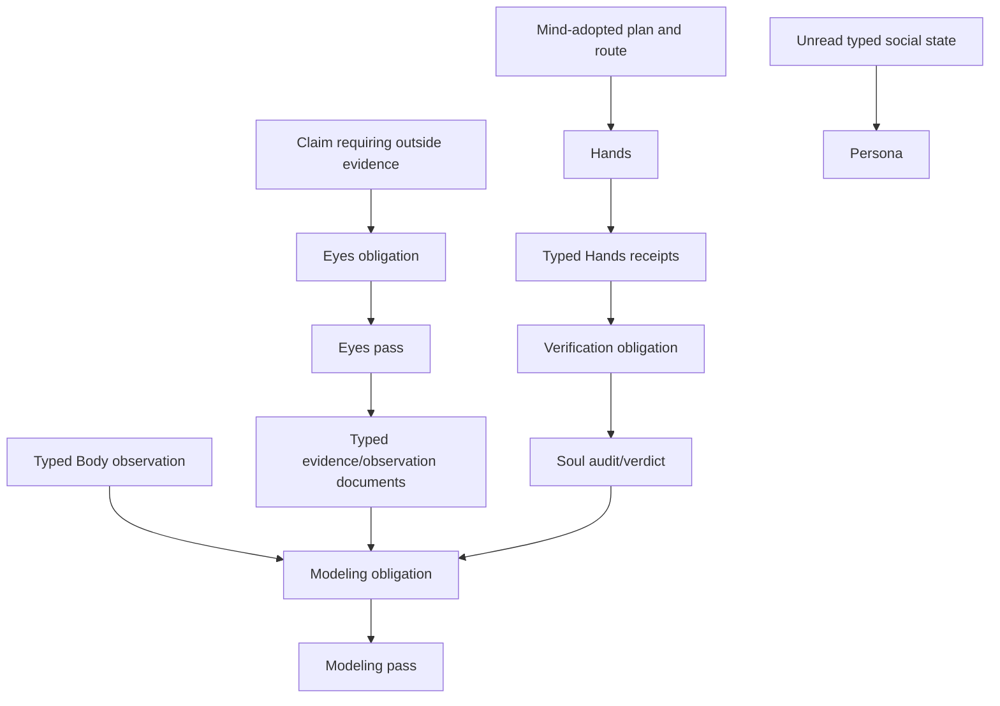

# Epiphany current algorithmic map

Updated: 2026-08-23
Latest committed implementation cut: `104bf390` on `codex/epiphany-shakedown-live`
Current worktree cut: canonical map/evidence sync; Ox17 remains paused

This document describes the live machine. Historical cuts, rejected paths, and
proof chronology belong in git, `state/ledgers.msgpack`, and bounded smoke
artifacts.

## Objective

Epiphany is a native typed organism whose durable decisions can answer one
question without consulting a transcript:

> What exact typed state and governed observations was this pass reasoning from
> when it produced this decision?

CultCache is the decision-bearing substrate. CultNet/CultMesh carry typed
projections and crossings. Each organ's typed CultNet contract factory is the
sole author of its contract directory; local Verse summaries derive directly
from those contracts and no parallel CultMesh contract documents are persisted.
The fixed three-Verse trust policy and public-room directory are also direct
local Verse projections; they are not written into CultCache as counterfeit
mutable state.

CultMesh contains no JSON-derived operator snapshot, coordinator receipt,
Hands gate, role-review event, unauthenticated Odin/Eve provider row, or daemon
tool directory. Native runtime and keyed Mind receipts remain the owners; old
stores containing the deleted envelope types refuse at the schema boundary.
Persona speech decisions and Weksa lowering receipts likewise remain in their
own typed owners; CultMesh does not persist unused parallel shadows.
Operator intent/completion and Hands consequence flow are also read from their
native runtime and Mind owners. The local Verse has no operator-run or generic
work-loop telemetry shadow and prompt assembly has no branch that depends on it.
Repository work likewise has no CultMesh overview, readiness, map-entry, or
public-proof aggregate. Keyed Mind/runtime documents own the underlying work;
an unused aggregate cannot become an interface merely by round-tripping. The
unused service-execution audit and Bifrost artifact, metrics, and public-proof
receipt families are deleted with the tests that alone called them.

Worker launches carry one typed launch document, its exact output contract, and
the sealed reasoning projection that owns model input. They do not carry a
generic organ dependency matrix or prose receipt catalogue. Family admission
owners derive exact dependencies from typed state; no universal "every organ
depends on every other organ" prompt cargo can make Eyes gate Modeling or make
a decorative list impersonate transaction authority. Persona projects exact
social, memory, and Body inputs without that fiction.

The operator surface has no unconsumed view-lens registry, legacy acceptance
bundle builder, test-only raw-JSON result interpreter, or second CRRC
recommendation algorithm. Typed runtime-result interpretation remains shared by
current work and reorientation. The keyed status composer is the sole CRRC
recommendation projection; its DTO does not confer routing authority.

Status projects only Mind identity, exact current work, one coordinator
action/reason pair, and operator-readable role lanes. It has no nested duplicate
`view`, inert auxiliary mode, ignored arguments, fixed synthetic jobs, second
scene/planning Mind, or result/tool/pressure tableaux. Exact `2ce91461` and
`78836f3b` remove 2,241 net lines and sixteen tests that guarded duplicate
projections, unreachable pressure routing, manifest strings, or prompt keywords
rather than a live consequence. Core 356/356, status 1/1, coordinator 8/8, and
release construction 19/19 pass. The operator thought-sealing boundary remains
tested.

The schema registry contains no `epiphany.surface.*` families. Exact
`f10f7fb3` deletes the final twelve schemas and ten catalog entries after a
producer/consumer audit found no live owner on either side; several still
claimed global revisions or artifact-directory state. The publication index
contains zero surface documents. Persona's portable state
remains `gamecult.persona_state.v0`; Eve/CultMesh providers retain their own
typed contracts.

Exact `ab3cacfb` reduces the local catalog to twenty-three live or portable
contracts. Thirty-one producerless RepoWork, operator-run, generic intent,
swarm, Persona-artifact, Rider, and Unity schemas are gone. Runtime sessions are
read-only lifecycle state; no generic session intent or swarm receipt is
advertised. Brokkr owns Unity capabilities through CultMesh/Eve, and a future
Rider daemon owns Rider. Epiphany has no editor-specific command organ.

The same cut removes the callerless `prompt_context` module and the
specialist-prompt TOML loader. Their public APIs had no production consumer and
their four tests were their only population. Live agent passes assemble sealed
typed reasoning projections and exact native/provider requests directly; no
parallel freeform context renderer survives.

Exact `16d85b1b` removes the six direct JSON-builder tests from
`agent_launch` and two OpenAI-runtime self-source searches. Strict provider
lowering, typed ingress refusal, runtime-owned identity derivation, and Mind
admission remain the behavioral owners; implementation spelling and duplicate
schema field inspection do not.

Exact `06f93f70` removes the test-only inverse OpenAI-to-native request mapper.
Provider requests are derived internally from canonical native requests in
tests as well as production; no fixture may manufacture native ancestry from a
caller-authored provider document.

Live providers own their CultMesh/CultNet schema catalogs. Exact `03140a47`
deletes the standalone runtime-spine CLI, its callerless Hello/catalog writers,
and its hand-maintained mutation-contract mirror. Runtime status and model
preflight derive accepted document types from the same CultCache registration
that opens the Mind store. The typed runtime documents remain; a command-line
facsimile no longer impersonates their service owner.

Coordinator status is a core projection, not a second program. Exact
`500125d5` deletes the unconsumed packaged status CLI and moves the functions
the coordinator actually calls into one `epiphany-core` module. Operator-safe
lowering remains tested; command parsing, file output, and duplicate compilation
do not.

Persona's consequence membrane is typed, not lexical. Exact `63939fa2` removes
the keyword tribunal that rejected projector prose for looking like JSON or
containing action-shaped words. Projector and Persona outputs remain sealed
private stage results. The Interpreter's closed effect enum, allowed-channel
set, cardinality and size bounds, exact decision context, and Mind admission
own consequence safety. Prompt-substring tests do not.

Tests must falsify an owner or consequence. Exact `bf2f39eb` deletes an
identical-call causal-ID tautology and a duplicate unknown-field check for an
extinct generic patch. Exact family lifecycles and runtime-owned identity
substitution remain the behavioral proofs.

Exact `104bf390` deletes two public-source tests that supplied no additional
protection: one duplicated the canonical immutable-GitHub parser tests already
owned by `epiphany-core`; the other was permanently ignored, network-dependent,
pinned to historical source, and asserted only that README prose contained the
project name. The bounded public-source transport remains production code; its
identity law remains tested once at its owner.

Persisted cluster topology is also gone. Its writer became dead when the
callerless seed bundle was removed, while the supervisor merely accepted any
nonempty subset of seven fixed keys as “bootstrap” without authenticating Body
domain, completeness, or runtime binding. That was a sentinel, not topology
authority. Supervisor admission continues through exact store/runtime identity,
packaged release, brake, service policy, process identity, and signed health.

Exact `203bcc41` separately deletes the producerless Bifrost body-change/GitHub
publication contracts and projections. Bifrost owns its real Persona
feedback/delivery stores and signed crossing receipts; Epiphany consumes those
provider-owned documents instead of publishing a substitute protocol. The two
specialized projector policy writers remain the only writers for their actual
local service policies; no test-only generic writer recreates that path.

Hands does not advertise a pull-request receipt it cannot produce. Exact
`11d99de1` deletes `HandsPrReceipt`, its registration, dead test-only writer,
read path, relinquishment check, exports, and contract claims. Local Hands
authority ends at exact patch, command, and commit consequences. A real remote
publication result enters as provider/Bifrost-owned evidence rather than an
Epiphany-authored facsimile.

Tool discovery also has no free-floating capability registry. Exact `beb9fd32`
deletes `EpiphanyToolCapability`, its constructor/registration/contract row,
standalone schema, catalog entry, and smoke-banner claim after finding no live
producer or consumer. Exact tool definitions sealed into model requests plus
runtime execution bindings and governed invocation receipts own the actual
path. The catalog retains tool intent/receipt and drops to 42 schemas.

Continuity publishes only the document it owns. Exact `ca2d2cf2` removes packet,
compaction-checkpoint, stale-turn-repair, and refusal contract rows that had no
typed documents or runtime path. Reorientation still emits the exact persisted
`ContinuityRecoveryReceipt`; compaction and handoff remain native state
physiology rather than advertised CultNet fiction.

Soul likewise publishes only its real result. Exact `f8974d52` removes generic
verification-request, invariant-check, regression, review, and refusal contract
rows that had no typed documents or runtime path. The keyed repo-frontier
verification request owns the live obligation, and `SoulVerdictReceipt` owns the
persisted audit result consumed by Modeling/Mind.

Eyes publishes only concrete observation evidence. Exact `201fa192` removes
generic evidence-request, review, and refusal rows that had no typed documents
or runtime path. Authenticated source lookup receipts prove what was inspected;
the typed research decision becomes the exact persisted evidence packet consumed
by current work and Modeling.

Idunn deployment truth is not mirrored into invented Epiphany-local envelopes.
Odin/Idunn owns `gamecult.idunn.deployment_manifest.v3` and signed daemon-health
admission. Cross-repository inspection found no producer for Epiphany's former
v0 deployment and aftercare DTOs; Epiphany had no writer, test, or consumer for
them. Those schemas, registry entries, context fields, loaders, and key helpers
are deleted rather than advertising a crossing that never existed.

Exact `856648de` completes the daemon and derived-cache subtraction. Epiphany
owns no local daemon supervisor, semantic-memory projector, workspace-coverage
projector, managed-service policy, projector lifecycle/heartbeat/recovery
mirror, or Qdrant/Ollama/Postgres cache configuration. Idunn owns deployment and
daemon survival; signed Idunn health is the operational receipt. Eve/CultMesh
may project that provider-owned state, but Epiphany does not mirror it into a
second writable authority.

Exact `30c66080`, `008bd493`, `7e16e758`, and `3312880e` close the remaining
generic command entrances, legacy lifecycle lineage, finite/fallback launch,
and caller-authored supervisor identity. Exact `afb223da` deletes two more
implementation-mirror tests and the wrapper created to animate one of them,
then advances managed-service policy to v1 without fixed owner prose,
`restart_mode`, unused backoff, decorative update time, or notes. Historical
policy rows refuse at the load boundary. Exact `ffe707ff` deletes the global
lifecycle latest mirror, history scan, timestamp election, local-Verse slot,
and their two self-referential tests. Each service now has one exact current
receipt head; same-service concurrent replacement conflicts atomically.

The five remaining supervisor tests guard lifecycle brake scope, Windows Task
Scheduler argv integrity, all-or-none Idunn signed-health identity, stale child
process identity/PID reuse, and heartbeat freshness plus lifecycle correlation.
Tests that merely format bytes, call a match arm, round-trip a brake, or preserve
a display/history mirror are gone with the production scaffolding they excused.

The earlier supervisor reductions established that Idunn on Yggdrasil is the
deployment and daemon-survival owner. `856648de` deletes the remaining local
spawn, process-identity, heartbeat, and recovery implementation instead of
keeping a parallel physiology alive for two cache processes that no agent used.
The model-provider boundary explicitly selects a
typed provider dialect and internally derives the exact provider request from
the canonical native request. OpenRouter/Ox is the current Yggdrasil provider;
Codex-derived code remains only where an OpenAI provider needs its earned
authentication or transport. Neither owns Epiphany Mind, scheduler, route, or
interface authority.

## Canonical authority map

| Owner | Inputs | Outputs | Invariant |
|---|---|---|---|
| keyed Mind documents | typed semantic documents keyed by logical identity | deterministic `EpiphanyMindView` | There is no persisted aggregate Mind head or global revision. |
| `reasoning_context.rs` Mind commit owner | invariant-owned strong reads and complete typed writes | atomic batch CAS plus `EpiphanyMindCommitReceipt` | Disjoint identities merge; same-identity or changed-strong-read conflicts refuse without partial mutation. |
| runtime bootstrap | immutable runtime identity envelope | exact identity strong read plus keyed session/job/launch writes | Worker launch replays the original identity and existing session envelopes byte-for-byte; it cannot refresh a singleton timestamp or capability mirror and thereby serialize unrelated work. Native runtime kind and supported document types are derived for CultNet publication. |
| concrete family admission owners | sealed decision context, exact family request/result chain, affected semantic documents | one family-specific `MindMutation` | The model cannot choose which stale state is safe to ignore. |
| `current_work.rs` | keyed Mind view and exact runtime request/job/result/decision families | pure family scheduling and continuation projections | Events, timestamps, role lanes, and thread provenance cannot create or suppress work. |
| coordinator policy/status | keyed Mind presence, exact current work, and the accepted continuity decision | one action/reason pair plus operator-readable role lanes | Coordinator presence is derived; no mutable coordinator head, pressure tableau, or duplicate policy wrapper exists. |
| runtime worker attempt owner | immutable launch, exact process claim, typed result, job result, archival evidence | one terminal attempt authority | Scheduling, process liveness, and semantic admission remain distinct authorities. |
| model-provider boundary | sealed native model request plus explicit provider configuration and injected credential | exact internally derived provider request and transport result | Provider selection cannot author a second request truth or admit Mind state. |
| OpenAI Responses schema projector | full native typed output schema | one provider-legal strict generation schema | Provider formatting preserves useful supported constraints but never replaces native decoding or Mind admission. |
| model-pass terminal owner | sealed reasoning basis/context and typed failure class | exact transport closure plus `EpiphanyModelPassFailure` and terminal session/event in one batch CAS | The caller cannot nominate a job/session; the context-derived binding closes role, reorient, and Persona failures without granting generic transport results decision authority. |
| Substrate Gate | exact worker/job authority and requested operation | scoped grant or refusal | Access permission does not admit Mind state. |
| Eyes | explicit external-evidence obligation plus governed source receipts | typed evidence packet and Mind observations | Eyes gathers outside evidence; it does not gate Modeling over the Body. |
| Modeling | Body basis, keyed RepoModel view, verified consequences, and explicit proposals | typed graph/frontier mutations | Modeling processes the Body directly and owns no external-source permission. |
| Hands | adopted route/plan plus exact capability receipts | typed consequences | A claimed intention is not a consequence. |
| Soul | exact consequence and invariant/evidence obligations | verification audit or refusal | Work is not true merely because it ran. |
| Persona | unread typed social/relationship state plus exact Persona projection and one explicit service turn budget | typed effects, speech intent, consequence receipts, or exact typed failure | Persona owns its outer pass deadline; provider transport owns no competing timeout policy, and Persona work cannot block unrelated Hands or Modeling documents. |
| Brokkr / editor providers | provider-owned editor capability documents and exact receipts | typed CultMesh/Eve observations and governed actuation results | Epiphany does not own Unity or Rider bridges. Brokkr owns Unity; a future Rider daemon owns Rider. |
| CultMesh/Eve | typed provider-owned documents and deterministic views | private/local/public projections | Visibility and rendering never create authority. |

External lifecycle boundary: Idunn remains available when Epiphany is missing,
failed, or braked. Epiphany's swarm brake is an input only to an Idunn
transaction that changes Epiphany's deployed body; it cannot gate Idunn startup,
self-bootstrap, observation, same-release recovery, or another target's
lifecycle. The persisted Epiphany brake survives that recovery and continues to
block cognition/consequence ingress. Treating the target brake as a deployer
prerequisite reverses the owner and creates an unrecoverable cycle.

Idunn's CI/CD loop also owns the source-change path on upgraded Yggdrasil:
observe pushed commit, compile, test, construct the exact release, admit/deploy
it, and publish service-health receipts. Starfire is an operator/source body;
it does not run a parallel release build when Idunn owns the same change.

## Canonical Mind

The runtime Mind `.cc` is the sole decision-bearing store. Other `.cc` files
may own physiology or external transport, but facts from them must enter Mind as
typed observations or receipts before an agent pass consumes them.

Singleton semantic identities:

- objective;
- focus;
- mode;
- RepoModel identity/body binding.

Keyed semantic identities include subgoals, invariants, evidence, observations,
checkpoints, planning items, Persona memories and social reads, Hands receipts,
Verification audits, and RepoModel domains/nodes/edges/summaries/frontier/
lifecycle receipts/per-claim obligation guards.

`EpiphanyMindView` and `EpiphanyRepoModelView` are deterministic assemblies of
exact envelopes. Their projection digests identify a view for audit/display;
they are not mutable authority revisions.

Deleted authority:

- `EpiphanyThreadStateEntry` and `EpiphanyThreadState`;
- `coordinator_state_transaction` and generic state-update services;
- generic coordinator launch/accept/interrupt requests;
- global `expectedRevision` and worker-launch `stateRevision`;
- aggregate prompt, freshness, and graph-context surfaces;
- aggregate RepoModel persistence and global model revision/hash causality.

There is no dual reader, bootstrap aggregate, migrator, or compatibility write
path.

## Reasoning audit path

```mermaid
flowchart LR
    S["Exact typed Mind envelopes"] --> B["Sealed EpiphanyReasoningBasis"]
    B --> N["Final native model request"]
    N --> P["Internally derived provider request"]
    P --> T["Governed tool intents and receipts"]
    T --> C["Sealed EpiphanyDecisionContext"]
    C --> D["Typed terminal decision or pass failure"]
    D --> M["Invariant-owned MindMutation"]
    M --> R["EpiphanyMindCommitReceipt"]
```

The sealed basis contains pass/organ identity, projection-policy version, exact
source document versions, immutable Body basis where applicable, and a closed
typed reasoning-projection variant.

The terminal context contains the exact basis ID, exact final native request,
the exact internally derived provider request, and ordered governed tool
intent/receipt versions actually supplied to the pass.

Provider credentials remain deployment-substrate inputs. Yggdrasil injects the
OpenRouter key through systemd `LoadCredential`; readiness is checked inside
Resident Self's mount namespace. The key is neither prompt cargo nor Mind state.

Persona and worker passes use the same provider boundary but keep family-owned
execution budgets. Workers already wrap the complete typed pass in their outer
budget and therefore lower provider transport with no independent request
timeout. Exact `3b958a83` gives Persona the same ownership shape through its
explicit `--turn-timeout-seconds` service input, defaulting to 600 seconds. The
inner provider transport receives no second timer. Provider-specific error text
is also removed from the shared transport failure surface.

Structured decisions are authoritative; token streams and assistant deltas are
optional retention. A model-backed failure is also a typed terminal decision
record. Generic diagnostic model runs cannot produce Mind-admissible decisions.

Current migration boundary: the typed basis/context foundation, concrete Body,
frontier, Research, Verification, Planning, Reorientation, and Persona paths,
plus worker/session/Persona archive reachability are landed. Exact `f8412b69`
adds one read-only context-ID audit projection and deletes the digest-only
worker archive: the typed role and generic terminal result family now survives
retention, and runtime schema v2 refuses the earlier writable shape. Exact `f7948795`
deletes `MindGatewayReview`, `MindStateCommitReceipt` v0, the generic Mind
interpreter prompt, and their false CultNet mutation mouths. Exact `e0e75a30`
deletes the residual aggregate-shaped role patch, its parser, and its
family-policy tribunals. Research now authors one closed typed decision whose
admission owner derives keyed Mind writes; the unowned generic Imagination
planning patch is gone. Exact `1c9aafd8` seals one decision context before model-backed
frontier-Planning failure terminalization and binds both the typed faculty
failure and generic job result to it. Shared runtime validators own the
store-backed model/tool refusal matrix used by both execution and sealing.
Exact `553f79d9` gives every role and Persona pass one shared Responses dialect
compiler. The provider sees a closed, generation-useful subset; native typed
decoding still sees the full schema and alone decides whether a terminal
decision can enter Mind. Provider success therefore cannot launder malformed
semantic output.

Exact `a8f3c1f0` makes the authenticated runtime Body route own initial
RepoModel binding. Bootstrap derives the keyed model identity from the admitted
Body observation instead of confusing Git source identity with Body-store
identity, and `initialize_keyed_repo_model` independently refuses a seed whose
runtime, swarm, workspace, or Body-binding digest disagrees with the live
route. The refusal is whole-store byte-identical. Later Modeling decisions
remain bound to their exact observation version and are never rebased.

Exact `bb823c54` adds one shared failure terminal owner after a native
provider refusal exposed split Persona closure. The failure cites the sealed
basis/context and exact model request; runtime derives the exact transport
binding from that context and atomically closes a still-live transport job plus
the exact model session. Role, reorient, and Persona failures use that same
owner; a generic transport result remains physiological and carries no decision
context. Persona re-entry first consults the typed failure, so failure cannot
resurrect inference. Successful Persona turns close only after their effect
document and terminal receipt exist. Runtime execution opening and context
sealing both derive provider requests internally from native requests; the
caller-authored provider-request entrance is deleted. A native negative replay
proves transcript-free audit plus byte-identical runtime/heartbeat restart.
Reorientation's family admission additionally requires the exact canonical
model-pass failure; a generic failed worker result plus context cannot mint a
Continuity failure decision. Exact failure replay includes the terminal time,
and audit/lookup revalidate the failure against its runtime model binding.

## Concurrent Mind mutation

Each concrete invariant owner builds a `MindMutation` containing exact decision
context, exact strong-read envelopes, exact inserts/replacements, its invariant
owner identity, and an atomically written commit receipt.

Merge law:

1. Different document identities merge regardless of commit order.
2. Distinct inserts merge.
3. Same-identity byte-identical replay returns the original receipt.
4. Same-identity divergent writes conflict.
5. Changed strong reads conflict before mutation.
6. Observational-only source changes do not block an unrelated mutation.
7. Multi-document invariants commit entirely or not at all.
8. Model output is never silently rebased; conflict creates fresh work.

Collection members therefore remain separate CultCache identities. Shared
vectors and mutable global heads are forbidden because they manufacture false
conflict between Persona, Hands, Modeling, and Verification.

There is no derived semantic cache authority. Modeling consumes the exact typed
Body and keyed RepoModel projection directly. Persona consumes keyed Persona
memory and typed social state directly. If a future retrieval provider earns a
place in a reasoning basis, its exact observation and receipt must enter Mind
as typed evidence; it may not grow a parallel mutable head.

## State-driven work

Coordinator priority is a pure projection:

1. missing keyed Mind preparation;
2. exact Reorientation work;
3. Resident pressure;
4. explicit operator regather;
5. exact Planning/PlanMind work;
6. Proposal, Body, or verdict Modeling work;
7. Verification work;
8. explicit external-evidence Research work;
9. exact consideration families;
10. Hands work;
11. otherwise await a frontier proposal.

No default Modeling job, latest lane, accepted-at comparison, runtime event, or
generic interrupt can manufacture work.

There is no persisted generic runtime-event document. A runtime session or job
owns its own lifecycle state; `EpiphanyRuntimeJobResult`,
`EpiphanyModelPassFailure`, `EpiphanyCoordinatorRunReceipt`, and
`EpiphanyCoordinatorDeathRecovery` own their exact terminal facts. CultNet and
operator views derive display from those documents. No paired event may become
a second terminality, archival, replay, or recovery authority.

```mermaid
flowchart TD
    Body["Typed Body observation"] --> MO["Modeling obligation"]
    MO --> Model["Modeling pass"]
    Claim["Claim requiring outside evidence"] --> EO["Eyes obligation"]
    EO --> Eyes["Eyes pass"]
    Eyes --> Evidence["Typed evidence/observation documents"]
    Evidence --> MO
    Plan["Mind-adopted plan and route"] --> Hands
    Hands --> Consequence["Typed Hands receipts"]
    Consequence --> Verify["Verification obligation"]
    Verify --> Audit["Soul audit/verdict"]
    Audit --> MO
    Social["Unread typed social state"] --> Persona
```

Eyes may create evidence that creates Modeling work. Eyes acceptance never
suppresses or authorizes ordinary Body Modeling.

Each simple unresolved model-pass family embeds one
`EpiphanyAgentPassAttemptProjection`: continuation action plus the exact latest
runtime job identity when one exists. Body, proposal and frontier-verdict
Modeling, Verification, consideration, admitted-direction consideration, and
Reorientation use that shared shape. Research and the two-stage Planning
workflow retain their full exact lifecycle projections because they carry more
than one pass stage; current-work may not crush them to an action or stage enum.

The typed family obligation and exact attempt/lifecycle together form current-work
identity. A failed or cancelled attempt therefore changes the projection digest
and permits one fresh Resident Self pressure/grant; replaying unchanged failed
state remains idempotent. Proposal attempt ordinals are canonical and
contiguous, and all older attempts must be terminal. No retry counter,
timestamp comparison, coordinator receipt, or event acquires scheduling
authority.

## Runtime and attempt lifecycle

These are distinct authorities and must not be collapsed into one state enum:

- Resident Self owns typed pressure, exact grant creation, prepared and active
  launch exclusion, coordinator lease, settlement, cooldown, retry, terminal
  receipts, and bounded lifecycle retention.
- Coordinator process owns its incarnation receipt or exact-death closure.
- Runtime worker attempt owns immutable launch, process claim, activation,
  typed result, job result, and terminal attempt classification.
- Mind owns adoption of a successful structured family result.
- Retention owns deletion only after all live authorities are terminal.

The attempt aggregate centralizes exact request association and typed terminal
classification. Archived fulfilled attempts must retain recoverable decision
authority, not merely an ID/digest tombstone.

The heartbeat scheduler does not exist. Resident Self directly selects the
oldest pending pressure when no grant, prepared launch, or active lease exists.
Grant creation consumes that exact pressure through one batch CAS. Terminal
settlement writes the final receipt and terminal grant state atomically; there
is no acknowledgement consumer, scheduler history, pacing head, stale repair,
or cross-store reconciliation loop. A loop iteration is physiology only and
authors no state when there is no unresolved obligation.

Persona owns a separate keyed social corpus. Each mention, immutable turn
request, terminal receipt, quarantine record, retention head, and retention
plan has its own CultCache identity. The Persona daemon derives an exact request
from pending mentions, reserves them through batch CAS, and cites that request
envelope as the observed source of its admitted pass input. Failed turns make
the mention pending with the terminal receipt bound into its next deterministic
request identity. Resident Self cannot launch, block, or terminalize Persona
work.

## RepoModel projection

RepoModel persistence is keyed by semantic identity: identity/body binding,
seed-owned domain, node, edge, frontier, and per-node claim-obligation guard.
Domains cannot be model-mutated. The producerless summary and lifecycle-receipt
families are deleted.

`EpiphanyRepoModelView` sorts and assembles those documents. Frontier dependency
and cycle checks include the exact reachable closure in strong reads. Per-node
guards make node retirement versus concurrent frontier targeting physically
conflict without serializing unrelated graph writes.

Each Modeling basis assembles the complete current keyed RepoModel view from
exact document versions and authenticates those versions through their owning
Mind commit receipts. There is no aggregate model revision, semantic projector
DTO, workspace-coverage readiness gate, or cache work item. Currentness is the
exact source-version set sealed into the reasoning basis.

## External and social facts

- Repository Body bytes enter through typed observations and exact digests.
- Immutable public Git content may remain external, but its canonical identity,
  digest, governed receipt, and exact observed excerpt enter Mind.
- Social reads enter as typed Persona observations before cognition.
- Crossings own transport and signed receipts; they never impersonate local
  cognition or Mind admission.
- Content-addressed artifacts may remain external, but the exact identity and
  decision-bearing excerpt/version are stored in the basis/context.

## Retention

Preserve reasoning bases, decision contexts, structured terminal decisions and
typed failures, Mind commit receipts, Persona effects, speech/consequence
receipts, and their direct context links.

Runtime retention may remove SSE frames, deltas, intermediate requests,
provider events, and tool scaffolding only after the terminal context is sealed
and the retained decision can still reach its basis/context without them.
The v1 worker-attempt archive embeds the exact typed role result and its
context-bound generic result family. The read-only decision audit consumes the
same durable records before and after archival.

## Verification and open gates

Accepted through the local `5b799b12` source boundary:

- core library `494/494`;
- OpenAI runtime library `26/26`;
- model-runtime binary `13/13`;
- coordinator binary `12/12`;
- swarm binary `10/10`;
- core and OpenAI runtime libraries compile natively through the shared target.
- authenticated Persona re-entry refuses naked typed input, performs no
  external observation or model call, and preserves the exact three-stage
  decision chain;
- reopened current-work projection is identical and byte-for-byte read-only at
  Launch, Wait, Review, completed, and post-Research boundaries; failed Body
  and proposal attempts change exact identity, receive one fresh grant, and
  identical failure replay cannot mint another pressure. Proposal retry then
  advances to the canonical next attempt.
- a structurally valid model result whose family mutation is semantically
  refused writes one exact typed admission-refusal document and commit receipt,
  changes no RepoModel graph document, and schedules a fresh attempt. Body,
  proposal, frontier-verdict Modeling, and frontier Verification share this
  refusal lifecycle without sharing semantic mutation ownership;
- proposal retry receives the ordered exact prior refusals. Claim/node
  identities cannot masquerade as frontier dependency identities in the output
  contract. Successful model transport remains distinct from Mind admission;
- `repository_scope` is now the explicit sorted repository-relative ceiling for
  future Planning and Hands consequences. Inspected files and evidence sources
  remain separate audit cargo. The shared RepoModel validator refuses invalid
  routed scope before any keyed graph document is written; Hands receives only
  the adopted narrowing as `authorized_paths`;
- `epiphany-model-runtime audit-decision` reconstructs an exact terminal pass
  from typed durable records only; the query is byte-for-byte read-only and
  remains complete after live worker result retirement.
- exact source `5f66d6c9` adds `epiphany-model-runtime list-decisions`, a
  deterministic read-only index of contexts whose terminal audit chain already
  validates. It omits sealed nonterminal pass physiology and cannot author or
  admit state.
- exact `ab321b34` adds explicit OpenAI/OpenRouter transport lowering while
  preserving the native request as the only canonical request. Exact
  `c1a6034f` keeps read-only physiology alive under the brake; exact `6b44b4d3`
  emits Idunn's shared signed-health schema.
- exact source `d2ca66301fb6af4e7d2d27fff0b772b0f0fccdf4` passed Idunn's native serialized
  Yggdrasil workspace gate under test receipt SHA-256
  `de0fc6b360ce03493b13208d917dc8349801f03364617d966152c85846c47482`
  and is deployed as 26 binaries plus witness in release
  `sha256-46407552b4a0937f63d2b7f2bd09a1dacb89d671a6e3807c97209159541aef06`.
- source `9b9b5c85` separately passed Idunn's native Yggdrasil gate under exact
  test receipt SHA-256 `6c6a71359f8c31297419665d2872f6982a89f84e197d71fc5b36a7fc86216093`
  and remains a sealed immutable package. A foreign-target helper interrupted
  candidate deployment; exact rollback restored d2ca and prevented false
  admission. Production units are inactive and deployment.env is absent;
- Mind epoch v4, runtime spine v7, and RepoModel epoch v2 refuse prior writable
  stores without mutation or a dual-read path.
- Persona production source has one outer turn deadline, no hidden provider
  request deadline, and focused provider/runtime suites pass.

Open before Model Atlas Gate 1 resumes:

1. let Idunn compile, test, and seal exact build-affecting source `5b799b12`;
2. use that exact package in private fresh-store Ox17; stop after three
   provider failures total, and prove direct Body Modeling, typed
   refusal-to-retry if exercised, Hands through Verification, exact context
   audit, and restart/re-entry without public speech;
3. only then restart Model Atlas Gate 1 from a new
   external root.

Ox10 is preserved failed evidence under
`/var/lib/gamecult/epiphany/capstones/ox10-470d4cb5`. It proved the direct
Body route and exact failure sealing, then failed closed when Ox emitted a
duplicate `tension` field and three Persona projector connections timed out.
The malformed Modeling result made no Mind commit. The run also falsified the
old Body retry projection: its failed job was omitted from current-work
identity, so Resident Self saw no new pressure under the old schema. The run is
braked, all transient units are inactive, and it must not be resumed or used
as accepted capstone state.

Ox12 is historical evidence under
`/var/lib/gamecult/epiphany/capstones/ox12-84a7dec1`. Exact `d2ca6630`
successfully recovered an orphaned worker, ran direct Body Modeling without
Eyes, admitted the Body decision, and completed admitted-direction Imagination.
After one typed empty-provider failure, exact `9b9b5c85` launched canonical
attempt 1 and OpenRouter returned a structured result. That result confused
RepoModel claims with frontier dependencies, so mutation admission correctly
refused the absent dependency and changed no graph document. Exact `e046a4d1`
makes that refusal durable and retryable. Its epoch cut means Ox12 remains
inactive and must never be resumed.

Ox13 is historical evidence under
`/var/lib/gamecult/epiphany/capstones/ox13-85061129`. Exact `85061129` passed
Idunn's full Yggdrasil gate, then the fresh root launched Persona concurrently
with direct Body Modeling and no Eyes result. Body Modeling and Imagination
admitted. Proposal Modeling attempt 0 completed but repeated the claim/frontier
dependency mistake; exact `e046a4d1` wrote a typed admission-refusal document
plus commit receipt and minted attempt 1, which then completed with corrected
semantics. The transcript-free audit for attempt 0 is retained at
`proofs/proposal-attempt-0-audit.json`, SHA-256
`b8346c676a0aedadc9004620a28479a2dddd63a3bca487a952177e8aee6ba36a`.
Persona exposed a separate split timeout owner: its provider transport still
hardcoded 90 seconds while workers used one outer 600-second budget. A stop
race allowed four exact projector failures, all context-bound and carrying no
Mind commit. No Hands mutation or public speech occurred. Ox13 is braked,
inactive, and must not resume. Later fresh roots run Persona without a systemd
restart loop so provider failure counts remain exact.

Ox15 is historical fresh-store evidence for the Persona deadline cut. Persona
no longer failed at the old inner transport timer, but the repository lane
exposed a stale-currentness mistake in proposal handling. That fault was cut by
making historical proposal direction proof independent of later disjoint
RepoModel changes. Ox15 is sealed and must not resume.

Ox16 is historical evidence under
`/var/lib/gamecult/epiphany/capstones/ox16-749d977e`. Exact `749d977e` launched
direct Body Modeling without Eyes while Persona's projector/persona/interpreter
stages ran concurrently; no public delivery succeeded. Body and proposal
decisions survived later disjoint RepoModel changes as intended. Planning then
remained structurally unavailable because the admitted active Imagination
frontier carried inspected evidence paths as its supposed future path scope,
omitted the requested `OX-CAPSTONE.md` output, and was not lexicographically
canonical. The root frontier's `sourceScopeValid=false` generated dependent
proposal pressure, so the run was braked and sealed before a proposal forest
could grow. No Hands consequence or capstone marker exists. Exact decision
audit retained the typed Body result and context without consulting a
transcript. Ox16 must never resume.

Exact `5b799b12` makes the Ox16 diagnosis a hard schema cut rather than prompt
penance: `source_scope`/`sourceScope` are deleted, `repository_scope` owns the
future repository consequence ceiling, `authorized_paths` is the adopted Hands
narrowing, and the graph validator owns canonical scope admission. Mind/runtime/
RepoModel epochs advance to v4/v5/v2.

Historical c011 and partial Gate roots remain read-only. The pre-upgrade
Yggdrasil's old capacity/topology is obsolete; the upgraded 16-vCPU host is the
intended swarm and CI/CD body. Idunn owns the installed Epiphany source-change
path. The former Discord/Bifrost/VoidBot operator bridge and its deployment
gate are deleted; Bifrost remains Persona and governed-consequence transport.
The prior package is not capstone or service-health evidence.
Operational topology registration and
autonomous scheduling remain forbidden until their owning gates pass.

## Primary source anchors

- `epiphany-core/src/mind_documents.rs`
- `epiphany-core/src/reasoning_context.rs`
- `epiphany-core/src/current_work.rs`
- `epiphany-core/src/repo_model_documents.rs`
- `epiphany-core/src/runtime_worker_attempt.rs`
- `epiphany-core/src/runtime_spine.rs`
- `epiphany-core/src/resident_self.rs`
- `epiphany-core/src/reorientation_work.rs`
- `epiphany-core/src/surfaces/coordinator_decision.rs`
- `epiphany-core/src/surfaces/worker_launch.rs`
- `epiphany-openai-runtime/src/lib.rs`
- `epiphany-openai-runtime/src/persona_executor.rs`
