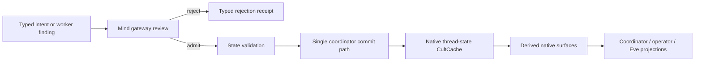

# Epiphany Current Algorithmic Map

## Heartbeat pulse-artifact retention ownership

- Owner: heartbeat Continuity owns retirement of its own closed `pulse-NNNNNN` artifact directories. Status display limits and Idunn process supervision own no deletion authority.
- Inputs: the canonical heartbeat artifact root, direct pulse directory sequences, exact recursive file manifests, the latest cognition artifact reference, a recent-pulse count, and a bounded retirement batch size.
- Outputs: a typed retention plan committed before deletion and a typed completion receipt after every planned directory is absent. Plans and receipts retain exact directory names, manifest roots, file counts, and byte counts without retaining private artifact bodies.
- Derived state: the active artifact count is bounded by recent count plus one hysteresis batch. The default 256 recent pulses and 64-pulse batch keep at most 320 active directories between retention runs.
- Forbidden writers: projection limits cannot masquerade as retention. Unknown directory names, symlinks, paths outside the canonical root, post-plan manifest changes, and the pulse containing the latest cognition artifact all fail closed before deletion.
- Shared paths: explicit `retain-artifacts` and every resident heartbeat serve outcome call the same plan/reconcile primitive. A crash after plan commitment resumes that exact plan; already absent members are accepted, while surviving members must still match their planned manifests.
- Cut line: the permanent one-directory-per-15-second growth path is removed. Process stdout/stderr logs remain a separate supervisor-owned rotation problem and are not deleted by heartbeat retention.
- Verification layer: synthetic CultCache-backed tests prove hysteresis bounding and idempotence, changed-plan refusal with preservation, unknown-directory refusal before deletion, and protection of the latest cognition artifact. Live backlog reduction waits for exact packaging.

## Runtime job and session closure ownership

- Owner: the worker runtime terminalizes its own outer role job and inner model job. Continuity owns runtime-session completion after every job in that session is terminal.
- Inputs: worker success, ordinary runtime error, timeout, and the session-local job set. Coordinator status is an observer of these typed documents, not a writer.
- Outputs: exactly one terminal job result per job, a `Completed` session, and one deterministic `session.completed` runtime event sourced from Continuity.
- Derived state: `*Running`, open-job count, and active-session count are projections. Adapter-status refreshes may change unrelated store bytes on restart and are not job authority.
- Forbidden writers: coordinator restart/status code cannot synthesize worker results or pretend a session closed. A repair loop cannot hide a dead worker. New jobs cannot enter a completed session.
- Shared paths: bounded and unbounded worker execution use the same result-sealing primitive; explicit session closure uses the same terminal-job predicate for coordinator, resident, and model-adapter sessions.
- Cut line: sessions no longer remain permanently active merely because creation was implemented before completion. Closure refuses any queued, running, or review-waiting session-local job; exact closure replay is idempotent.
- Verification layer: a byte-identical disposable copy of sealed v28 reproduced the dead Imagination job. Authenticated `55660d78` terminalized it as failed, restart could not create a second result, and the new Continuity primitive closed all four sessions from four active to zero while preserving sealed v28 unchanged.

## Proposal frontier routeability invariant

Proposal Modeling admission and Self planning selection now share one boundary:
an admitted frontier `source_scope` must be non-empty safe relative paths in
strict lexicographic ascending order with no duplicates. Modeling may normalize
proposal scope hints into that canonical form; it must not preserve arbitrary
serialization order. `runtime_repo_frontier_planning_eligibility` projects the
same predicate per active Imagination frontier, alongside challenge and
dependency blockers, so operator status describes the exact selector reality.

Proposal Evolution also requires `status=active`. Mind acceptance is the
proposal's admission decision; persisting it as merely proposed creates a dead
document that Self cannot select and proposal Evolution cannot revise. The
eligibility projection includes unresolved proposed Imagination frontier as a
diagnostic candidate with `statusValid=false`, but only active frontier can be
eligible. This projection observes the wound; admission prevents it.

Proposal Evolution also requires exact canonical routeable organ identity:
`Hands`, `Eyes`, or `Imagination`. The field remains a string in the portable
RepoModel, but Mind admission owns the executable subset and refuses lowercase,
unknown, or merely display-shaped labels. Planning eligibility includes a
case-mismatched Imagination-shaped legacy document only to project
`recommendedNextOrganValid=false`; it never case-folds that document into
authority. v25 proved why: lowercase `imagination` was admitted but invisible to
Self's exact selector.

Owner: Mind admission owns whether proposal frontier state may enter the model.
Self only selects admitted routeable state. `source_scope` is no longer assumed
routeable merely because its individual paths are safe. Invalid ordering is
rejected before mutation; no repair loop or selector exception may launder it.

## Coordinator cold start and source-regather ownership

- Owner: typed `UserObjectiveIntake` owns first objective/state creation. It is
  seed-only, atomic, idempotent for identical input, and refuses replacement.
- Eyes owns source gathering. An accepted CRRC `Regather` judgment becomes
  `RegatherManually`, which Self maps to Research; the continuity judge does not
  recursively relaunch itself after its judgment is accepted.
- Modeling owns Body mapping only after source inspection. Research, Modeling,
  and Verification share bounded repository read/Git tools; tool receipts are
  operator-safe evidence while direct thought stays sealed.
- Mind owns admission. Provider JSON Schema is a formatting projection, not
  authority. Canonical worker-result parsing, exact launch Body-basis replay,
  and Mind review/admission decide whether a RepoModel patch exists.
- The model may name additional evidence, but it does not own transport
  provenance. The OpenAI runtime adds the immutable request-chain reference to
  the typed role result before persistence. Mind still requires the admission
  review to bind that exact non-empty result evidence set.
- Derived state: status, role boards, and coordinator decisions read one
  canonical typed role/reorient result path. Display synthesis cannot remember
  a finding that coordinator signals forget, or vice versa.
- Forbidden writers cut: sibling-path local-Verse inference, fake checkpoint
  preparation, recursive reorientation after accepted regather, duplicate
  display/coordinator result readers, and JSON null treated as a state patch.
- Failure lifecycle: failed and completed-unreviewable results require an
  explicit supersession receipt before relaunch. Exact repeat is idempotent;
  conflicting acceptance authority is refused.
- Live shakedown evidence: the authenticated model runtime completed
  source-grounded Modeling passes with typed repository reads and emitted a
  reviewable Body-bound `repoModelPatch`. Admission remains the proof layer;
  prose summaries and successful model transport do not make the patch true.

## Observation and bootstrap authority correction (2026-07-12)

- Owner: diagnostics only project persisted CultMesh state; they never initialize it.
- Bootstrap owns static policy, topology, schema, brake, and organ-contract declarations. It does not own daemon liveness or provider availability.
- Daemons own heartbeat/status documents. Missing status produces no observed daemon row; declared targets remain separate and are never promoted to presence or `ready` by a reader or seeder.
- The provenance-free v0 Odin advertisement, Eve surface, and daemon-tool families are quarantined legacy vocabulary. Live provider directories return no rows from them; missing provider state produces no synthetic row.
- Forbidden writers removed in this pass: read-command calls to `seed_epiphany_local_verse_context`, loader fallback constructors, and bootstrap's default-ready daemon-status loop.
- Next authority cut: requester commands may author intents, but Bifrost, GitHub, tool providers, Eve providers, and daemon lifecycle owners must author their own response receipts.

## Declared topology versus observed presence (updated 2026-07-15)

- Owner of declaration: explicit bootstrap persists seven faculty routes, desired private-Verse addresses, and daemon/Eve targets as configuration.
- Owner of presence: a provider-authored daemon status/heartbeat is the only input that creates an observed daemon row.
- Outputs keep the distinction in their names: `declaredFacultyCount`, `declaredPrivateVerseRouteCount`, `declaredDaemonTargetCount`, and `observedDaemonCount`.
- Restart-policy sight may enumerate desired targets with `daemonStatus=unobserved`; that supports Idunn reconciliation but does not materialize a daemon.
- Prompt context labels topology as declared routes and targets. It cannot imply those addresses are inhabited.
- Forbidden substitutions: topology rows cannot become daemon or agent counts; daemon heartbeats cannot become agent counts; configured private-Verse ids cannot become active Verse counts.
- Cut line: the synthetic `unknown_daemon_status` constructor is deleted. A fresh bootstrap has seven declared targets and zero observed daemons; one persisted provider status yields exactly one observed daemon.

## Bifrost body-change request path (2026-07-12)

- Owner: the calling Hands/requester owns the body-change intent.
- Inputs: repository, branch, change summary, justification, changed paths, verification/review receipt references, authors, and credit subjects.
- Output: one persisted `gamecult.bifrost.body_change_publication_intent`; command status is `pending-bifrost`.
- Derived sight: requester-owned receipt-directory and publication surfaces show the pending intent and the absence of a provider response. There is no local Bifrost ledger or closure oracle.
- Forbidden writers: the requester CLI no longer constructs or writes Bifrost acceptance, ledger attribution, GitHub publication, PR, commit, publication URL, or credit receipts.
- Response owners: Bifrost may answer with its publication receipt; the GitHub publication adapter may answer only after real substrate evidence exists.
- Negative proof: after request submission, latest intent is present while latest Bifrost publication and GitHub publication receipts are absent.
- There is no Epiphany-local `bifrost-ledger` or accounting closure surface.
  Missing provider response remains missing with no local follow-up command.
  Provider closure requires a future authenticated provider ingress/admission
  witness; typed local document presence is insufficient.

## Daemon tool request path (2026-07-12)

- Owner: the requesting agent owns the invocation intent; the advertised host daemon owns the response receipt.
- Input: a persisted capability plus requester identity, requester cluster, payload reference, and bounded reason/summary.
- Output: one `epiphany.cultmesh.daemon_tool_invocation_intent`, status `pending-provider`, and the host daemon id as `responseOwner`.
- Unknown host status does not block request queuing and is never promoted by the requester.
- Forbidden writers: `invoke-tool` cannot accept or synthesize receipt id/status, result reference, or result summary; it no longer executes local readback functions and labels them daemon results.
- Negative proof: request intent persists, latest provider receipt remains absent, and response-shaped CLI fields are refused.

## Daemon lifecycle request and heartbeat paths (updated 2026-07-15)

- Owners: Self/operator requests intervention; Idunn owns poke intent, command-attempt receipt, restart policy, and backoff; `epiphany-cluster-daemon` alone owns its provider heartbeat/status envelope.
- Inputs: persisted provider status, the heartbeat observed before intervention, restart policy, scheduler staleness observation, and the real command result.
- Outputs: immutable poke intent/receipt v1 events plus an atomically advanced chronological latest pointer. Exit zero yields `awaiting-provider-heartbeat`; command failure yields `restart-failed`.
- Derived state: scheduler staleness, lifecycle attention, receipt-directory resolution, and Idunn backoff are observations of provider state and attempts. They are not provider status.
- Forbidden writers: poke callers and the supervisor cannot assign provider status, operator action, or `last_heartbeat_utc`; command success cannot mint `ready`; stale status cannot be resolved by a heartbeat older than the completed attempt.
- Shared paths: manual reconcile and scheduled reconciliation use the same attempt primitive. Both retain restart pressure until a provider-authored heartbeat causally newer than the completed attempt proves recovery.
- Cut line: the supervisor's provider-status writer and synthetic heartbeat advancement are removed. Generated attempts use unique identities; exact retry is idempotent, identity collision is refused, and delayed replay cannot rewind `latest`.
- Verification: the survival rehearsal preserves the provider envelope across two successful restart commands, observes two distinct awaiting receipts, then publishes a real provider heartbeat and proves receipt resolution plus failure-count reset.

## Provider discovery and heartbeat authority (updated 2026-07-15)

- Owner: `epiphany-cluster-daemon` owns only its liveness heartbeat/status envelope. No central process currently owns provider advertisement, Eve composition, or hosted-tool availability.
- Inputs: heartbeat accepts persisted topology identity and daemon-local liveness evidence. Topology `eve_surface_id` is routing/address metadata only; it is not proof that a surface exists.
- Outputs: heartbeat writes liveness only. Live Odin, Eve, and tool directories remain empty until a future provider-authored contract is admitted.
- Derived state: topology, labels, expected routes, and test-only templates may describe stable addresses and legacy shape. They cannot become provider presence, composition content, supported actions, or executable capability.
- Forbidden writers: generic bootstrap, heartbeat, query CLI, and central template builders cannot publish the provenance-free v0 Odin advertisement, Eve surface, or daemon-tool families. Live consumers ignore those families, and explicit bootstrap retires any stale rows of exactly those types.
- Cut line: `publish_epiphany_cultmesh_provider_state` and the heartbeat call to it are deleted. The seven centrally synthesized surfaces and their tool claims are no longer live state.
- Re-admission invariant: provider discovery returns only after an owning provider emits a provenance-bearing typed contract whose origin can be verified; actions additionally require a real dispatcher and receipt path.

## Persona feedback and typed Imagination consideration boundary (updated 2026-07-18)

- Eve is presentation only. Epiphany has no Eve connection intent or receipt
  document, writer, reader, prompt projection, query action, receipt-directory
  row, or tool claim. Presentation connectivity cannot admit feedback or become
  cognition authority.
- Daemon-tool invocation requests likewise remain pending until the advertised host daemon or authenticated ingest boundary supplies the typed response. Local response construction/writing/validation is test-only; aggregate smoke and receipt-directory projection prove intent-present/receipt-missing instead of manufacturing host acceptance.
- Idunn deployment and aftercare outcomes have no local production writer. The synthetic deployment-config family smoke and its green aggregate MVP-gate handoff are deleted; config audit/runbook remain pre-deployment surfaces, while typed Idunn readers await genuine daemon-authored ingest.
- Bifrost artifact-acceptance and metrics requests remain open until actual Bifrost/Maintainer receipts are ingested. The stale response-closing request-family smokes, accounting bundle, wrapper mode, and aggregate green gate are deleted.
- Repo-work readiness reports are sight only. The generic readiness-review approval command and writer are deleted because one caller supplied four unresolved reviewer labels. `repo.readiness_review_request` now assigns routing to Self, lists Maintainer/Soul/Mind/Bifrost as independent required reviewers, and names no readiness-approval owner; typed review readers await genuine multi-organ/provider evidence.
- Interpreter Brief is preparation cargo authored by Imagination from accepted public pressure. It requests Mind interpretation and remains `interpretation_admitted=false`; it is not Mind-owned state until a genuine Mind path supplies and admits interpretation evidence.
- Repo collaboration policy/topic files are proposals, not live social or renderer contracts. Imagination authors them, Persona owns discussion, Persona/Mind review policy, Mind admits repo policy, Bifrost owns publication, and requested public-room/Eve-surface identifiers remain unpublished until provider receipts exist. Epiphany does not own downstream Eve/TUI/GUI composition.
- The deterministic `repo.tool_capabilities` and `repo.eve_surface` safe families are deleted. Expected tool ids and invented surface/row/lowering catalogs cannot substitute for host advertisements or provider-published composition graphs. Live paths are typed tool requests/host receipts, Odin discovery, authenticated Bifrost feedback delivery, and provider-owned publication.
- `repo.body_manifest` is deleted. An unconsumed `epiphany.toml` that invents Body/Verse/Eve identity and capability hints is not observed runtime state or admitted birth configuration. Runtime state, repo birth receipts, and provider advertisements own those facts.
- Doctrine update requests split authority: Imagination authors, Self routes, Maintainer reviews, Soul verifies, Mind admits doctrine state, and Hands mutates `AGENTS.md` under receipts. There is no Maintainer/Mind composite owner or OR gate.
- Closure has no substring authority. Worklog, planning/checklist notes, managed/status sections, and task cards are explicitly presentation-only; closure relies on committed target/path/blob evidence instead of treating formatting text as Soul truth.
- Deployment requests split Self routing from independent Maintainer/Soul/Mind/Bifrost review and Idunn-only execution. Maintainer review cannot impersonate Idunn deployment; only Idunn deployment and aftercare receipts prove outcomes.
- PR requests split Self routing, Bifrost publication gating, Hands execution, and GitHub provider outcomes. GitHub receipt authorship does not grant publication-policy authority.
- Artifact acceptance requests split Self routing, Maintainer acceptance decisions, and Bifrost accounting. Acceptance receipts and accounting ledger rows no longer claim one composite owner.
- Metrics requests split Self routing, Bifrost accounting custody, and Maintainer review-load evidence. Spend/review receipts are observations and grant no spend or ledger authority.
- `repo.planning_brief` is deleted. It contained no candidate work-item records and let copied global catalog/schema/closure constants self-attest as per-item planning and readiness evidence. The live preparation chain is consensus draft -> interpretation request -> objective draft -> Mind adoption.
- There is no aggregate repo-swarm MVP gate. The former smoke manually aggregated fixture summaries into green rows and `demoReady=true`; it and its wrapper are deleted. Whole-organism readiness requires a live-fire path whose claimed consequences are observed at their owning boundaries.
- Bifrost owns authenticated Persona-feedback admission. Its signed packet is
  feedback-only pressure, not an Eve connection, Persona command, objective, or
  work proposal.
- Self owns an immutable Imagination consideration request binding one admitted
  feedback packet digest to one exact admitted Modeling revision/hash/receipt
  and one fixed question enum. Feedback prose is transported only as quoted
  evidence.
- Imagination owns a proposal-only consideration candidate with `suggest`,
  `hold`, or terminal `no_fit` disposition. The candidate has no state patch,
  model patch, frontier candidate, Hands route, release, or deployment mouth.
- A separate Self review request is required before a suggestion may enter
  Modeling review. It grants proposal-review authority only; it does not mutate
  the map or adopt work.
- Eve and Persona render or discuss derived results. They do not own admission,
  cognition, result completion, or adoption. The former Eve-dependent feedback
  and synthetic consensus-receipt shapes are obsolete.

## Public-proof submission boundary (2026-07-12)

- Request source: an existing redacted `repo_work_public_proof` document is the complete pending publication cargo.
- Consumer command: `bifrost-public-proof` selects that proof and reports `pending-bifrost`; it writes no new receipt.
- Bifrost owner: ledger attribution, review and credit receipt binding, public destination, publication URL, publication status, and final receipt.
- Forbidden writers: the caller-facing command rejects all Bifrost result fields and leaves publication coordinates null.
- Negative check: absence of a pending proof fails without writing a publication receipt; response-shaped fields are rejected before mutation.

## Bifrost accounting request boundaries (2026-07-12)

- Artifact acceptance source: Mind-admitted `repo.artifact_acceptance_request`; caller output is pending `Maintainer/Bifrost` with null acceptance coordinates.
- Metrics source: Mind-admitted `repo.metrics_request`; caller output is pending `Bifrost/Maintainer` with null accounting coordinates.
- Forbidden artifact writers: caller cannot provide artifact/proof/review/ledger/receipt/status/accepted-by results.
- Forbidden metrics writers: caller cannot provide accepted artifact, model spend, review load, credit, proof, summary, receipt, or status results.
- Negative proof: missing requests fail without receipt mutation and response-shaped arguments fail before lookup or write.

## Operator snapshot authority boundary (2026-07-12)

- Owner: operator snapshot adapter owns only a bounded summary of an edge status artifact.
- Runtime spine owns daemon-tool execution intent and receipt truth.
- Forbidden projection: `/tools/invocations` JSON cannot be promoted into canonical daemon-tool schemas by snapshot import.
- Output explicitly returns null tool intent/receipt fields and `toolInvocationAuthority=runtime-spine-only`.
- Negative proof: forged accepted tool JSON produced a snapshot but no canonical intent or receipt.

## Fixture store quarantine (2026-07-12)

- `epiphany-verse-query smoke` owns synthetic contract fixtures only.
- Its only writable body is `.epiphany-smoke/verse-query-default/local-verse.ccmp` with runtime `verse-query-default-smoke`.
- Generic local Verse bootstrap owns policy, declared topology, initial brake,
  and organ contracts only. It does not publish Odin provider
  advertisements, Eve surfaces, or daemon-hosted tools. Those families require
  provider publication; discovery preserves their absence.
- Bootstrap receives the authenticated repository Body domain explicitly and
  stamps that exact domain into every cluster declaration. Cluster topology no
  longer owns a compiled workstation path; seed commands fail closed when the
  Body domain is absent or is not a non-empty `repo:` domain. Stored topology is
  the only live source for downstream liveness, policy, Eve, and tool routing.
- The generic Verse query CLI has no provider-advertisement preview or Odin
  publication command. Provider bodies must publish their own discovery state;
  central declared topology cannot be lowered into `active`/`daemon-live`
  compatibility presence.
- `epiphany-cluster-daemon` owns heartbeat liveness only. Heartbeat/serve does
  not publish Odin advertisements, Eve surfaces, or hosted tools. The former
  daemon-ID-bounded central publisher is deleted.
- Cluster daemons never bootstrap the local Verse and never load its full
  context. They require persisted topology, read narrow liveness, then write
  only their bounded heartbeat. Explicit operator bootstrap
  owns policy/topology/contract initialization.
- `epiphany-daemon-supervisor` also requires explicit persisted bootstrap for
  every production lifecycle, policy, scheduler, runbook, audit, status, and
  control path. Only its two synthetic audit-smoke commands may initialize
  fixtures, and only beneath `.epiphany-smoke`.
- In `epiphany-verse-query`, only explicit seed commands and the fixed
  quarantined smoke initialize local Verse state. Every operator/requester
  mutation requires persisted status and topology before writing its bounded
  brake, poke, tool, Eve, Bifrost, metrics, artifact, or feedback document.
- Coordinator launch-context assembly also requires persisted status and
  topology. Rendering a worker prompt cannot initialize shared state. Its
  standalone smoke accepts no path arguments and writes only beneath
  `.epiphany-smoke`.
- Bifrost publication/GitHub/public-proof/artifact/metrics response constructors
  are test-only. Production
  retains typed schemas and readers for provider-authored ingest, but no local
  shipped binary owns or writes those response documents.
- Bulk seven-daemon `ready` construction/writing is also test-only. Production
  loaders enumerate topology keys without manufacturing status; only narrow
  single-daemon heartbeat/observation writers remain. Aggregate synthetic
  readiness exists solely inside the fixed Verse smoke body.
- Topology-derived Odin advertisement, Eve surface, and tool-capability builders
  survive only as test fixtures for legacy v0 document shapes. Live consumers
  ignore provenance-free v0 rows, and explicit bootstrap retires them. Topology
  `eve_surface_id` remains address metadata, not availability evidence.
- Generic bootstrap owns declarations and initial control state, not operator
  observation. The template-based operator-status writer and its writerless
  schema/context/prompt/reader family are deleted. Operator snapshots remain
  source-artifact-derived documents.
- Agent-state SoA sync requires an existing bootstrapped Verse before mirroring
  the persisted agent store. SoA report is filesystem-pure on a missing store.
  Wrapper mode `agent-state-soa` explicitly composes sync then report; the
  report itself never refreshes canonical state.
- Merely naming a CultMesh store does not create its body. Query, cluster-daemon,
  and daemon-supervisor parsers perform no filesystem writes; missing status or
  topology prerequisites preserve absence because CultCache pulling bypasses
  lock acquisition when the backing file is absent. Full context query refuses
  a nonexistent store. Explicit bootstrap or a real writer owns body creation;
  individual loaders do not carry duplicate absence compensators.
- Store/runtime overrides fail before fixture seeding or receipt construction.
- Negative proof: targeting `state/local-verse.ccmp` was rejected and its SHA-256 did not change.
- Positive proof: the built-in quarantined smoke completes successfully and reports its quarantine coordinates.

## Operator-run completion receipt boundary (2026-07-12)

- Intent owner: operator orchestration writes run id, mode, roots, limits, and artifact coordinates before execution.
- Completion evidence: matching latest intent plus a valid JSON result inside the canonical artifact root, modified at or after intent creation.
- Receipt status is derived as `completed`; callers cannot submit status.
- Forbidden evidence: missing, non-JSON, pre-intent, out-of-root, or mismatched-run artifacts.

## Daemon-supervisor install authority boundary (2026-07-12)

- Plan commands force non-execution and may only write planned artifacts/receipts.
- Execute commands force execution intent and must pass the existing elevation gate before service-manager mutation.
- Wrapper command identity matches the Rust command exactly; no hidden `--execute-install` switch selects reality.
- Ambiguous install aliases are not accepted.
- Negative proof: hostile plan flag cannot mutate; execute without elevation produces an explicit refusal receipt.

## Standalone receipt fixture boundaries (2026-07-12)

- Deployment-family fixture receipts live only in a disposable repo under `<root>/.epiphany-smoke`.
- Weksa fixture receipts live only at `.epiphany-smoke/weksa-interlingua/local-verse.ccmp`.
- Neither smoke accepts a caller-selected receipt store.
- Redirect arguments fail before synthetic receipt construction.

This is the source-grounded map of the live machine. Historical route and
bridge anatomy belongs in git history and evidence ledgers, not here.

## Objective

Epiphany is a native typed organism. Persistent Mind, coordinator policy,
worker lifecycle, organ receipts, prompt context, operator surfaces, and Verse
publication are owned by Epiphany Rust/CultCache/CultMesh/CultNet organs.
Vendored Codex retains Codex-native behavior and the OpenAI-compatible
authentication/model-transport reliquary. It owns no Epiphany state, prompt,
scheduler, route, notification, or interface contract.

## Authority Map

| Owner | Inputs | Outputs | Invariant |
|---|---|---|---|
| `epiphany-state-model` | typed state fields | `EpiphanyThreadState` and prompt projection | State is typed; rendering is not authority. |
| `coordinator_state_transaction.rs` | expected state, next state, typed companion envelopes | one atomic canonical-state transaction | Sole production writer of `THREAD_STATE_KEY`; companions cannot impersonate state. |
| `coordinator_state.rs` | current state plus validated ordinary update | proposed next state and transaction request | Owns update meaning, not persistence. |
| `coordinator_launch.rs` | validated launch plan, state, runtime envelopes | state-plus-launch transaction request | Launch constructs runtime companions; the transaction owner commits them. |
| `coordinator_acceptance.rs` | reviewed finding, Mind review, commit receipt | state-plus-Mind-witness transaction request | Acceptance owns admission meaning; the transaction owner commits its witnesses. |
| `thread_state_store.rs` | typed state entry | low-level CultCache codec/read access | Substrate, not policy; it exposes no production writer. |
| `coordinator_service.rs` | state/runtime store paths and typed commands | state update, launch, accept, interrupt results | Facade routes typed work; it contains no policy or protocol mapping. |
| `surfaces/*` | native state, runtime snapshots, pressure/freshness inputs | scene, jobs, roles, planning, context, graph, CRRC, coordinator recommendations | Read surfaces derive; they do not mutate. |
| `runtime_spine.rs` | typed launch/result/receipt documents | CultCache runtime records | Runtime lifecycle and evidence are durable typed documents. |
| `mind_gateway.rs` and coordinator acceptance | worker findings and proposed patches | review, rejection, or state-commit receipts | Worker thought cannot write Mind directly. |
| `substrate_gate.rs` | bounded access intent | scoped access grant/refusal | Repository access and state admission are separate authorities. |
| `eyes_gateway.rs` | inspected source under a grant | evidence review/packet/refusal | Looked-at truth carries provenance. |
| `hands_gateway.rs` | approved action intent | patch/command/commit/PR receipts | Consequence is bounded, attributable, and reviewable. |
| `soul_gateway.rs` | claimed consequence plus evidence | verdict/refusal receipt | Work is not true merely because it ran. |
| `continuity_gateway.rs` | rupture/checkpoint/recovery facts | continuity receipts | Survival state is explicit, not transcript residue. |
| `heartbeat_state.rs` and daemon binaries | durable schedule/liveness policy | pulses, launch pressure, sleep/rumination state | Scheduling is physiology, not project truth. |
| `cultmesh_integration.rs` and `epiphany-verse-query` | typed local documents | private/local/public Verse projections | Visibility never creates authority or declassifies private state. |
| Persona loop | state projection, stimulus, semantic recall | natural speech plus interpreted candidate actions | Imagination projects; Persona speaks; Mind interprets. |
| vendored Codex | Codex sessions and OpenAI-compatible auth/model transport | Codex behavior and model transport | No Epiphany protocol or durable Epiphany state crosses this boundary. |

## Primary State Flow


```mermaid
flowchart LR
    I["Typed intent or worker finding"] --> G["Mind gateway review"]
    G -->|reject| R["Typed rejection receipt"]
    G -->|admit| V["State validation"]
    V --> C["Single coordinator commit path"]
    C --> S["Native thread-state CultCache"]
    S --> P["Derived native surfaces"]
    P --> O["Coordinator / operator / Eve projections"]
```

`coordinator_state_transaction::{open_coordinator_state_transaction,
commit_coordinator_state_transaction}` is the single persistence owner.
Ordinary updates, launch transactions, and accepted findings construct their
domain-specific next state or companion documents, then submit them to that
owner. It rejects stale expected state, refuses companion envelopes that target
the canonical key, and commits state plus companions in one prepared batch.
`thread_state_store.rs` retains typed codec/read access only; its production raw
writers and their public exports are deleted. A source guard rejects any second
production `THREAD_STATE_KEY` writer. `EpiphanyCoordinatorService` is the narrow
caller-facing facade.

Forbidden writers:

- worker result payloads;
- operator display JSON;
- Codex rollouts or Codex thread objects;
- derived scene/coordinator/context projections;
- heartbeat telemetry;
- CultMesh mirrors and public Verse documents.

## Worker And Receipt Flow


```mermaid
flowchart LR
    C["Self / coordinator"] --> L["Typed worker launch request"]
    L --> RS["Runtime spine"]
    RS --> M["Model runtime"]
    M --> F["Typed role or reorient finding"]
    F --> MG["Mind review"]
    MG --> SC["State commit receipt"]
    SC --> S["Native thread state"]
```

`runtime_spine.rs` registers and persists worker launch requests, worker
results, Mind reviews, Mind commit receipts, Eyes packets, Substrate Gate
grants, Hands consequence receipts, Soul verdicts, Continuity receipts, and
coordinator run receipts. `EpiphanyCoordinatorService` now accepts one `store`
path for canonical state and its atomic runtime/witness companions. The native
status mouth exposes the same boundary as one `--store` argument. Document
families remain typed and separately owned inside the cache; filesystem path
plurality no longer pretends to be an authority boundary.

## Hands → Soul → Modeling Loop

1. Self emits a bounded Hands gate with requested paths and required receipts.
2. Substrate Gate records the access grant.
3. Hands records intent/review plus patch, command, and commit receipts.
4. `coordinator_launch_context.rs` builds sealed work-loop telemetry from that
   receipt chain for Soul.
5. Soul emits a verdict receipt against the actual consequence.
6. Modeling receives the verified consequence and proposes a map/state patch.
7. `coordinator_acceptance.rs` commits an admitted proposal with its Mind
   review/commit witnesses before Self routes another Hands turn.

The repo-work scheduler obeys the same order. After a branch-local execute
receipt it stops at `await-modeling`; it cannot invoke closure or manufacture
Modeling/Mind evidence. `epiphany-work close` requires explicit model
authorship, model reference, verdict, and finding before it can admit a map.
Deterministic checks remain Soul evidence, not a substitute for Modeling. The
verified consequence now crosses an explicit
`epiphany.modeling.repo_work_request.v0` boundary authored by Self. The request
is immutable, references the passing Soul receipt, commit, and changed paths,
and grants Modeling interpretation authority without granting Self authority to
write the result. A Modeling finding is refused unless it answers that exact
request and matches its verified consequence. The current close command writes
both phase documents from explicit CLI cargo; scheduler launch and asynchronous
result collection remain the next cut.

Soul verification is now an explicit phase of the shared closure pipeline.
`epiphany-work verify` and the first post-execution scheduler pulse run only
that phase: deterministic verification, immutable Soul verdict, and immutable
Self-to-Modeling request. Modeling absence or a non-passing Modeling verdict can
no longer make Soul report failure. The partial closure artifact is
`status=awaiting-modeling`; overview and later scheduler pulses preserve that
gate rather than mistaking file existence for Mind admission. The scheduler
source contains neither the Modeling finding writer nor map admission.

Repo work now has a native third worker launch kind beside generic role and
reorientation work: `repo-work-modeling`. It runs through the existing
`epiphany-openai-runtime`, carries the immutable request plus the bounded
Soul-verified commit diff, and requires
`epiphany.worker.repo_work_modeling_result.v0`. The runtime—not Self—converts
model output directly into the canonical `RepoWorkModelingFinding`. Scheduler
pulses launch one detached runtime job, wait without duplication, consume only
the typed finding, and then resume the existing immutable Mind/map admission.
A non-passing finding is immutable and stops for reviewed revision rather than
being overwritten or silently retried.

The former direct CLI writer is cut. `epiphany-work close --model-authored ...`
may no longer create a Modeling finding; closure can only reread the canonical
runtime document. The obsolete direct-CLI closure smoke was deleted. A live
negative probe returned exit 1 for forged passing CLI cargo while leaving the
typed request awaiting its real Modeling worker.

Detached worker physiology is now Idunn-owned. `epiphany-work` opens the typed
runtime job and invokes `epiphany-daemon-supervisor service-launch`; it contains
no child-process `spawn`. The supervisor launches the existing model runtime,
owns Windows hidden-process behavior, redirects stdout/stderr to explicit
artifacts, and publishes an
`epiphany.cultmesh.daemon_service_lifecycle_receipt.v0` containing service and
process identity. Self receives that receipt ID as routing evidence only. Live
item `idunn-owned-modeling` crossed this boundary and reached the Bifrost gate.

The current Modeling request is owned by
`epiphany.modeling.repo_work_route.v0`, not the filesystem closure projection.
Generation zero lands atomically with its Soul-backed request. A later
generation can advance only through `advance_repo_work_modeling_route`: the
current finding must exist and be non-passing, the new request must preserve
item/Soul/commit/paths, and a Mind acceptance must grant only
`repoWork.modelingRoute`. Request, Mind review, and stable route pointer commit
in one CultCache batch; old request/finding documents remain immutable.
`epiphany-work revise-modeling --review-ref ... --rationale ...` is the explicit
review mouth. Scheduler job IDs include the route generation and derive the
stable route key from the item, so neither close JSON nor an old completed job
can select current work.

Before any Modeling runtime job is opened, the exact consumer executable runs
`preflight` against the actual runtime store. Its own schema registry must read
the store and advertise the required route, request, finding, and worker-launch
types. Preflight hashes both executable bytes and the ordered supported schema
catalog. Idunn refuses a typed launch without the passing schema flag,
executable SHA-256, schema-catalog SHA-256, witness ID, and required document
list; all are persisted in the daemon service lifecycle receipt. The preflight
ID is correctly a witness, not a fake independent receipt. Preflight precedes
`open_runtime_spine_heartbeat_job`, so stale consumers leave no queued corpse.

The
accepted interpretation is persisted as
`epiphany.modeling.repo_work_finding.v0`; it references the passing Soul verdict,
commit, and changed paths. Mind rereads that typed receipt and the admitted repo
map plus CultMesh projection carry its receipt ID.

The canonical repo-work map entry is `epiphany.repo_work.map_entry.v0` in the
same runtime CultCache. `commit_repo_work_map_admission` validates it against
the persisted Modeling finding, then publishes the map entry, Mind review, and
Mind commit in one prepared batch. The former bespoke
`.epiphany/state/repo-work-map.msgpack` owner is deleted. CultMesh remains a
projection after admission and cannot repair or override the canonical entry.

Closure phase documents are immutable by stable receipt ID. An identical retry
reuses the existing Soul verdict and Modeling finding, rereads an already
admitted Mind/map batch, and regenerates only operator/CultMesh projections.
Conflicting same-ID Soul, Modeling, or map cargo is refused; no reconciliation
loop may overwrite the earlier truth.

Manual edits and programmatic actions converge at the same receipt and Mind
admission boundaries. A later action cannot retroactively make an unrecorded
consequence valid.

## Read And Recommendation Flow

`epiphany-mvp-status` reads the unified native coordinator store.
It derives:

- scene via `surfaces/scene.rs`;
- pressure via `surfaces/pressure.rs`;
- freshness via `surfaces/freshness.rs`;
- jobs via `surfaces/jobs.rs`;
- role board via `surfaces/role_board.rs`;
- planning via `surfaces/planning.rs`;
- reorientation via `surfaces/reorient.rs`;
- CRRC via `surfaces/crrc.rs`;
- coordinator status via `surfaces/coordinator.rs`.

`epiphany-mvp-coordinator` consumes that native status shape. Requested Hands
paths come from the scene checkpoint/frontier. Revision comes from
`/scene/scene/revision`. There is no Codex `read.thread.epiphanyState` fallback.

## Persona Flow


```mermaid
flowchart LR
    T["Typed Persona state + visible stimulus"] --> PR["Imagination Projector"]
    PR --> PE["Persona turn"]
    PE --> IN["Mind Interpreter"]
    IN --> CA["Candidate actions / memory proposals"]
    CA --> G["Review and external authority gates"]
```

Semantic memory recall is a bounded context input, not a state writer. Outside
world actions pass through Bifrost identity/governance and Heimdall capability
proofs. Persona speech audits are typed CultMesh witnesses; public speech does
not expose private worker or operator state.

## Heartbeat And Daemon Physiology

`heartbeat_state.rs`, `epiphany-heartbeat-store`,
`epiphany-daemon-supervisor`, and `epiphany-cluster-daemon` own scheduling and
liveness. A lane is not relaunched while its prior turn is active. Cooldown
begins after completion. Idle physiology may ruminate, distill memory, or dream
without claiming project-state authority.

Idunn owns daemon survival. Self and Downstream consumers may inspect and recommend; they do
not become alternate daemon keepers.

## Verse And Interface Projection

CultMesh is the preferred local typed interface over CultCache/CultNet.

- `epiphany-internal`: private thoughts, reviews, receipts, and local organ
  coordination;
- `gamecult-local`: trusted operator-safe GameCult sharing;
- `epiphany-global`: public dreams and Persona/public discussion documents.

Eve/CultUI surfaces lower typed CultMesh composition/state. Renderers and
wrappers do not own the projected truth.

## Codex Boundary

The following are structurally absent:

- `thread/epiphany/*` requests and notifications;
- `ThreadEpiphany*` protocol DTOs and generated bindings;
- `Thread.epiphanyState` in Codex app-server payloads;
- Epiphany rollout migration or replay;
- app-server phase-6 Epiphany smokes;
- Codex-backed MVP status/interruption;
- `epiphany-codex-bridge`.

Native coordinator/status projections emit `state`, not the deleted Codex
`Thread.epiphanyState` spelling. Source guards reject that compatibility field
and reject the old two-store status flags.

Codex app-server protocol has no dependency on `epiphany-state-model`.
App-server has no Epiphany state-model/core/bridge dependency. Negative source
checks in native launch/coordinator code reject renewed Codex route authority.

## Verification Layers

| Claim | Evidence layer |
|---|---|
| State mutation law | `state_update.rs` and coordinator-state unit tests |
| Worker/Mind admission | runtime-spine and coordinator-acceptance tests |
| Read-only derived surfaces | focused `surfaces/*` tests |
| Native status/interrupt | `epiphany-mvp-status` tests and executable smoke paths |
| Hands/Soul loop | Hands receipt tests plus coordinator launch-context tests |
| Protocol starvation | source scans, app-server compile, generated-schema equivalence |
| Verse privacy/authority | CultMesh/Verse focused smokes and typed receipt readbacks |
| Public crossings | Persona mouth contract smokes: fail-closed eligibility, single-crossing receipt binding, and private-state seals; no provider-readiness projection |

### Persona mouth / provider-readiness boundary

Owner: the participating Bifrost/provider boundary owns the consequence of a
public crossing. Epiphany owns only Persona speech eligibility and artifact
binding.

Inputs: one eligible Discord, Reddit, or named future-surface request plus the
configured actuator coordinates and target-shaped identity/capability
references.

Outputs: one validated transport/request receipt bound to that one
speech/request artifact.

Derived state: the receipt is artifact-local evidence of the named consequence.
It does not derive provider inventory, liveness, capability, readiness,
publication, or future operability. Missing evidence remains unknown.

Forbidden writers: MVP status, wrapper summaries, fixture aggregators,
sibling-path/executable probes, subprocess exit status, parseable JSON, and
caller-supplied booleans cannot write provider readiness.

Shared paths: Discord, Reddit, and future-surface mouths all use the same
fail-closed eligibility-to-receipt boundary, but each single-mouth smoke proves
only its own crossing. No cross-mouth aggregate remains.

Deletion line: remove the sibling advertisement subprocess projection, both
aggregate smoke binaries, aggregate output fields, and status/wrapper
presentation. Retain only the scoped mouth consequence receipts.

Repo-work map admission is a canonical generation-bound transaction. A map
entry names its `RepoWorkModelingRoute` and generation; the runtime spine loads
that route and admits only a passing immutable finding selected by the route's
current request. CLI closure is a caller of this invariant, not its owner.
Non-passing findings and stale generations therefore cannot become durable Mind
state even through a forged-looking admission call.

The model runtime has a deterministic generation-retry proof at
`epiphany-openai-runtime/src/lib.rs`: both findings pass through the production
assistant-result parser and runtime-owned finding writer. Generation zero is
non-passing, Mind alone advances the route, generation one is passing and
admitted, and a stale generation-zero admission is refused. This proves typed
handoff and ownership without provider/network variance. The remaining smoke
boundary is process composition through `epiphany-work revise-modeling`, the
scheduler's consumer preflight, and Idunn's child lifecycle receipt.

Scheduler dry-run is now an authority projection rather than a vague promise.
When a current typed Modeling request has no finding or job, its
`advancedResult` names the current route, generation, request, generation-bound
job id, required preflight, and Idunn lifecycle ownership without opening a job
or spawning a process. A disposable authority test drives the production
revision mouth and scheduler and proves generation one is selected. The final
process proof must compare this projection with a real preflighted Idunn launch
receipt; it must not add a fake production runtime mode.

The physical comparison passes. A real generation-one scheduler pulse matched
the deterministic route/request/job projection, consumer preflight
fingerprinted the executable and compiled schema catalog, Idunn persisted the
launch lifecycle receipt, and the detached model runtime completed a passing
typed finding with empty stderr. A later scheduler dry-run saw that finding as
`admit-modeling`; it did not relaunch generation zero. This closes the
generation-retry authority path. Re-enter through a source-grounded Perfect
Machine audit rather than adding more closure machinery.

## Current Cut Line

Keep:

- native typed state and runtime stores;
- explicit organ gates and receipts;
- native coordinator/status surfaces;
- CultMesh/CultNet/Eve projection;
- Codex-compatible auth/model transport where still required.

Cut or correct next:

- current plans and handoff prose that still describe deleted Codex routes or
  bridge files as live mechanisms;
- wrapper arguments named for Codex when they no longer cross a Codex boundary;
- compatibility-shaped JSON field names inside native-only operator artifacts
  when no external contract requires them;
- misleading state/runtime store path names;
- any remaining full-context serializer or summary that duplicates typed owner
  state instead of projecting it narrowly.

## Native Heartbeat Service Boundary

The refreshed Perfect Machine audit selects runtime physiology as the next
organ boundary. `epiphany-heartbeat-store serve` now owns a native interval
loop around the existing `run_void_routine_store` primitive. It writes one
iteration directory per pulse, emits only a compact pulse receipt containing
artifact identity and success, supports bounded clean shutdown through
`--max-iterations`, and contains no child-process spawn or second state writer.
Heartbeat owns pulse timing; the next cut is to launch this binary through
Idunn and prove restart/resume, swarm-brake observability, and lifecycle
readback before demoting the PowerShell rumination vigil.
That cut is now proven. An engaged brake produced two compact refused pulses
without terminating `serve`; releasing it let the same persisted store complete
a routine. Idunn then launched two pulses and a separate one-pulse restart from
that store with empty stderr and lifecycle receipts. The attached PowerShell
vigil is deleted. The remaining service boundary is durable Idunn policy and
operator readback: advertise/configure the heartbeat service through typed
daemon state so restart intent survives beyond one explicit `service-launch`.
Source inspection corrected the proposed owner: standing daemon restart policy
requires a topology daemon and liveness status, while heartbeat is an
Idunn-managed child service. The durable owner must therefore be a typed
managed-service desired-state document keyed by service id. It delegates all
starts to the existing service lifecycle primitive and must not invent an
`epiphany-daemon-heartbeat` topology identity.
The typed desired-state surface is now implemented as
`epiphany.cultmesh.managed_service_policy.v0`, persisted at a service-id key.
`epiphany-daemon-supervisor managed-service-policy` writes command, args, cwd,
enabled/restart/backoff intent, sealed log refs, and the latest lifecycle
witness; `managed-service-read` projects desired state plus
`latestLifecycle`. It deliberately reports process observation as unknown
until a real reconcile probe exists, so an old launch receipt cannot claim the
service is alive.
That probe now exists. `managed-service-reconcile` reads only the service policy
and lifecycle history, observes the latest PID through the native platform
process API, applies enabled/restart-mode/cooldown decisions, and delegates a
restart to `service_launch`. Launch receipt ids now carry attempt time, so
restarts preserve history. Live root
`C:\Users\Meta\AppData\Local\Temp\epiphany-managed-reconcile-8e3d7cc5fe0b4c5fa38b18b3d00cea0c`
proved restart receipt
`daemon-service-lifecycle-receipt-idunn-managed-heartbeat-launch-1783858125893`
and PID `19736` were observed alive after the prior process was killed. Next
fold this reconcile into Idunn's own serve loop and cut the full-context Verse
load from service launch.
Both cuts are landed. Service plan/launch now load only the typed swarm brake
and rely on their own typed writers to open/register the store; they do not
reseed or serialize the local Verse. `managed-service-serve` is a distinct Idunn
loop from standing-daemon `serve`, so child service desired state is not blocked
by absent topology restart policies. Live root
`C:\Users\Meta\AppData\Local\Temp\epiphany-idunn-unattended-3394ecfaa03f41d8935f9fb70411ca75`
proved PID `44276` was observed alive without duplication, then after forced
death the next pulse launched PID `40532` under unique receipt
`daemon-service-lifecycle-receipt-idunn-managed-heartbeat-launch-1783859054234`.
The next boundary is provider-owned Eve sight over managed service desired/observed
state.
That first sight boundary is now implemented. `observe_native_process` moved
from the supervisor binary into a shared narrow core organ. Query aliases
`managed-services` and `idunn-services` join typed
service policy with latest lifecycle history and native observation, then read
only the compact heartbeat serve pulse line from the sealed stdout artifact.
Live row PID `25236` transitioned from `READY/alive` to `ATTN/dead` while
retaining pulse `completed`, iteration `1`, and lifecycle receipt
`daemon-service-lifecycle-receipt-idunn-managed-heartbeat-launch-1783859373793`.
No command args or routine payloads are projected. Next merge these rows into
the main provider-owned Eve composition rather than keeping a specialist query only.

## Semantic Projector Executor Authority

Canonical Mind and Modeling admission own projection demand. Their transaction
writes the exact semantic-projection obligation beside the canonical source
head; neither Idunn nor the projector may invent that demand. Idunn owns the
decision to assign an executor or fence an abandoned executor. The projector
owns only the claim-bound Qdrant mutation, post-write observation, attempt
terminalization, and exact success receipt.

The execution chain is now:

`canonical obligation -> Idunn acquisition CAS -> consumed executor grant + running claim/attempt -> epoch-isolated Qdrant synchronization -> canonical authority reauthentication -> terminal claim/attempt + exact receipt CAS`.

Acquisition binds scope, obligation, executor identity and incarnation,
purpose, Idunn incarnation, predecessor claim, and resulting claim epoch in one
consumed typed grant. `execute` cannot reopen an exact succeeded claim;
`repair` requires that exact predecessor. The execution CLI accepts a claim id,
not an executor label, and authenticates the consumed authority behind the
claim before touching Qdrant. Acquisition reauthenticates the complete sealed
canonical input and carries its authority envelopes through the same CAS, so a
persisted historical obligation cannot reopen an advanced source head.

Running-claim recovery reloads the exact Idunn poke intent/receipt and a
provider-authored immutable heartbeat event from CultMesh. It requires an
`awaiting-provider-heartbeat` lifecycle result followed by a newer ready
heartbeat for the replacement provider incarnation, hashes those source
envelopes, requires the heartbeat to name the exact restart receipt as its
startup cause, and consumes a typed recovery authorization in the same CAS that
fails the abandoned attempt and advances the claim epoch. The old executor can
thereafter write only its physically isolated abandoned Qdrant namespace and
cannot terminalize the active CultCache claim.

Projection health, elapsed time, process status, command exit, Qdrant counts,
CultMesh mirrors, Eve, and swarm overview remain derived sight. They cannot
create an obligation, grant, claim, attempt, success receipt, recovery, or
query admission. Initial execution, retry, repair, and recovered execution all
use the same claim-authenticating execution primitive; only acquisition and
recovery differ in how Idunn establishes the claim authority.

Verification covers concurrent acquisition with one winner and no issued
litter, predecessor/epoch ordering, purpose separation, claim-authority
authentication, evidence field substitution, lifecycle/heartbeat causal
ordering, recovery single use, and the inability of the recovery command to
execute projection work itself.

The packaged workstation body now contains the single projector owner, Idunn
supervisor, and semantic query verifier. Task Scheduler owns current-user
after-login presence of the foreground Idunn reconciler; the reserved typed
policy owns the exact projector launch shape; Idunn seals the launch receipt;
and the projector authenticates that receipt before taking the host-wide
canonical-store-pair singleton. `gamecult-ops` separately owns the foreground
Yggdrasil tunnel that exposes Qdrant on workstation loopback. Canonical store
and Qdrant placement remain one topology; dual projectors are forbidden.

Provider correlation is derived sight. The service-status projection reports
`provider-correlated` or `provider-degraded`, never semantic readiness. Query
admission authenticates the newest exact obligation/current/success chain and
alone owns readiness. Deployment proof uses the packaged verifier with explicit
`EPIPHANY_QDRANT_URL` and `EPIPHANY_OLLAMA_BASE_URL`; both Mind and Modeling
queries have returned semantic ranking under those explicit coordinates.

Stopping the scheduled reconciler does not kill its detached projector child.
Process ancestry is therefore current observation, not durable ownership, and
a task restart can reuse an already-running child. The missing proof is a real
operator-approved reboot/logon cycle that observes both tasks restored, the
tunnel ports live, a fresh post-boot reconciler -> exactly-one-projector chain,
a new launch-correlated provider heartbeat, and semantic ranking from both
packaged queries. This proves after-login physiology only. Reboot is outside
agent authority until the operator grants that exact host-wide action.

## Coordinator action authority and smoke boundary (2026-07-15)

The production coordinator now derives one path:
`typed status/evidence -> coordinator action -> shared action arm -> optional Hands gate`.
Typed status and accepted evidence own action selection; Hands/Substrate review
owns permission. Current typed thread state, accepted role results, and review
evidence are inputs. The action, run receipt, and optional Hands gate are
outputs. Smoke fixtures and scenario controls are derived verification state.

Production callers, wrappers, fixture flags, and smoke helpers are forbidden
writers of action, `canAutoRun`, review requirements, bootstrap state, and Hands
permission. The seven former production fixture flags and their override/helper
paths are deleted. The dedicated smoke creates fixtures only under
`.epiphany-smoke/mvp-coordinator`, then exercises the shared typed paths; it
rejects attempts to reintroduce those flags.

Future audit frontier, not established anatomy: sibling Bifrost subprocess JSON
used by readiness needs a focused identity/schema/provenance audit before any
cut or confirmed finding.

## Freshness -> reorientation authority (2026-07-15)

```text
canonical retrieval state -----------------------> retrieval judgment --+
legacy graph checkpoint + churn + frontier -----> legacy graph judgment -+--> reorientation decision --> CRRC/coordinator/launch
positive watcher changes ------------------------> watcher judgment -----+
durable investigation checkpoint ---------------------------------------+
```

`derive_freshness` owns the first three judgments. Retrieval Ready becomes
Clean only with an empty dirty-path set; otherwise it derives Stale. The legacy
thread graph can prove Stale from explicit frontier pressure, but cannot prove
Clean/Ready because it has no legal Modeling writer and cannot see canonical
RepoModel admission. Missing authority stays Missing/Unknown. Watcher silence stays
Unavailable/Unknown because no continuity receipt exists; Changed is positive
evidence. `surfaces/jobs.rs` consumes the same graph judgment for remap work.

`recommend_reorientation` alone owns Resume/Regather. Resume requires a
resume-ready investigation checkpoint, retrieval Clean, graph Clean, and a
watcher that is Clean or Unknown. Any retrieval/graph non-clean value or
watcher Dirty/Stale/Changed forces Regather. Path matches, status labels,
worker-launch documents, coordinator rows, and CRRC recommendations are derived
consumers and forbidden decision writers.

Canonical RepoModel is the admitted map, not the repository Body. Its exact
revision/hash and Mind-issued `RepoModelAdmissionReceipt` prove map identity
only. Future Ready additionally requires a nervous-system-owned, continuity-
bearing Body observation and retrieval coverage bound to the same source
generation; Mind derives readiness from that exact join. Legacy graph
checkpoints retain only checkpoint identity and frontier content; churn retains
understanding and diff pressure. Neither can publish graph freshness or a graph
revision. Generic thread patches, watcher silence, snapshot source metadata,
and unrelated thread revisions are forbidden readiness writers. Until every
authority is present and current, Unknown is the truthful result.

## Repository Body observation substrate (2026-07-15)

`repository_body_observer.rs` owns bounded `git_worktree` observation. A
separate bind command consumes the existing validated runtime swarm binding and
pins a caller-supplied workspace ID, exact runtime/swarm/source-identity hash,
canonical Git root, object format, scope, and ignore policy; observe cannot mint
identity. One observation-owned disposable index/object quarantine is initialized
with `read-tree`; two complete `git add --all -- .`/`write-tree`/staged-entry/
raw-byte manifest scans against that same private index must agree. The second
scan may reuse Git's verified index stat cache, but it still enumerates the whole
Body and cannot publish unless its tree and raw manifest exactly equal the first.
The index is deleted with the observation session and never becomes durable
truth. CultCache MessagePack persists immutable
generations and an exact-CAS current head; unchanged raw manifest preserves the
generation. The observer makes no historical continuity claim and has no Ready field.
Sparse checkout fails closed, submodules are gitlink-only, and RepoModel/
retrieval/scheduler/Mind integration is absent. The CultCache store must remain
outside the observed worktree so observer writes cannot become observed input.
Machine-global excludes are disabled during observation. Only accepted stable
observations persist; failed/unstable attempts return errors and advance no
head. HEAD absence counts as unborn only when a symbolic ref is proven absent.
Every Git subprocess strips ambient repository, worktree, object, ref,
namespace, index, shallow/graft, and injected-config environment authority.
The index owns ignore-aware UTF-8 path, Git mode, and gitlink enumeration; its
clean-filtered tree OID is auxiliary. Raw regular-file bytes and lengths, or
non-followed symlink-target bytes, feed ordered typed entries. A domain-separated
SHA-256 root over workspace, scope policy, and those entries is authoritative
Body identity. Manifest, observation, and manifest-root head land in one CAS.
Gitlinks remain nonrecursive. Unsafe or unrepresentable paths fail closed.

The bind rite also writes one immutable runtime-side
`RuntimeRepositoryBodyStoreBinding`. It names the canonical external Body-store
locator and hashes the exact Body binding while repeating runtime, swarm, and
workspace identity. Every read reopens the Body store and validates that chain.
One runtime cannot silently switch between Body stores; relocation or replacement
requires a future explicit migration receipt.

Every coordinator-owned Modeling launch now obtains a typed
`RepositoryBodyObservationBasis` before the worker thinks. The immutable launch
binds runtime/swarm/workspace/scope, Body-binding hash, observation
generation/id/root, and scan interval. Modeling output contract v3 requires the
worker-authored exact echo; result ingress rejects missing or substituted basis.
Non-Modeling launches and results cannot carry it. Mind review v1 and admission
receipt v5 preserve the same basis. Admission validates exact
launch/result/review equality and the referenced immutable historical Body
artifacts before copying it into the CAS receipt. It does not resample current
Body. Direct Mind adoption and legacy migration remain explicitly ungrounded.

## Mind readiness join boundary (2026-07-15)

A truthful whole-repository readiness join does not yet exist. Body-grounded
RepoModel admission now exists; Mind must own a
derived `RepositoryReadinessProjection`; Body observation, Modeling, retrieval,
semantic projection, schedulers, watchers, jobs, and UI are forbidden writers.
Its required inputs are a fresh validated Body observation, the canonical
RepoModel plus its exact Mind admission receipt carrying its Body basis,
the authenticated Modeling semantic projection receipt for that admitted model,
and exact workspace-retrieval coverage bound to the same Body manifest and a
named inclusion policy. Derivation must retry if any participating head advances.

The join is a race-bounded operation: observe Body root R1, validate every exact
artifact against R1, then observe again and require R2=R1 before emitting an
`observed-ready-at` receipt whose truth interval ends at the second scan. Later
reads must revalidate rather than present it as timeless Ready. A→B→A is harmless
when all artifacts are content-addressed to A. Gap-free watcher or journal
continuity is not required and cannot prove truth after its own final event.
Legacy retrieval `Ready`, empty dirty paths, timestamps, watcher silence, Git
tree or HEAD OIDs, Qdrant existence, counts, and unrelated generations are not
substitutes. Watchers and Hands receipts may trigger recomputation but cannot
replace either Body observation. The lossy JSON workspace manifest remains cache metadata, not
coverage authority. Semantic-projector Ready remains exact query eligibility for
the admitted RepoModel projection; it does not prove repository Body coverage.

## Counterfeit workspace retrieval organ removed (2026-07-15)

The old `retrieval.rs` module was not wired to any runtime, CLI, scheduler, or
app-server caller. It stored JSON under `CODEX_HOME`, identified files by
path/size/mtime/chunk count, used different filesystem walkers for exact and
semantic search, named Qdrant collections from workspace path plus model, and
could emit `Ready` from a missing manifest or query-time BM25. It had no Body,
runtime, swarm, workspace, policy, content-root, or observed point-set binding.
The module and re-exports are deleted. Legacy `EpiphanyRetrievalState` remains
presentation-only: clean `Ready` projects Missing, and its index job is
unavailable and unowned; dirty/stale data may warn but cannot authorize coverage.

The replacement starts from an authenticated historical Body manifest,
classifies every entry under one versioned inclusion policy, verifies eligible
live bytes against Body hashes, builds a Body-root/policy/index-epoch isolated
Qdrant projection, observes its deterministic point set, and only then publishes
an immutable CultCache coverage receipt. Qdrant remains disposable.

## Body-bound workspace coverage substrate (2026-07-15)

`workspace_retrieval_coverage.rs` now defines the truthful contract boundary
without pretending the projector exists. Obligation derivation reloads the exact
historical Body manifest through the authenticated runtime Body-store route;
callers cannot hand it a manifest-shaped claim. One versioned policy classifies
every ordered Body entry and seals the complete classification set into the
obligation. A separate projection plan seals chunker, projection, embedding, and
expected point-set identity, while deriving its physical Qdrant collection from
the Body-bound authority instead of accepting a caller-selected namespace.

Receipts validate only when an exact Qdrant scroll observation matches that
sealed plan, and heads join one workspace, obligation, plan, and receipt. This
module has no store writer, Qdrant actuator, query gate, or readiness writer.
The next organ must own CAS persistence and execution: verify eligible bytes
against the historical Body hashes, project, scroll-observe, then atomically
publish the receipt/head. Until then coverage remains absent.

### Projector authority map

Repository Body owns observed substrate only: its binding, immutable
observations/manifests, and current Body head. Projection activity must not
rewrite `body.cc`. Live Yggdrasil candidate `c94fa580` falsified the old shared-
store ownership by attributably rewriting `body.cc` while projection ran; it
remains rejected.

Commit `261c7bc8` adds the pinned transactional store foundation. The runtime
record `epiphany.runtime.workspace_coverage_store_binding.v0` selects one
canonical store path and file identity while sealing the exact repository Body
route/envelope and Body-binding hash. The store-local
`gamecult.epiphany.workspace_coverage_store_binding.v0` repeats runtime, swarm,
workspace, file identity, Body-binding hash, repository source identity,
projection scope, and backend. `open_workspace_coverage_authority` validates
both bindings and returns the owned transactional store together with exact
read-only Body authority. A naked path is never sufficient.

The workspace-coverage store owns obligation, plan, immutable claim/attempt and
recovery history, current-claim authority, checkpoint events/head, progress
events/latest, terminal receipt, coverage head, and retirement history. Qdrant
is disposable derived state. This ownership is the target, not yet the live
implementation: commit `261c7bc8` provides bindings and transactional keyed
storage, but existing projector writers still persist projection records in
Body or local Verse.

Inputs are the exact pinned Body route/binding and current observation basis,
sealed policy/plan/model identity, authenticated managed launch and provider
incarnation, exact Idunn recovery evidence, and waited Qdrant readback. Outputs
are the typed lifecycle/proof records above. Current claim, progress, coverage,
warming, active, readiness, and query eligibility are derived joins; none may
be manufactured by a path, heartbeat, Qdrant count, or stale head.

Forbidden writers are explicit: Body observer/bootstrap never writes projection
state; projector/checkpoint/recovery never writes Body; local Verse retains
managed process lifecycle but not coverage progress; Idunn, deploy scripts,
health, heartbeat, Qdrant, Eve, and swarm overview cannot advance coverage
authority.

The shared execution path resolves the runtime coverage binding, opens exact
Body read authority, then acquires against the exact current Body chain,
verify every included live file against its historical length and SHA-256,
derive deterministic chunks and UUIDv5 point descriptors, embed and write into
a claim/epoch-fenced plan collection, scroll the whole collection with typed
payloads, then terminal-CAS success in the coverage store after reopening and
reauthenticating the still-current Body head. Plans
must seal an ID-to-payload binding root; equal counts or equal IDs do not prove
the indexed content. Receipt/head constructors and writers remain projector-
private. Live query eligibility re-observes Qdrant; a stored receipt proves only
that one exact observation completed.

Each waited batch/readback must transactionally admit its checkpoint event/head
and derived progress event/latest together in the coverage store. Cross-store
atomicity is not invented: Body is authenticated before the coverage CAS and
reopened afterward; if it moved, the projection evidence remains historical and
cannot become current. Claim authority is scoped to Body generation so an old
running claim cannot block new Body work. Same-Body abandoned-owner recovery
remains possible only through exact Idunn predecessor termination and
replacement authority.

Migration/cut line: quiesce projection, create and bind the coverage store,
copy projection envelopes from Body and progress envelopes from Verse while
preserving exact envelopes/digests, validate every chain, activate the runtime
binding as the single authority switch, then CAS-remove legacy records. After
activation legacy residue is inert. Missing binding, divergent sources, or
partial migration fail closed. No dual-read or fallback path survives. Every
bootstrap/deploy path must create the bound store before service start.

The execution path is reachable only through the reserved packaged workspace-
coverage projector managed by Idunn. It validates plan-sealed text hashes and vector
dimensions, creates or authenticates one exact managed claim/epoch Qdrant
collection, writes no empty upsert, whole-scrolls typed payloads, rejects cyclic
pagination plus duplicate/extra/missing/substituted points, and terminal-CASes
the receipt/head against the exact current Body authority, immutable plan,
running claim/attempt, and prior coverage head acquired at start. A CAS loser
cannot mint a receipt; failure can terminalize after Body advance.

The dedicated workspace-coverage projector binds claims to an authenticated
executor incarnation and reserved managed-process launch. Its pulse has an exact
`Current` result and rematerializes text through the authenticated historical
Body session rather than caller-supplied bytes. Abandoned-claim recovery admits
only immutable host-signed termination, one causally linked replacement launch,
and that replacement's latest signed ready heartbeat before one Body-store CAS.
Time, Qdrant state, generic policy, process guesses, and caller strings are not
abandonment authority. If Body advanced, recovery terminalizes the stale claim
and lets normal acquisition derive a new plan; it never resurrects stale work.

### Dedicated service and exact semantic proof

The dedicated service is now a real reserved managed body, not a generic job.
Its policy fixes the packaged sibling executable and exact runtime/Verse/
Qdrant/Ollama arguments. Startup authenticates the policy-bound launch receipt,
PID, executable hash, runtime identity, immutable Body-store route, and one
host-wide singleton. Claims and attempts bind that executor incarnation and
startup receipt.

Each pulse reloads only the persisted current Body basis, resolves the mutable
Ollama tag to its installed artifact digest, and probes dimensions. An exact
head/obligation/plan/receipt fast path returns Current without reading worktree
files. Needed work opens one authenticated Body read session, verifies every
eligible file and chunk, embeds only after claim acquisition, and observes both
typed payloads and exact stored vectors. Receipt identity includes the vector-
binding set; wrong, missing, nonfinite, or wrong-dimensional vectors cannot mint
success. Body history derives retirement candidates for terminal non-current
claim collections; current and running collections are preserved, and Qdrant
deletion requires exact managed metadata.

Recovery is present through Idunn's reserved reconciliation path. Launch,
heartbeat, and termination serialize through one per-launch process-evidence
head. Host-signed termination binds host+boot incarnation, exact native process
identity, executable, policy, and launch; it may seal death before heartbeat one
without turning timeout or PID absence into authority. One termination admits
one causal replacement slot. Recovery then requires the replacement's latest
signed ready heartbeat and commits failed history, epoch+1 successor, and an
immutable evidence-digest receipt in one Body CAS. PID reuse, access failure,
indeterminate observation, stale ready replay, and timeout remain inadmissible.

### Resident organizational Self

Resident wake scheduling has one owner. The standard heartbeat consumes one
pending typed pressure and atomically emits one single-consumption Self grant;
`epiphany-swarm` does not invent work from an idle loop. Accepted pressure is
bounded to operator objective, Body-map drift, and reviewable Imagination
proposal documents. Persona feedback remains persisted pressure and cannot
become a resident grant or coordinator objective; it enters Imagination only
through the separate typed consideration carrier. Those documents request
attention only. They
cannot adopt Mind state, authorize Hands, publish a release, or deploy it.

Resident Self owns the grant-to-coordinator process transaction. Its inputs are
the authenticated packaged-release witness, separate resident/runtime/Verse/
Mind stores, the heartbeat grant, the swarm brake, and exact process
observations. It outputs an immutable preparation, child claim, exact active
turn lease, coordinator terminal receipt binding, and terminal acknowledgement
back to heartbeat. The active turn and cooldown are derived from that chain;
PID, exit code, journal output, and an unbound coordinator receipt are sight,
not completion authority.

Preparation and grant consumption share one CAS. The packaged coordinator must
claim the preparation before cognition, binding process id, creation token,
executable path and digest, grant, and launch digest. Resident Self then
acknowledges exactly that claim. Completion requires the same turn, grant,
launch digest, release identity, and coordinator receipt. Brake or timeout
drains the exact process and cannot silently abandon a live lease. A prepared
launch survives scheduler restart: an unclaimed preparation safely retries the
same grant and launch contract, while a claimed preparation reattaches only to
the exact process incarnation recorded by the packaged child before cognition.

Forbidden writers are the old source-tree/Cargo `epiphany-swarm` wrapper,
`epiphany-work` queue machinery, free-running heartbeat loops, Persona,
Imagination, Modeling, coordinator artifacts, process exit, systemd, and
presentation projections. Direct operator objectives and domain-derived
pressure use the same pressure -> heartbeat grant -> preparation -> child claim
-> lease -> exact receipt -> terminal acknowledgement path. The cut line removes
the former `online`, `run`, `run-queue`, and `pulse` authority and packages the
swarm, coordinator, model runtime, and tool spine as witnessed sibling binaries.

Verification belongs at the typed transition layer: CAS-loss and replay tests,
store-separation checks, packaged-witness authentication, brake/timeout process
timeline tests, child-claim-before-cognition proof, exact receipt substitution
rejection, and negative scans proving no runtime Cargo or historical queue path
survives. A nonblocking trust seam remains: the parent currently compares its
post-launch process observation with the child's atomic claim. The claim closes
child bootstrap authority, but a future hardening pass should replace parent
observation trust with an OS-authenticated parent/child launch channel where the
host supports one; it is not permission to accept PID-only identity.

### Resident deployment and organizational loop

Heartbeat `serve` owns one physiology sequence: reconcile an exact terminal
acknowledgement; retain pressure under the brake; refuse replacement while a
coordinator is active; emit one grant when clear and pressured; otherwise run
bounded void/sleep work. Restart resumes typed state rather than inferring
completion from exit codes or journals.

`epiphany-swarm status` is a non-actuating join over exact
runtime/release/witness/source identity, packaged siblings, physical store
separation, heartbeat and Self freshness/coherence, lease sight,
runtime-scoped brake, writable workspace, and credential posture. The daemon
supervisor remains the sole signed Idunn health writer and may aggregate the
exact heartbeat/Self provider pair. Wrong-release evidence contradicts;
missing evidence warms; stale or incoherent evidence degrades. Readiness,
health, systemd, and PID sight cannot write deployment admission.

Yggdrasil separates provenance from Body. `/srv/epiphany/source/current` is
immutable release source. `/var/lib/gamecult/epiphany/workspace` is the writable
domain Body carrying repository binding, persistent Modeling map, Mind state,
and Hands consequences. Service authority is split as follows:

- `epiphany.service`: supervisor/projector and signed aggregate health;
- `epiphany-heartbeat.service`: heartbeat pressure, state, and grants;
- `epiphany-swarm.service`: resident-Self state and bounded coordinator turns.

Coordinator, model runtime, and tool spine are witnessed bounded children.
Deployment authenticates them, preserves coverage checkpoints across retries,
initializes heartbeat, manages the three units together, waits for typed
readiness, and crosses admission only through Idunn.

```text
domain Body -> persistent Modeling map -> Self pressure -> Imagination proposal
     ^                 ^                                         |
     |                 +-- Self proposal-review request ----------+
     |                            ^                                v
     |  signed feedback -> Self consideration -> Imagination candidate
     |                                                   Mind review/adoption
     |                                                           |
     +---------------- Hands consequence <- explicit route -------+
                                   |
                          Bifrost exact release
                                   |
                            Idunn deployment
```

Every arrow is a typed request or receipt. Persona owns conversation;
Modeling owns the persistent map; Imagination proposes; Mind adopts, refuses,
or holds; Hands changes the Body only through an explicit route; Bifrost and
Idunn separately own release and deployment. Operator silence permits bounded
observation, map maintenance, rumination, and proposals. It grants none of the
later consequences.

The frontier-planning substrate is already complete below the MVP mouth.
`runtime_spine.rs::select_and_commit_repo_frontier_planning_request` selects one
admitted, unchallenged active Imagination frontier. `coordinator_launch.rs`
transports that exact request only through an exclusive Imagination launch and
persists its launch binding. `commit_repo_frontier_plan_mind_request` binds the
immutable Imagination result and candidate to a dedicated Mind request;
`EPIPHANY_MIND_ROLE_BINDING_ID` owns that review launch.
`commit_repo_frontier_plan_decision` then revalidates the entire causal chain and
atomically adopts or refuses it against the current model.

Self now observes this chain through
`runtime_repo_frontier_planning_lifecycle`, a read-only projection whose stages
are derived from the canonical request, launch bindings, immutable worker
results, Mind request, and decision receipt. The MVP coordinator advances each
stage only through the established commit primitive: select planning, launch
exclusive Imagination, request Mind review, launch the dedicated reviewer, and
commit Mind's decision. Failed Imagination or Mind jobs become explicit review
stages rather than remaining indistinguishable from running jobs. A terminal
Hold or Refuse suppresses immediate replanning of the same current authority.
Exact packaged `c35272c9` proves the live chain through the Mind boundary: fresh
accepted Modeling minted one typed Imagination frontier, Self selected it over
older CRRC regather display state, Imagination completed, and Self committed the
dedicated Mind request without adopting the candidate or granting Hands
authority. Mind launch, judgment, and decision commit remain next.

Selected user proposals are also native Self input. The runtime projection
`runtime_pending_repo_frontier_proposal_modeling_request` returns the single
validated selection with no launch binding. Coordinator status routes that
authority before generic regather. The MVP no longer rewrites an
`awaitFrontierProposal` action from a CLI flag; an optional request ID is only
an equality assertion over Self's derived request. This cuts the split owner
exposed when exact `881b2b1a` saw the live v23 proposal but remained in manual
regather.

Proposal Modeling receives the canonical RepoModel shape, including current
domain, claim, and frontier identity. `existingFrontier` is the operation
boundary: `upsert_frontier` creates only a genuinely new id, while
`revise_frontier` changes an id already owned by Modeling. Admission still
fail-closes both mistakes. This context is required because exact `737f2b94`
correctly routed a live proposal but the worker, deprived of the frontier
inventory, attempted to upsert an existing item and was rejected.

The autonomous proposal crossing is source-grounded in
`runtime_spine.rs`, `admitted_model_direction_consideration.rs`,
`coordinator_launch.rs`, and `repo_model_gateway.rs`. A deployment-configured
`RuntimeRepositoryDomainBinding` immutably joins the runtime/swarm/workspace to
the exact repository Body binding. It names organizational jurisdiction only;
it is not proof of a Git remote. Self promotion reloads the exact direction
request/result, worker result and launch, admitted model receipt, domain
binding, and Body-owned canonical Git root, then one preserved-authority CAS
creates an inert frontier proposal and its Modeling selection. The generic
proposal mouth rejects Imagination provenance so it cannot substitute for this
causal crossing.

Proposal Modeling is structurally bounded: its sole frontier upsert must
recommend `Imagination` and carry no adopted plan. Proposal Evolution is
insert-only. Ordinary Modeling has one separate standing transition: the typed
`checkpoint-update-needed` verdict asserts that the Body map contains a future
design gap and must mint exactly one new active, unadopted frontier recommending
`Imagination`, with no unresolved dependencies, safe non-empty source scope,
and evidence grounded in the result. `checkpoint-ready` and `regather-needed`
cannot mutate frontier. `nextSafeMove` is display-only. Therefore map
direction can become an inspectable proposal and planning request, but not a
Hands route. The full-chain hostile test supplies an exact proposal-citing
Modeling result that recommends direct Hands; Mind admission rejects it before
mutation, the store remains byte-identical, and Hands authority remains absent.
Only the existing explicit Mind adoption transition may create the route that
Hands consumes.

Self remains a router, not a prose interpreter. Once Mind accepts the ordinary
future-gap patch, the existing frontier-planning eligibility projection sees
the typed active frontier and launches Imagination before generic CRRC or
manual regather. Modeling owns representation of the gap; Imagination owns
possible futures; Mind alone may adopt one; Hands receives no authority from
this transition.

This map must change when ownership changes. Historical scars belong in git,
evidence, or an explicitly archived note—not in the machine's Modeling state.

### Resident producer replay identity

Resident domain ingestion is an at-least-once producer. The source request ID,
kind, provenance, objective, schema, and privacy boundary own pressure identity.
`created_at_millis` records the first observation; `status` and
`consumed_by_grant_id` belong to the heartbeat lifecycle. They are not producer
identity and cannot make an identical later ingestion conflict or recreate work.

`enqueue_resident_self_pressure_idempotent` therefore accepts an existing row
only when its immutable producer fields match, regardless of later observation
time or grant consumption. It still rejects any same-ID substitution of kind,
provenance, objective, schema, or privacy authority. The shared path applies to
admitted-model direction, autonomous proposal Modeling, and Imagination
consideration pressure. Verification replays after timestamp change and after
heartbeat consumption, and retains a hostile changed-objective collision.

Resident cancellation owns retry admission for a failed bounded coordinator
turn. In the same CAS that clears the exact active lease and writes its typed
terminal acknowledgement, cancellation verifies the grant still owns the
source pressure and returns that pressure from `consumed` to `pending`. It does
not mint the retry grant. The standard heartbeat remains the sole scheduler and
may issue a new grant with a new identity for the same exact pressure after it
has reconciled the terminal turn. A failed launch can therefore recover without
operator pressure duplication or an authority-bypassing coordinator call.
Grant identity includes the pressure-local attempt ordinal as well as heartbeat
schedule and action identity. Historical grants remain immutable receipts; a
retry cannot collide with its predecessor even when heartbeat reconciles the
failed turn and schedules the replacement within the same physiological action.
Concurrent issuers still derive the same next ordinal and contend on the one
pending-pressure CAS, so attempt identity does not weaken single consumption.

Typed pressure does not own a new coordinator thread. Imagination
consideration, admitted-model direction consideration, and autonomous proposal
Modeling requests each carry the implementation thread that owns their causal
state. Resident preparation reloads that exact request from the runtime store,
verifies its runtime identity, and binds its thread into the coordinator argv.
The prepared argv is then the single source for child launch and lease thread
identity. Only plain operator objectives use the resident runtime thread.
`epiphany-swarm` no longer reconstructs a fixed thread after preparation.

An Imagination direction result may contain several option drafts. Autonomous
promotion gives every option its own proposal, provenance binding, and explicit
proposal-Modeling request. These are selected work items, not candidates still
awaiting preference. `runtime_pending_repo_frontier_proposal_modeling_request`
therefore schedules the oldest unclaimed request by `selected_at`, then stable
request ID. A launch binding removes only its exact request from the pending
queue, exposing the next. Resident ingestion queries that same head and emits
pressure for only that request. It does not mirror every selected request into
a second independently ordered pressure queue. Self owns queue order; it does
not silently discard or rank Imagination's already-selected options, and
heartbeat owns opportunity without acquiring a second scheduling opinion.

Resident terminal success is also pressure-specific. For a
`repo-frontier-proposal-modeling` grant, a zero-exit coordinator receipt proves
only that the bounded coordinator process ended cleanly; it does not prove the
requested Modeling launch occurred. Before acknowledging that pressure,
resident Self now requires the runtime spine to contain the exact
`RepoFrontierProposalModelingLaunchBinding`. Missing fulfillment is a typed
failed turn: the same cancellation authority used by process failure, timeout,
and brake cancellation admits the `unfulfilled` terminal class and atomically
requeues the same pressure for heartbeat retry. The producer of a terminal
class and the cancellation contract must evolve together; otherwise the
runtime errors before the requeue CAS and leaves physiology split across an
active resident lease and an uncompleted heartbeat turn.

Typed resident launches run the bounded coordinator in planning mode so an
ordinary operator objective cannot silently become actuation. Request-owned
lanes that already carry their own authority therefore act through exclusive
startup handlers before the generic planning loop: Imagination consideration,
admitted model-direction consideration, and proposal-bound Modeling each load
their exact request and launch only that request's worker. Proposal Modeling
must not depend on the later generic `launchModeling` action loop; planning mode
intentionally stops before that loop actuates. Its startup handler creates the
exact `RepoFrontierProposalModelingLaunchBinding` that resident fulfillment
then verifies.

Role tool authority belongs to the role-scoped adapter, not to resident Self.
Resident preparation therefore does not append a blanket `--no-auto-tools`:
Modeling and Eyes must be able to inspect their Body through the adapter's
read-only grants, while the adapter still refuses tools outside the launched
organ contract. Live v41 proved the distinction: tool-starved Modeling twice
returned an empty non-typed payload; the same bounded recovery with native
tools produced a grounded typed result.

Output shape must also match launch authority. Ordinary Modeling with no typed
proposal, claim-repair, or verdict request exposes only node/edge evolution in
its output schema. Frontier operations remain available only behind the typed
authority fields whose exact identities Mind validates. This moves the first
line of defense from a prose warning plus downstream rejection into the model's
declared output contract; Mind remains the final admission owner.

Live v42 proves that contract end to end: ordinary resident Modeling received
read-only source tools, grounded its map in inspected repository paths, emitted
only generic node/edge evolution, and reached Mind RepoModel admission. The next
split is downstream. CRRC still derives resumability from the thread state's
durable investigation checkpoint, while Modeling acceptance commits RepoModel
admission plus observation/evidence state and does not establish that
checkpoint. Consequently accepted Modeling can leave `prepareCheckpoint` true
and trigger another generic Modeling launch. Neither generic `statePatch` nor
the worker may become a second checkpoint owner. A typed proposal now asks the
frontier-planning circuit to choose one authority: either Mind admission derives
the continuity checkpoint deterministically from accepted RepoModel evidence,
or CRRC consumes canonical RepoModel admission directly. Canonical Imagination
and dedicated Mind must adopt the choice before Hands changes the seam.

Fresh v49 proves the current planning path through canonical Imagination and
dedicated Mind adoption. Its six safe paths are the complete implementation
owner set at that revision; the previously named vendored app-server owner does
not exist. The route is nevertheless preserved as incomplete evidence because
the machine itself lacked the newly required relinquishment transaction when
Mind adopted that plan. Historical route authority is never widened after the
fact.

The live repair boundary is split deliberately. `hands_gateway.rs` defines the
immutable refusal receipt. `runtime_spine.rs::relinquish_repo_frontier_hands_route`
requires exactly one still-current route/authority/intent/review/grant chain,
requires at least one safe missing path outside the adopted scope, and refuses
to run after patch, command, commit, or PR consequences exist. Hands attests
inability; it does not revise RepoModel. In the same compare-and-swap, Mind
writes its review and admission receipts, retires the exact frontier through
`RepoModelPatchPurpose::RelinquishFrontierRoute`, emits the next Modeling
projection obligation, and records the companion relinquishment receipt. The
route and authority remain immutable historical evidence. Their old
model revision/hash can no longer validate after the retirement admission, so
they are structurally unable to authorize edits. Native status projects the
latest relinquishment; `epiphany-hands-action record-refusal` is the operator
mouth. Generic Modeling admission explicitly rejects this Mind-owned purpose,
and the full consequence/Soul path remains the only route to a `Resolved`
frontier.

Planning failure has two adjacent authorities. The generic runtime job owns
process and transport terminal status. The typed role result owns what Self may
infer about a faculty outcome. `runtime_repo_frontier_planning_lifecycle` reads
the latter by exact planning request or launch job identity; it deliberately
does not treat an arbitrary failed process as an Imagination judgment. A worker
adapter that rejects a malformed planning candidate must therefore persist both
receipts: the generic failed job and a non-executable typed Imagination result
with `item_error`, exact launch job identity, and no candidate cargo. Without
that projection, a dead failed job remains `ImaginationRunning` and the current
planning request has no lawful review or retry transition. Native interrupt is
not the missing owner: it may stop or block a binding, but it cannot fabricate
the faculty result that Self's lifecycle consumes.

The repair must not collapse retry scheduling into the semantic planning
request. The current request ID is a deterministic function of runtime, thread,
model, and frontier identity; it describes *what* is being planned. A retry is
an attempt to execute that same authority, not a new semantic request and not a
mutation of the old launch receipt.

- Owner: the model adapter owns syntactic ingress and must canonicalize
  set-shaped candidate fields such as safe paths before validation. Ordering is
  serialization, not Imagination authority. Mind still owns whether the
  resulting canonical paths stay within the request ceiling.
- Owner: the model adapter also owns one non-executable typed role failure when
  candidate parsing or validation fails. It binds the exact worker launch job,
  carries `item_error`, carries no candidate or foreign authority cargo, and is
  adjacent to—not replaced by—the generic failed runtime-job receipt.
- Owner: Self owns attempt scheduling. An explicit reviewed failure may
  authorize a new immutable attempt for the same semantic planning request.
  Attempt identity and launch binding must be unique and monotonic; the prior
  launch and failure remain immutable evidence.
- Derived state: planning lifecycle reads the latest lawful attempt while
  retaining earlier failures. `ImaginationFailed` is a review boundary, not an
  implicit retry and not a terminal judgment on the frontier itself.
- Forbidden writers: native interrupt cannot author faculty failure; generic
  job status cannot become Imagination truth; a new launch cannot overwrite the
  old binding; and retry cannot mint a new model/frontier authority or bypass
  the current request's Body hashes.
- Negative checks: malformed output yields both failure receipts; no retry is
  launchable before explicit failure review; exactly one next attempt becomes
  launchable afterward; stale or substituted review identity is refused; prior
  failed attempts cannot later supply a candidate or override the successful
  attempt.

Live v50 exposed a missing-context fault at the Imagination boundary. Runtime
spine already enforces that every candidate `safe_paths` entry equals an
immutable planning `source_scope` entry or descends from one. The model-facing
schema described only a non-empty string array, and the runtime output contract
asked for identity echo without stating the ceiling. Two consecutive canonical
Imagination attempts therefore expanded scope and failed closed with no
candidate cargo. The repair belongs at context ownership: the schema and
runtime contract now state that safe paths are a sorted, duplicate-free
narrowing of source scope, and adjacent useful files belong in stop conditions.
The validator remains unchanged and Mind retains final admission authority.

Fresh v51 moved the same immutable planning authority past that ceiling and
exposed the next retry invariant. Self correctly names attempt zero
`repo-frontier-planning-launch-<request>` and later immutable attempts
`repo-frontier-planning-launch-<request>-attempt-<ordinal>`. Result validation
nevertheless required the attempt-zero record ID for every successful result.
Consequently failures and reviews could schedule retries, but no retry could
ever become a valid Imagination result. Validation now derives the expected
record ID from the persisted binding's attempt ordinal. The regression test
proves failure, explicit review, suffixed retry binding, successful result
persistence, and transition to `ImaginationResultReady` without relaxing any
other causal identity.

Fresh v52 then proved that full retry path live: the same planning authority
produced a valid typed candidate, dedicated Mind adopted it, RepoModel advanced
to revision 5, and the substrate derived `Hands=true`. A separately launched
proposal-bound Modeling result became stale at that admission and was correctly
rejected. Coordinator action ordering nevertheless treated its reviewed failure
as a demand for a new proposal before consulting the newer actionable Hands
frontier. This let stale worker history preempt current Mind authority. The
coordinator now excludes exactly the state `(reviewed proposal failure, current
Hands frontier)` from stale-result recovery, allowing the existing Hands branch
to own the decision. Without a Hands frontier, the consumed proposal still
fails closed at `awaitFrontierProposal`; ordinary non-proposal failures still
route back to Modeling.

## Supervisor execution-amendment authority

Owner: Mind owns a single-use repair when an immutable adopted plan contains a
non-executable command that cannot bind an already-observed Hands consequence.
The original Imagination plan and Self route remain immutable evidence.

Inputs: one exact current route, the exact current frontier-item hash, hashes of
the original action and command, authenticated supervisor actor/command/admission
and packet provenance, one replacement action and command, rationale, and an
operator-owned timestamp.

Outputs: one new RepoModel revision plus Mind review, admission, execution-
amendment, and Modeling-projection receipts in one compare-and-swap. Self must
derive a fresh route from the amended model; the old route cannot become current
again. Hands command receipts bind `effective_command`, and the gate projects
both original and effective values for inspection.

Forbidden writers: generic Modeling admission cannot carry the amendment
operation; Hands cannot substitute a command; a stale route cannot be amended;
and an already-amended plan cannot be amended again. The amendment is not a
repair loop and does not erase failed Soul launches or historical Hands receipts.

Verification layer: focused derivation tests prove exact success, original-plan
preservation, single-use refusal, and generic-purpose refusal. The Hands receipt
test proves a mismatched stated command leaves the store byte-identical before
the exact command succeeds. Live v53 now proves the amended route through exact
Hands receipts and an accepted Soul result at thread-state revision 31.

Self resolves the complete Soul lifecycle before generic CRRC/regather routing.
A pending or running Soul job routes only to result observation. A completed,
accepted Soul result routes according to its verdict: bounded missing evidence
may return to Hands, while an accepted pass or non-pass awaiting model
incorporation routes Modeling. CRRC cannot mint a replacement Hands gate while
Soul is running or after Soul has established the newer causal boundary.

## Soul provenance classification for adopted frontier plans

Owner: the immutable `RepoFrontierPlanDecisionReceipt` owns the provenance of
an adopted plan. Its Mind-worker result ID is an audit reference, not an organ
classifier. All new plan-decision RepoModel admissions therefore carry
`RepoModelAdmissionSource::FrontierPlanDecision`, regardless of whether Mind or
an authenticated operator supplied the decision.

Soul selects and verifies provenance by typed route anatomy. A non-empty
`frontier_plan_decision_id` requires the exact decision receipt, Adopt verdict,
admission receipt binding, pre-admission model revision/hash and frontier
identity, admission-purpose planning/candidate identity, post-admission route
model revision/hash, and exact Mind-worker result/job or authenticated-operator source. Only an
ordinary worker-result admission may require the Modeling acceptance,
Mind-state-commit, and gateway-review chain. Execution amendments retain their
separate exact receipt chain.

Derived state: `RepoModelAdmissionReceipt.result_id` remains inspectable but no
longer decides which organ admitted the model. Existing v53 evidence is not
rewritten: its explicit `frontier_plan_decision_id` selects the correct typed
validation path despite the legacy generic `WorkerResult` source tag.

Forbidden writer: Soul cannot infer Modeling from result presence, and a plan
decision cannot bypass provenance merely because its admission and review
contain a model-produced result. Missing, substituted, non-Adopt, or
route-mismatched decisions fail closed before worker launch. The decision's
pre-adoption frontier-item hash is deliberately not equated with the route's
post-adoption frontier-item hash; Mind's admitted patch is the transition that
changes that item.

## Exact release build cache ownership

The root release-bundle manifest owns release profile policy. Measured on the
exact 21-binary bundle after touching `epiphany-core/src/lib.rs`, release
incremental reduced rebuild time from 7m04s to 31.47 seconds and is therefore
enabled in `[profile.release]`. An independent `rust-lld` trial reached 29.34
seconds, only 2.13 seconds faster, while depending on host-specific Windows
linker discovery; it remains an experiment rather than repository policy.
Fresh-target timings (1226.69 seconds with the default linker, 1097.14 with
`rust-lld`) calibrate clean-build cost but do not override the iteration-path
decision.

Release construction has two serialized cache authorities. The graph cache is
identified only by the frozen root `Cargo.lock`, target triple, and installed
toolchain fingerprint. It owns Cargo outputs and holds an exclusive graph lock
through compilation and binary copying. Source commit identity does not
partition this cache and never becomes derived build authority.

The source cache is identified by canonical repository identity. It owns one
persistent detached worktree so unchanged tracked files retain stable paths and
timestamps across commits. Before every build it exclusively locks that source,
force-checks out the exact clean commit, cleans the main tree and recursive
submodules, and verifies repository ownership, HEAD, status, and submodule
identity with long-path-aware Git commands. It remains locked until the release
has copied and witnessed every binary. No concurrent packager can mutate source
or graph outputs during that interval.

The release witness remains the only packaged-output authority: exact commit,
runtime, target, toolchain, sorted binary roles, lengths, and byte digests.
Caches accelerate reconstruction; they cannot certify it.

Exact `8bb8b7d3` is the steady-state acceptance proof. After the stable source
cache's one-time local population, a documentation/state-only successor kept
the same graph and checkout identity; Cargo completed the exact release build
in 29.92 seconds. Independent witness inspection still authenticated all 21
binaries and rejected any notion that cache reuse could substitute for release
identity.

The release publisher executable is part of this mechanism and must be
bootstrapped after its cache implementation changes. On 2026-08-08 an older
publisher was still launching an ephemeral `ep-src-*` checkout and a
commit-partitioned target directory; it was terminated after 12.8 minutes while
still compiling. Rebuilding the publisher from exact `8a9439ca` took 3m49s.
The current publisher then reused the persistent source/graph authorities and
packaged the 21-binary core-change release in 6m46s of Cargo work. An identical
warm package completed Cargo in 1.48s and the full hash/copy/witness path in
18.669s. Benchmark command lines and resolved cache paths are therefore part of
release-cache evidence; source code alone does not prove the active packager.

The cache does not erase crate invalidation. Exact `58f42b6a` changed
`epiphany-core` and required 6m50s of Cargo work; its successor `5f09d35a`
changed only `epiphany-mvp-coordinator`, reused the core artifact, and completed
Cargo in 29.58s. The current iteration bottleneck is the broad recompilation
and relink fan-out of the monolithic core crate. Incremental release reuse,
linker choice, or a deliberate authority-based crate split must be benchmarked
as separate release-contract changes rather than mixed into a cognition fix.
Exact `ecfff489` confirmed the slow case at 7m04s of Cargo work. The active
release rustc command had no incremental directory, and the root bundle built
all 21 binaries. Release incremental compilation and `rust-lld` therefore have
separate measurable hypotheses; an authority-based core crate split remains the
larger structural option if those two changes do not materially reduce edits to
the current monolith.

Exact `6f3cdc61` sharpened the remaining ownership defect. The stable source and
graph caches were active and third-party dependencies stayed warm, yet one core
schema/routing change rebuilt the four first-party libraries and all 21 root
release binaries in 6m59s. The root `epiphany-release-bundle` is one Cargo
package whose package-wide dependency list includes `epiphany-core` and every
adapter/runtime crate; 19 of its 21 binary sources directly import
`epiphany_core`. A changed core artifact therefore invalidates almost the whole
release bundle even when the changed authority belongs only to coordinator
routing.

The intended split follows authority rather than file size. Stable coordinator
state/view contracts must live below a volatile Self policy leaf. Runtime-spine
persistence, Persona/transport, repository observation, and release tooling
must not depend on that leaf. Only status/coordinator consumers should relink
when Self policy changes. Removing the root mega-package eventually requires
the release packager to build and witness binaries from their owning packages;
the witness remains the cross-package release authority. A compatibility
re-export from `epiphany-core` would preserve the invalidation edge and is not a
completed split.

Exact `0f0b006d` tested the tempting manifest-only cut and rejected it. The
packager grouped binaries under three independently locked owner manifests and
shared one target directory. Cold core completed in 8m02s; the OpenAI owner
then resolved its own graph and began compiling `epiphany-core` again. The run
was terminated at 16m53s before the tool owner could repeat the same wound, and
`a1a43892` reverted the cut. Separate owner lock universes are therefore not the
crate split. The viable design must keep one Cargo dependency graph while
moving volatile coordinator policy and the coordinator/status binary consumers
out of the stable core compilation unit.

The local replacement implements that single-graph boundary. Stable coordinator
DTOs live in `surfaces/coordinator_contract.rs` and remain available to core
state/projection organs. Routing functions live in the separately compiled
`epiphany-self-policy` leaf and are not re-exported through core. Core disables
autobin discovery and explicitly declares all 74 retained non-coordinator
binaries. The root release graph exposes `epiphany-mvp-coordinator` only behind
optional feature `coordinator-runtime`; that feature alone enables the policy
dependency. The packager first builds ordinary bins without the feature, then
builds only coordinator with it under the same root lock and target directory.
Target-cache identity depends on target and toolchain, not lockfile bytes;
Cargo fingerprints changed dependencies, while `--locked` and the release
witness retain build and publication authority.

Launch latency is a separate whole-store-read wound. The live runtime store was
about 40 MiB, and post-Soul Modeling launch took roughly 50-90 seconds before
the detached model process appeared. `launch_role` currently reads coordinator
state, assembles memory context, reloads RepoModel shape, commits/reloads the
Soul-to-Modeling request and route, reads telemetry, writes telemetry, and then
commits the job through path-based helpers. Each helper may independently
construct and pull the append-only CultCache store. The next launch-path cut is
one transaction-scoped typed read view plus explicit write boundaries, with
phase timings at the same owner seams. A cache wrapper that leaves repeated
whole-store pulls authoritative would merely hide the smell.

## Runtime-spine keyed storage ownership

The live 83 MiB runtime spine still uses
`SingleFileMessagePackBackingStore`. Every coordinator launch opens a complete
snapshot and its identity-scoped state/job CAS reads, decodes, sorts, encodes,
and replaces that whole file. Fresh v53 timings isolate the cost: state load
79ms, dynamic context 66ms, role augmentation 1.053s, job commit 51.482s,
total 52.680s. Prompt assembly is not the bottleneck.

CultCache already owns the standard replacement:
`RedbMessagePackBackingStore` stores each polymorphic `(type, key)` identity as
an independent MessagePack row and performs the same exact batch-CAS checks in
one redb transaction. Epiphany must promote that existing backend rather than
inventing a cache, journal, sidecar, or second persistence protocol.

Owner: one runtime-spine storage binding selects the physical backend for the
entire store. All runtime state, jobs, results, events, Mind admissions,
Hands/Soul receipts, and coordinator transactions resolve through that owner.

Migration inputs are an immutable single-file snapshot, its byte digest and
entry count, an empty destination, and the destination file identity. The
output is one redb store plus a typed migration receipt binding source hash,
sorted envelope identities/digests, destination identity, and completion time.
The old `.cc` file becomes sealed evidence and cannot remain a live fallback.

Forbidden writers: no runtime or coordinator helper may instantiate
`SingleFileMessagePackBackingStore` directly after a redb binding is selected;
no path may silently infer a backend from whichever decoder succeeds; and no
dual-write or reconciliation loop may create two authorities. All direct and
programmatic launch/result/admission paths use the same backend factory and CAS
primitive.

Negative verification must prove stale CAS refusal, immutable identity
collision refusal, migration equivalence for every envelope, absence of writes
to the sealed source, crash-safe destination recovery, and a live-sized job
commit that no longer scales with total historical store bytes.

Historical transaction benchmarking after implementation corrected the causal
map. Exact surviving batches around live job `972f4e31` take roughly
0.8-1.0s through the legacy snapshot backend and 0.02-0.03s through keyed redb.
Keyed CAS is a valid secondary optimization, but it cannot explain or remove a
51.482s coordinator bucket by itself. Live migration is therefore not yet
authorized by performance evidence.

The Modeling-only pre-transaction owner is Repository Body observation. It
builds two isolated Git indexes/trees and two complete raw SHA-256 manifests,
then admits only exact equality. On the current 3,994-file Body, an authenticated
release observation took 92.30s. The isolated Git add/write-tree portion takes
about 1.62s; serial raw file reads and metadata dominate. Manifest entries are
independent after typed index parsing, so bounded parallel construction changes
only execution order. Per-file before/after metadata checks, raw hashes,
deterministic sorting, manifest-root derivation, the second full scan, and exact
equality remain owners. The measured parallel observation is 49.52s. A future
cut that reuses hashes or weakens the second scan requires a new explicit
freshness authority; it must not be smuggled in as a cache.

## Cross-host Persona consequence nerve

Owner: Starfire Persona owns cognition, Interpreter effects, and the signed
`epiphany.persona_discord_delivery_request.v0`. Yggdrasil Bifrost owns Discord
actuation, its private execution journal, and the signed
`bifrost.persona_discord_delivery_receipt.v0`. The existing Starfire permit
issuer owns the final five-second consequence authorization from the canonical
CultMesh brake.

Inputs: one exact signed Persona request, one Bifrost trust binding for the
admitted target runtime/Persona/channel, one purpose-specific Bifrost permit
request identity, the canonical Starfire brake document, and the two
purpose-specific public receipt/permit anchors. Runtime identity must be data
bound by those anchors and deployment configuration; `epiphany-yggdrasil` is no
longer a valid compiled assumption while cognition resides on Starfire.

Signal path: Epiphany sends the signed request as a typed CultNet raw document
over RUDP. Bifrost verifies and persists it before processing. Immediately
before Discord actuation Bifrost requests the existing short-lived permit from
Starfire and durably records permit consumption before the provider call.
Bifrost returns the terminal signed receipt as a separately typed CultNet raw
document. Epiphany persists and verifies that receipt before creating delivery
evidence and terminalizing the heartbeat request.

Derived state: RUDP connection/ack state is transport-only. The request is an
inert proposal until a permit exists. The permit authorizes one bounded attempt
but is not delivery evidence. Only the signed Bifrost receipt can prove
`completed`, `failed`, or terminal-`unknown` consequence.

Forbidden writers: SFTP may not copy either live `.cc` store; Bifrost private
execution state and Discord credentials may not cross to Starfire; Epiphany
cannot manufacture a receipt; Bifrost cannot manufacture or extend a permit;
and an `unknown` journal/receipt cannot be retried automatically. Running the
Bifrost mouth on Starfire would move crossing authority and is not an accepted
shortcut.

Shared paths: first delivery, restart recovery, duplicate request replay,
expired request, braked permit refusal, provider failure, and terminal receipt
replay all use the same typed request/permit/receipt identities. The local
stores are durable endpoint state beneath the network contracts, not the
crossing themselves.

Verification layer: Rust/TypeScript interop fixtures must prove exact tuple and
wire compatibility; RUDP smokes must prove request persistence, permit
correlation, signed receipt return, replay idempotence, and substituted
runtime/channel/signature refusal. Live proof requires one reserved Persona
turn to reach model terminal, signed request, released-brake permit, Discord
message ID/URL, signed Bifrost receipt, Epiphany delivery evidence, and
heartbeat terminal receipt without exposing private state.

## Verdict-bound Modeling output authority

Live v53 exposed a missing typed boundary after Soul acceptance. The
coordinator committed an exact `RepoFrontierModelingRequest` and rendered it in
dynamic context, but the persisted worker launch did not carry that identity.
The model runtime therefore exposed the generic Modeling schema, and a worker
could choose ordinary Evolution before Mind rejected it. Context was correct;
schema authority was not.

Owner: the typed worker launch carries the exact
`repo_frontier_modeling_request_id` returned by the request-commit boundary.
The model runtime specializes its provider schema from that field: exact ID
echo, verdict-incorporation purpose, non-empty evidence, and exactly one
`revise_frontier` operation. Prompt text is derived explanation, not authority.
Ordinary Modeling retains its generic schema. Mind still validates route,
verdict receipt, frontier identity, hashes, evidence, and mutation content at
admission. The old path can no longer spend a model turn producing Evolution
under verdict authority and rely on a later rejection to discover the mismatch.

Exact `61e8be38` proved that operation-level restriction is necessary but not
sufficient. The inherited frontier-item output schema omitted `adopted_plan`.
A schema-conforming `revise_frontier` therefore implicitly replaced an adopted
plan with absence, and Mind correctly rejected it as alteration of execution
anatomy. Verdict Modeling launch authority must carry both the exact request
and exact routed item, not merely request identity. The provider schema must
const-bind all identity anatomy, including the complete adopted plan, while
leaving only status, evidence references, gap, and update timestamp writable.
The completed worker result is immutable invalid evidence and cannot be made
valid by changing admission after the fact. Supersede it only when the corrected
launch/schema boundary is ready, then run one new inference.

## Launch-owned Mind decision identity (2026-08-09)

Owner: the authenticated `RepoFrontierPlanMindContextProjection` in the worker
launch owns Mind request, planning request, Imagination result, candidate, and
candidate-digest identity. The Mind model owns only the judgment and rationale;
its JSON echoes are formatting cargo and cannot select executable identity.

Current mechanism: `complete_worker_job_from_assistant_text` passes the exact
launch projection to `role_worker_result_from_ingress`. The adapter constructs
`RepoFrontierPlanMindDecision` identity fields and the outer request echo from
that projection. A decision without Mind launch context becomes a typed item
error. `put_runtime_role_worker_result` retains its exact persisted-request,
launch-binding, launch-document hash, role, runtime, thread, and candidate
validation; no admission check was weakened.

Forbidden writer: `RoleWorkerResultIngress` no longer deserializes Mind identity
fields into authority. A model may print counterfeit IDs, but they are ignored.
This replaces the live failure mode where two validly launched resident Mind
attempts failed closed because the model imperfectly recopied long immutable
identities. The failed results remain sealed evidence and cannot be rewritten.

Verification layer: `mind_ingress_derives_immutable_identity_from_launch_context`
feeds five substituted identities and proves the emitted typed decision carries
only the canonical launch identities. All 15 `epiphany-openai-runtime` library
tests pass. Exact Linux package `bd96305e` live-proved the boundary: typed review
superseded failed job `8e5952fb`, authorized retry `2d2a3e8b` completed with the
canonical request and candidate identities, and Self atomically committed adopt
decision `repo-frontier-plan-decision-e7d7f3c7...`. The lifecycle is terminal;
no tools or external consequence occurred.

## Starfire package cache physiology (2026-08-09)

Owner: the persistent Docker source, graph, and Cargo-home volumes own reusable
build products. The exact release witness still owns package identity. Free disk
and cache presence are preconditions for the fast path, not release evidence.

A full `C:` disk exposed the physical failure boundary: the shared Windows
Codex target occupied roughly 276 GiB, rustc faulted with SIGBUS, and Docker's
backend also faulted until targeted Cargo cleanup restored about 252 GiB free
and only the `docker-desktop` WSL body was restarted. The recovered package
then paid a 25m12s cold release compile plus a 33.53s isolated coordinator pass.

An identical package against `epiphany-linux-package-source`,
`epiphany-linux-package-cache`, and `epiphany-linux-cargo-home` completed in
9.65 seconds wall. Cargo phases were 0.81s and 0.65s and the run reproduced
release `sha256-01dbed4b...` and witness `sha256-c3ab5a60...`. Therefore normal
shakedown iteration must retain those volumes and inspect disk/cache health
before compilation. Routine cache destruction, commit-partitioned graph caches,
or Yggdrasil builds are forbidden writers of iteration latency.

State stewardship currently sits outside that warm release surface. Building
the unshipped `epiphany-state` binary against the same exact source and graph
still recompiled a second dependency universe and took 7m11s merely to append a
typed evidence record. This is not a request for another cache. Either the state
steward must ship in the owned release graph or its narrow typed write port must
move into an already-shipped native owner; canonical Mind maintenance must not
require a second monolithic core build.

## Live route relinquishment and stale CRRC fallback (2026-08-09)

The adopted frontier candidate carried its own negative transition: discard the
planning draft if later admitted evidence proves the coordinated resident
circuit already exists. By Hands-gate time, canonical c005 state did prove that
circuit, while the typed receipt bodies needed to reconcile the later evidence
were outside the route's two safe paths. Hands made no file or command
consequence and emitted refusal `hands-refusal-4cd85889...` naming the missing
artifact scope. Mind-owned relinquishment `7b846272...` atomically retired route
`817bf422...`, advanced RepoModel from revision 2 to 3, and preserved the adopted
route as immutable history.

The status owner now compares the latest bound reorientation job `updated_at`
with the latest typed relinquishment `relinquished_at`. No relinquishment keeps
the ordinary CRRC path. After relinquishment, a missing or older reorientation
job makes manual-regather pressure stale. Coordinator status preserves the raw
CRRC source projection but feeds routing `Continue` with no scene action to
Self. A newer reorientation result retains ordinary manual-regather authority.

The focused policy regression passed 1/1. A collision-safe copy of the c005
`eyes-tools` store derived `awaitFrontierProposal`, `canAutoRun=false`, and
target Imagination while source signals still published raw CRRC
`regatherManually`. The live c005 store was never mounted. CRRC therefore owns
continuity observation, Self owns routing, and relinquishment is the causal
boundary preventing dead continuity history from impersonating current Eyes
pressure.

## Build runner and dependency-graph authority receipt (2026-08-09)

The persistent target is useful only when the build process names it as
`CARGO_TARGET_DIR`; mounting a volume at `/target` alone carries no authority.
One rejected invocation silently compiled into `/workspace/target` for 17m48s
before operator intervention stopped it. A cached `CARGO_HOME` must also not
cover `/usr/local/cargo`, where the image keeps its Rust proxies. The working
contract uses a separate cache mount, explicit target directory, and explicit
Rust proxy path. It rebuilt the current coordinator in 37.55s with dependencies
warm.

The root manifest now declares every first-party Epiphany crate as one Cargo
workspace and the root lockfile is the sole resolution owner. Seven child locks
and three dead child patch declarations are deleted. Vendored Codex and
CultCache are explicitly excluded because they own nested workspaces. A release
contract test rejects any omitted first-party member or regrown child lock.

`epiphany-state` stays with its narrow owner, `epiphany-core`; placing it in the
root release-bundle package was tested and rejected because package-level
dependencies would preserve the monolith. The native packager instead builds
that package/bin explicitly on its existing target and witnesses it as required
role `state-steward`. The release bundle therefore grows from 22 to 23 binaries
without creating a second graph or a duplicate executable owner.

Measured proof: the one-time workspace migration compiled first-party crates in
5m02s; the identical locked policy test then passed in 4.47s. The core-owned
state steward built in 23.20s on that graph and served a status read in 1.12s
including container startup. Eighteen release-contract tests pass. Their
one-time dev harness cost 5m33s, identical warm execution cost 4.43s, and a
subsequent packager source edit rebuilt/tested in 20.10s. Exact release witness
authority remains unchanged; a clean 23-binary package is the next boundary.

The first clean-package attempt exposed a lock migration incompatibility before
release construction. Fresh resolution selected `allocative 0.3.6` beside
vendored Starlark's older `hashbrown` integration; Rust rejected the missing
`Allocative` implementation. The lock owner now retains the previously proven
`allocative 0.3.4`, `allocative_derive 0.3.3`, and `ctor 0.1.26`. A locked
release-target check traversing Starlark through Codex login and
`epiphany-openai-auth-spine` completed successfully in 3m16s. This is lockfile
compatibility authority, not a source patch or relaxed gate.

### Single deterministic packaged build authority

The original packaged-release path invoked Cargo three times against one target
directory: the broad root binary graph, the coordinator feature graph, and the
core-owned state steward. Cargo correctly rebuilt when each command changed the
selected feature set, so the cache oscillated instead of warming. Exact source
`e9465c11` took 24m22s cold (17m03s root plus 6m38s state) and 28m30s on an
identical cached rerun (21m04s root, 34.62s coordinator, 6m42s state).

The two runs also yielded different valid authenticated releases. Twenty-one of
23 binaries were byte-identical; only the two `epiphany-openai-runtime`
binaries differed, including different ELF build IDs and code bytes. Release
incremental codegen is therefore not an admissible input to witnessed output.

`build_required_release_siblings` now has one process owner. It selects
`epiphany-release-bundle` and `epiphany-core`, selects
`epiphany-release-bundle/coordinator-runtime` once, names all 23 required
binaries explicitly, and sets `CARGO_INCREMENTAL=0`. Follow-up coordinator and
state-steward Cargo commands are forbidden writers and have been deleted. All
19 focused packaged-release tests pass. Exact Linux packaging plus a
byte-identical warm rerun remain the verification boundary.

### Sole packaged executable owner

The first single-process proof exposed a deeper split. Selecting
`epiphany-release-bundle` and `epiphany-core` together compiled overlapping bin
names into the same output paths. Cargo warned that this collision may become a
hard error. The cold run took 36m55s and the identical warm run took 11.05s
(Cargo 1.26s), so graph warming was fixed, but four output files changed and the
witness did not reproduce.

Packaged executable selection now belongs only to `epiphany-release-bundle`.
It declares all 23 targets, including `epiphany-state`, from their owning source
paths and selects the core library as a dependency. `epiphany-core` binary
targets remain developer entry points; the core package is not selected as a
release writer. The forbidden state is two selected packages writing one
release filename. Nineteen focused tests prove the command contains one package
selector and no `epiphany-core` package argument. Exact warning-free Linux and
byte-identical warm witness proof remain open.

### Deterministic warm release proof

Exact source `9b8df0b4` completed the corrected package in 12m46s with no Cargo
output-collision warnings. The resulting 23-binary release is
`sha256-d13927303c957db6799135a61ce6a2899235c397b525968be0bffc3b5ad2a831`;
its witness is
`sha256-d07277cb5f142a4cc90e9364da0bd058eeba8c524eaf8c00bd9d55f088c78de0`.
Native inspection accepted exact source, inventory, sibling hashes, and private
state exclusion.

The identical warm replay used the same source, Cargo home, and graph cache. It
completed in 10.73s total with Cargo at 0.97s and reproduced the release and
witness identifiers exactly. This closes the package-speed and deterministic
artifact boundary: one workspace lock, one Cargo process, one graph, one
selected package, 23 explicit outputs, and non-incremental release codegen.

Native publication inserted the release entry and head into c005's existing
local Verse without stopping its resident process. Publication changes release
availability; it does not own executable replacement. Continuity now owns the
next boundary: supervised stop, authenticated body replacement, restart on the
same typed stores, and proof that Self resumes the existing frontier.

### Operator projection and resident topology ownership

`epiphany-mvp-status` owns read-only coordinator projection. It may execute an
already-present optional projection helper, but it cannot construct one.
Missing Heartbeat, Persona, or Void helpers therefore derive an unavailable
auxiliary panel. `--coordinator-only` omits those panels and reads the accepted
coordinator state directly; observation can no longer summon Cargo. The status
binary is an explicit release sibling so deployed operator sight is part of the
authenticated body rather than a workstation accident.

Resident Self has four distinct store roles. `release_store` authenticates the
running body; `runtime_store` owns nervous-system and coordinator state;
`local_verse_store` owns the coordination providers and brake; and
`agent_memory_store` owns Mind material. These paths may share a directory, but
they are not interchangeable. In c005, the accepted Eyes-to-Hands chain owns
the `/state/eyes-tools/` runtime, local Verse, and Mind. The main local Verse
still owns release publication. The old `/state/runtime.cc` is no longer a
resident cognition owner; it is retained evidence only.

Docker SIGTERM currently reaches `epiphany-swarm` PID 1, but `serve` owns an
unconditional loop followed by blocking `thread::sleep` and installs no signal
observer. Docker therefore escalates to SIGKILL and records exit 137. Graceful
shutdown work must assign one signal owner, make sleep interruptible, and define
how an active exact child is drained or terminalized before claiming closure.

### Release-construction bootstrap authority

Exact `f00c8279` packages the build-free status projector as the 24th binary.
The cold package compiled its one deterministic release graph in 18m44s and
produced release `sha256-a7c4c2e3...` with witness `sha256-e9984086...` without
warnings. The identical warm replay took 10.64s total, Cargo 0.92s, and
reproduced both identifiers exactly. Independent native inspection accepted
both copies. Publication changed c005's main local Verse hash from
`d88bb300...dcf0d` to `b160c610...3909` without activating the new body.

The remaining cold iteration tax precedes that graph. `epiphany-release` owns
package, inspect, and publish commands but imports all implementation through
`epiphany-core::packaged_release`; obtaining the publisher therefore compiled
the monolithic core for 7m57s before the package command compiled core again.
Release construction and filesystem witness inspection need a narrow owner.
Live CultMesh publication is a distinct authority and may continue through the
core document catalog. The deletion line is the core-owned construction module:
construction logic must not remain duplicated behind a new wrapper, and a
bootstrap packaging tool must not depend on monolithic `epiphany-core`.
